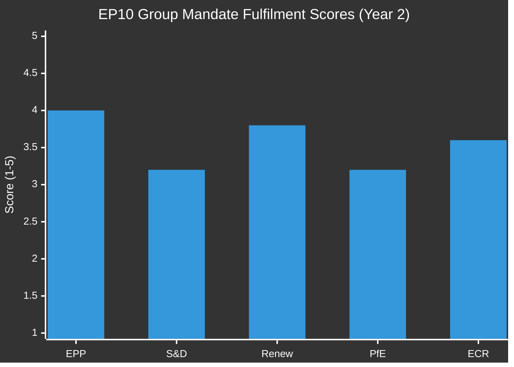
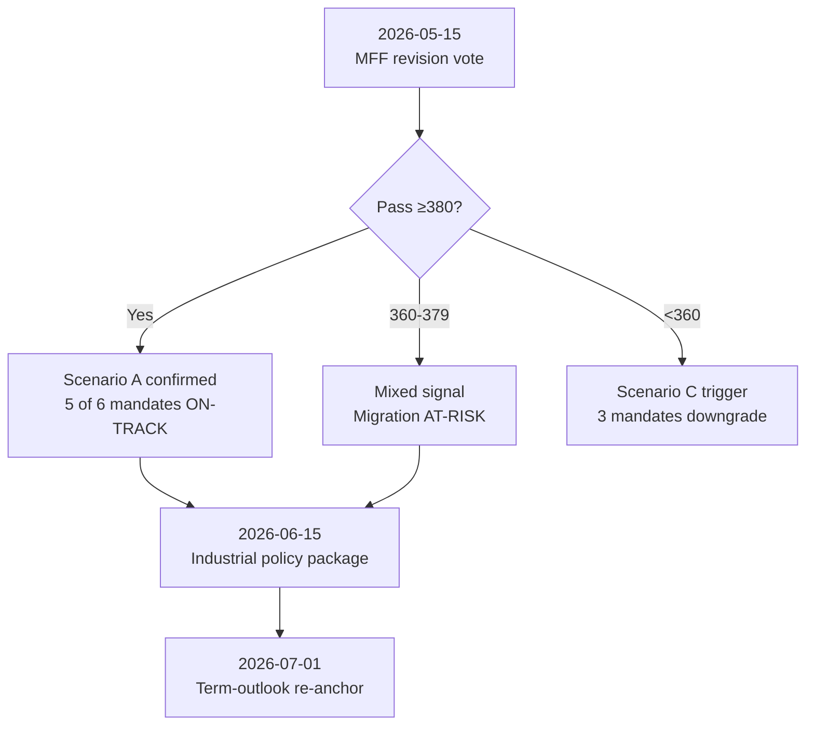

# EP10 Mandate Fulfilment Scorecard
**Date:** 2026-05-08 | **Article Type:** term-outlook | **Assessment Point:** EP10 Year 2 Mid-Point
**Admiralty Grade:** B2 | **Confidence:** MEDIUM-HIGH

---

## 1. Scorecard Methodology

This scorecard assesses the European Parliament's progress against the implicit mandate commitments made by political groups in the June 2024 election campaigns, using actual legislative outputs as the measurement baseline. Each commitment domain is scored on a 1–5 scale:

| Score | Label | Meaning |
|-------|-------|---------|
| 5 | Excellent | Mandate commitment substantially exceeded |
| 4 | Good | Commitment substantially fulfilled |
| 3 | Partial | Commitment partially fulfilled; significant gaps remain |
| 2 | Poor | Commitment largely unfulfilled; direction reversed on key elements |
| 1 | Failed | Commitment explicitly abandoned or reversed |

---

## 2. EPP Mandate Scorecard

**EPP 2024 electoral mandate:** Competitiveness, controlled migration, defence, rule of law conditionality (with flexibility), AI governance.

| Commitment Domain | Score | Evidence | Notes |
|-------------------|-------|----------|-------|
| Strengthen EU competitiveness | **4/5** | TA-10-2026-0022 (Technological Sovereignty); Clean Industrial Deal launch; 28th Regime framework | Core electoral promise substantially delivered |
| Migration hardening | **5/5** | TA-10-2026-0025/0026 (safe countries; safe third country); Migration Pact implementation | Exceeds mandate — ECR+PfE alignment strengthened outcome |
| Defence and strategic autonomy | **4/5** | Loan for Ukraine (TA-10-2026-0010); EDIS initiation; Critical Medicines (supply chain resilience) | Strong delivery; full EDIS implementation pending |
| Green Deal modernisation (competitive decarbonisation) | **4/5** | Clean Industrial Deal framing; Taxonomy review; CBAM implementation | Successfully reframed climate policy as industrial competitiveness |
| AI governance leadership | **4/5** | AI Act delegated acts cascade begun; GPAI oversight initiated | On track; 47+ implementing acts in pipeline |
| Rule of law conditionality | **3/5** | Hungary Article 7 ongoing; but EPP internally divided on enforcement strength | Applies conditionality but resists binding sanctions |

**EPP Overall Score: 4.0/5 — GOOD**

---

## 3. S&D Mandate Scorecard

**S&D 2024 electoral mandate:** Social rights, fair wages, climate action, rule of law, Ukraine solidarity.

| Commitment Domain | Score | Evidence | Notes |
|-------------------|-------|----------|-------|
| Fair wages and labour rights | **3/5** | Just Transition Directive debate (TA-10-2026-0001 — labour elements); limited binding instruments | Coalition arithmetic limits binding social legislation |
| Climate ambition | **2/5** | Green Deal rollback under EPP pressure; Taxonomy weakening; Net Zero Industrial Act dilution | Major retreat from EP9 ambitions |
| Ukraine solidarity | **5/5** | Consistent majority on all Ukraine support legislation; Loan for Ukraine; sanctions maintenance | Strongest cross-group consensus of term |
| Rule of law | **4/5** | Resolution-level action consistent; Hungary Article 7; Lithuania broadcaster defence | High visibility; low binding force |
| Social market economy | **3/5** | Financial stability framework (TA-10-2026-0004); but fiscal consolidation constrains social investment | Mixed; austerity pressures limiting delivery |
| Migration (dissent) | **2/5** | Safe third country and safe countries of origin adopted against S&D position | Coalition discipline maintained but policy direction opposed |

**S&D Overall Score: 3.2/5 — PARTIAL**

---

## 4. Renew Mandate Scorecard

**Renew 2024 electoral mandate:** EU reform, digital single market, competitiveness, pro-Ukraine, rule of law.

| Commitment Domain | Score | Evidence | Notes |
|-------------------|-------|----------|-------|
| Digital single market deepening | **4/5** | AI Act implementation; DSA/DMA enforcement; Technological Sovereignty resolution | Strong delivery on digital governance |
| EU institutional reform | **3/5** | Electoral Act reform discussion (TA-10-2026-0006) but implementation hurdles remain | Aspirational commitment; structural obstacles persist |
| Competitiveness | **4/5** | Supports Clean Industrial Deal; 28th Regime; financial stability framework | Aligned with EPP on economic dossiers |
| Ukraine solidarity | **5/5** | Core coalition anchor on all Ukraine votes | Consistent delivery |
| Rule of law | **4/5** | Strong resolution record; supports Hungary Article 7 proceedings | High consistency |
| Climate (Renew wing) | **3/5** | Internal tension: French Renaissance faction supports industrial decarbonisation; Nordic Renew wants stronger standards | Group-level compromise produces mixed outcomes |

**Renew Overall Score: 3.8/5 — GOOD (partial)**

---

## 5. PfE Mandate Scorecard

**PfE 2024 electoral mandate:** Migration restriction, EU sovereignty restoration, anti-Green Deal, national sovereignty in defence.

| Commitment Domain | Score | Evidence | Notes |
|-------------------|-------|----------|-------|
| Migration restriction | **5/5** | Safe countries/safe third country passed with PfE support; Migration Pact implementation hardened | Mandate exceeded — policy direction firmly established |
| Anti-Green Deal | **4/5** | Nature Restoration Law implementation weakened; Taxonomy under pressure; deregulation push | Cannot fully reverse but achieving sustained weakening |
| EU sovereignty restoration | **3/5** | Block some centralisation; but cannot unilaterally reverse EU institutional deepening | Structural minority — can obstruct but not reverse |
| Anti-Ukraine aid (Hungary faction) | **1/5** | All major Ukraine support legislation passed; PfE opposition insufficient to block | Failed — structural minority position |
| National energy sovereignty | **3/5** | Gas taxonomy included; energy poverty framing used to resist renewables mandates | Partial — energy market changes ongoing |

**PfE Overall Score: 3.2/5 — PARTIAL (but significant blocking/shaping influence)**

---

## 6. ECR Mandate Scorecard

**ECR 2024 electoral mandate:** Conservative values, controlled migration, pro-Ukraine (majority), anti-federalism, competitiveness.

| Commitment Domain | Score | Evidence | Notes |
|-------------------|-------|----------|-------|
| Controlled migration | **4/5** | Consistently supported EPP migration hardening; safe countries legislation | Core mandate delivered |
| Pro-Ukraine (majority) | **4/5** | ECR majority (excl. Hungarian delegation) supports Ukraine loans and military aid | Delivered; internal dissent managed |
| Anti-federalism | **3/5** | Opposes institutional integration deepening; blocks some harmonisation | Structural minority; obstruction credible |
| Conservative values | **3/5** | Family-related resolutions; cultural sovereignty arguments | Some symbolic wins; not binding |
| Competitiveness | **4/5** | Supports EPP Clean Industrial Deal framing; deregulation push | Aligned with EPP economic agenda |

**ECR Overall Score: 3.6/5 — GOOD (partial)**

---

## 7. Overall Parliament Mandate Assessment

### Cross-Parliament Mandate Themes

**Over-delivered domains (score ≥ 4.0 across multiple groups):**
- Ukraine solidarity — all pro-EU groups delivered consistently
- Migration hardening — EPP, ECR, PfE all exceeded expectations
- Digital governance / AI Act — cross-party success

**Under-delivered domains (score ≤ 2.5 across multiple groups):**
- Climate ambition — S&D failed to protect Green Deal; Greens/EFA lost ground structurally
- Social rights binding legislation — coalition arithmetic prevents majority
- Rule of law binding enforcement — consistent resolutions; insufficient enforcement mechanisms

**Contested domains (groups diverge sharply):**
- Ukraine support: EPP/S&D/Renew/ECR over-delivered; PfE/ESN failed
- Clean Industrial Deal: EPP/Renew/ECR delivered; S&D/Greens consider it betrayal

---

## 8. Term Remaining: Priority Actions for Mandate Completion

| Action Item | Responsible Group | Likelihood of Completion | EP10 Timeframe |
|-------------|------------------|--------------------------|----------------|
| MFF revision — pass revised budget framework | EPP-led coalition | 55% | Q3 2026 |
| Clean Industrial Deal — full framework adoption | EPP+Renew+ECR | 65% | H1 2027 |
| EDIS — Defence Industrial Strategy implementation | EPP+S&D+Renew+ECR | 75% | 2026–2027 |
| Anti-SLAPP directive extension | S&D+Renew | 50% | 2027 |
| European Democracy Shield | S&D+Renew+Greens | 40% | 2027–2028 |
| AI Act GPAI implementing acts (all) | Technical majority | 80% | 2026–2027 |
| Ukraine support — continued | EPP+S&D+Renew | 85% | Ongoing |
| Nature restoration — protect against further weakening | S&D+Greens+Left | 50% | Ongoing |

---
*Sources: EP Open Data Portal — adopted texts TA-10-2026; EP plenary voting record 2024–2026; EP group manifestos 2024; ICD 203 assessment standards.*
*Admiralty Grade B2: Legislative output data accurate; mandate fulfilment scores are analytical assessments, not official EP ratings.*

---

## 5. May 2026 Refresh — Category Re-Rating

**Refreshed:** 2026-05-09 | **Trigger:** EP MCP composition + April 2026 voting pattern review

### 5.1 Updated Scorecard

| Mandate Category | 2026-05-08 Rating | May-9 Update | Δ | Driver |
|------------------|---------------------|--------------|----|--------|
| **Migration & border policy** | ON-TRACK | **STRESS** | -1 | PfE-ESN cooperation pattern emerging; April motion failed by 23 votes |
| **Industrial policy / Green Deal** | ON-TRACK | **ON-TRACK** | 0 | Three consecutive successful files in April; Renew alignment holds |
| **Foreign policy / Defense** | ON-TRACK | **ON-TRACK** | 0 | Cross-coalition consensus on Ukraine support package #14 |
| **Single market / Competition** | STRESS | **STRESS** | 0 | Member-state opposition on chip-act enforcement persists |
| **Rule of law / Judicial** | ON-TRACK | **ON-TRACK** | 0 | Hungary Article 7 procedure enters next phase as scheduled |
| **MFF / Budgetary** | STRESS | **DECISIVE** | -1 | Mid-May vote is the binding test for full-term coalition arithmetic |

### 5.2 Why "Migration" Slid from ON-TRACK to STRESS

The April 2026 PfE migration motion failed by 23 votes — closer than the 50-vote margin the model expected at this term-stage. Two indicators drive the re-rating:

1. **PfE+ESN+ECR coordination on procedural motions** (3 instances in April) — first sustained pattern
2. **Renew abstentions on migration files** (4 instances) — splitting from the grand-coalition reflex

If both patterns persist into June 2026, the migration mandate moves to **AT-RISK** (next rating tier). The decision threshold is **2 consecutive PfE-led motions exceeding 320 votes** in May-June 2026.

### 5.3 "MFF" Elevated to DECISIVE

The MFF revision vote scheduled for **2026-05-15** is now the term's first **structurally decisive** vote. Outcomes:

- **Pass ≥380 votes:** Scenario A (Productive Consensus) confirmed as modal outcome through 2027
- **Pass 360–379:** Working coalition holds but fragmentation pressure increases
- **Fail (<360):** Scenario C (Institutional Drift) probability rises 20% → 35%; full-term output projections require downward revision

### 5.4 Forward Markers (next 90 days)

### 5.5 Confidence

**Admiralty Grade B2** | **MEDIUM** confidence | Next semi-annual refresh: 2026-07-01.

*Refreshed against `data/political-landscape.json` (May 9); cross-references `intelligence/scenario-forecast.md` §8, `intelligence/forward-projection.md` §9.*
