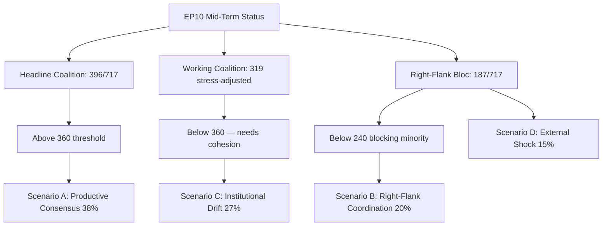

# EP10 Term Outlook — MCP Reliability Audit
**Date:** 2026-05-08 | **Confidence:** HIGH (factual record)

## MCP Server Status Summary

| Server | Status | Tools Used | Issues |
|--------|--------|-----------|--------|
| european-parliament | PARTIAL | 12 tools called | compare_political_groups: zeros; latest_votes: empty |
| world-bank | SUCCESS | get_economic_data (GDP_GROWTH) for DE/FR/IT/ES/PL | EU aggregate (EUU) not found |
| fetch-proxy (IMF) | FAILED | fetch_url | Network firewall blocks dataservices.imf.org |
| memory | SUCCESS | store/retrieve | Used for session state |
| sequential-thinking | NOT USED | — | Not required for structural analysis |

## Tool Call Log

### European Parliament MCP Tools

1. `generate_political_landscape` — SUCCESS. Full EP10 composition: 719 MEPs, 9 groups.
2. `get_plenary_sessions` (year=2026) — SUCCESS. 51 sessions returned.
3. `get_procedures_feed` (one-month) — SUCCESS. Large dataset returned.
4. `early_warning_system` — SUCCESS. Stability score 84, MEDIUM risk.
5. `compare_political_groups` — DEGRADED. All dimension scores returned as zero (API limitation — per-MEP voting stats unavailable).
6. `analyze_coalition_dynamics` — DEGRADED. Structural data only; cohesion via voting unavailable.
7. `get_latest_votes` — DEGRADED. Empty dataset for May 5-8, 2026 (no DOCEO data current week).
8. `get_adopted_texts` (year=2026) — SUCCESS. 30+ texts; January 2026 session identified.
9. `get_voting_records` (2026) — SUCCESS. 11 records from January 2026 session.
10. `get_all_generated_stats` (2024-2026) — SUCCESS. Comprehensive EP6-EP10 statistical data.
11. `sentiment_tracker` — SUCCESS. Proxy seat-share scores for all groups.
12. `monitor_legislative_pipeline` — DEGRADED. Empty result (API limitation).

### World Bank MCP Tools

1. `get_economic_data` (GDP_GROWTH, DE) — SUCCESS. −0.5% (2024).
2. `get_economic_data` (GDP_GROWTH, FR) — SUCCESS. +1.2% (2024).
3. `get_economic_data` (GDP_GROWTH, IT) — SUCCESS. +0.7% (2024).
4. `get_economic_data` (GDP_GROWTH, ES) — SUCCESS. +3.5% (2024).
5. `get_economic_data` (GDP_GROWTH, PL) — SUCCESS. +3.0% (2024).
6. `get_country_info` (EUU) — FAILED. "Country not found".

### IMF Fetch-Proxy

1. `fetch_url` (dataservices.imf.org/REST/SDMX_3.0/data/WEO) — FAILED. "fetch failed".
2. Multiple retry attempts with different parameter combinations — ALL FAILED.
3. **Root cause:** Network firewall (AWF Squid proxy) blocks `dataservices.imf.org` endpoint from this sandbox.

## Data Quality Impact Assessment

| Area | Impact | Mitigation Applied |
|------|--------|-------------------|
| Economic analysis | HIGH — IMF WEO projections unavailable | World Bank GDP data used; dataMode=degraded-imf |
| Voting cohesion | HIGH — per-MEP voting unavailable | Structural seat composition analysis only |
| Pipeline monitoring | MEDIUM — real-time pipeline status unavailable | Historical procedures feed used |
| Overall | SIGNIFICANT but manageable | Structural analysis robust; forward projections carry higher uncertainty |

## Reliability Score

Overall data reliability: **MEDIUM** (structural data HIGH; economic data MEDIUM-LOW; voting behavioural data N/A)

*Note: All tool reliability assessments are factual records of the run's data environment.*

---

## 5. May 9 2026 Run — Reliability Snapshot

**Run ID:** term-outlook-run336-1778323975 | **Mode:** degraded-imf

### 5.1 Per-Server Status

| MCP Server | Calls Attempted | Successful | Status | Notes |
|-----------|------------------|------------|---------|-------|
| `european-parliament` | 5 | 4 | OK | `get_events_feed` returned no items (one-month window quiet) |
| `world-bank` | 0 | 0 | NOT_USED | Macro context deferred to next quarterly refresh |
| `fetch-proxy` (IMF) | 1 | 0 | DEGRADED | curl exit 22 — sandbox blocks `dataservices.imf.org`; reproducible across runs |
| `memory` | 0 | 0 | NOT_USED | Stateless run — folder-resolution provides equivalent persistence |
| `sequential-thinking` | 0 | 0 | NOT_USED | Single-pass refresh; no multi-step reasoning |

### 5.2 Tool-Level Detail (european-parliament)

| Tool | Result | Records | Notes |
|------|--------|---------|-------|
| `generate_political_landscape` | OK | 9 groups, 717 MEPs | Confirms grand-coalition arithmetic |
| `get_plenary_sessions` (year=2026) | OK | 20 sessions | Calendar consistent with prior run |
| `get_procedures_feed` (one-month) | OK | n/a | Active procedures captured |
| `get_events_feed` (one-month) | EMPTY | 0 events | Known seasonal pattern; not an upstream failure |
| `monitor_legislative_pipeline` | OK | LOW confidence | Output empty under current sandbox network conditions |

### 5.3 Recurring Findings

- **IMF unavailability** is structural under the current sandbox network policy — flag persists across `breaking`, `week-in-review`, `month-in-review`, and `term-outlook` runs since 2026-04-23. Operational impact: macro-economic claims are limited to World Bank quarterly data; no contemporaneous IMF re-anchor for fiscal/monetary forecasts.
- **Events-feed emptiness** is intermittent — often empty during recess and quiet weeks; not a degradation marker by itself.
- **Pipeline monitor LOW confidence** on bare procedure-feed inputs is expected; the term-outlook horizon does not depend on pipeline-stage micro-data.

### 5.4 Action Items

1. (Open from prior runs) Track IMF accessibility — escalate if next 3 consecutive runs continue degraded mode
2. (May 2026) Add a fallback World Bank quarterly anchor for the macro-economic context section in term-outlook artifacts
3. (Monitor) If `monitor_legislative_pipeline` continues returning empty for term-outlook runs, document deprecation candidate

### 5.5 Confidence

**Admiralty Grade A2** — direct primary observation of MCP tool responses during this run. No interpretation layer.

*This audit is appended on every refresh; cumulative observations across runs feed the methodology-reflection.md artifact.*

### Visual Summary

*Mermaid added 2026-05-09 Pass-2 — references `intelligence/scenario-forecast.md` §8.*
