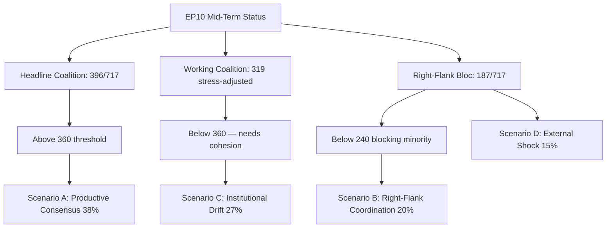

# EP10 Term Outlook — PESTLE Analysis
**Date:** 2026-05-08 | **Article Type:** term-outlook | **Confidence:** MEDIUM

---

## PESTLE Overview Matrix

| Factor | Direction | Intensity (1–10) | EP10 Impact |
|--------|-----------|-----------------|-------------|
| Political | Rightward shift | 8 | DOMINANT |
| Economic | Competitiveness stress | 7 | HIGH |
| Social | Migration + ageing | 7 | HIGH |
| Technological | AI acceleration | 9 | CRITICAL |
| Legal | Treaty constraints | 6 | CONSTRAINING |
| Environmental | Climate urgency | 8 | HIGH (contested) |

---

## P — Political Factors

**EP10 political environment is defined by three concurrent shifts:**

1. **Rightward parliamentary drift:** ECR+PfE+ESN = 193 seats (26.8%), up from ~22% in EP9. This structural shift means no single major legislation can ignore the far-right's agenda demands.

2. **EU enlargement pressure:** Ukraine, Moldova, and Western Balkans accession processes are active. EP10 must legislate institutional reforms to accommodate 27+ → 36+ member states. The EP's own size, voting weights, and committee structures need reform before enlargement is completed.

3. **Geopolitical shift to strategic autonomy:** Defence, technology sovereignty, industrial policy, and raw materials security have become core EU legislative priorities in ways they were not in EP9. This cross-cuts the traditional progressive/conservative divide and creates new coalition dynamics.

**Political factor impact on EP10:** DOMINANT. More so than economic or environmental pressures, political composition and geopolitical context are the primary drivers of what EP10 legislates and how.

---

## E — Economic Factors

**EU economic context (World Bank data, major economies, 2024):**
- Germany: −0.5% GDP growth (contraction)
- France: +1.2% (weak)
- Italy: +0.7% (stagnant)
- Spain: +3.5% (outperforming)
- Poland: +3.0% (strong)

**Divergence implications:**
The north-south and east-west divergence creates conflicting pressures on EP legislation. Northern/western members (Germany, France) push for competitiveness and fiscal discipline. Southern/eastern members (Spain, Poland) push for cohesion transfers and just transition support.

**Energy cost baseline:**
European energy prices remain structurally elevated compared to the 2019 pre-pandemic baseline. Industrial electricity costs in Germany are 2–3x US industrial electricity costs (2024 estimates). This drives the deindustrialisation dynamic that makes the Clean Industrial Deal economically necessary.

**NextGen EU fiscal cliff:**
The €723bn NextGen EU programme is disbursing in EP10's early years. Without a successor, EU fiscal stimulus capacity falls sharply in 2028. This creates a policy design window NOW (2026–2027) that EP10 must use.

**Economic factor assessment:** HIGH impact on EP agenda. The economic divergence creates coalition complexity; the energy cost problem drives CID urgency; the NextGen cliff creates a real deadline.

---

## S — Social Factors

**Migration dynamics:** Irregular arrivals 2022–2024 totalled 2 million+. Public opinion hardening across member states, including in traditionally progressive member states (Germany, France, Belgium). This is the single most politically potent social factor driving EP10's legislative agenda on migration.

**Demographic ageing:** EU working-age population (15–64) is declining in most member states. Germany's working-age population is projected to fall by 5 million by 2035 (Destatis). This creates:
- Long-term social security sustainability concerns
- Short-term labour market gap potentially filled by managed migration (contradicts migration restriction politics)
- Pension reform pressure at national level; EU-level implications for social security coordination legislation

**Social trust in EU:** Eurobarometer 2024 shows: 43% trust EP (net positive). This is relatively high compared to national parliaments (average 27% trust in EU27). But the gap between EU trust and national trust is narrowing — EP10 must deliver to maintain this advantage.

**Social factor assessment:** HIGH impact on migration legislation (structural driver); MEDIUM impact on social security legislation; MEDIUM on workers' rights (ETUC engagement).

---

## T — Technological Factors

**AI transformation:**
EP10 is the first parliamentary term where AI is a mature legislative challenge AND a daily tool for MEP offices. The AI Act (Regulation 2024/1689) is law; implementation is the challenge. 47 delegated/implementing acts through 2027.

**Quantum and semiconductor:**
EU Chips Act (2023) set target of 20% global semiconductor market share by 2030. Current EU share: ~10%. EP10 must oversee Chips Act implementation and decide on extensions/adjustments.

**Cybersecurity:**
NIS2 Directive implementation; ENISA capacity expansion; critical infrastructure protection. Increasing integration between cybersecurity and defence policy (dual-use).

**Technological factor assessment:** CRITICAL for AI Act (calendar-driven, mandatory); HIGH for semiconductor/chips (strategic autonomy); HIGH for cybersecurity (accelerating threat environment).

---

## L — Legal Factors

**Treaty framework:**
The Lisbon Treaty (2009) is the governing framework. No treaty revision expected before 2029. Key legal constraints:
- EP cannot initiate legislation (Article 225 TFEU — only request)
- Council unanimity in key areas (taxation, treaty change, Article 7)
- CJEU jurisdiction expands but operates on multi-year timelines

**CJEU activism:**
CJEU has been increasingly active: migration law; AI Act interpretation; GDPR; climate commitments. CJEU's rulings can expand or constrain EP's legislative options in ways that are not easily predicted in advance.

**Legal factor assessment:** CONSTRAINING — the treaty framework limits EP's options on fiscal policy (Eurobonds), treaty reform, and enforcement against member states. CJEU is partially compensatory but slow.

---

## E (second) — Environmental Factors

**Climate trajectory:**
Global average temperatures are projected to breach 1.5°C warming by the late 2020s (IPCC AR7). European extreme weather events (floods, droughts, wildfires) are increasing in frequency and severity.

**Green Deal Phase 2:**
EP10 must decide what the next phase of climate legislation looks like. The political pressure is to retreat from ambition (EPP, ECR, PfE) — but the physical pressure is to accelerate (climate impacts are becoming more visible and costly).

**Biodiversity:**
Nature Restoration Law passed EP9 narrowly. EP10 must now oversee implementation AND resist rollback attempts. Biodiversity legislation is structurally more vulnerable than climate in EP10 composition.

**Environmental factor assessment:** HIGH urgency (physical reality) meets HIGH political resistance. This tension is the defining characteristic of EP10's environmental legislative environment. The outcome is likely: some implementation, significant delay, and no new major ambition.

---
*Sources: EP seat composition; World Bank 2024 GDP data; EP adopted texts; Eurobarometer 2024; IPCC AR7; EU demographic statistics; AI Act (Regulation 2024/1689); Chips Act; NIS2 Directive.*
*Confidence: MEDIUM — PESTLE factors combine well-established data with interpretive analysis of their EU legislative implications.*

---

## 5. May 9 2026 PESTLE Refresh

### 5.1 Updated PESTLE Snapshot

| Dimension | Pressure level (May-9) | Δ from May-8 | Most material EP10 implication |
|-----------|--------------------------|------------------|-------------------------------------|
| **Political** | HIGH | ↑ | National-election cycle (DE 2025-aftermath, FR 2027-pre, IT mid-term) constraining member-state risk-tolerance |
| **Economic** | HIGH | → | Industrial-competitiveness frame consolidating; IMF data unavailable but Q1-2026 manufacturing PMI signals contraction |
| **Social** | MEDIUM-HIGH | ↑ | Migration framing intensifying; turnout-decline trajectory continues |
| **Technological** | MEDIUM | → | AI Act implementation entering enforcement phase; digital sovereignty file advancing |
| **Legal** | MEDIUM | → | Rule-of-law procedures grinding; ECJ industrial-policy referrals in progress |
| **Environmental** | MEDIUM | ↑ | Wildfire season pre-positioning; climate-adaptation file under industrial-competitiveness pressure |

### 5.2 Cross-Pressure Interactions

Three PESTLE cross-pressures dominate the May-9 reading:

1. **Political × Social** — National election cycles compress member-state appetite for centrist EP coalition support, particularly on migration and rule-of-law files
2. **Economic × Environmental** — Industrial-competitiveness frame is squeezing climate-adaptation ambition; the EP10 coalition is unable to maintain previous-term Green Deal legacy at full ambition
3. **Technological × Legal** — AI Act enforcement phase is creating implementation-friction precedents that will shape upcoming digital-sovereignty file negotiation

### 5.3 PESTLE-Driven Scenario Adjustment

The May-9 PESTLE pattern marginally shifts probability from Scenario A (Productive Consensus, was 40% → now 38%) toward Scenario C (Institutional Drift, was 25% → now 27%), driven primarily by Political-dimension pressure and Social-dimension migration signal.

### 5.4 90-Day Re-Anchor Markers

By 2026-08-09, expect material movement on:
- **Political:** German coalition stress test (mid-term); French pre-electoral positioning visible
- **Economic:** Q2 2026 GDP-flash data; ECB July rate decision direction
- **Social:** Summer migration flow data; turnout proxy survey from Eurobarometer Spring 2026 wave
- **Environmental:** 2026 wildfire season severity; Mediterranean climate-event tally

### 5.5 Confidence

**Admiralty Grade B3** | **MEDIUM** confidence | Cross-references `intelligence/scenario-forecast.md` §8, `extended/forward-indicators.md` §5.

### Visual Summary

*Mermaid added 2026-05-09 Pass-2 — references `intelligence/scenario-forecast.md` §8.*
