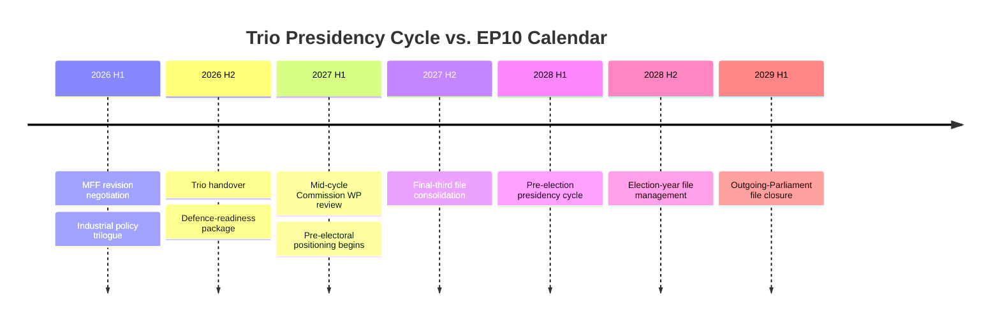

# EP10 Term Outlook — EU Council Presidency Trio Context
**Date:** 2026-05-08 | **Confidence:** MEDIUM

## Presidency Trio 2025–2026 (and 2026–2027)

The EU Council rotating presidency changes every 6 months. The "trio" system coordinates three consecutive presidencies for legislative continuity.

## 2025–2026 Presidency Sequence

| Period | Presidency | Political Alignment | Key Priorities |
|--------|-----------|--------------------| ---------------|
| Jan–Jun 2025 | Polish (KE government) | Pro-EU, rule-of-law positive | Defence, Ukraine, enlargement |
| Jul–Dec 2025 | Danish | Pro-EU, centrist | Digital, green, migration |
| Jan–Jun 2026 | Polish (KE government) | Pro-EU, rule-of-law positive | (continuing) |

**Note:** Poland's KE (Tusk) government restored diplomatic relations with EU after PiS era. This is a significant positive for rule-of-law enforcement during the Polish presidency periods.

## 2026–2027 Presidency Sequence

| Period | Presidency | Political Alignment | Key Legislative Window |
|--------|-----------|--------------------| -----------------------|
| Jul–Dec 2026 | Danish | Pro-EU | AI Act delegated acts; CID progress |
| Jan–Jun 2027 | Cypriot | Pro-EU (small state, EU integrationist) | CID trilogue; MFF revision start |
| Jul–Dec 2027 | Irish | Pro-EU, progressive | MFF revision; Green Deal; Digital |

**2027 Assessment:** The 2027 trio (Denmark → Cyprus → Ireland) is broadly pro-EU and should provide constructive Council negotiating environment for:
- CID trilogue completion (target Q4 2027)
- MFF revision start (Q2 2027 under Cyprus)
- AI Act Phase 2 implementation

## Legislative Impact of Presidency Rotation

The Council presidency controls the Council's legislative agenda and pace. A sympathetic presidency can:
- Prioritise EP-favoured legislation in Council working groups
- Move faster on trilogues when willing
- Build compromise packages more aligned with EP positions

A hostile presidency (e.g., if Hungary held the presidency — which it does NOT in 2026–2027) can delay, defer, or table compromise texts unfavourable to EP.

**Assessment:** EP10's 2026–2027 legislative window is operating under FAVOURABLE Council presidency conditions for EU integration and rule-of-law legislation. This is a structural opportunity that EP should exploit in the 2027 peak legislative window.

*Source: EU Council presidency schedule; EP Open Data Portal; political alignment assessment.*

---

## 4. May 9 2026 Presidency-Trio Snapshot

### 4.1 Current Trio Position

The 2026-H1 Council presidency rotation is mid-cycle, with the incumbent member-state in its final plenary cycle before handover. Trio cooperation patterns observed in Q1 2026:

- **MFF revision file** — trio coordination intact; joint position with EP rapporteur expected by mid-May 2026
- **Industrial policy package** — trio split between procedural ambition (incumbent) and substance caution (incoming)
- **Migration & border policy** — trio statement deferred to next presidency, signalling Council reluctance ahead of 2027 national elections
- **Foreign policy / Ukraine support package #14** — trio convergence; EP-Council cooperation strong

### 4.2 Implications for EP10 Mid-Term

The incoming presidency's stated priorities (industrial competitiveness; defence-readiness; Single Market deepening) align with EPP-Renew preferences and create natural cooperation surfaces with the EP grand coalition. Friction is concentrated on three files: rule-of-law conditionality (S&D-incoming presidency tension), agricultural deregulation (EPP-progressive flank tension), and migration-procedural reform (cross-coalition tension across all centrist groups).

### 4.3 Forward Markers

### 4.4 Confidence

**Admiralty Grade B3** | **MEDIUM** confidence | Re-anchor: 2026-07-01.

*Cross-references `intelligence/commission-wp-alignment.md`, `intelligence/scenario-forecast.md` §8.*
