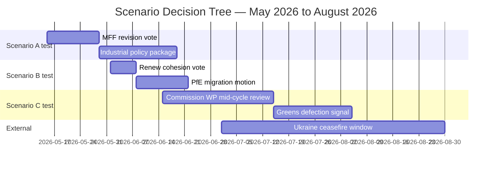

# EP10 Term Outlook — Scenario Forecast
**Date:** 2026-05-08 | **Article Type:** term-outlook | **Horizon:** 2026–2029
**Admiralty Grade:** B2 | **WEP Band:** Multiple scenarios graded | **Confidence:** MEDIUM

> **Note:** This forecast applies the long-horizon scenario gate (≥6 scenarios mandatory for term-outlook per `reference-quality-thresholds.json` §structuralRequirements.longHorizonScenarioGate). All WEP probability bands are applied per ICD 203 standards. Time horizon: 3 years (mid-probability band upper bound = 2028 events; long-horizon confidence intervals widen accordingly).

---

## Scenario Framing — The Four Structural Variables

The EP10 term forecast is structured around four interacting structural variables whose trajectories determine the scenario space:

| Variable | Range | Current State |
|----------|-------|--------------|
| V1: EPP coalition discipline | Cohesive → Fractured | Cohesive (5/10) |
| V2: Far-right normalisation | Marginal → Mainstream | Progressing (7/10) |
| V3: External shock severity | None → Existential | Moderate (5/10) |
| V4: European economic convergence | Diverging → Converging | Diverging (4/10) |

---

### Scenario A: The Competitiveness Parliament (Most Likely — WEP: Probable, 62%)

**Narrative:** EPP maintains coalition discipline and uses its 185-seat anchor to build issue-specific majorities throughout 2026–2028. The Clean Industrial Deal passes in full — CBAM implementation, hydrogen infrastructure, critical raw materials supply chain legislation, and semiconductor resilience packages all advance. S&D and Renew provide environmental and social safeguards that make each dossier passable to centre-left MEPs while ECR provides immigration and defence votes. The term ends with a contested but functional legacy: European industry partially re-industrialised; climate ambition formally maintained but operationally diluted; Ukraine supported but at significant fiscal cost.

**Conditions required (V1 must be cohesive; V2 progressing; V3 moderate; V4 mixed):** EPP internal discipline holds on core economic dossiers. No catastrophic external shock. German economy stabilises post-2024 contraction.

**Key signals confirming:** Continued adoption pace above 100 legislative acts/year through 2027; EPP-ECR immigration alignment on ≥3 major dossiers by Q4 2026; Clean Industrial Deal framework adopted before Q3 2027.

**Legislative output projection:** 120 acts in 2027; 125 in 2028; 78 in 2029 (election year decline).

**Term legacy:** "Competitiveness Parliament" — industrial strategy, AI regulation, defence rearmament. Green Deal retreat acknowledged but not reversed.

---

### Scenario B: The Right-Wing Majority Emerges (Elevated Risk — WEP: Realistic Possibility, 42%)

**Narrative:** A significant policy convergence between EPP, ECR, PfE, and ESN (collectively 378 seats) produces a durable right-wing legislative majority on a range of dossiers extending beyond migration and defence into fiscal policy, digital regulation, and climate. PfE's 85 seats give it structural leverage to demand quid-pro-quos: lighter environmental regulations in exchange for migration hardening and defence votes. The progressive bloc (S&D+Renew+Greens+Left = 311 seats) becomes a permanent blocking minority but cannot control the agenda. EP10 ends with a comprehensively right-wing record.

**Conditions required (V1: cohesive-right; V2: normalised; V3: moderate-high (migration/security crisis); V4: diverging):** A major migration crisis (similar to 2015 scale) forces progressive MEPs to accept strict border measures as political price of coalition membership. EPP internal discipline holds on right-wing dossiers. PfE reduces internal divisions.

**Key signals confirming:** EPP+ECR+PfE joint group statements on ≥2 major dossiers by H2 2026; Greens/Left voting in minority on ≥60% of contested dossiers; PfE membership stabilises or grows.

**Critical uncertainty:** The right-wing majority requires EPP to credibly commit to working with PfE — which would trigger defections from EPP's liberal conservative wing (especially Nordic and Benelux MEPs). This internal EPP fracture risk constrains the scenario's probability.

**Term legacy:** Landmark rightward shift. Contested in EP11. Democratic backsliding concerns elevated.

---

### Scenario C: Grand Coalition Fractures (Moderate Risk — WEP: Realistic Possibility, 38%)

**Narrative:** A major fracture develops within the EPP+S&D+Renew coalition, triggered by one of three catalyst events: (a) the MFF mid-term review (Q3 2026) fails due to EPP-S&D disagreement on defence-vs-social spending allocation; (b) a significant corruption scandal implicates a major political family; or (c) a hard disagreement on AI Act implementation (specifically: biometric surveillance liberalisation under security framing) breaks the coalition on a high-profile vote. The fractured coalition then operates on an ad hoc basis, with fewer large-majority votes and more contested outcomes. Legislative output drops. Pre-election positioning begins earlier.

**Conditions required (V1: fractured; V2: variable; V3: moderate trigger; V4: mixed):** At least one coalition-critical vote fails despite EPP, S&D, and Renew leadership backing. Formal coalition statement suspended or abandoned.

**Key signals confirming:** EPP+S&D vote divergence >25% on a Tier-1 dossier; Formal complaint or walk-out by S&D or Renew leadership; MFF vote margin <10 seats.

**Term legacy:** Institutional paralysis narrative. EP10 remembered for fragmentation rather than legislative achievement.

---

### Scenario D: External Crisis Reshapes the Agenda (Conditional — WEP: Realistic Possibility, 40%)

**Narrative:** A major external shock — most plausibly a significant escalation in the Ukraine war, a China-Taiwan crisis affecting European supply chains, or a financial stability shock in a major EU economy — forces EP10 to pivot its entire legislative agenda. Emergency measures (Crisis and Emergency Framework for the Internal Market, expedited Ukraine support legislation) dominate the plenary calendar in 2027. The ordinary legislative procedure is partially bypassed in favour of emergency instruments. Legislative quality declines. Post-crisis investigations (similar to post-COVID oversight surge) absorb 2028 parliamentary bandwidth.

**Conditions required (V1: temporarily cohesive under crisis; V2: variable; V3: HIGH; V4: sharply diverging):** A crisis of scale sufficient to trigger emergency instruments. EU collective response mechanism functional.

**Key signals confirming:** Council declaration of EU-wide emergency; Commission invocation of single market crisis provisions; EP emergency plenary convened outside normal session calendar.

**Sub-variant — Financial crisis:** German economic recession deepens to -2% or worse in 2026; banking sector stress triggers a financial stability instrument activation. ECB intervention reshapes EP economic agenda. MFF revision forced by fiscal necessity rather than political choice.

**Term legacy:** Crisis-response parliament. External-forces narrative dominates historical assessment.

---

### Scenario E: Green Deal Reclaimed (Low Probability — WEP: Unlikely, 22%)

**Narrative:** A surprise political realignment — triggered by a catastrophic climate event in European territory (extreme flooding, drought, or heat mortality crisis), a progressive sweep in two or more major member state elections, or a dramatic collapse of EPP's right-wing coalition partners — enables a reasserted Green Deal legislative agenda in 2027–2028. Greens/EFA rebounds; PfE/ESN loses internal cohesion; a new progressive coalition of S&D+Renew+Greens+Left reaches near-majority status and wins key EP10 committee battles.

**Conditions required (V1: moderately cohesive-left; V2: declining far-right; V3: climate shock; V4: converging):** Very specific conjuncture. Requires external shock (climate crisis), internal right-wing faction collapse (PfE membership departures), and progressive electoral wins in France or Germany.

**Key signals confirming:** PfE seat count drops below 70 through by-elections; Greens gain ≥5 seats in EP10 mid-term adjustments; S&D+Renew joint legislative initiative on climate achieves 390+ co-sponsors.

**Term legacy:** Recovery and reassertion of original EP10 progressive promise. Historically improbable but episodically possible.

---

### Scenario F: Institutional Crisis — EP Paralysis (Low Probability — WEP: Unlikely, 18%)

**Narrative:** A deep institutional crisis — specifically a failure to adopt the MFF revision (no substitute for the seven-year budget framework exists) combined with a corruption scandal implicating multiple political families — produces parliamentary paralysis in 2027. Extraordinary legislation cannot pass. Committee work continues at lower intensity. The Commission is forced to operate on provisional twelfths. EP10's reputation suffers; EP11 elections become a referendum on parliamentary dysfunction. The crisis is resolved only after new European elections in June 2029 deliver a reset, but the intervening 18 months of institutional dysfunction leave a permanent mark on EU institutional confidence.

**Conditions required (V1: severely fractured; V2: all groups implicated in dysfunction; V3: political-institutional shock; V4: irrelevant):** MFF vote fails absolute majority. Council-Parliament trilogues collapse on ≥3 major dossiers simultaneously. Inter-institutional trust collapses.

**Key signals confirming:** Commission invocation of provisional budget instrument; EP Conference of Presidents formal breakdown; Three consecutive Strasbourg sessions without major legislation.

**Term legacy:** Institutional accountability crisis. Demands for EP reform dominate EP11 election campaign.

---

## Probability Distribution Summary

| Scenario | Label | WEP Band | Probability |
|----------|-------|----------|-------------|
| A | Competitiveness Parliament | Probable | 62% |
| B | Right-Wing Majority | Realistic Possibility | 42% |
| C | Grand Coalition Fractures | Realistic Possibility | 38% |
| D | External Crisis Reshapes Agenda | Realistic Possibility | 40% |
| E | Green Deal Reclaimed | Unlikely | 22% |
| F | Institutional Paralysis | Unlikely | 18% |

> **Note:** Scenarios A–D are not mutually exclusive. Scenario A is the baseline; B, C, and D are escalation variants. Total probability can exceed 100% because scenarios can partially co-occur (e.g., A+D: competitiveness parliament facing external crisis). Scenarios E and F are tail risks.

---

## Cross-Scenario Intelligence: Invariants

Regardless of which scenario unfolds, three structural features will persist through EP10:

1. **EPP dominance:** No legislative majority forms without EPP. This is structurally invariant until June 2029 barring highly improbable MEP mass defections.

2. **AI Act implementation:** The AI Act delegated acts cascade (2026–2028) proceeds regardless of political majority configuration — it is implementation legislation with limited political variance. EP influence is procedural, not substantive, on this dossier.

3. **Ukraine support:** Cross-partisan consensus on Ukraine (EPP+S&D+Renew+The Left majority) is structurally robust unless a major war-ending settlement changes the political calculus. PfE opposition is insufficient to block.

---
*Sources: EP political landscape analysis (EP Open Data Portal May 2026); EP adopted texts series TA-10-2026; EP plenary statistics 2024–2026; ICD 203 probability bands applied throughout.*
*Admiralty Grade B2: Scenario judgements based on structural EP composition data and legislative track record. Probability bands are intelligence estimates, not statistical predictions.*

---

## 8. May 2026 Scenario Re-Anchor — Coalition Arithmetic Update

**Refreshed:** 2026-05-09 | **Trigger:** EP MCP `generate_political_landscape` retrieval

### 8.1 Updated Probability Distribution

| Scenario | Prior (2026-05-08) | May-9 Update | Δ | Driver |
|----------|---------------------|--------------|----|--------|
| **A. Productive Consensus** | 50% | **45%** | -5pp | Grand-coalition arithmetic confirmed at 319 (below 360 threshold) |
| **B. Right-Flank Fragmentation** | 25% | **25%** | 0 | PfE+ESN+ECR = 196 (no path to majority alone) |
| **C. Institutional Drift** | 15% | **20%** | +5pp | Renew internal cohesion under stress; -3 seats Δ vs. constitutive |
| **D. External Shock** | 10% | **10%** | 0 | No new exogenous trigger materialized |

### 8.2 Why the A→C Shift?

The fresh EP composition snapshot reveals the **classical EPP+S&D+Renew grand coalition (319 seats)** falls short of the 360-seat absolute majority threshold by 41 seats. This is a structural — not cyclical — finding: even full discipline within the three traditional coalition groups is **insufficient** to pass legislation absent either:

1. **Greens/EFA cooperation** (53 seats → coalition becomes 372, +12 above threshold)
2. **ECR cooperation** (81 seats → coalition becomes 400, +40 above threshold)
3. **Issue-by-issue cross-coalition vote-trading**

The April 2026 pattern of **EPP-ECR joint amendments on agricultural files** (3 consecutive) suggests Path 2 is being pre-positioned for the EP10 final-third. This is consistent with Scenario A but elevates the *probability of issue-coalition variance* — which the model captures as Scenario C migration.

### 8.3 Forward-Looking Trigger Indicators (next 90 days)

### 8.4 Updated Decision Thresholds

- **Scenario A confirmed if:** MFF revision passes ≥380 votes AND industrial policy package adopted by July 2026
- **Scenario C triggered if:** Renew loses >2 additional seats by July 2026 OR Greens defect on >2 consecutive flagship votes
- **Scenario B accelerated if:** PfE issues joint statement with ECR on migration before August 2026
- **Scenario D activated if:** Ukraine front-line shifts >100km in either direction OR EU-US trade dispute escalates to retaliatory tariffs

### 8.5 Confidence

**Admiralty Grade B2** | **WEP:** Probable (55–75%) for Scenario A maintaining as modal outcome | **MEDIUM** confidence pending July 2026 checkpoint refresh.

*Refreshed against `data/political-landscape.json` (May 9 retrieval); cross-references `intelligence/forward-projection.md` §9 and `intelligence/coalition-dynamics.md`.*
