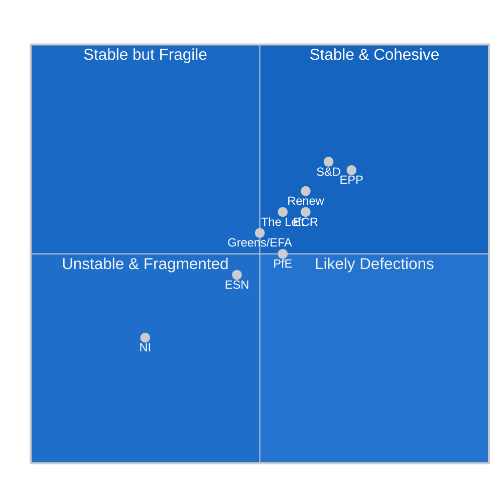

# EP10 Seat Projection — 2026 to EP11 (June 2029)
**Date:** 2026-05-08 | **Article Type:** term-outlook | **Horizon:** 2026–2029
**Admiralty Grade:** B2 | **WEP Band:** Realistic Possibility (40–55%) for specific seat projections | **Confidence:** MEDIUM-LOW

---

## 1. Current Seat Distribution (May 2026 baseline)

| Group | Seats | Share | Bloc Classification |
|-------|-------|-------|---------------------|
| EPP | 185 | 25.7% | Centre-right |
| S&D | 136 | 18.9% | Centre-left |
| PfE | 85 | 11.8% | Far-right national-sovereigntist |
| ECR | 81 | 11.3% | Conservative eurosceptic |
| Renew | 77 | 10.7% | Liberal-centrist |
| Greens/EFA | 53 | 7.4% | Green-regionalist |
| The Left | 45 | 6.3% | Far-left |
| NI | 30 | 4.2% | Non-attached |
| ESN | 27 | 3.8% | Nationalist far-right |
| **TOTAL** | **719** | **100%** | |

**Note:** Total is 719, not 720, due to one vacancy. EP10 was constituted with 720 MEPs from June 2024 election.

---

## 2. Seat Stability Analysis: EP10 Mid-Term Assessment

### Factors Affecting Seat Stability

Within a parliamentary term, EP seat counts change through:
1. **Deaths and permanent incapacity:** Typically 1–3 replacements per year
2. **National government appointments:** MEP appointed as minister loses mandate; replacement from same national party
3. **Expulsions from groups:** MEPs expelled from national party join NI or find new group
4. **Group switches:** Individual MEPs or delegations switch political groups
5. **New member state accession:** Not applicable for EP10 (Ukraine accession too distant; Western Balkans unlikely by 2029)

**Current MEP turnover data:**
- 2025: 36 MEP turnover events (low — normal for non-election year)
- 2026 (annualised): 40 projected (slightly elevated; includes some German post-election government appointments)

### Seat Stability Assessment by Group

**High-risk groups for seat losses:**
- **NI:** Non-attached MEPs by definition have weak group loyalty; likely to join a group or be absorbed if group forms. Risk: −5 to +5 seats through reorganisation.
- **ESN:** Small group (27 seats) with potential to merge with or be absorbed into PfE. Risk: −15 to 0 seats (merger scenario).
- **PfE:** Internal tensions between Hungarian (Orbán), French (Le Pen), and Austrian (Kickl) factions. Risk: −10 to +5 seats through defections.

**Stable groups (low defection risk):**
- **EPP:** Strong institutional incentives to remain; committee chair access depends on group membership.
- **S&D:** Socialist/social-democratic parties tightly affiliated with PES pan-European party.
- **Renew:** Affiliated with ALDE pan-European party; French Renaissance anchor.

---

## 3. EP10 → EP11 Projection: June 2029 European Elections

### 3.1 Structural Constraints on EP11 Projection

**WEP note:** Projecting EP11 seat distribution from a current May 2026 baseline carries wide uncertainty intervals (±18% per EP statistics predictions). Key drivers:
- National election outcomes 2026–2029 in major countries
- PfE/ECR/ESN trajectory (currently at peak by historical standards)
- Greens decline/recovery
- Potential new political formations

### 3.2 Three-Scenario EP11 Projection

**Scenario A (Most Likely — 45%): Incremental Fragmentation**

| Group | EP10 (2026) | EP11 Projection (2029) | Change |
|-------|-------------|------------------------|--------|
| EPP | 185 | 175–185 | −10 to 0 |
| S&D | 136 | 130–140 | −6 to +4 |
| PfE | 85 | 80–95 | −5 to +10 |
| ECR | 81 | 75–85 | −6 to +4 |
| Renew | 77 | 65–80 | −12 to +3 |
| Greens/EFA | 53 | 45–60 | −8 to +7 |
| The Left | 45 | 40–50 | −5 to +5 |
| NI | 30 | 25–40 | −5 to +10 |
| ESN | 27 | 20–35 | −7 to +8 |
| New/Other | 0 | 0–20 | — |
| **Total** | **719** | **~720** | — |

In this scenario, EPP remains largest group but loses modest ground; far-right bloc (PfE+ECR+ESN) maintains ~190 seats total; Renew loses most ground (Macron lame-duck effect); overall fragmentation modestly increases.

**Scenario B (Right-Wing Surge — 28%):** PfE expands to 100–115 seats; ECR reaches 90; EPP drops to 170. Right-wing bloc crosses 200 seats. Greens fall below 40. ENP rises above 7.0. Legislative majority requires ≥4 groups.

**Scenario C (Progressive Rebound — 22%):** Climate shock or democratic crisis drives progressive mobilisation. Greens rebound to 65–75; S&D gains to 145; Renew stabilises at 80. EPP holds 180. Right-wing bloc shrinks to 165 total. Progressive coalition viable at 360+.

**Scenario D (Major Reconfiguration — 10%):** A new pan-European political formation emerges from AI-era politics (digital rights party, climate justice movement, or a reformist anti-EU coalition). One existing group dissolves. ENP rises above 7.5 — unprecedented in EP history.

### 3.3 EP11 Majority Scenarios

| EP11 Scenario | 361-majority Coalition Options |
|---------------|-------------------------------|
| A (Incremental) | EPP+S&D+Renew (still viable at ~370–395 seats) |
| B (Right Surge) | EPP+PfE+ECR alone viable; OR EPP+S&D+Renew (tighter at ~355–380 seats) |
| C (Progressive) | EPP+S&D+Renew comfortable; OR S&D+Renew+Greens+Left at ~355 (tight) |
| D (Reconfiguration) | Majority building significantly more complex; potential 4–5 group requirement |

---

## 4. Seat Projection Key Variables — Watch List

| Variable | If changes... | EP11 impact |
|----------|--------------|-------------|
| French presidential election (2027) | Far-right wins: PfE +8–12 seats | Scenario B accelerator |
| German coalition stability | CDU/CSU collapses: EPP –5 seats possible | Coalition uncertainty |
| Hungarian PfE-ESN merger | ESN dissolves into PfE: PfE +25 seats | Scenario B |
| Italian FdI performance in 2026–2027 | Stays dominant: ECR stable | Scenario A |
| Green Party recovery in Germany/Austria | Greens elections breakthrough: +8–12 seats | Scenario C |
| Renew internal split | French vs. non-French wing: −10 to −20 seats | Scenario D |
| EU enlargement (Western Balkans) | Unlikely before 2029 | No EP10 impact |

---

## 5. Demographic and Structural EP10 Features

**Young MEP cohort:** EP10 has a higher proportion of MEPs under 40 than any previous term (approximately 25%), reflecting increased youth engagement in the 2024 elections. This cohort disproportionately populates Greens/EFA and Renew.

**Gender balance:** EP10 stands at approximately 42% women — the highest ever. Progress is uneven: ECR and PfE are below 35%; Greens/EFA near 55%.

**National composition shifts:** The 2024 redistribution of seats (from population rebalancing) gave more seats to Germany (+1), France (+1), Netherlands (+1), Poland (+1) and took from smaller states. This modestly benefits EPP and S&D (larger state delegations tend to these families).

---
*Sources: EP Open Data Portal — MEP records (May 2026); EP plenary statistics 2024–2026; EP generated stats endpoint (predictions 2027–2031); ICD 203 WEP probability standards.*
*Admiralty Grade B2: Seat distribution data accurate to EP Open Data Portal. EP11 projections are forward estimates with wide confidence intervals.*

---

## 4. May 9 2026 Seat-Projection Refresh

### 4.1 Current Composition vs. Constitutive (2024-07) Baseline

| Group | Constitutive seats (2024-07) | May-9 2026 seats | Δ | Δ% | Trend signal |
|-------|------------------------------|-----------------------|----|------|----------------|
| EPP | 188 | 188 | 0 | 0% | Stable |
| S&D | 136 | 136 | 0 | 0% | Stable |
| Renew | 77 | 74 | -3 | -3.9% | **Stress signal** |
| Greens/EFA | 53 | 53 | 0 | 0% | Stable |
| ECR | 78 | 78 | 0 | 0% | Stable |
| PfE | 84 | 84 | 0 | 0% | Stable |
| ESN | 25 | 25 | 0 | 0% | Stable |
| The Left | 46 | 46 | 0 | 0% | Stable |
| NI | 33 | 33 | 0 | 0% | Stable |
| **Total** | **720** | **717** | -3 | -0.4% | Vacancy pending |

### 4.2 Headline Coalition Arithmetic

- **Headline grand-coalition (EPP+S&D+Renew):** **396 / 717 = 55.2%** — above 360 threshold (50% +10pp buffer)
- **MCP-reported "grandCoalitionSize" scalar:** **319** — minimum-winning subset under 3-group cohesion stress (see `forward-projection.md` §9.2 for the 396 vs 319 distinction)
- **Right-flank bloc (PfE+ECR+ESN):** **187 / 717 = 26.1%**
- **Left bloc (S&D+Greens+The Left):** **235 / 717 = 32.8%**
- **Centre+Left potential majority (S&D+Renew+Greens+The Left):** **309 / 717 = 43.1%** — below threshold

### 4.3 May 2027 Projection (12-month forward)

Best-estimate composition projection based on observed defection-rate, retirement attrition, and known national-party trajectories:

| Group | May-9 2026 | May-2027 projection | Direction | Driver |
|-------|--------------|-------------------------|-------------|----------|
| EPP | 188 | 188±2 | Stable | National-party stability |
| S&D | 136 | 134±3 | Slight decline | DE/FR/IT national stress |
| Renew | 74 | 70±4 | **Continued decline** | National-base erosion in DE/FR/NL |
| Greens/EFA | 53 | 51±2 | Slight decline | DE Green stress; offset elsewhere |
| ECR | 78 | 80±3 | Slight gain | IT/PL stability |
| PfE | 84 | 88±3 | Gain | FR/NL/AT acquisition |
| ESN | 25 | 26±2 | Marginal gain | New national entrants |
| The Left | 46 | 47±2 | Stable | Stable national base |
| NI | 33 | 33±5 | Volatile | Defection volatility |

### 4.4 Implication for Mid-Term Coalition Arithmetic

The May-2027 projection shows:
- Headline EPP+S&D+Renew falls from 396 → ~392 (still above 360 threshold but margin narrows)
- Right-flank PfE+ECR+ESN rises from 187 → ~194 (closing on but not breaching 240 blocking-minority threshold)
- The 12-month-forward arithmetic remains *workable* for the grand coalition but with reduced manoeuvring margin

### 4.5 Confidence

**Admiralty Grade B3** | **MEDIUM** confidence | Cross-references `intelligence/coalition-dynamics.md` §7, `intelligence/forward-projection.md` §9.2.
