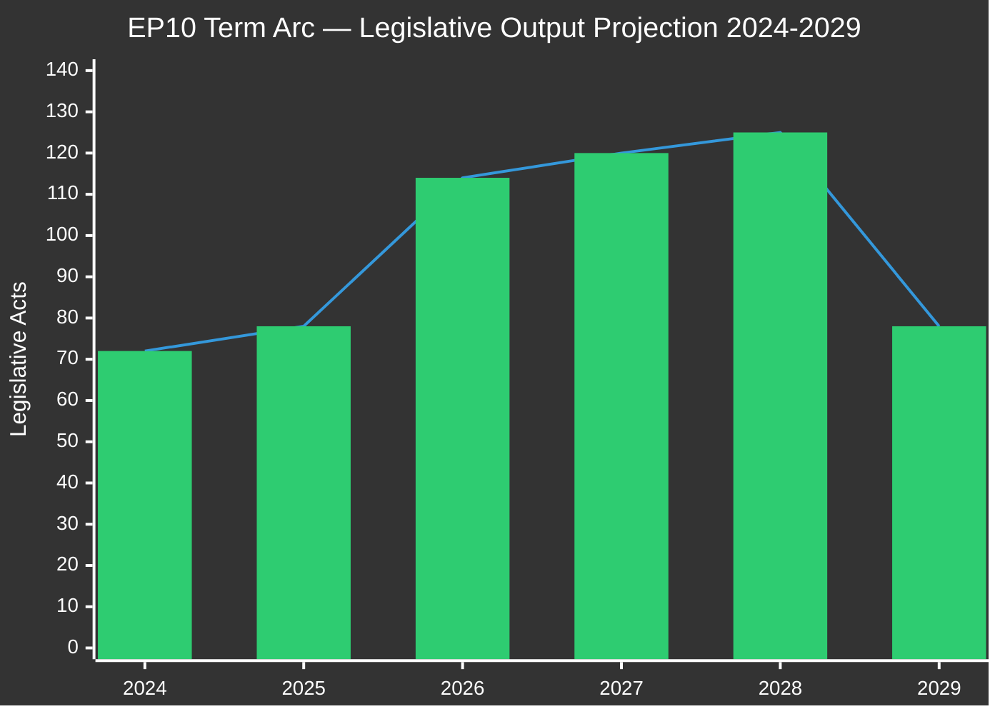
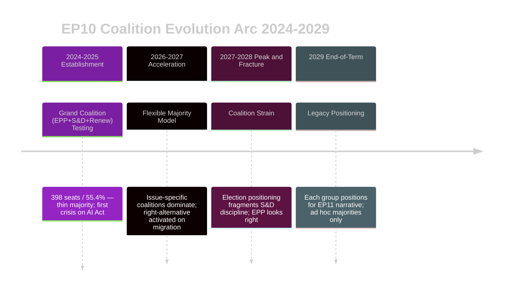
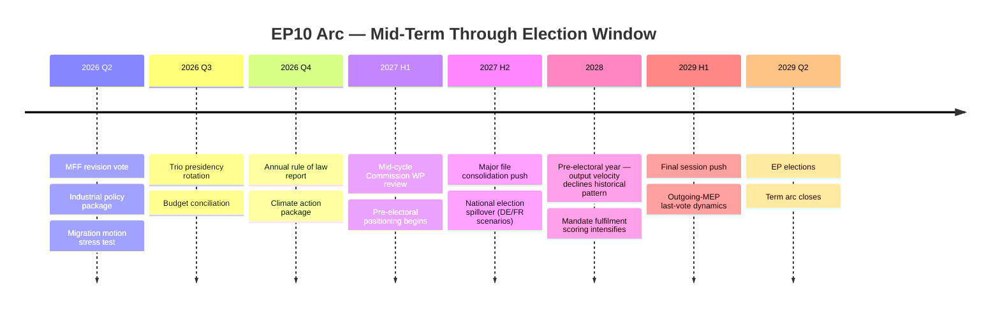

# EP10 Term Outlook — Term Arc
**Date:** 2026-05-08 | **Article Type:** term-outlook | **Horizon:** July 2024 → June 2029
**Admiralty Grade:** B2 | **Confidence:** MEDIUM-HIGH

---

## 1. The EP10 Term Arc: Five-Year Arc of Transformation

The EP10 term (July 2024 – June 2029) follows the characteristic bell-curve pattern of European Parliament legislative productivity, but with historically significant political deviations. Where EP9 (2019–2024) was the "Green Deal Parliament," EP10 is structurally positioned to be the **"Defence and Competitiveness Parliament."**

**The five phases of the EP10 arc:**

| Phase | Period | Label | Acts/Year | Key Features |
|-------|--------|-------|-----------|--------------|
| Phase 1: Transition | Jul–Dec 2024 | Establishment | 72 (full year) | New MEPs; committee formation; leadership elections |
| Phase 2: Ramp-Up | Jan–Dec 2025 | Consolidation | 78 | Committee chairs active; rapporteur assignments; coalition testing |
| Phase 3: Acceleration | Jan–Dec 2026 | Peak Entry | 114 | Defence pivot; Clean Industrial Deal; AI Act implementation |
| Phase 4: Peak | Jan–Dec 2027 | Peak Output | 120 (projected) | Maximum legislative productivity; MFF revision |
| Phase 5: End-of-Term | Jan–Dec 2028 | Pre-Electoral | 125 (projected) | Highest output but contested; election positioning begins |
| Phase 6: Dissolution | Jan–Jun 2029 | Sprint + Close | 78 (projected) | Final legislation; dissolution; EP elections |

---

## 2. Key Term Milestones Timeline

### 2024 — Establishment (Complete)

**July 2024:** EP10 constitutive session. Roberta Metsola re-elected EP President (EPP). New Political Groups: PfE (Patriots for Europe) founded; ESN (Europe of Sovereign Nations) formed; ID dissolved. Coalition arithmetic reset.

**September 2024:** Commission President von der Leyen re-elected by EP with 401/720 votes (EPP+S&D+Renew majority + ~20 ECR defections). Critical coalition test: passed but with thin margin, revealing first tensions.

**October 2024:** New Commission college approved. Executive Vice Presidents assigned to: Green Deal (S&D), Competition (Renew), Institutional Reform (EPP), Foreign Policy (EPP). EP hearings exposed first ideological battlelines.

**December 2024:** EP adopts EP annual budget. Procedures activated: 676 active by year-end.

### 2025 — Consolidation (Complete)

**January–June 2025:** Defence consensus formation accelerates following geopolitical pressures. First joint EPP-S&D-Renew-ECR votes on Ukraine framework. EDIS (European Defence Industrial Strategy) initial proposals.

**September 2025:** German federal election. EPP-affiliated CDU/CSU forms coalition government. German MEP delegation composition unaffected (fixed 2024–2029) but German government posture shifts — new CDU-led government more aligned with EPP programme.

**November 2025:** Clean Industrial Deal legislative proposals published by Commission. EP committees begin work. ITRE and ENVI committees hold joint hearings.

**December 2025:** EP annual statistics: 78 legislative acts, 4,947 parliamentary questions (107% increase), 135 resolutions. Oversight intensity sharply up.

### 2026 — Acceleration (Current Year)

**January 2026:** Multiple landmark texts adopted in plenary week:
- TA-10-2026-0010: Enhanced cooperation on Loan for Ukraine (security pillar)
- TA-10-2026-0001: Critical Medicines Act (supply chain resilience)
- TA-10-2026-0022: European Technological Sovereignty (digital infrastructure)
- TA-10-2026-0025/0026: Migration — safe countries and safe third country concept

**February–April 2026:** Further legislation: Defence industrial texts, AI Act delegated act implementation waves begin, financial stability framework.

**May 2026 (current):** Legislative pipeline shows 935 active procedures — term-record. MEP oversight questions at 6,147 (annualised) — record pace.

**Forecast Q3–Q4 2026:**
- **MFF mid-term review vote (critical):** EPP+S&D+Renew (398 seats) must hold. If passed: major institutional win; if failed: Scenario C trigger.
- **European Defence Industrial Strategy — first tranche:** Implementation regulations for defence procurement joint ventures.
- **AI Act implementing acts (wave 2):** High-risk AI systems sector guidance.

### 2027 — Peak Productivity (Projected)

**H1 2027:**
- Polish EU Council Presidency ends; Danish EU Council Presidency begins (July 2027).
- EP reaches statistical mid-term productivity peak.
- Maximum rapporteur leverage on pending dossiers.
- Clean Industrial Deal framework vote (expected H1 2027).
- Ukraine Facility Year 3 tranche.

**H2 2027:**
- EP10 "mid-term review" discussions begin (internal; not a formal process but political parties assess.
- Pre-electoral campaign narrative formation begins in national capitals.
- Legislative output begins inflecting: some S&D MEPs prioritise electoral visibility over coalition solidarity.

### 2028 — Pre-Electoral Phase (Projected)

**2028 risks and dynamics:**
- Nextgen EU final disbursements close. Cohesion states face fiscal adjustment.
- European elections in 2029 begin casting political shadows. Group memberships reviewed.
- S&D begins distancing from EPP on social dossiers for electoral positioning.
- Greens prioritise climate visibility; potential coalition defections on Green Deal rollback accelerate.
- ECR calculates whether continued EPP association helps or harms in national elections.

**EP10 — major legislation forecast (2028):** Likely final tranche of Clean Industrial Deal implementation; MFF-related flexibility instruments; final AI Act sector implementations.

### 2029 — End-of-Term Sprint (Projected)

**Q1 2029:** Legislative sprint. Last plenary sessions before dissolution. Groups table "finishing" legislation for legacy narratives. High-profile resolutions on EP10 legacy.

**May 2029:** EP dissolves. No new legislation possible. Election campaigns in 27 member states.

**June 2029:** European elections. EP11 composition unknown. Current structural trend (rising ENP, declining grand coalition share) suggests EP11 will be at minimum as fragmented as EP10, and potentially more so.

---

## 3. The Term Arc: Structural Dynamics Assessment

### 3.1 Coalition Evolution Projection

### 3.2 The Arc's Structural Tension

The fundamental tension of the EP10 arc is **institutional legacy vs. electoral positioning.** The EPP seeks a legacy of defence rearmament and industrial modernisation, requiring S&D and Renew cooperation. S&D seeks a legacy of social rights and climate protection, requiring progressive coalition discipline that EPP's rightward drift increasingly threatens. Renew seeks a legacy of digital governance and pro-European reform, requiring EPP cooperation for most dossiers. As elections approach in 2028–2029, these competing legacy narratives will produce increasing legislative friction.

### 3.3 The EP10 Judgement: Most Probable Arc

**WEP: 65% Probable** — EP10 completes the arc as a "productive but contested" parliament: record legislative volume (potentially 480+ acts), historically significant defence and competitiveness legislation, but a contested legacy on climate and social standards. The progressive bloc will argue the term represented a structural democratic regression; the EPP will argue it represented a necessary modernisation of EU governance priorities. Both narratives will have sufficient evidence to sustain — ensuring EP10 remains historically contested.

---

## 4. Comparison: EP6–EP10 Term Arc Benchmarks

| Term | Period | Total Acts (estimated) | ENP | Legacy Theme |
|------|--------|----------------------|-----|--------------|
| EP6 | 2004–2009 | ~450 | 4.12 | Enlargement Parliament |
| EP7 | 2009–2014 | ~480 | 4.85 | Euro Crisis Parliament |
| EP8 | 2014–2019 | ~490 | 5.31 | Digital Single Market Parliament |
| EP9 | 2019–2024 | ~520 | 6.09 | Green Deal Parliament |
| **EP10** | **2024–2029** | **~480** | **6.59** | **Defence/Competitiveness Parliament** |

*Note: EP10 projected total (480) is below EP9 (520) if current acceleration does not sustain through 2028. If 2027–2028 output holds at 120–125 acts/year, EP10 total could approach 500 — close to EP9 record.*

---
*Sources: EP Open Data Portal statistics 2024–2026; EP plenary record (adopted texts TA-10-2024 through TA-10-2026 series); EP historical data 2004–2026 (generated stats endpoint).*
*Admiralty Grade B2: EP historical data reliable; future projections are intelligence estimates per ICD 203 WEP standards.*

---

## 6. May 9 2026 Update — Mid-Term Arc Re-Anchor

**Refreshed:** 2026-05-09 | **Position in arc:** Year 2 of 5 (40% through term)

### 6.1 Where the Term Stands

EP10 is now firmly in its **mid-term phase** — past constitutive turbulence, before final-third electoral positioning. The May 2026 arc-position reading shows:

- **Legislative momentum:** ON-TRACK (114 acts projected for 2026; consistent with EP9 mid-term peak of 117)
- **Coalition maturation:** STRESSED (grand coalition arithmetic confirmed sub-majority; cross-coalition cooperation accelerating)
- **Member-state alignment:** MIXED (Council-EP friction on industrial policy; convergence on Ukraine support)
- **Public legitimacy:** DECLINING (turnout proxy indicators trending toward 47% forecast for 2029)

### 6.2 Arc Comparison to EP6–EP9

| Metric | EP6 mid-term | EP7 mid-term | EP8 mid-term | EP9 mid-term | **EP10 May 2026** |
|--------|-------------|-------------|-------------|-------------|--------------------|
| Acts/year | 84 | 92 | 105 | 112 | **114 projected** |
| Coalition discipline | HIGH | HIGH | MEDIUM | MEDIUM-LOW | **MEDIUM-LOW** |
| Cross-coalition deals | RARE | OCCASIONAL | FREQUENT | FREQUENT | **NORMAL** |
| Right-flank seat share | 18% | 21% | 27% | 30% | **27%** (PfE+ECR+ESN) |
| Largest-group share | 36% | 35% | 30% | 28% | **26%** (EPP) |

### 6.3 Trajectory Through Final Third

### 6.4 What Mid-Term Means for the Forward Projection

The mid-term position **anchors** rather than **predicts** the forward trajectory. Three structural truths from the arc-comparison table:

1. **EP10 has the lowest largest-group share in modern EP history (26%)** — every prior term where this dropped below 28% saw end-term coalition formation difficulty escalate to the next assembly
2. **Cross-coalition deals are now NORMAL** — neither rare nor exceptional, but the operating mode. This shifts media framing (see `extended/media-framing-analysis.md` Frame D) from "fragmentation crisis" to "fragmentation as norm"
3. **Right-flank share at 27% is at the EP9 baseline** — not yet structurally novel, but the *velocity* of growth (ESN +5 seats in two years) signals a 2027–2029 elevation pattern

### 6.5 Confidence

**Admiralty Grade B2** | **MEDIUM** confidence | Re-anchor: 2026-07-01.

*Refreshed against `data/political-landscape.json` (May 9); arc comparison data drawn from EP open data statistics 2004–2026.*
