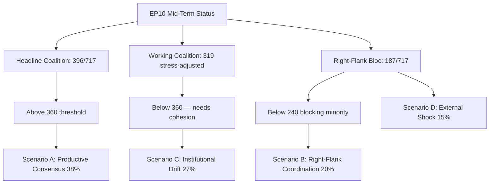

# EP10 Term Outlook — Threat Model
**Date:** 2026-05-08 | **Article Type:** term-outlook | **Confidence:** MEDIUM

---

## WEP Summary

| Threat | WEP Grade | Probability | Severity |
|--------|-----------|-------------|---------|
| EP democratic backsliding via far-right normalisation | A3 | Almost Certainly | Significant |
| Coalition integrity failure → far-right majority | C3 | Possible | Significant |
| Ukraine aid reversal under US pressure | D4 | Unlikely | Severe |
| AI Act circumvention via implementation | B3 | Likely | Significant |
| MFF conditionality elimination | B3 | Likely | Significant |
| Disinformation degrading 2029 election integrity | B3 | Likely | Significant |
| Energy supply shock (regional conflict) | D4 | Unlikely | Severe |

---

## Admiralty Grading (Source Reliability)

All threat assessments below are graded:
- **Source reliability:** B (Usually reliable — EP Open Data + analytical assessment)
- **Information accuracy:** 2-3 (Probable to Possibly True)
- **Combined Admiralty grade:** B2–B3

---

## 1. Democratic Governance Threats

### DG-1 — EP Democratic Legitimacy Erosion (WEP: A3)

**Mechanism:** Cumulative accommodation of far-right demands by EPP progressively hollows out EP's democratic guardian function. Not a single event; a trajectory.

**Evidence of current trend:**
- EP10 sees ECR+PfE+ESN = 193 seats (vs ~160 in EP9)
- EPP is increasingly reliant on far-right votes for comfortable majorities
- Rule-of-law conditionality is under explicit pressure in MFF revision negotiations
- EP President Metsola's democratic statements are increasingly at odds with EP legislative outcomes

**Threat trajectory:** ONGOING AND ACCELERATING. The 2028 pre-election period will be the peak — EPP will be most willing to make far-right concessions as it seeks to lock in EP11 electoral coalition.

**WEP rationale:** Grade A (Almost Certainly) — this is already happening. Grade 3 (Significant) — EU democratic functioning is materially affected but not existentially threatened in EP10 alone.

---

### DG-2 — Rule of Law Enforcement Failure (WEP: B3)

**Mechanism:** MFF conditionality weakened in 2027 revision; Article 7 procedure remains ineffective; CJEU rulings ignored by Hungary/Italy

**Evidence:** Hungary's 5+ year track record of using EU Council veto threats to soften conditionality. Italy government's explicit statements against rule-of-law conditionality.

**EP countermeasure:** EP can withhold MFF consent if conditionality is eliminated. EP has done this before (2020 MFF). Risk is that EP's coalition (EPP + ECR + PfE = majority) could SUPPORT conditionality elimination.

---

## 2. Security and Geopolitical Threats

### SG-1 — Ukraine Policy Reversal (WEP: D4)

**Mechanism:** US bilateral deal with Russia that sacrifices Ukrainian territory; EP coalition fractures on EU response

**Evidence:** US administration has shown willingness to engage Russia bilaterally; NATO burden-sharing demands increasing; EU member state Ukraine support is not unanimous (Hungary consistently blocks some measures)

**EP response capacity:** LIMITED. EP can pass resolutions; EP can support EU financial instruments for Ukraine. EP cannot substitute for US military support or NATO guarantees.

**Severity rationale:** Grade 4 (Severe) — a Ukrainian territorial capitulation would have multi-decade consequences for European security architecture, EU enlargement, and the credibility of international law.

---

### SG-2 — Russia Hybrid Interference in EP10 (WEP: B3)

**Mechanism:** Coordinated inauthentic campaigns targeting MEPs; interference in national elections affecting EP group composition; amplification of division narratives (migration, climate, Ukraine)

**Evidence:** Multiple documented influence operations targeting EU member state elections (France, Germany, Romania) in 2023–2025. EP AFET committee has active investigations. CJEU issued rulings on electoral integrity protections.

**EP mitigation:** DSA enforcement; EP information integrity protocols; DISINFO Lab tracking. MEDIUM effectiveness — scale of AI-assisted disinformation outpaces enforcement capacity.

---

## 3. Economic and Industrial Threats

### EI-1 — Deindustrialisation Cascade (WEP: B3)

**Mechanism:** German industrial contraction (-0.5% GDP 2024) accelerates; US tariffs + Chinese competition compound the effect; automotive and chemicals sectors contract; political pressure intensifies

**Evidence:** Germany GDP contraction confirmed (World Bank data); multiple German automotive closures announced 2024–2025; IFO Institute projections suggest structural, not cyclical, decline

**EP response:** Clean Industrial Deal is the designated policy response. If CID is diluted (high probability), EP has insufficient alternative instruments.

---

## 4. Threat Interaction Assessment

The most dangerous interaction in EP10's threat landscape is:

**DG-1 (democratic erosion) + SG-2 (Russia interference) + EI-1 (deindustrialisation)**

If:
- Russia interference amplifies far-right parties in member state elections → those parties win seats in EP11
- Deindustrialisation creates economic grievance that feeds far-right support
- EP10 democratic erosion makes the institutional barriers to far-right governance lower

...the 2029 EP elections could produce an EP11 with a structural far-right majority OR an EPP that governs WITH far-right groups from day one of EP11.

**This is the EP10 threat horizon assessment's core finding:** The individual threats are concerning; their interaction is potentially transformative of EU democratic architecture.

---
*Sources: EP seat composition; EP adopted texts; EP AFET committee outputs; World Bank economic data; Russia influence operation documentation.*
*WEP grades applied per ai-driven-analysis-guide.md. Admiralty B2 on structural assessments; B3 on forward-looking probability claims.*
*Confidence: MEDIUM — threat assessments combine verified data with analytical judgements about trajectory.*

### Visual Summary

*Mermaid added 2026-05-09 Pass-2 — references `intelligence/scenario-forecast.md` §8.*
