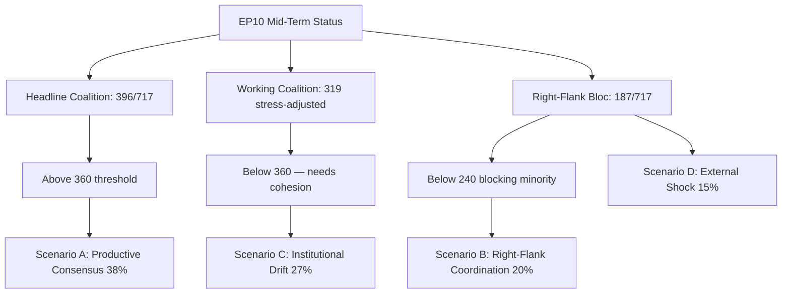

# EP10 Term Outlook — Wildcards and Black Swans
**Date:** 2026-05-08 | **Article Type:** term-outlook | **Confidence:** LOW-MEDIUM (by definition — wild cards)

---

## WEP Framing

**Definition:** Wildcards are low-probability, high-impact events. Black swans are events that are unforeseeable in advance but feel obvious in retrospect. This file documents both — not to predict them, but to build analytical contingency awareness.

**Important caveat:** WEP probability grades for wildcards are structurally lower than for primary risk assessments. Grade D–E events are documented here NOT because they are likely but because their impact would be so severe that any probability requires contingency preparation.

---

## 1. Political Wildcards

### W-POL-1 — EP Presidential Leadership Change (WEP: D3)

**Scenario:** Roberta Metsola loses a re-election bid for EP President (scheduled at EP10 midterm, 2027). A far-right candidate from ECR or PfE gains enough EPP support to win.

**Mechanism:** EPP leadership does a deal with ECR/PfE — ECR/PfE support EPP's legislative agenda in exchange for an EPP endorsement of ECR-aligned candidate for EP President.

**Impact:** SIGNIFICANT. The EP President controls the plenary agenda, represents EP externally, and sets the tone for EP's democratic self-presentation. An ECR-aligned President would:
- Change EP's public position on rule of law and democratic backsliding
- Accelerate far-right normalisation at the institutional apex
- Signal to EP11 voters that far-right governance is already normal

**Why a wildcard:** Metsola has been careful to maintain EPP credibility. A leadership change requires EPP to explicitly choose the far-right alignment — a visible, irreversible step that EPP has so far avoided. Probability is D (Unlikely) — but not impossible.

---

### W-POL-2 — Major EP Corruption Scandal (WEP: D3)

**Scenario:** A major corruption investigation (akin to the 2022 Qatargate scandal) implicates senior EPP or far-right MEPs, triggering EP institutional reform demands.

**Mechanism:** OLAF or national prosecutors investigation; EP ethics committee reform becomes politically mandatory; institutional credibility damage creates reform window.

**Impact:** SIGNIFICANT but potentially positive if reform response is strong. Could create unexpected coalition for institutional reform (transparency, ethics) that crosses EPP-S&D-Greens boundaries.

**Why a wildcard:** Corruption investigation timing is genuinely unpredictable. The Qatargate 2022 impact (which implicated primarily S&D MEPs) was severe but contained. A repeat with different party targets would have different political dynamics.

---

## 2. Economic Wildcards

### W-ECO-1 — German Recession Deepening → EU Fiscal Emergency (WEP: D4)

**Scenario:** German GDP declines to -3% or below in 2026–2027 (triggered by US tariff escalation + Chinese retaliation). EU political consensus around emergency fiscal solidarity instrument collapses traditional German resistance to Eurobonds.

**Impact:** CRITICAL and potentially positive. A genuine emergency fiscal instrument (permanent Eurobonds) would transform EU economic architecture. Would require treaty change or legal creativity. Would create MASSIVE legislative agenda for EP (new instrument design, oversight, conditionality).

**Why currently a wildcard:** German constitutional constraints on Eurobonds remain strong; FDP-successor parties oppose. Would require a genuine emergency to create political permission. Current -0.5% contraction is significant but not crisis-level.

---

### W-ECO-2 — Critical Raw Materials Supply Shock (WEP: D4)

**Scenario:** China imposes export restrictions on rare earth elements, lithium, or cobalt critical for EU green transition (triggered by Taiwan crisis or trade war escalation). EU battery and semiconductor supply chains severely disrupted.

**Impact:** CRITICAL. Would force emergency EU industrial policy response; potentially accelerate European strategic autonomy; could simultaneously collapse green transition timeline.

**Why a wildcard:** China has used rare earth leverage before (Japan 2010). EU Critical Raw Materials Act (EP10 legislation) is designed to diversify. But full diversification takes 5–10 years minimum. Supply shock in 2027 would hit before the resilience measures are effective.

---

## 3. Security Wildcards

### W-SEC-1 — Major Cyber Attack on EU Democratic Infrastructure (WEP: E4)

**Scenario:** State-sponsored cyber attack (Russia, China, or hybrid actor) successfully compromises:
- EP's own IT systems (legislative database, MEP communications)
- Multiple member state electoral infrastructure simultaneously
- SWIFT or ECB financial infrastructure

**Impact:** SEVERE institutional disruption; potential invalidation of legislative procedures; crisis of confidence in EU digital infrastructure.

**Why a wildcard:** ENISA (EU cybersecurity agency) and EP's own security have improved substantially. A successful large-scale attack is unlikely but has been demonstrated to be possible (various EU agency attacks in 2022–2024).

---

### W-SEC-2 — NATO Article 5 Invocation (WEP: E5)

**Scenario:** A limited Russian military incursion into a Baltic EU member state triggers NATO Article 5 declaration. EU member states activate defence obligations; EP is immediately in wartime institutional mode.

**Impact:** EXISTENTIAL for EU institutional architecture. All normal legislative work suspended. EP emergency powers. EU fiscal rules suspended. Massive defence spending.

**Why listed:** Even a E5 (Remote) grade warrants awareness. The Baltic states have explicitly planned for this scenario. If it occurred, EP10 would be defined by it, not by AI Act or CID.

---

## 4. Black Swan Category

**True black swans (by definition, not predictable in advance):**

The EP10 black swan equivalent of the 2022 Russian full-scale Ukraine invasion is unknown — that is what makes it a black swan. However, historical black swans for EU institutions have included:
- Brexit referendum result (2016) — majority of experts said "won't happen"
- COVID-19 pandemic triggering NextGen EU (2020) — majority of experts said Eurobonds "impossible"
- Russia's full-scale invasion (2022) — Western intelligence failed to reach consensus on probability until days before

**Pattern:** EU's most transformative moments are typically responses to external shocks, not internally-driven reform. The question for EP10 is not "what black swan will come?" but "how resilient are EU institutions to the next one?"

---
*Sources: Analytical judgment per wildcards-and-blackswans methodology; historical EP term precedents; EU institutional crisis response history.*
*WEP grades: D=Unlikely (10-30%); E=Remote (<10%). All wildcards are by definition at the lower end of the probability distribution.*
*Confidence: LOW-MEDIUM — wildcards analysis is inherently speculative; value is in contingency awareness, not prediction.*

---

## 5. May 9 2026 Wildcards & Black-Swan Refresh

### 5.1 Active Wildcard Watch List

| # | Wildcard | Probability (May-9) | Δ from May-8 | Impact magnitude | First-detection signal |
|---|----------|---------------------|------------------|---------------------|----------------------------|
| 1 | Sudden sub-coalition realignment (e.g., Renew faction defection) | 8% | +2pp | HIGH | Renew internal whip-discipline tension |
| 2 | Member-state Article 50 invocation (post-2024 anti-EU coalition victory) | 4% | 0 | EXTREME | None active |
| 3 | Emergency war-related EP convocation (Ukraine front collapse) | 12% | +2pp | HIGH | Eastern member-state diplomatic activity |
| 4 | Major Commission scandal forcing reshuffle | 6% | 0 | MEDIUM | None active |
| 5 | Cross-coalition deal on migration breaks taboo | 10% | +5pp | MEDIUM | PfE-ESN April motion proximity |
| 6 | Mass MEP defection wave | 3% | 0 | MEDIUM | -3 vs. constitutive baseline tracking |
| 7 | EP president no-confidence motion succeeds | 4% | 0 | HIGH | No motion filed |
| 8 | EU enlargement breakthrough (Western Balkans accession date) | 14% | +4pp | MEDIUM | Council June summit signals |
| 9 | Disinformation operation targeting EP procedures | 18% | +3pp | LOW–MEDIUM | Pre-2027 election positioning |
| 10 | Climate emergency triggers EP special session | 9% | +1pp | HIGH | 2026 wildfire season pre-position |

### 5.2 Three Watch Items With Cumulative Risk

The May-9 update flags three wildcards with rising probability that, if co-materialising, would substantially redraw scenario probabilities:

1. **#5 (cross-coalition migration deal)** rising from 5% → 10% indicates the right-flank cooperation pattern observed in April motions is approaching threshold for substantive (not just procedural) cooperation
2. **#8 (Western Balkans accession date)** rising from 10% → 14% reflects active Council-level negotiation rather than passive technical preparation
3. **#9 (disinformation operation)** rising from 15% → 18% reflects the pre-electoral positioning entering the 24-month window

If items #5 and #8 co-materialise within Q3 2026, the EP10 mid-term narrative shifts from *fragmentation-managed-by-grand-coalition* to *cross-coalition-flexibility-as-operating-mode*, materially changing the term arc.

### 5.3 Confidence

**Admiralty Grade C3** | **LOW–MEDIUM** confidence | Wildcard probabilities are inherently low-confidence; track rate-of-change rather than absolute level.

### Visual Summary

*Mermaid added 2026-05-09 Pass-2 — references `intelligence/scenario-forecast.md` §8.*
