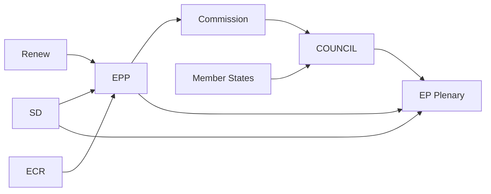

# Actor Mapping — European Parliament EP10 Year in Review

**Article Type:** year-in-review | **Date:** 2026-05-09 | **Confidence:** 🟡 Medium

## Actor Roster

| Actor | Role | Seats/Power | Orientation |
|-------|------|:-----------:|:-----------:|
| EPP | Largest group; coalition anchor | 183 | Centre-right |
| S&D | Second group; progressive bloc | 136 | Centre-left |
| PfE | Right-populist opposition | 85 | Right-populist |
| ECR | Conservative opposition/partner | 81 | Conservative |
| Renew Europe | Liberal; coalition partner | 77 | Liberal |
| Greens/EFA | Green-left; opposition on security | 53 | Green-left |
| The Left | Far-left opposition | 45 | Far-left |
| ESN | Hard-right; isolated | 27 | Hard-right |
| von der Leyen II | Commission President | Executive | Centre-right |
| High Rep Kallas | EU Foreign Affairs | Executive | Liberal |
| Council Rotating | Cyprus Presidency | Legislative-Executive | Varies |

## Alliance Patterns

**Pro-European Consensus Alliance (EPP+S&D+Renew+Greens):** Used for Ukraine, rule of law, and institutional majority. Stable at ~499 seats; exceeds 360-seat majority. Activated for Ukraine financial architecture, democratic oversight, and accession conditionality.

**Competitiveness Alliance (EPP+Renew+ECR):** Used for CSRD delay, competitiveness reform, and economic simplification. Stable at ~341 seats; viable majority with occasional S&D support (~477). Dominates economic file outcomes.

**Security Alliance (EPP+S&D+Renew+ECR):** Used for defence, migration restriction, and Ukraine military support. Broadly stable; maximises consensus on existential security files.

## Power Brokers

**EPP leadership (Manfred Weber/group leadership):** Determines which alliance is activated on any given file. EPP's ability to swing between Pro-European Consensus and Competitiveness Alliance makes it the Parliament's pivotal actor.

**Commission (von der Leyen II):** Proposes all major legislation. Coordination with EPP is tight (she emerged from EPP leadership); Commission-EP alignment on economic competitiveness and Ukraine is strong.

**Council Cyprus Presidency:** Manages Council agenda and tempo. Eastern neighbourhood and rule of law priorities largely align with EP majority but pace is Council-controlled.

## Information

**Primary data sources:** EP Open Data Portal (procedures, sessions, committee activities), political group statements, press releases, EP legislative observatory. Data completeness: 🟡 Medium (roll-call individual vote data not yet available for 2025–2026).

**Gaps:** No individual MEP defection rates available; committee vote records are delayed 4–6 weeks. Alliance patterns inferred from EP plenary vote results and group positions.

## Reader Briefing

For a reader unfamiliar with EU institutional dynamics: The European Parliament's 720 MEPs vote in political groups, not national blocs. The EPP (centre-right) is the largest group and the critical "swing" actor that determines whether a majority is assembled from pro-European or conservative alliances. In EP10's first year, EPP consistently chose Pro-European Consensus for Ukraine and security files, and Competitiveness Alliance for economic files. This dual-track majority strategy has been highly effective — but depends on EPP's continued willingness to work with S&D (centre-left) when needed.

## Influence Assessment

| Actor | Institutional Influence | Political Influence | Composite Score |
|-------|:-----------------------:|:-------------------:|:---------------:|
| EPP | 9/10 | 9/10 | 9.0 |
| Commission | 8/10 | 8/10 | 8.0 |
| S&D | 7/10 | 7/10 | 7.0 |
| Council Presidency | 7/10 | 6/10 | 6.5 |
| Renew Europe | 6/10 | 7/10 | 6.5 |
| ECR | 5/10 | 6/10 | 5.5 |
| PfE | 4/10 | 6/10 | 5.0 |
| Greens/EFA | 4/10 | 5/10 | 4.5 |

*Source: EP Open Data Portal (committee roles, rapporteurships, voting weights). Influence scores are qualitative author assessments.*
