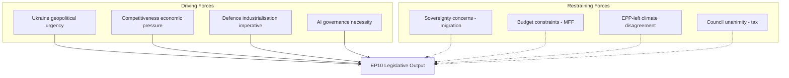

# Forces Analysis — European Parliament EP10 Year in Review

**Article Type:** year-in-review | **Date:** 2026-05-09 | **Confidence:** 🟡 Medium

## Issue Frame

EP10's first year has been defined by a dual challenge: maintaining European geopolitical solidarity (Ukraine, defence) while managing a competitiveness-green transition tension domestically. The fundamental issue frame is: **can EP10 maintain the Ukraine security consensus while the Draghi competitiveness agenda erodes the Green Deal and progressive social priorities?**

The answer in year 1 is: YES — barely. The coalitions are different for security vs. competitiveness vs. social files, and EPP has successfully managed these without coalition collapse.

## Driving Forces

**1. Ukraine Geopolitical Urgency (Force: 9/10)**
Russia's ongoing military campaign and Ukraine's existential security needs have created the strongest driving force for EP action since the COVID crisis. Ukraine solidarity transcends traditional left-right divisions. Financial support mechanisms, arms procurement frameworks, and accession pathway decisions all advanced because of this force.

**2. Economic Competitiveness Pressure (Force: 8/10)**
The Draghi report (2024) defined the EU's competitiveness deficit against the US and China. Business lobby pressure for regulatory simplification created a strong force toward CSRD/CSDDD delay, carbon market flexibility, and investment facilitation. The Competitiveness Alliance (EPP+Renew+ECR) is the institutional expression of this force.

**3. Defence Industrialisation Imperative (Force: 8/10)**
NATO's 2% GDP target, US strategic ambiguity under the new administration, and the Ukraine weapons demand have created powerful pressure for EU defence spending acceleration. EDIP and bilateral defence frameworks advanced because of this force.

**4. AI Governance Urgency (Force: 7/10)**
The AI Act's full implementation timeline (2025–2027) and the rapid deployment of generative AI in high-risk applications have created regulatory urgency. The DMA's application to GPAI models intersects with AI governance. The AI Office's first enforcement actions will test this driving force.

## Restraining Forces

**1. National Sovereignty on Migration (Force: 8/10)**
EU migration policy remains deeply contested. While EP10 adopted the February 2026 migration package, individual member state sovereignty concerns (border controls, asylum procedures) create constant friction. Hungary and Poland's asylum non-compliance is the most visible expression.

**2. MFF Budget Constraints (Force: 7/10)**
The 2021–2027 MFF mid-term review revealed structural under-funding. New demands (Ukraine, defence, competitiveness, climate) compete for a fixed budget envelope. 'Frugal' member states resist net contribution increases.

**3. EPP-Left Climate Disagreement (Force: 6/10)**
The Greens+S&D+Left bloc's climate priorities are fundamentally opposed to EPP's competitiveness pivot. The CSRD/CSDDD delay exemplifies the restraining force: Green Deal momentum from EP9 is being restrained by EP10's different majority arithmetic.

**4. Council Tax Unanimity Requirement (Force: 9/10, restraining)**
Any tax harmonisation requires unanimous Council agreement — making financial transaction tax, digital tax, and BEFIT reform almost impossible regardless of EP majority. This is a structural restraining force that EP cannot overcome.

## Net Pressure

**Security/Ukraine files:** Driving forces (9+8+8=25) >> Restraining forces (2). Net pressure: STRONGLY TOWARD ADVANCING.

**Competitiveness files:** Driving forces (8) > Restraining forces (7). Net pressure: MODERATELY TOWARD ADVANCING (with member state pressures).

**Social/Climate files:** Driving forces (3-5) << Restraining forces (6-8). Net pressure: TOWARD STALLING.

**Tax/Fiscal harmonisation:** Driving forces (4) << Restraining forces (9). Net pressure: STRONGLY TOWARD BLOCKING.

## Intervention Points

Where the restraining forces could be overcome:
1. **MFF 2028-34 negotiations** — opportunity to reset budget priorities if geopolitical case is made for higher contributions
2. **AI Act enforcement** — first case could shift driving forces for broader digital regulation
3. **Ukraine accession conditionality** — EP can set terms for accession that influence member states
4. **Court challenges** — CJEU challenges to migration package could re-open legal space for rights-based approaches

## Reader Briefing

Forces analysis reveals that EP10's agenda has been overwhelmingly driven by external geopolitical shocks (Ukraine, defence) rather than planned internal priorities. The competitiveness agenda has benefited from the 'anything vs. Green Deal' political dynamic, advancing faster than it would have in a normal political cycle. Social, climate, and fiscal equity priorities face structural restraints that are unlikely to lift in the remaining EP10 term without a major political shift.
