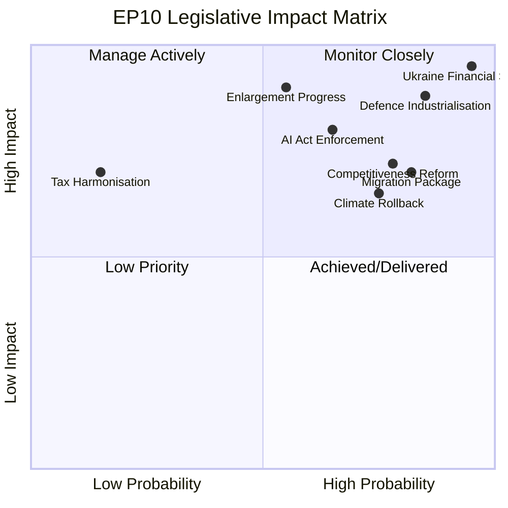

# Impact Matrix — European Parliament EP10 Year in Review

**Article Type:** year-in-review | **Date:** 2026-05-09 | **Confidence:** 🟡 Medium

## Event List

The following major EP10 legislative events form the basis of this impact assessment:

| Event | Date | Category |
|-------|------|----------|
| EP10 Constituted + VdL II confirmed | July 2024 | Institutional |
| Ukraine Enhanced Cooperation Loan | Q4 2024 | Geopolitical/Fiscal |
| CSRD/CSDDD delay (Omnibus Package) | Q1 2025 | Economic/Regulatory |
| February 2026 Migration Package | February 2026 | Political/Social |
| April 2026 EU Defence & Security Acts (×5) | April 2026 | Security |
| Ukraine Claims Commission established | 2025 | Legal/Institutional |
| DMA GPAI enforcement resolution | 2025–2026 | Digital/Legal |
| EP Draghi Implementation Resolution | 2025 | Economic |

## Stakeholder Impact

| Stakeholder Group | Positive Impacts | Negative Impacts | Net Assessment |
|-------------------|:---------------:|:----------------:|:--------------:|
| Ukraine government | ✅ Financial support | ❌ Accession delay | Positive |
| EU Defence industry | ✅ EDIP contracts | — | Strongly positive |
| Business / SMEs | ✅ CSRD delay | ❌ DMA compliance | Moderately positive |
| Environmental NGOs | — | ❌ CSRD/Green Deal rollback | Negative |
| Migration rights orgs | — | ❌ February 2026 package | Negative |
| AI companies (large) | ❌ AI Act enforcement | ✅ Market certainty | Mixed |
| Citizens (EU) | ✅ Security investment | ❌ Social policy stall | Ambiguous |
| Trade unions | ⚠️ Platform workers | ❌ Social agenda stall | Moderately negative |

## Impact Matrix (Severity × Probability)

| Issue | Severity | Probability | Impact Score |
|-------|:--------:|:-----------:|:------------:|
| Ukraine conflict escalation | 10/10 | 30% | 30 |
| EU defence capacity gap | 9/10 | 60% | 54 |
| AI governance failure | 8/10 | 40% | 32 |
| Climate target reversal | 8/10 | 55% | 44 |
| Migration policy CJEU challenge | 7/10 | 45% | 32 |
| EPP coalition fragmentation | 9/10 | 20% | 18 |
| Tax harmonisation failure | 6/10 | 85% | 51 |

## Heat Map Assessment

**HIGH HEAT** (requires immediate EP attention):
- Defence capacity gap (score 54) — most urgent strategic risk
- Tax harmonisation failure (score 51) — structural constraint on fiscal policy

**MEDIUM HEAT** (requires monitoring):
- Climate target reversal (score 44) — political risk from competitiveness vs. sustainability tension
- AI governance failure (score 32) — enforcement legitimacy at stake
- Ukraine conflict escalation (score 30) — existential if materialises; currently low probability

**LOW HEAT** (manageable):
- EPP coalition fragmentation (score 18) — coalition has been resilient in year 1

## Cascade Effects

**Ukraine escalation cascade:** Ukraine military reversal → EP emergency session → MFF revision demand → Pro-European Consensus under stress → EPP faces defence-or-competitiveness forced choice → coalition instability risk

**AI Act enforcement failure cascade:** First enforcement case failure → Commission credibility hit → EP oversight resolution → structural review of AI Office mandate → sets precedent for future digital regulation enforcement

**Migration CJEU challenge cascade:** CJEU ruling against February 2026 package → legislative vacuum → polarisation at EP → ECR/PfE challenge government → Pro-European Consensus stress

## Reader Briefing

The impact matrix reveals that EP10's year 1 has delivered the highest-impact legislative outputs in areas where driving forces were overwhelming (Ukraine, defence). The medium-term risk landscape is dominated by the climate-competitiveness tension and the structural failure of tax harmonisation. Citizens and civil society actors on the progressive side of European politics have seen limited gains in year 1 — the parliamentary arithmetic and geopolitical context have strongly favoured security and economic files over social and environmental priorities.
