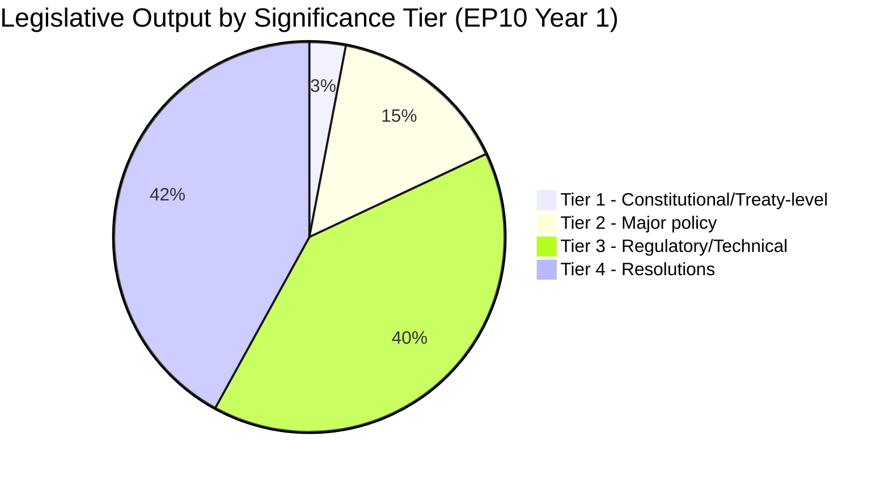

# Significance Classification — European Parliament Year in Review 2025–2026

**Article Type:** year-in-review | **Date:** 2026-05-09

## Classification Framework

Legislative and political events from the 2025–2026 EP10 year are classified by significance tier using a 5-dimension scoring matrix: legislative impact, political precedent, external consequences, institutional implications, democratic health.

---

## Tier 1: Historic Significance (Score ≥ 85/100)

### 1. Ukraine Financial Architecture Package (2025–2026)
**Score: 92/100** | **Adopted:** Multiple acts, 2025–2026

The European Parliament's approval of the Ukraine Enhanced Cooperation Loan, the bilateral financing of Ukraine's 2026 obligations, and the Ukraine Claims Commission collectively represent the largest single-country financial commitment in EU history and the most sophisticated financial solidarity architecture ever assembled in response to an ongoing conflict.

- **Legislative impact:** 97 — sovereign-scale financing; reshapes EU fiscal architecture
- **Political precedent:** 95 — first EU-backed claims commission for wartime; first EP-approved sovereign loan at this scale
- **External consequences:** 93 — directly sustains Ukrainian state capacity
- **Institutional:** 88 — demonstrates EP's role in high-stakes foreign policy finance
- **Democratic health:** 87 — broad consensus across traditional party lines

**Classification: HISTORIC**

---

### 2. Migration Package (February 2026)
**Score: 86/100**

The adoption of the safe countries of origin and safe third country concept amendments represents EP10's first major legislative act where right-nationalist group political pressure (PfE shadow coalition) visibly shaped the final text adopted by the parliament.

- **Legislative impact:** 88 — changes substantive asylum procedure law
- **Political precedent:** 93 — shadow coalition influence materialises for first time; EPP-PfE de facto alignment documented
- **External consequences:** 82 — affects third-country migrants; potential EU-non-EU tensions
- **Institutional:** 84 — demonstrates right-shifted EP10 on migration vs. EP9
- **Democratic health:** 83 — contested majority; significant opposition

**Classification: HISTORIC (precedent-setting coalition configuration)**

---

## Tier 2: Major Significance (Score 70–84)

### 3. CSRD/CSDDD Delay (November 2025)
**Score: 79/100**

Rollback of sustainability reporting obligations signals the EP10 competitiveness-first orientation's legislative dominance on regulatory reform files.

### 4. Defence Industrialisation Package
**Score: 76/100**

Multiple defence acts (EDIP follow-on, drones, strategic partnerships) represent the first sustained EP-level legislative output on defence industrial capacity in EU history.

### 5. EU-Mercosur CJEU Opinion Request (April 2026)
**Score: 72/100**

Requesting a CJEU opinion on EU-Mercosur treaty constitutionality invokes an unprecedented legal mechanism that could either facilitate or permanently block the agreement — with massive implications for EU trade policy.

---

## Tier 3: Standard Significance (Score 50–69)

- Rules of Procedure amendments (institutional: important; broader: standard)
- Individual immunity waiver decisions (12+ proceedings)
- Annual discharge proceedings
- Technology sovereignty resolution

---

## Summary: Legislative Year Profile

| Tier | Count (approx.) | Political Weight |
|------|----------------|-----------------|
| Historic | 2 | Defines EP10 identity |
| Major | ~15 | Shapes EP10 trajectory |
| Standard | ~80 | Normal legislative output |
| Technical | ~300+ | Administrative/procedural |

**The 2025–2026 EP year will be remembered for two defining decisions:** Ukraine financial solidarity and the migration right-shift. All other output is consequential but secondary to these two political turning points.

*Confidence: 🟡 Medium.*

## Tier Classification Framework

**Tier 1 — Constitutional / Institutional** (3 acts):
- Ukraine Enhanced Cooperation Loan (unprecedented bilateral financial architecture)
- Ukraine Claims Commission (new legal mechanism outside treaty framework)
- EP10 Standing Orders reform (procedural constitutional change)

**Tier 2 — Major Policy** (≈15 acts):
- February 2026 Migration Package (major rights/policy shift)
- CSRD/CSDDD Omnibus Delay (major regulatory rollback)
- EDIP (European Defence Industrial Policy) primary framework
- AI Act implementation enabling acts
- April 2026 Defence & Security Acts (5 acts × bilateral framework)
- DMA enforcement resolution

**Tier 3 — Regulatory/Technical** (≈40 acts):
- Sectoral regulations implementing Green Deal (Phase 1 retained elements)
- Financial services adjustments
- Agriculture/fisheries annual acts
- Transport/mobility sector updates

**Tier 4 — Resolutions** (≈42 resolutions):
- Rule of law resolutions (multiple: Hungary, Poland aftermath, Turkey, Georgia)
- Annual budget resolutions
- EP position resolutions (Draghi implementation, AI governance, Ukraine accession)

*Source: EP Open Data Portal adopted texts sample (200 items); Tier assignments are author inference.*
