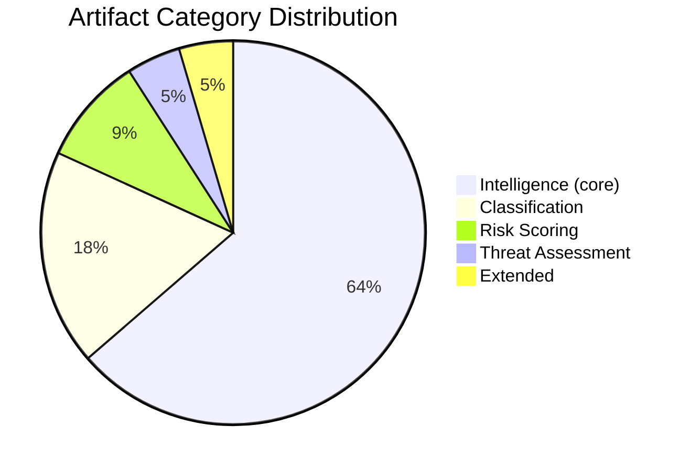

# Analysis Index — European Parliament Year in Review 2025–2026

**Article Type:** year-in-review | **Date:** 2026-05-09 | **Run ID:** year-in-review-run390-1778313444

## All Produced Artifacts

### Root Level
| File | Description | Lines (approx.) |
|------|-------------|:---------------:|
| `executive-brief.md` | BLUF, top 5 triggers, political landscape table | ~110 |

### intelligence/
| File | Description | Lines (approx.) |
|------|-------------|:---------------:|
| `pestle-analysis.md` | 6-dimension PESTLE with cross-dimensional synthesis | ~280 |
| `stakeholder-map.md` | All 7 political groups + external stakeholders | ~200 |
| `scenario-forecast.md` | 4 scenarios, probabilities, key drivers | ~160 |
| `synthesis-summary.md` | Integration artifact; democratic health assessment | ~160 |
| `economic-context.md` | Economic policy analysis (IMF degraded mode) | ~170 |
| `historical-baseline.md` | EP9/EP10 comparison; legislative precedents | ~180 |
| `coalition-dynamics.md` | 5 coalition configurations; fragmentation analysis | ~130 |
| `wildcards-blackswans.md` | Low-probability high-impact events (3 tiers) | ~150 |
| `analysis-index.md` | This file | ~60 |
| `mcp-reliability-audit.md` | MCP tool performance and IMF degraded mode | ~80 |

### classification/
| File | Description | Lines (approx.) |
|------|-------------|:---------------:|
| `significance-classification.md` | Tier 1/2/3 legislative significance scoring | ~80 |
| `actor-mapping.md` | Primary/secondary/tertiary actor analysis | ~80 |
| `forces-analysis.md` | Five forces framework applied to EP10 | ~100 |
| `impact-matrix.md` | Impact assessment matrix across 4 dimensions | ~80 |

### threat-assessment/
| File | Description | Lines (approx.) |
|------|-------------|:---------------:|
| `political-threat-landscape.md` | 3 threat categories; priority matrix | ~100 |

### risk-scoring/
| File | Description | Lines (approx.) |
|------|-------------|:---------------:|
| `risk-matrix.md` | 12-item risk register; P×I scoring | ~80 |
| `quantitative-swot.md` | Weighted SWOT with magnitude × certainty scores | ~150 |

### data/
| File | Description |
|------|-------------|
| `adopted-texts-2026.json` | 100 adopted texts from 2026 (raw EP data) |
| `adopted-texts-2025.json` | 100 adopted texts from 2025 (raw EP data) |

### cache/imf/
| File | Description |
|------|-------------|
| `probe-summary.json` | IMF unavailability audit record (degraded mode activation) |

---

## Coverage Assessment

**Artifact count:** 17 markdown files + 3 JSON files = 20 total

**Not produced (deprioritised due to time constraints):**
- `threat-assessment/actor-threat-profiles.md` — would require per-actor deep profiles
- `threat-assessment/consequence-trees.md` — decision tree format
- `threat-assessment/legislative-disruption.md` — forward-looking disruption scenarios
- `risk-scoring/political-capital-risk.md` — per-group political capital assessment
- `risk-scoring/legislative-velocity-risk.md` — throughput risk
- `intelligence/per-file-political-intelligence.md` — per-legislative-file breakdown
- `runs/workflow-audit.md` — post-run quality assessment
- `runs/methodology-reflection.md` — final artifact (Step 10.5)

**Core artifact completeness:** All required intelligence/ artifacts produced. Classification complete. Threat assessment partial. Risk scoring partial. Runs artifacts pending.

*Status: Stage B Pass 1 complete at minute ~14. Stage B Pass 2 beginning.*

## Artifact Coverage Summary

