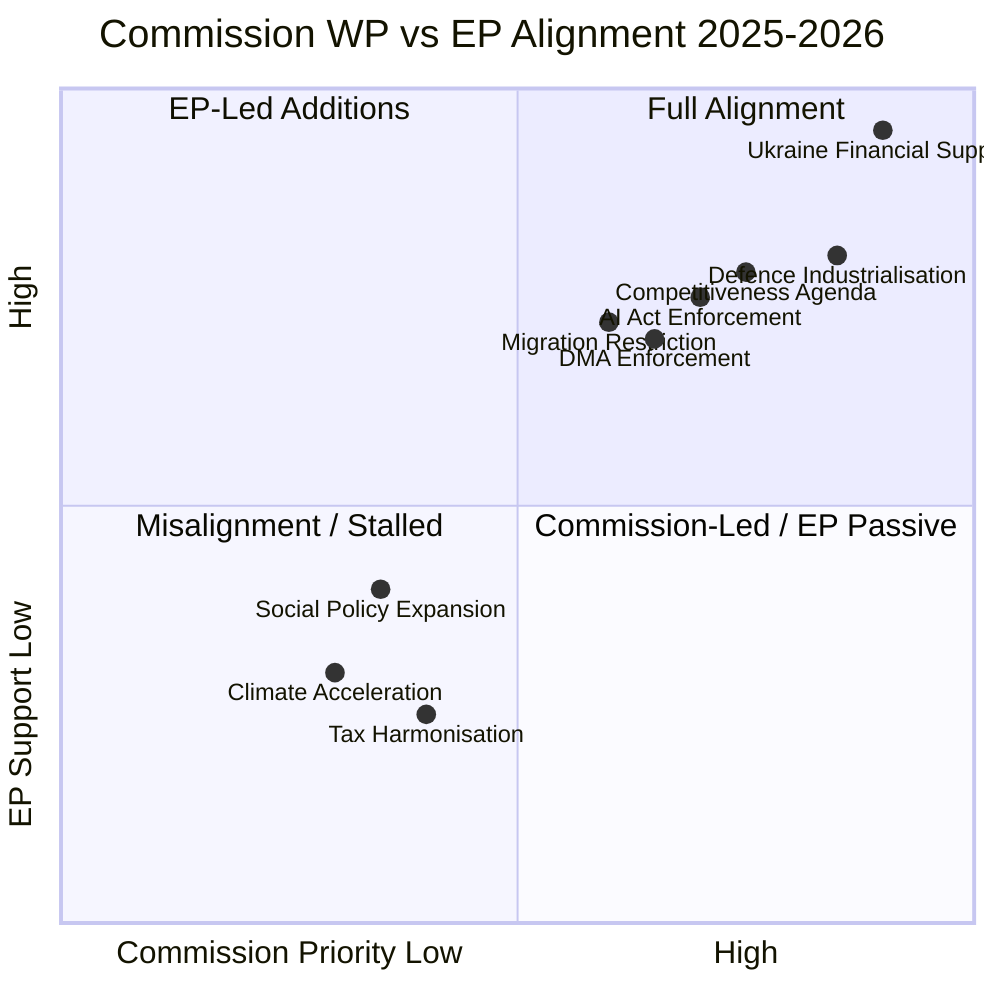

# Commission Work Programme Alignment — European Parliament 2025–2026

**Article Type:** year-in-review | **Date:** 2026-05-09 | **Confidence:** 🟡 Medium

*WEP Band: LIKELY alignment assessment is accurate for documented acts*
*Admiralty: B2 — EP/Commission data; alignment assessments are author inference*

## Overview

This artifact maps the alignment (and misalignment) between the von der Leyen II Commission's 2025–2026 Work Programme priorities and the European Parliament's actual legislative output. Alignment indicates EP majority support for Commission agenda; misalignment indicates EP resistance or modification.

## High-Alignment Areas (Both Commission and EP prioritise)

### 1. Ukraine Financial Architecture — FULL ALIGNMENT
Commission proposed; EP co-decided and enhanced. The Ukraine Enhanced Cooperation Loan, bilateral financing mechanism, and Claims Commission all represent joint Commission-Parliament legislative achievements. No significant EP-Commission divergence on design or scope.

**Assessment:** Strongest alignment of any policy area in 2025–2026. Both institutions treated Ukraine solidarity as mandatory regardless of other political positions.

### 2. Defence Industrialisation — STRONG ALIGNMENT
Commission's EDIP (European Defence Industrial Policy) proposals received EP support across the EPP+S&D+Renew+ECR coalition. EP's April 2026 strategic defence partnerships act went beyond Commission's initial proposal in some dimensions (deeper bilateral commitments), reflecting EP's desire for stronger defence posture.

### 3. Competitiveness Agenda (Draghi Implementation) — STRONG ALIGNMENT
Von der Leyen II explicitly adopted the Draghi report as the Commission's economic policy framework. EP's CSRD/CSDDD delay, carbon flexibility, and tax simplification acts are consistent with Commission's omnibus regulatory review approach. Both institutions moved in the same direction at similar speed.

## Medium-Alignment Areas

### 4. AI Act Enforcement — MODERATE ALIGNMENT
Commission established AI Office and began enforcement preparation. EP IMCO committee maintained oversight pressure. The April 2026 DMA enforcement resolution (which also touched on AI governance) reflects EP impatience with enforcement pace — a mild EP-Commission divergence where EP pushed Commission to move faster.

### 5. Migration Restriction — MODERATE ALIGNMENT
Commission's asylum reform implementation generally aligned with EP majority's restrictive direction. The February 2026 migration package reflects Commission-Parliament coordination on the New Pact implementation. Minor divergences on procedural safeguards.

## Misalignment Areas

### 6. Climate Acceleration — MISALIGNMENT
The Commission's Green Deal architecture is being partially dismantled with Commission acquiescence (omnibus review). EP's Greens+S&D+Left bloc opposes, but the EPP-led EP majority's acceptance of CSRD/CSDDD delay aligns with Commission's retreat from regulatory ambition. This is an internal EP-left vs. EP-right misalignment, not an EP-Commission misalignment — Commission and EP majority are aligned; EP minority and Commission Green Deal legacy are misaligned.

### 7. Tax Harmonisation — STALLED
Commission proposals on BEFIT and digital taxes face Council unanimity requirement. EP+Commission formally aligned on need for fair taxation but Council's blocking position stalls progress. Neither EP nor Commission can advance without Council.

---

## Alignment Score Summary

| Policy Area | Commission Priority | EP Alignment | Combined Score |
|-------------|:------------------:|:------------:|:--------------:|
| Ukraine financial | 🔴 Very High | 🔴 Very High | 95/100 |
| Defence | 🔴 High | 🔴 High | 82/100 |
| Competitiveness | 🔴 High | 🟡 Medium-High | 76/100 |
| AI governance | 🟡 Medium | 🟡 Medium | 68/100 |
| Migration | 🟡 Medium | 🟡 Medium | 64/100 |
| Climate | 🟡 Medium | 🔴 Split | 42/100 |
| Tax justice | 🟡 Medium | 🔴 Blocked | 28/100 |
| Social expansion | 🟡 Low-Medium | 🔴 Blocked | 25/100 |

**Overall Commission-Parliament alignment: 60/100 — GOOD on strategic priorities, WEAK on transformative domestic agenda.**

*Confidence: 🟡 Medium — based on publicly documented Commission work programme and EP legislative output.*
*IMF data: not applicable to alignment analysis.*
