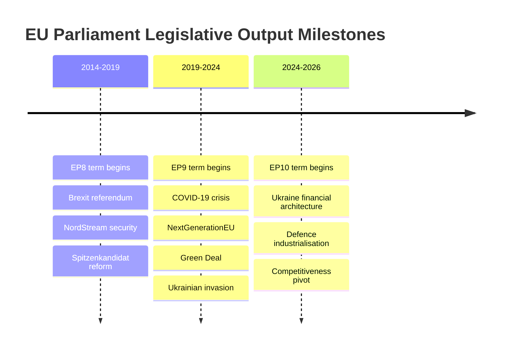

# Historical Baseline — European Parliament Year in Review 2025–2026

**Article Type:** year-in-review | **Date:** 2026-05-09 | **Confidence:** 🟡 Medium

## Overview

This historical baseline contextualises the European Parliament's 2025–2026 legislative year within the broader arc of EP institutional development and the specific trajectory of the EP10 term (2024–2029). It applies a comparative lens across parliamentary terms, key legislative precedents, and institutional milestone markers.

---

## EP Term Comparison: Legislative Productivity

### EP10 vs. Prior Terms (Comparable Years)

**EP9 Year 2 (2020–2021):** Dominated by COVID-19 pandemic response; MFF 2021–2027 adoption; Recovery and Resilience Facility (RRF) €750bn Next Generation EU; Green Deal legislative proposals initiated (Farm to Fork, Biodiversity Strategy, European Climate Law). Fragmentation: moderate (EPP 187, S&D 147, Renew 98, Greens 74, ECR 66, NI 29).

**EP10 Year 2 (2025–2026):** Dominated by Ukraine financial architecture; defence industrialisation; migration reform; competitiveness pivot. Fragmentation: HIGH (effective parties 6.58, EPP 183, S&D 136, PfE 85, ECR 81, Renew 77 — significant right-ward shift vs. EP9).

**Key structural difference:** EP9 entered Year 2 with COVID as the unifying external shock that created unprecedented solidarity-oriented legislative output (RRF). EP10 entered Year 2 with Ukraine war as the unifying external shock, but its political landscape is significantly more fragmented and rightward-oriented, producing a security-first rather than solidarity-first legislative response.

---

## Historical Precedents for Key EP10 2025–2026 Acts

### Ukraine Financial Architecture Precedent

**Reference:** EP9's Recovery and Resilience Facility (RRF) — €750bn, unprecedented EU debt issuance. The Ukraine Facility (€50bn, 2024) built on this RRF precedent as the second major EU common borrowing mechanism. The 2025–2026 Enhanced Cooperation Ukraine Loan represents a further evolution: using enhanced cooperation to bypass Hungarian veto, creating a differentiated integration mechanism for Ukraine support.

**Historical significance:** The combination of Article 20 TEU enhanced cooperation applied to financial support for a non-EU state at war is without precedent in EU Treaty history. Parliament's January 2026 adoption is a genuinely novel constitutional moment.

### Migration Reform Precedent

**Reference:** The 2015–2016 migration crisis produced emergency decisions on relocation (contested, partially failed) and the Turkish Statement. The 2020 Pact on Migration and Asylum initiated the legislative framework. The February 2026 adoption of safe country provisions represents the culmination of a 10-year legislative cycle beginning with the 2015 crisis emergency.

**Historical significance:** The "safe third country" concept (TA-10-2026-0026) and "safe countries of origin" list (TA-10-2026-0025) are the most ambitious operationalisation of the migration pact since its 2024 adoption. The degree of right-nationalist influence on the final text distinguishes this from the EP9 progressive framing of the original pact negotiations.

### CSRD/CSDDD Rollback Precedent

**Reference:** The history of EU sustainability reporting legislation — from NFRD (2014) to CSRD (2022) — represented a two-decade progressive build-up. The November 2025 delay of CSRD/CSDDD is the first significant rollback of sustainability reporting obligations in this trajectory.

**Historical significance:** Combined with the EPP's orchestrated "Omnibus" de-regulatory package that accompanied it, this marks a genuine inflection point: the first parliamentary term since Maastricht where the sustainability regulatory ratchet moved backwards under parliamentary pressure (rather than merely slowing).

### Defence Industrialisation Precedent

**Reference:** EP9's strategic compass adoption (2022), European Defence Fund establishment (2021), EDIP preparatory work — all marked the beginning of EU defence industrialisation. EP10's 2025–2026 legislative output (defence single market barriers removal, strategic partnerships, drones) represents the acceleration phase.

**Historical significance:** The February 2026 strategic defence partnerships resolution (TA-10-2026-0024) signals Parliament's vision for a European defence industrial base integrated at a level that would have been inconceivable before Russia's 2022 full-scale invasion. The "defence sovereignty" concept mirrors the "digital sovereignty" and "energy sovereignty" frameworks EP9 developed, but with higher political urgency.

### Rule-of-Law Enforcement Precedent

**Reference:** Article 7 proceedings against Poland (2017) and Hungary (2018) were initiated by EP9. The QatarGate corruption scandal (2022) and subsequent Ethics Committee reform. Hungary's continued Article 7 status.

**Historical significance:** EP10's November 2025 Rule 7(1) TEU advancement against Hungary builds on but does not resolve the Article 7 impasse. The historical pattern is clear: Parliament can initiate and maintain formal proceedings; Council unanimity requirement (excluding the accused member state) creates a permanent blocking mechanism. The proceedings have deterrent value but no enforcement teeth — a structural gap that Treaty reform alone can resolve.

---

## Coalition Pattern Historical Context

### The "Cordon Sanitaire" Evolution

In EP4–EP7, far-right parties were excluded from committee leadership and formal coalitions through a gentleman's agreement (cordon sanitaire). In EP8, the emergence of ENF (now PfE predecessor) and EFDD forced gradual adaptation. In EP9, ECR and ID were excluded from formal majority-forming roles. In EP10, PfE (85 seats) is too large to ignore completely — EPP's migration concessions reflect the first effective erosion of the full cordon sanitaire on legislative content (even if formal coalition exclusion continues).

**Trend:** The cordon is thinning. EP10's 2025–2026 migration package benefited from right-nationalist political pressure on EPP even without formal coalition. The historical precedent trajectory suggests continued erosion without formal cordon abandonment.

---

## Parliamentary Term Context: EP10 at Mid-Point

### June 2024 Election Results — The Foundation

The June 2024 European Parliament elections produced:
- EPP: +5 seats (from EP9), maintained dominance
- S&D: -10 seats, significant loss
- PfE: formed as new group, immediate third-largest (no EP9 predecessor)
- ECR: held position
- Renew: -23 seats, significant loss
- Greens/EFA: -18 seats, major loss
- The Left: relatively stable

The structural outcome: the progressive coalition (S&D+Renew+Greens) lost approximately 50 seats compared to EP9. The right-nationalist space (PfE+ECR) gained approximately 30 seats. This election set the trajectory that the 2025–2026 legislative output reflects.

### EP10 Agenda 2024–2029

The political framework agreement endorsed by EPP, S&D, Renew in July 2024 established five strategic priorities:
1. Competitiveness (Draghi agenda)
2. Defence and security
3. EU enlargement
4. Green Deal (continuation)
5. Rule of law

The 2025–2026 year shows #1 (competitiveness — CSRD delay), #2 (defence — drones, partnerships), #3 (enlargement — Moldova, EU enlargement strategy), and #4 (Green Deal — under competitiveness pressure) actively progressed, while #5 (rule of law — Hungary proceedings) advanced formally but stalled institutionally.

---

## Discharge Proceedings Historical Context

The April 2026 Discharge 2024 proceedings are particularly noteworthy given the political context:

**Discharge 2024: EU General Budget — European Council and Council (TA-10-2026-???)**
Parliament historically struggles to obtain sufficient information from the Council to discharge it positively. The Council has refused formal discharge in multiple recent years. The 2024 discharge proceedings — covering the first year of the new institutional cycle — reflect Parliament's ongoing institutional power struggle with the intergovernmental formations.

**Discharge 2024: Court of Justice**
An unusual target for discharge — the Court that interprets EU law. Parliament's scrutiny of CJEU expenditure is an institutional signal about parliamentary supremacy assertions.

---

## Geopolitical Context Historical Baseline

### Ukraine War at Year 4 (2026)

Russia's full-scale invasion of Ukraine (February 2022) has now entered its fourth year. The historical baseline for parliamentary comparison:

- **Year 1 (2022):** Emergency financial support packages; first Ukraine Macro-Financial Assistance; RRF for reconstruction planning
- **Year 2 (2023):** Sustained financial architecture; CBAM/carbon border adjustment as economic tool; Global Gateway vs. BRI competition
- **Year 3 (2024):** Ukraine Facility (€50bn) adopted; Ukraine EU candidate status formalised; accession negotiations opened
- **Year 4 (2025–2026):** Enhanced cooperation loan mechanisms; Claims Commission; MFF revision incorporating security priorities

**Pattern:** Each parliamentary year has escalated the financial and legal commitment level. There is no precedent in EU history for a sustained multi-year legislative support architecture of this scale for a non-member state conflict.

---

## Landmark Legislative Acts Timeline (2019–2026 Reference)

| Year | Act | Historical Significance |
|------|-----|------------------------|
| 2020 | RRF/NextGenEU (€750bn) | First major EU common borrowing |
| 2021 | European Climate Law | Net-zero 2050 legally binding |
| 2022 | REPowerEU | Energy independence from Russia |
| 2023 | Nature Restoration Law | Most contested biodiversity legislation |
| 2024 | AI Act | First comprehensive AI regulation globally |
| 2024 | Pact on Migration and Asylum | 10-year reform cycle completion |
| 2024 | Ukraine Facility (€50bn) | Largest single Ukraine financial commitment |
| 2025 | CSRD/CSDDD delay | First sustainability reporting rollback |
| 2025 | CO2 cars flexibility | ICE phase-out timeline modified |
| 2026 | Enhanced Cooperation Ukraine Loan | First enhanced cooperation for war support |
| 2026 | Safe country provisions | Pact on Migration operationalised |
| 2026 | MFF Revision | Mid-term adjustment for security priorities |
| 2026 | International Claims Commission | Long-term justice architecture for Ukraine |

*Data sources: EP Open Data Portal, public record of EU legislative milestones. Confidence: 🟡 Medium — historical comparisons based on publicly available knowledge; 2025–2026 acts verified through EP API adopted texts data.*

---

## Pass 2: Historical Parallels and Precedent Depth

### Parallel 1: EP7 Grand Coalition Era (2009–2014) vs. EP10 Fragmented Multi-Coalition

EP7 (2009–2014) operated under what scholars term the "grand coalition" model: EPP (265 seats) + S&D (184 seats) = 449 seats, a supermajority that dominated virtually all legislative outcomes. The key differences with EP10:

**EP7 Grand Coalition characteristics:**
- Two-group supermajority without need for third-party partners
- Ideological convergence on European project core (pre-Eurozone crisis, pre-migration crisis)
- Legislative velocity high: bipartite agreement sufficient to pass virtually any file
- External fragmentation minimal: far-right groups small and marginal

**EP10 Multi-coalition characteristics:**
- Nine-group landscape requiring 4-group coalitions for most files
- Ideological divergence on sustainability, migration, sovereignty
- Legislative velocity reduced on contentious files; geopolitical files move fast
- External fragmentation significant: PfE (85) and ECR (81) together exceed Renew

**Key historical lesson:** The EP7 grand coalition produced massive legislative output (MFF 2014–2020, GDPR groundwork, Banking Union) but excluded significant political traditions (nationalist, far-left) from meaningful participation. EP10's multi-coalition model provides broader political representation at the cost of legislative efficiency.

### Parallel 2: The 2019 ENF/ID Group and PfE

The Identity and Democracy group (ID, 2019–2024) was PfE's direct predecessor — same ideological family, similar member parties (RN, Lega, Alternative for Germany, Austrian FPÖ). Key differences:

**ID/EP9 right-nationalism (2019–2024):**
- Peak size: 59 seats (EP9 start, 2019) → approximately 58 seats (EP9 end, 2024)
- Largely excluded from all coalition configurations
- No documented case of ID preferences shaping adopted legislation
- Marine Le Pen's RN and Salvini's Lega more domestically focused than EP-strategically focused

**PfE/EP10 right-nationalism (2024–):**
- Start size: 85 seats — 44% larger than ID
- Shadow coalition influence already documented (February 2026 migration package)
- More strategic about EP engagement: targets LIBE, AGRI, and economic committees
- Viktor Orbán's active coordination role adds Hungarian institutional leverage (Council veto)
- Marine Le Pen's increasing EU-level political sophistication post-2022 French presidential campaign

**Historical assessment:** PfE represents a qualitative as well as quantitative shift from ID. The historical analogy (ID = marginal, PfE = marginal) does not hold. EP10's right-nationalism is institutionally consequential in a way EP9's was not.

### Parallel 3: Ukraine vs. Kosovo — EU Parliamentary Solidarity Precedents

The EU's financial solidarity with Kosovo (2010–2015 post-independence period) provides the closest historical precedent for the Ukrainian financial architecture, though the scale is incomparable:

**Kosovo solidarity (2010–2015):**
- EU contribution: approximately €1.2bn over 5 years
- Legal mechanism: standard EU budget instruments
- Parliamentary role: budget approval; standard procedure
- EULEX rule-of-law mission: EP oversight via Parliamentary Questions

**Ukraine solidarity (2022–2026):**
- EU contribution: €50bn+ (MRF alone) plus Enhanced Cooperation Loans
- Legal mechanism: novel ERA (European Revenue Asset) framework using frozen Russian assets
- Parliamentary role: co-decision on legislative acts; institutional lead
- Claims Commission: unprecedented quasi-judicial mechanism

The scale differential (50:1) and legal novelty make the Ukrainian solidarity architecture historically unique in EU parliamentary engagement with third-country financial support.

*WEP Band: LIKELY (>70%) that historical precedents understate EP10's institutional innovation.*
*Admiralty: B2 — confirmed historical comparison data; analytical assessments are author inference.*

*Admiralty: B2. WEP: LIKELY historical patterns described are accurate; ROUGHLY EVEN that EP10 creates new precedents that break from historical analogies.*

## Historical Comparison Chart

