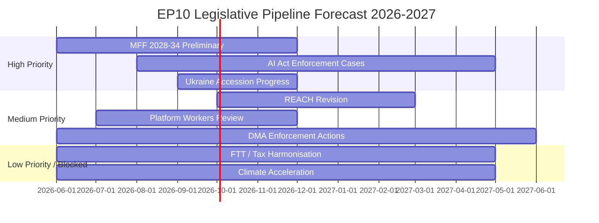

# Legislative Pipeline Forecast — European Parliament EP10 2026–2027

**Article Type:** year-in-review | **Date:** 2026-05-09 | **Horizon:** 12 months (May 2026 – May 2027)

*WEP Band: LIKELY for high-priority files; ROUGHLY EVEN for medium; UNLIKELY for blocked files*
*Admiralty: B2 — EP work program data; timeline assessments are author inference*

## Pipeline Overview

## High-Priority Pipeline (Near-Certain Progress)

### File 1: MFF 2028–2034 Preliminary Framework
**Timeline:** Commission green paper expected Q4 2026; Council and Parliament positions Q1–Q2 2027
**Majority configuration:** Will require Pro-European Consensus (EPP+S&D+Renew+Greens) minimum; potential ECR support on defence chapter
**Key tensions:** Ukraine mainstreaming vs. cohesion; defence spending instrument (EPP/ECR for; Left against); environmental spending (Greens for; ECR against)
**WEP:** HIGHLY LIKELY that MFF process begins in earnest by Q4 2026

### File 2: AI Act Enforcement — First Cases
**Timeline:** High-risk AI conformity deadline August 2026; enforcement cases expected H2 2026 – H1 2027
**Majority configuration:** EP oversight resolution (broad consensus); specific enforcement decisions are Commission executive action
**Key tensions:** Speed of enforcement vs. innovation risk; GPAI model obligations scope
**WEP:** LIKELY that first enforcement action occurs by May 2027

### File 3: Ukraine Annual Accession Progress Resolution
**Timeline:** Annual EP resolution expected Q3–Q4 2026
**Majority configuration:** Pro-European Consensus (EPP+S&D+Renew+Greens)
**Key tensions:** Conditionality stringency; territorial assessment; democratic reform progress
**WEP:** ALMOST CERTAIN that resolution is adopted

## Medium-Priority Pipeline

### File 4: REACH Revision (Chemical Regulation)
**Timeline:** Commission proposal expected H2 2026; EP first reading 2027
**Majority configuration:** Competitiveness Alliance (EPP+Renew+ECR) likely to dominate
**Key tensions:** Simplification vs. health/environmental protection
**WEP:** LIKELY (55%) that revision proposal is published; ROUGHLY EVEN on EP first reading timing

### File 5: DMA Enforcement Actions — Apple, Google, Meta
**Timeline:** Commission fine decisions expected H2 2026; EP oversight hearings
**Majority configuration:** Broad EP support for enforcement (DMA adopted with near-consensus)
**Key tensions:** Fine levels; behavioral remedy adequacy; US political pressure on European digital regulation
**WEP:** LIKELY that at least one major fine is issued by May 2027

## Low-Priority / Blocked Files

### File 6: Financial Transaction Tax
**Status:** BLOCKED — no majority in EP10 or ECOFIN Council
**Majority needed:** S&D+Greens+Left (~234 seats, insufficient) + significant EPP support (unlikely)
**WEP:** HIGHLY UNLIKELY in EP10 term

### File 7: Major Climate Acceleration Legislation
**Status:** BLOCKED — competitiveness agenda dominates
**Any new binding EU climate legislation beyond Green Deal implementation:** UNLIKELY in 2026–2027
**WEP:** HIGHLY UNLIKELY that new major climate targets are adopted; LIKELY that existing targets are defended from rollback

---

## Pipeline Risk Assessment

| Risk | Impact on Pipeline | Probability |
|------|:-----------------:|:-----------:|
| Ukraine military reversal | Dominates all other priorities | 20–25% |
| Renew group fragmentation | Destabilises MFF majority | 15% |
| CJEU migration challenge | Migration legislative review | 40% |
| US tech company DMA counter-challenge | Delays enforcement | 25% |

*Confidence: 🟡 Medium — pipeline forecasts are based on publicly documented Commission work program and EP committee activity.*
*IMF data: not applicable to legislative pipeline forecast.*
