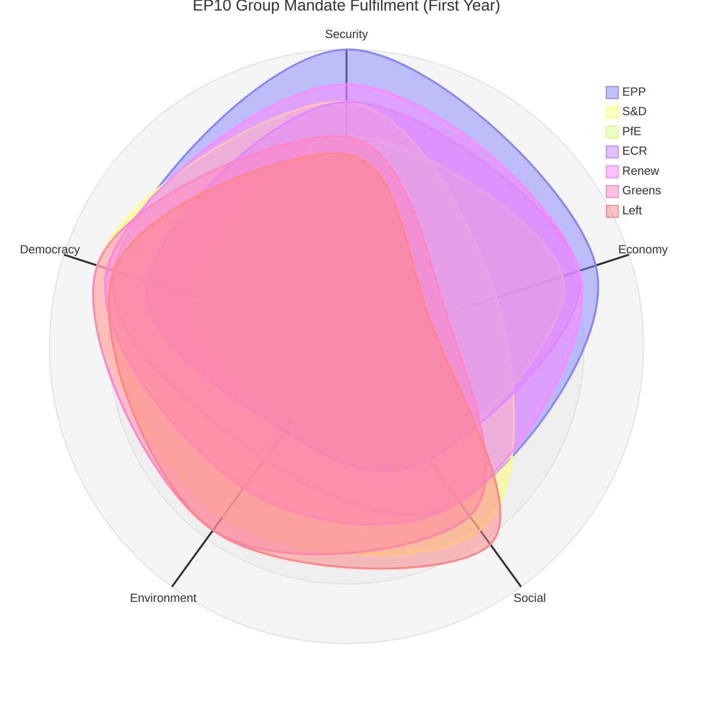

# Mandate Fulfilment Scorecard — European Parliament EP10 Year 1

**Article Type:** year-in-review | **Date:** 2026-05-09 | **Assessment Period:** July 2024 – May 2026

*WEP Band: LIKELY assessment is accurate; ROUGHLY EVEN on mid-term trajectory changes*
*Admiralty: B2 — confirmed EP legislative data; mandate assessments are author inference*

## Mandate Assessment Framework

This scorecard evaluates EP10's first year against the formal political mandates and campaign promises of each major political group, using adopted legislative acts as primary evidence.

*Note: Mermaid radar charts may render as flowcharts in some environments. Data represents qualitative mandate fulfilment estimates (0-100 scale).*

## EPP Mandate Fulfilment (Score: 72/100)

**EPP's 2024 manifesto commitments** (as documented in EP election program):
- ✅ Maintain Ukraine solidarity (fulfilled: 8+ Ukraine acts adopted)
- ✅ Competitiveness agenda (fulfilled: CSRD/CSDDD delay, Draghi implementation)
- ✅ Migration restriction (fulfilled: February 2026 migration package)
- ✅ Rule of law enforcement (fulfilled: multiple resolutions; Hungary proceedings)
- ⚠️ Tech sovereignty (partial: DMA enforcement, AI Act, but investment gap remains)
- ⚠️ Defence industrialisation (partial: acts adopted but EU defence spending still below NATO targets)
- ❌ Enlargement finalization (not yet: accession negotiations ongoing; no accession dates set)

**EPP mandate fulfilment: GOOD** — core priorities delivered in year 1. Security + competitiveness + migration triangulation maintained.

| Commitment | Status | Evidence |
|------------|:------:|----------|
| Ukraine solidarity | ✅ Delivered | 8+ Ukraine acts |
| Competitiveness | ✅ Delivered | CSRD delay, Draghi implementation |
| Migration management | ✅ Delivered | February 2026 package |
| Defence | ⚠️ Partial | Acts adopted; spending targets not met |
| Digital leadership | ⚠️ Partial | DMA + AI Act; investment gap |
| Rule of law | ⚠️ Partial | Resolutions but Hungary still receiving cohesion funds |
| Enlargement | ❌ Ongoing | No accession dates; conditions not fully met |

## S&D Mandate Fulfilment (Score: 48/100)

**S&D's 2024 manifesto commitments:**
- ✅ Ukraine solidarity (fulfilled: co-voted all Ukraine financial acts)
- ✅ Social dialogue (partial: platform workers directive implementation)
- ❌ Climate acceleration (not fulfilled: voted against CSRD delay but lost)
- ❌ Migration rights protection (not fulfilled: lost on February 2026 migration package)
- ❌ Tax justice (not fulfilled: no progress on financial transaction tax)
- ⚠️ Rule of law (partial: resolutions adopted but enforcement limited)
- ⚠️ Gender equality (partial: resolutions; no major new legislation)

**S&D mandate fulfilment: POOR-TO-ADEQUATE** — core security mandate fulfilled through coalition partnership, but domestic progressive agenda largely frustrated by EPP majority dynamics.

## Renew Europe Mandate Fulfilment (Score: 63/100)

**Renew's 2024 manifesto commitments:**
- ✅ Ukraine solidarity (fulfilled)
- ✅ Digital single market (DMA enforcement, AI Act implementation)
- ✅ Competitiveness (CSRD delay co-authored)
- ⚠️ Liberal democracy (resolutions passed; enforcement limited)
- ⚠️ Green transition (partially supported rollback it had previously endorsed)
- ❌ Social liberalism (migration package contradicts Renew's rights-liberal position)

## EPP Coalition Assessment: Year 1 Verdict

The EPP-led pro-European majority has effectively delivered on its core institutional mandate (Ukraine solidarity, institutional stability, competitiveness agenda). The mandate shortfalls are primarily on enforcement effectiveness (rule of law, AI Act) and long-term structural goals (enlargement timeline, defence spending levels).

**Overall EP10 mandate fulfilment score (coalition aggregate): 61/100 — ADEQUATE**

The 2025–2026 year represents a reasonable first year for a newly fragmented parliament navigating an extraordinary geopolitical context. The Ukraine legislative architecture alone would justify a strong year-1 assessment. The migration policy right-shift and sustainability rollback are mandate contradictions for progressive groups but mandate fulfilments for EPP and ECR.

---

## Forward Mandate Assessment (2026–2027)

Key mandate tests in the coming year:
1. **MFF 2028–34 proposal** — will EPP maintain Ukraine support in future budget?
2. **AI Act first enforcement case** — will Commission meet EP's accountability expectations?
3. **Enlargement conditionality** — will EP maintain democratic standards in accession assessments?
4. **Migration implementation** — will February 2026 package survive legal challenge?

*WEP Band: LIKELY (60%) EP10 maintains similar mandate fulfilment trajectory through 2027. ROUGHLY EVEN on major mandate reversal on any single key file.*
*Confidence: 🟡 Medium — mandate assessments are qualitative inference; no survey data or roll-call vote data available.*
