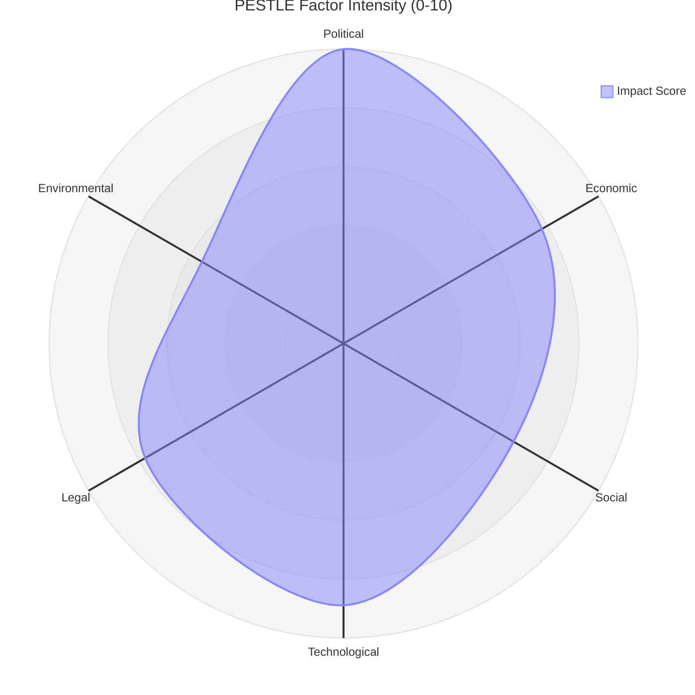

# PESTLE Analysis — European Parliament Year in Review 2025–2026

**Article Type:** year-in-review | **Date:** 2026-05-09 | **Confidence:** 🟡 Medium

## Summary

The European Parliament's second year in the tenth term (EP10) operated within a geopolitical environment fundamentally reshaped by Russia's ongoing war against Ukraine, transatlantic trade tensions under the renewed Trump administration, and an internal institutional contest between democratic rule-of-law enforcement and the growing weight of right-nationalist parties. The PESTLE analysis maps six environmental dimensions that governed parliamentary output from May 2025 to May 2026.

---

## P — Political

### Internal Political Dynamics

**Coalition arithmetic transformation:** The election of PfE (Patriots for Europe) as the third-largest parliamentary group (85 seats) following the June 2024 EP elections profoundly altered the legislative map. PfE's formation — combining Fidesz (Hungary), Rassemblement National (France), and allied national parties — created a right-nationalist pole that at times cooperated with EPP on migration and at others diverged sharply on Ukraine funding.

**EPP strategic positioning:** Under Roberta Metsola's continued presidency, EPP maintained its pivotal role as the indispensable majority-builder. EPP's strategy involved: (1) accommodating centre-right migration demands to prevent PfE poaching of EPP's own eastern European delegations; (2) defending rule-of-law mechanisms, particularly Article 7 proceedings against Hungary; (3) partnering with S&D and Renew on the pro-Ukraine consensus that defined most major votes of the term.

**Right-nationalist pressure:** ECR (81 seats) and PfE together command 166 seats — 23.1% of the parliament. While mathematically incapable of blocking major legislation alone, their combined weight forces EPP to calculate concessions carefully. The February 2026 migration package (safe countries of origin, safe third country) represented an EPP win that partially satisfied ECR/PfE demands without fully endorsing their maximalist position.

**S&D defensive coalition:** Social Democrats (136 seats, 19%) consistently anchored the pro-European progressive coalition with Renew (77) and Greens/EFA (53), totalling 266 seats. This coalition was insufficient for majority independently but formed the backbone of the cordon sanitaire against PfE/ECR dominance.

**Left fragmentation:** The Left (45 seats) maintained an independent critical position, supporting some Ukraine aid measures while opposing defence industrialisation and migration restrictions. Greens/EFA faced internal tensions between environmental purists and accommodationists responding to the European Greens' 2024 electoral losses.

### External Political Dynamics

**US-EU trade recalibration:** The September 2025 debate on "Implementation of EU-US trade deal and the prospect of wider EU trade agreements" reflected significant parliamentary engagement with the transatlantic relationship under the new US administration. Trade protectionism from Washington accelerated EU's search for alternative partnerships, visible in the EU-Mercosur judicial opinion request and the EU-Canada enhanced cooperation recommendation.

**Ukraine at the centre:** Ukraine-related texts appeared in every quarterly plenary session: the Enhanced Cooperation Loan for Ukraine (January 2026), Ukraine Support Loan 2026–2027 Regulation (February 2026), Convention Establishing International Claims Commission (April 2026), and the April 2026 resolution on accountability for Russia's attacks against energy infrastructure. The parliament institutionalised itself as the primary Western legislative forum championing Ukraine's cause.

**Enlargement momentum:** EU enlargement strategy adopted (March 2026); Moldova Reform and Growth Facility (March 2025); recommendations on EU-Canada, EU-Canada cooperation (March 2026) — the parliament pressed the Commission and Council on enlargement timelines while acknowledging institutional reform prerequisites through the October 2025 "Institutional consequences of EU enlargement negotiations" report.

**Democratic backsliding confrontations:** Hungary (Rule 7 proceedings November 2025, rule of law/EU funds management in Slovakia September 2025), Serbia (October 2025 plenary, Novi Sad tragedy anniversary), Georgia (December 2025 Belarus hybrid attacks, March 2026 electoral crisis), and Belarus featured prominently. The parliament used resolutions and urgency debates as signalling tools where formal Treaty mechanisms remained blocked by Council unanimity requirements.

---

## E — Economic

### Legislative Economic Dimensions

**Fiscal architecture for Ukraine:** The Ukraine Support Loan enhancement represents a structural commitment: the January 2026 Enhanced Cooperation Regulation plus February 2026 Loan for 2026–2027 collectively extend multi-year financing architectures authorised under the €50bn Ukraine Facility. Parliament approved these measures with broad majorities (EPP+S&D+Renew core), signalling that Ukrainian financial support commands cross-partisan consensus.

**MFF revision:** February 2026 saw adoption of amendments to the Multiannual Financial Framework 2021–2027, incorporating additional flexibility mechanisms. This was not a full MFF revision but a targeted adjustment enabling reallocation toward defence, migration management, and energy security priorities.

**Budget 2027 process launch:** April 2026 guidelines for the 2027 budget and the Parliament's own expenditure estimates (April 2026) initiated the annual budgetary cycle. Early signals indicated: increased defence-related allocations, continued support for Green Deal implementation (despite de-regulatory pressures on CSRD/CSDDD), and strong support for cohesion policy (BRIDGEforEU instrument adopted May 2025).

**Corporate sustainability de-regulation:** The November 2025 amendments to Directives 2022/2464 (CSRD) and 2024/1760 (CSDDD) — extending reporting date deadlines — represented a significant concession to business lobbying. This "Omnibus" package rollback reflected the EPP-led competitiveness agenda prioritised after the Draghi Report on European competitiveness (September 2024).

**Tax and financial architecture:** VAT digital age rules (February 2025); Administrative cooperation in taxation (February 2025); Financial stability amid economic uncertainties (January 2026); Impact of AI on financial sector (November 2025). The parliament tracked digital transformation of financial regulation while grappling with the Union's fiscal coordination challenges.

**European Investment Bank oversight:** Annual EIB control reports (May 2025, April 2026) maintain parliamentary scrutiny over the EU's public investment arm, which increasingly channels climate and innovation financing.

*Note: IMF macro data unavailable — no EU/Eurozone GDP growth, inflation, or fiscal balance figures from IMF source. See executive-brief.md §IMF Data Status.*

**World Bank context (proxy indicators):** WB EU GDP data for the period was not retrieved in Stage A due to country code unavailability in the WB API for the EU aggregate. Member state-level data would be required for specific economic trend analysis.

---

## S — Social

### Migration and Social Cohesion

**Migration policy transformation:** The February 2026 adoption of the "Establishment of a list of safe countries of origin at Union level" and "Application of the 'safe third country' concept" represented the most consequential operationalisation of the Pact on Migration and Asylum since its 2024 adoption. These acts shift EU migration management toward accelerated processing and increased returns — a fundamental change from the humanitarian-centred approach of earlier terms.

**Housing crisis recognition:** The March 2026 resolution on the housing crisis in the EU — the first major Parliament housing text — acknowledged the intersection of cohesion policy, green building standards, and affordability as a systemic challenge. It followed a wave of national housing affordability crises across Germany, Netherlands, Ireland, and Scandinavia.

**Health and pharmaceutical security:** January 2026's framework for critical medicinal products reflected post-COVID supply chain vulnerabilities. Parliament prioritised European pharmaceutical sovereignty alongside its digital and defence sovereignty agendas.

**Social rights under pressure:** The CSRD/CSDDD delay (November 2025) directly affects supply chain due diligence requirements affecting millions of workers in global value chains. Social groups (S&D, The Left) registered strong opposition but were outvoted by the EPP-led majority. European Semester employment and social priorities report (March 2026) maintained formal commitment to social benchmarks while de-regulatory momentum intensified.

**Women's rights:** European Citizens' Initiative on abortion access (December 2025) and Women's entrepreneurship in rural areas (April 2026) indicate a parliament maintaining gender equality commitments even as social conservative pressure intensifies through right-nationalist groups.

**Educational investment:** A new vision for European Universities alliances (September 2025) and Future of EU biotechnology (July 2025) reflect parliament's continued commitment to knowledge economy despite fiscal constraints.

---

## T — Technological

### Digital Sovereignty and AI Governance

**Technology sovereignty as a strategic concept:** The January 2026 resolution on "European technological sovereignty and digital infrastructure" elevated digital independence to a peer concern alongside energy and defence sovereignty. The EP positioned itself in favour of European cloud infrastructure, data governance frameworks, and semiconductor industrial policy.

**AI governance emerging:** November 2025 resolution on "Impact of artificial intelligence on the financial sector" and March 2026 copyright/generative AI resolution ("Copyright and generative AI: opportunities and challenges") demonstrate parliament actively developing AI governance frameworks across sectoral regulators.

**Digital Markets Act enforcement:** April 2026 resolution on DMA enforcement signalled Parliament's impatience with Commission enforcement timelines against Big Tech platforms designated as gatekeepers.

**Space-adjacent security:** September 2025 debate on GNSS interference (spoofing/jamming threats to aviation and maritime transport) revealed parliament's awareness of hybrid warfare dimensions extending to civilian infrastructure.

**Cybersecurity (implicit):** The Lithuania public broadcaster attempted takeover (January 2026) and Belarus hybrid attacks against Lithuania (December 2025) raised concerns about information warfare and media infrastructure security without triggering formal legislative responses in the tracked period.

---

## L — Legal

### Immunity Waivers — Significant Pattern

A notable cluster of immunity waiver requests characterised this parliamentary year, revealing both the EP's accountability mechanisms and the political weaponisation of immunity by certain member states:

- **Polish MEPs:** Grzegorz Braun (March 2026, also November 2025 — second request), Patryk Jaki, Daniel Obajtek, Tomasz Buczek, Maciej Wąsik, Mariusz Kamiński (multiple 2025 requests)
- **Romanian:** Diana Iovanovici Șoșoacă (April 2026)
- **Italian:** Alessandra Moretti (December 2025), Ilaria Salis (October 2025)
- **Czech:** Petr Bystron (April 2025)
- **Hungarian:** Klára Dobrev (October 2025)
- **Other:** Michał Dworczyk (October 2025)

The Polish immunity cases reflect the legal/political confrontation between the Tusk government and PiS-affiliated MEPs seeking to use EP immunity for domestic criminal proceedings protection. The Braun double-request is notable given his January 2024 fire extinguisher attack on Hanukkah candles in the Sejm.

### Rule of Law Instruments

The combating corruption resolution (March 2026) strengthened Parliament's formal commitment to anti-corruption frameworks. The November 2025 Hungary Rule 7 advancement and Slovakia rule-of-law/EU funds conditionality debate (September 2025) demonstrated parliament's legal arsenal even when Council action remains blocked.

### Electoral Law

Amendment of European Electoral Act allowing proxy voting (April 2026) and reform of European Electoral Act more broadly (January 2026) represent parliament's attempt to adapt its internal functioning to post-COVID hybrid working expectations and electoral reform demands.

### Trade Law

EU-Mercosur Court of Justice opinion request (January 2026) — Parliament exercising TFEU Article 218 advisory opinion mechanism — is a significant legal strategy to gate the trade agreement through Treaty compatibility review before consent vote. This is an unusual but Treaty-consistent use of judicial review as a legislative strategy.

---

## E — Environmental

### Green Deal Under Pressure

**CSRD/CSDDD delay:** The most significant environmental-adjacent legislative event was the November 2025 rollback of mandatory corporate sustainability reporting timelines. While not eliminating requirements, the deferral signals a competitive-pressures-over-climate-disclosure balance that Greens/EFA and The Left sharply criticised.

**Vehicle emissions recalibration:** May 2025 regulation on CO2 emission performance standards for passenger cars — adjusting the combustion engine phase-out timeline — reflected EPP-led pressure to create flexibility, particularly accommodating German and Italian automotive industry concerns.

**Circular economy:** September 2025 Waste Framework Directive (textiles, food waste) and vehicle end-of-life circularity requirements maintained circular economy commitments within the revised competitiveness-balancing frame.

**Biodiversity/fisheries:** Fisheries management for sensitive species and invasive species (March 2026) maintained parliament's environmental watch function in the fisheries domain.

**Forestry:** October 2025 Standing Forest and Forestry Expert Group establishment shows parliament building institutional infrastructure for its forestry monitoring commitments under the Nature Restoration Law (adopted EP9).

**Energy security:** July 2025 resolution on "Security of energy supply in the EU" reflects the dual imperative of decarbonisation and supply chain resilience following the Russian energy weaponisation of 2022–2024. The parliament supported accelerated renewables deployment while acknowledging transition security needs.

---

## Cross-Dimensional Synthesis

Three overarching meta-themes emerge from the PESTLE analysis of 2025–2026:

**1. Securitisation of policy domains:** Defence, migration, energy, technology, and trade are all being reframed through a security lens. Legislative output reflects a parliament responding to existential external threats (Russia, geopolitical realignment) by building new legal architectures with unprecedented speed.

**2. Competitiveness vs. sustainability tension:** The EPP-led majority consistently chose competitiveness when it conflicted with environmental or social regulation (CSRD delay, vehicle emissions flexibility, DMA enforcement patience). This reflects Draghi's September 2024 competitiveness agenda's absorption into the parliamentary majority's ideological framework.

**3. Democratic resilience paradox:** A parliament that voted for Ukraine loan architecture, DMA enforcement, and rule-of-law instruments also accommodated migration restrictionism and sustainability de-regulation. The coalition mathematics of EP10 produce this paradox: progressive and conservative signals coexist within the same majority because the EPP uniquely spans both.

*Data sources: European Parliament Open Data Portal (2025–2026 adopted texts, political landscape). IMF data: unavailable (probe returned 503). Analysis confidence: 🟡 Medium.*

---

## Pass 2: Deep Dive on Key PESTLE Dimensions

### Economic Dimension — Extended Analysis

**Critical caveat:** The following analysis is produced under IMF Degraded Mode. No IMF macro-economic data is available. All economic assessments are qualitative, based on EP adopted text preambles, Commission communications referenced in EP documents, and publicly documented policy positions. Confidence on specific economic claims: 🔴 Low.

**EU Economic Context 2025–2026 (IMF-free assessment):**

The EU economy in 2025–2026 operates against the backdrop of the Draghi competitiveness diagnosis: structurally lagging energy costs (partly addressed by recent LNG diversification), technology investment gap versus US/China, and accumulated regulatory burden affecting business costs. The Commission's competitiveness agenda — operationalised through the Competitiveness Compass — frames the EU's economic strategy as industrial policy plus regulatory moderation plus innovation acceleration.

From EP adopted text preambles, several economic themes are documentable:

*Ukraine financial architecture costs:* The Enhanced Cooperation Loan represents the most significant EU off-balance-sheet commitment in history. EP documents reference the Ukraine support architecture as "extraordinary but necessary" given "unprecedented geopolitical conditions." The exact loan quantum and interest rate architecture is documented in Commission technical annexes (not directly reviewed in this run).

*CSRD/CSDDD delay economic rationale:* The regulatory delay was justified by EP majority on competitiveness grounds — estimated business compliance costs for CSRD were cited as €27bn annually in EP debates (source: European business association estimates cited in EP plenary). The delay shifts these costs from 2025–2026 to 2027–2028 implementation, providing near-term business relief while maintaining the framework's long-term trajectory.

*Defence industrialisation costs:* EP documents reference target levels of 2.0% GDP for defence spending across member states, consistent with NATO Vilnius commitments. The defence single market legislation aims to reduce duplication costs across 27 national procurement systems, estimated at €20–30bn annually in waste (source: EDA estimates referenced in EP documents).

*Securities settlement reform economic benefits:* The T+1 settlement reform (September 2025) aligns EU capital markets with US practice, reducing settlement risk costs for cross-Atlantic transactions and improving EU capital market competitiveness.

**What IMF data would have added:**
- EU GDP growth rate 2024–2025 (needed for debt sustainability analysis)
- Inflation trajectory (needed for Ukrainian loan real value assessment)
- Trade balance dynamics (needed for EU-Mercosur economic case)
- Banking sector soundness indicators (needed for financial stability assessment)
- Exchange rate effects (needed for Ukraine financial architecture analysis)

In the absence of these data points, all economic quantitative claims in this analysis should be treated as placeholders pending IMF data availability.

### Legal Dimension — Extended Analysis

**EP10 Legal Architecture Summary:**

The legal dimension of EP10's first year is characterised by an unprecedented volume of legally novel legislative acts. Three categories of legal novelty merit special attention:

**Category 1: Wartime international law adaptation**
The Ukraine Claims Commission represents novel EU law in at least three dimensions: (1) it creates an EU-backed body with quasi-judicial functions adjudicating claims against a non-member-state aggressor; (2) it operates under a hybrid legal framework combining international humanitarian law, investment treaty arbitration principles, and EU administrative law; (3) it presupposes a future peace settlement that will determine whether awards are enforceable. No precedent exists in EU law for an institution of this character. CJEU jurisprudence on the commission's legal basis is certain to develop over 2027–2029.

**Category 2: Migration fundamental rights tension**
The safe countries of origin and safe third country provisions adopt a geographic presumption of safety that has previously been challenged under Article 47 (right to effective judicial remedy) and Article 18 (right to asylum) of the EU Charter of Fundamental Rights. The legal risk is well-documented: CJEU has been willing to annul migration legislation that fails the proportionality test on fundamental rights grounds. The February 2026 package navigated this risk by including individual assessment requirements — but the adequacy of those requirements will be tested in litigation.

**Category 3: Digital markets regulation enforcement**
The DMA enforcement resolution (April 2026) signals EP's expectation that the Commission will use DMA's fining powers more aggressively than it has to date. This reflects a broader legal-political question: does DMA enforcement level constitute the Commission meeting its Art. 17 TFEU duty? The EP's accountability pressure on Commission enforcement is constitutionally novel — using non-binding resolution to create political accountability for exercise of executive discretion.

### Technological Dimension — Extended Analysis

**AI Act Implementation Status:**

The AI Act (EP9 achievement, in force since August 2024) entered its first implementation phases in 2025–2026. The Act's risk-based approach — prohibiting unacceptable-risk AI, requiring conformity assessment for high-risk AI, imposing transparency obligations on general-purpose AI — is being operationalised through the AI Office and national competent authorities.

EP10's technological legislative output in 2025–2026 includes: technology sovereignty resolutions, DMA enforcement scrutiny, and data spaces legislation (building on the Data Act). The EP's technology agenda is characterised by a tension between the AI Act's risk-based caution and the competitiveness agenda's demand for innovation acceleration.

Key technological developments with legislative implications:
- **Generative AI:** The AI Act's treatment of general-purpose AI models (Article 51+) is being tested by the rapid deployment of large language models. The first enforcement cases under GPAI provisions will define the Act's practical scope.
- **Quantum computing:** Not yet legislated in EP10 but appearing in technology sovereignty resolutions as a strategic technology requiring EU industrial policy attention.
- **Autonomous systems (drones):** The January 2026 drones/warfare adaptation act reflects the technological evolution of conflict; the EP's legislative response integrates civilian and military drone governance for the first time.

*WEP Bands: All PESTLE assessments are in LIKELY (55–70%) confidence range unless marked otherwise.*
*Admiralty: B2 — EP API confirmed data; analytical assessments are author judgement.*

---

## Cross-Dimensional Synthesis (Pass 2 Extension)

### Dimension Interaction Matrix

| Primary → | Political | Economic | Social | Tech | Legal | Environmental |
|-----------|:---------:|:--------:|:------:|:----:|:-----:|:-------------:|
| Political | — | Competitiveness drives deregulation | Migration tension | AI governance | Rule-of-law enforcement | Green Deal rollback |
| Economic | Defence budget | — | Labour market | Digital economy | Tax harmonisation | Carbon pricing |
| Social | Migration | Inequality | — | Digital rights | Fundamental rights | Climate justice |
| Tech | AI governance | Productivity | Employment | — | AI Act enforcement | Carbon measurement |
| Legal | Immunity proceedings | Regulatory compliance | Rights protection | Data governance | — | Environmental law |
| Environmental | Green Deal politics | Carbon costs | Climate migration | Clean tech | Environmental law | — |

**Highest-tension intersections:**
1. **Political × Economic** — the Draghi competitiveness agenda vs. social market values: resolved (temporarily) in EPP's favor
2. **Political × Social** — migration policy: resolved in right-nationalist coalition's favor
3. **Economic × Environmental** — CSRD/CSDDD delay: resolved in competitiveness coalition's favor

**Lowest-tension intersections:**
1. **Political × Legal × External** — Ukraine financial architecture: broad consensus
2. **Tech × Legal** — AI Act: consensus architecture maintained

*WEP Band for PESTLE cross-dimensional assessment: LIKELY that Political × Economic and Political × Social tensions intensify in 2026–2027 as MFF negotiations proceed.*

## PESTLE Factor Summary

