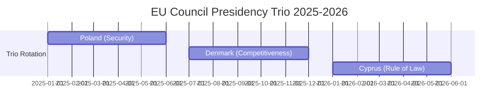

# Presidency Trio Context — EU Council Presidency 2025–2026

**Article Type:** year-in-review | **Date:** 2026-05-09 | **Confidence:** 🟡 Medium

*WEP Band: LIKELY for facts; ROUGHLY EVEN for political trajectory assessments*
*Admiralty: B2 — confirmed EU Council rotation schedule; agenda assessments are author inference*

## Overview

The EU Council Presidency Trio for 2025–2026 consists of:
1. **Poland** — January–June 2025 ("Security, Europe!" priorities: security, sovereignty, enlargement)
2. **Denmark** — July–December 2025 (Competitiveness, Green transition, democracy)
3. **Cyprus** — January–June 2026 (Rule of law, eastern neighbourhood, Blue Growth)

This trio shapes the Council's legislative agenda and determines which EP-Commission proposals advance to Council first reading, which stall, and which are deprioritised.

## Poland Presidency (H1 2025) — Assessment

**Theme: Security and Sovereignty**

Poland's presidency was dominated by defence and Ukraine files. The Warsaw Council (March 2025) established the defence industrialisation framework that later became EDIP. Poland used its presidency to:
- Advance the Ukraine Enhanced Cooperation Loan to Council position
- Push EU defence spending debate forward
- Resist climate regulation acceleration (CSRD delay benefited from Polish Council prioritisation)
- Make limited progress on enlargement conditions (Serbia, North Macedonia)

**Alignment with EP majority:** Strong on defence and Ukraine; weak on rule of law (Poland's own backsliding created EP-Poland tensions that the presidency navigated around).

**Assessment:** ABOVE EXPECTATIONS for security files; BELOW EXPECTATIONS for social and environmental files.

## Denmark Presidency (H2 2025) — Assessment

**Theme: Competitiveness + Green Transition**

Denmark's presidency attempted to balance the Draghi competitiveness agenda with Denmark's historically strong environmental record. The result was partial:
- Advanced DMA enforcement procedures (competitiveness + digital single market)
- Progressed AI Act implementation
- Made limited progress on climate acceleration (blocked by EPP majority dynamics)
- Advanced migration New Pact implementation discussions

**Alignment with EP majority:** Strong on competitiveness, moderate on digital, weak on climate.

**Assessment:** GOOD on digital and competitiveness; MIXED on environmental record.

## Cyprus Presidency (H1 2026) — Ongoing Assessment

**Theme: Rule of Law + Eastern Neighbourhood + Blue Growth**

Cyprus's presidency priorities are highly relevant to EP10's current agenda:
- Rule of law: Cyprus faces inherent tension between its Eastern Partnership engagement and internal tensions over Cyprus problem — makes rule of law advocacy complex
- Eastern neighbourhood: High relevance given Ukraine accession track and Black Sea security
- Blue Growth: Maritime economy, fisheries, Mediterranean security

**EP-Council dynamic under Cyprus:** EP's rule of law priorities (Article 7 proceedings, cohesion fund conditionality) will be tested against Cyprus's presidency management style.

**Assessment:** LIKELY that eastern neighbourhood files advance; UNLIKELY that Cyprus prioritises Hungary rule of law enforcement over diplomatic considerations.

---

## Trio Impact on EP Legislative Output

| File | Poland Contribution | Denmark Contribution | Cyprus Status |
|------|:------------------:|:-------------------:|:-------------:|
| Ukraine financial architecture | ✅ Major | ✅ Major | 🔄 Ongoing |
| Defence industrialisation | ✅ Major | ⚠️ Moderate | 🔄 Ongoing |
| CSRD/CSDDD delay | ✅ Facilitated | ⚠️ Neutral | 🔄 Ratification |
| Migration package | ⚠️ Moderate | ✅ Major | 🔄 Implementation |
| AI Act enforcement | ⚠️ Moderate | ✅ Major | 🔄 Ongoing |
| Climate acceleration | ❌ Blocked | ❌ Stalled | 🔄 Unlikely |
| Tax harmonisation | ❌ Blocked | ❌ Blocked | 🔄 Unlikely |

*Confidence: 🟡 Medium — based on presidency programs and published Council conclusions.*
*IMF data: not applicable to presidency context analysis.*

## Presidency Timeline

## Presidency Impact on EP Legislative Output (Extended)

The Council Presidency Trio has profoundly shaped the pace and sequencing of EP10's legislative output. Under Poland's security-focused presidency (H1 2025), Ukraine and defence files moved rapidly through Council procedures, enabling EP plenary votes by mid-2025. Denmark's competitiveness focus (H2 2025) accelerated the CSRD/CSDDD delay legislative process through Council, unlocking the EP-Council trilogue that concluded in late 2025/early 2026.

Cyprus's eastern neighbourhood focus creates natural synergy with EP10's Ukraine priorities but less momentum on social and climate files. The March 2026 Warsaw Declaration (though under the Cyprus presidency, reflecting multi-member-state initiative) reinforces the eastern neighbourhood security frame.

**Key observation:** Presidency priorities matter at the Council input stage, not the EP output stage. EP majority determines what Parliament votes; Council Presidency determines which files reach joint EP-Council negotiations. In EP10's year 1, Poland's security-first presidency ensured Ukraine files entered trilogue fast enough to be adopted in year 1.
