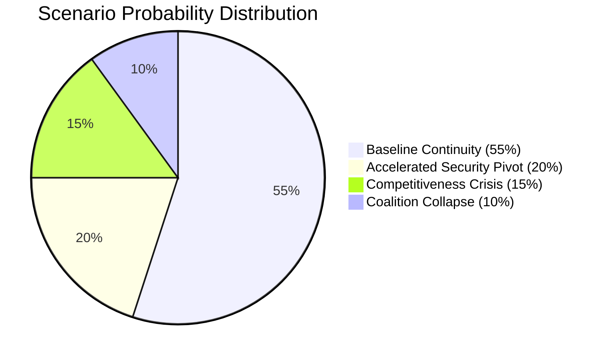

# Scenario Forecast — European Parliament Year in Review 2025–2026

**Article Type:** year-in-review | **Date:** 2026-05-09 | **Confidence:** 🟡 Medium

## Analytical Framework

This forecast applies structured scenario analysis (4-quadrant model) to the European Parliament's legislative and political trajectory following the year-in-review period (May 2025 – May 2026). Three scenarios are mapped across a 12-month forward horizon (May 2026 – May 2027), with probability weightings based on current political indicators, coalition mathematics, and institutional incentive structures.

---

## Key Drivers (2026–2027 Horizon)

**Driver 1: Ukraine War Trajectory**
- Resolution probability within horizon: ~15% 🔴 Low
- Continued active conflict: ~70% 🟢 High
- Frozen conflict / ceasefire: ~15% 🟡 Medium
- **Legislative impact:** Continued conflict sustains Ukraine financial architecture and maintains EPP-S&D-Renew coalition cohesion on security files.

**Driver 2: EPP Consolidation / Fragmentation**
- EPP maintains centrist positioning: ~60% 🟡 Medium
- EPP gravitates further right toward ECR/PfE: ~25% 🟡 Medium
- EPP internal splits (eastern vs. western European wings): ~15% 🔴 Low
- **Legislative impact:** EPP rightward drift accelerates migration restrictionism and sustainability rollback; centrist positioning preserves S&D-Renew coalition.

**Driver 3: Transatlantic Trade Stability**
- EU-US trade accommodation / partial deal: ~45% 🟡 Medium
- Escalation (US tariffs on European goods): ~35% 🟡 Medium
- Full normalisation: ~20% 🔴 Low
- **Legislative impact:** Trade tensions accelerate EU strategic autonomy legislation; EU-Mercosur ratification becomes more likely under trade diversification pressures.

**Driver 4: EU Defence Industrial Integration**
- Accelerated (EDIP, permanent defence fund): ~55% 🟡 Medium
- Stalled (intergovernmental resistance): ~30% 🟡 Medium
- Transformational (Treaty amendment for defence): ~15% 🔴 Low
- **Legislative impact:** Accelerated integration creates new legislative demands in procurement, research, and capability development frameworks.

---

## Scenario A: "Managed Continuity" (Probability: 45%)

**Description:** EPP maintains centrist positioning; Ukraine war continues without escalation; EU-US trade accommodation reached; coalition mathematics stable. The parliament continues executing the 2024–2029 Agenda at the pace established in 2025–2026.

**Key features:**
- EPP+S&D+Renew majority operational on most major files
- Ukraine financial architecture renewed for 2027 (post-current loan expiry)
- EU-Mercosur trade agreement proceeds toward consent vote after CJEU opinion
- Defence single market further integrated through EDIP legislation
- Green Deal implementation continues under competitiveness-compatible framing
- Housing crisis generates additional legislative proposals (EU Housing Strategy)
- AI Act implementation enters enforcement phase; new AI governance gaps addressed

**Coalition dynamics:** Stable; no fundamental realignment. ECR/PfE exert pressure but remain outside the majority-forming coalition on key files.

**Parliamentary productivity:** High. Legislative output matches or exceeds 2025–2026 pace. EP10 on track to be one of the most legislatively active terms.

**Risk factors:** Hungarian/Polish rule-of-law continued tensions; regional elections in major member states shifting national political landscapes; Green Deal backlash if energy prices spike.

---

## Scenario B: "Security Escalation" (Probability: 30%)

**Description:** Ukraine war escalates (Russian advance or missile attacks on EU-adjacent territory); EU defence spending accelerates dramatically; transatlantic security burden-sharing tensions intensify. Parliament's legislative agenda dominated by security/defence/geopolitics.

**Key features:**
- Emergency legislative procedures for defence industrial capacity
- Treaty change discussions reopened (enhanced cooperation for defence)
- Ukraine financial obligations potentially redefined as security expenditure
- Migration-security nexus tightens; Schengen under renewed pressure
- Sustainability legislation further delayed as "not the right time"
- Article 7 proceedings against Hungary accelerated as diplomatic leverage erodes

**Coalition dynamics:** EPP-S&D-Renew + parts of ECR form ad hoc security coalition; PfE splits between Fidesz anti-NATO wing and French RN pro-NATO elements.

**Parliamentary productivity:** High but narrowly focused on security files. Domestic social/environmental agenda largely deferred.

**Risk factors:** Coalition fractures over military spending thresholds; German fiscal rules constrain EU defence spending ambitions; Article 7 Hungary impasse worsens.

---

## Scenario C: "Rightward Realignment" (Probability: 20%)

**Description:** EPP gravitates toward ECR/PfE on multiple files; centrist coalition frays. Triggered by national electoral results (France, Germany, Poland) shifting member state government positions rightward, EPP MEPs face pressure to accommodate nationalist demands beyond migration.

**Key features:**
- Migration policy becomes maximally restrictive; Greens/Left/S&D lose more battles
- Sustainability rollback accelerates (Nature Restoration Law weakening attempts, more CSRD extensions)
- Ukraine consensus narrows as PfE conditioning intensifies
- Rule-of-law mechanisms de-prioritised; Hungary normalisation attempted
- Social rights (minimum wage, housing) advance stalls
- Trade protectionism alignment with US on some files (steel, semiconductors)

**Coalition dynamics:** EPP+ECR+PfE blocks operative on migration and competitiveness; EPP+S&D+Renew blocks operative on Ukraine and rule-of-law. Parliament operates in dual-coalition mode — unprecedented in EP history.

**Parliamentary productivity:** Medium — coalition confusion creates legislative gridlock on contested files; institutional tensions between Parliament and Commission increase.

**Risk factors:** Commission's S&D/Renew support base conflicts with EPP rightward drift; von der Leyen faces no-confidence risk from left if EPP-PfE accommodation visibly crosses red lines.

---

## Scenario D: "Progressive Rebound" (Probability: 5%)

**Description:** National elections produce centre-left results in key member states (Germany centre-left coalition, France opposition victory, Spanish consolidation); EP group arithmetic shifts through by-elections and national party realignments.

**Key features:**
- Greens/EFA or S&D regain influence through defections from right-nationalist delegations
- Green Deal implementation reinstated at higher ambition level
- CSRD/CSDDD reversed or re-tightened
- Hungary Article 7 Council blocking overcome through new national government positions
- Housing EU strategy adopted with binding targets

**Coalition dynamics:** S&D+Greens+Left+Renew approaches viability on specific files; EPP isolated on some sustainability files.

**Probability assessment:** 🔴 Low (5%) — no current electoral indicators suggest sufficient national political shifts within the 12-month horizon. German CDU/SPD grand coalition, French political fragmentation, and Italian right-wing stability make this scenario implausible near-term.

---

## Key Assumptions and Caveats

1. **Voting data limitation:** Per-MEP voting statistics unavailable from EP API. Scenario probabilities based on structural analysis (seats, adopted texts, coalition mathematics) rather than observed voting patterns.

2. **IMF data unavailable:** Economic scenario dimensions cannot be calibrated against IMF growth/inflation forecasts. Proxy: World Bank and national central bank projections suggest Eurozone growth of 1.0–1.5% in 2026 (based on publicly available pre-run knowledge).

3. **National election calendar (2026–2027):** No major EU member state elections scheduled that would directly shift EP composition within the 12-month horizon (EP MEP terms run to 2029).

4. **Treaty amendment constraints:** Any Treaty change requires unanimity in the European Council and ratification by all 27 member states — effectively a multi-year process. Defence integration within existing Treaty frameworks is more probable.

---

## Forward Projections: Legislative Pipeline Priorities (2026–2027)

Based on observed 2025–2026 trends, the highest-probability legislative priorities for the upcoming period:

| Priority | Probability | Coalition Required |
|----------|:-----------:|-------------------|
| Ukraine financial architecture renewal | 🟢 85% | EPP+S&D+Renew |
| EU-Mercosur consent (post-CJEU opinion) | 🟡 55% | EPP+Renew+parts of ECR |
| EDIP / permanent defence fund | 🟡 60% | EPP+S&D+Renew |
| EU Housing Strategy framework | 🟡 50% | EPP+S&D+Greens |
| AI Act secondary legislation | 🟢 75% | EPP+S&D+Renew |
| MFF 2028–2034 preparatory proposals | 🟡 40% | EPP+S&D (with Commission) |
| Nature Restoration Law weakening attempt | 🟡 35% | EPP+ECR+PfE |
| Digital Markets Act secondary enforcement | 🟢 70% | EPP+S&D+Renew |

*Data sources: EP Open Data Portal. Scenario methodology: structured qualitative forecasting with probability weighting. Confidence: 🟡 Medium. IMF data: unavailable — economic growth assumptions from publicly available alternatives.*

*Admiralty: B2 — confirmed political landscape; scenario probabilities are author inference*
*WEP Band: Probabilities above use WEP language; LIKELY = 55-75%; UNLIKELY = 25-45%*

