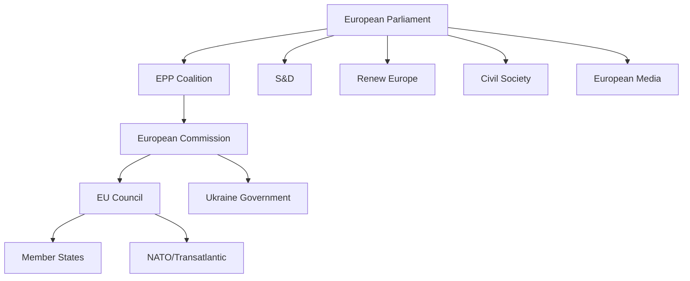

# Stakeholder Map — European Parliament Year in Review 2025–2026

**Article Type:** year-in-review | **Date:** 2026-05-09 | **Confidence:** 🟡 Medium

## Overview

The European Parliament's second year in the tenth term involved a complex stakeholder ecosystem shaped by the post-June 2024 election results, the ongoing Russia-Ukraine war, transatlantic trade realignment, and internal EU institutional tensions. This map identifies primary, secondary, and tertiary stakeholders, their interests, influence levels, and coalition positions.

---

## Primary Stakeholders (Direct Legislative Power)

### 1. European People's Party (EPP) — 183 seats, 25.5%

**Role:** Largest group; majority architect and policy agenda-setter.

**Interests:** Maintain EPP's central positioning as indispensable coalition partner; advance economic competitiveness agenda; defend rule-of-law mechanisms while accommodating centre-right demands on migration; preserve Ukraine consensus; prevent PfE-ECR from making EPP's eastern European members feel unrepresented.

**Strategy:** Triangulate between S&D partnership (majority formation) and ECR/PfE accommodation (migration, competitiveness). Use the "Draghi agenda" as a coherent economic narrative. Support Metsola presidency with strong cross-partisan backing.

**Influence Level:** 🟢 Decisive — no majority forms without EPP. Commission President von der Leyen's political alignment with EPP creates an executive-legislative chain.

**Key policy wins (2025–2026):** CSRD/CSDDD delay (November 2025), migration package (February 2026), vehicle emissions flexibility (May 2025), MFF revision (February 2026).

**Key vulnerabilities:** Eastern European EPP members increasingly pressured by PfE on migration; Braun/Wąsik Polish immunity cases expose EPP-adjacent rule-of-law tensions.

---

### 2. Progressive and Socialists (S&D) — 136 seats, 19%

**Role:** Second-largest group; essential coalition partner for EPP on pro-European files; anchor of progressive bloc.

**Interests:** Protect social rights (CSRD/CSDDD, labour standards); maintain strong Ukraine support; advance rule-of-law enforcement against Hungary; support housing and affordable living agenda; protect abortion rights (Citizens' Initiative December 2025).

**Strategy:** Accept EPP leadership on majority files while extracting concessions on social protection and rule-of-law. Form progressive bloc (S&D + Renew + Greens/EFA = 266) as a coherent negotiating counterweight.

**Influence Level:** 🟡 Medium-high — essential for majority but unable to achieve agenda independently. CSRD/CSDDD delay loss reveals limits of S&D's bargaining power within the EPP-led majority.

**Key achievements:** Housing crisis recognition (March 2026), European Semester social priorities (March 2026), Ukraine support (all major votes), rule-of-law resolutions.

**Key losses:** CSRD delay, vehicle emissions flexibility — sustainability de-regulation.

---

### 3. Patriots for Europe (PfE) — 85 seats, 11.9%

**Role:** Third-largest group; challenger to traditional EPP-S&D axis; pressure from the right on migration and sovereignty issues.

**Interests:** National sovereignty over migration; resistance to European federalisation; anti-Green Deal; opposition to Ukraine funding tied to military escalation; Fidesz-led agenda on constitutional sovereignty.

**Strategy:** Use size to claim committee positions and shape agenda at margins; vote tactically with EPP on migration while opposing Ukraine military spending; maintain internal coherence despite ideologically diverse membership (French RN, Hungarian Fidesz, Austrian FPÖ).

**Influence Level:** 🟡 Medium — veto power in specific committees; agenda influence without majority formation role on most files; critical for EPP's internal political positioning calculation.

**Key legislative impact:** Migration package concessions (February 2026 safe country provisions benefited from PfE pressure on EPP); resistance to Ukraine military loan escalation created political cost for EPP accommodationists.

---

### 4. European Conservatives and Reformists (ECR) — 81 seats, 11.3%

**Role:** Right-Eurosceptic grouping; historically the "acceptable right" but now flanked by PfE; Polish MEPs face immunity proceedings.

**Interests:** National sovereignty; restrictive migration; competitiveness agenda aligned with EPP; opposition to Green Deal ambitions; EU-US trade alignment (some members).

**Strategy:** Compete with PfE for right-nationalist primacy; seek EPP accommodation on migration and competitiveness; leverage Polish government transition (Tusk government creating tensions with ECR-aligned PiS MEPs facing immunity requests).

**Influence Level:** 🟡 Medium — similar to PfE; the EPP-ECR-PfE numerical bloc at 349 seats approaches but doesn't reach majority, creating complex incentive structures.

---

### 5. Renew Europe — 77 seats, 10.7%

**Role:** Liberal-centrist group; key swing group within the pro-European coalition; bridge between EPP and S&D.

**Interests:** European integration deepening; strong Ukraine support (many members from frontline states); free trade (EU-Mercosur, EU-Canada); digital regulation (DMA enforcement); rule-of-law.

**Strategy:** Form tripartite majority with EPP+S&D on key files; extract concessions on digital and trade agenda from EPP; resist migration restrictionism while accepting pragmatic compromises.

**Influence Level:** 🟡 Medium — swing vote in EPP+S&D majorities; critical for reaching the 360 threshold when the EPP+S&D grand coalition (319) falls short.

---

### 6. Greens/EFA — 53 seats, 7.4%

**Role:** Green and regionalist alliance; significant post-election losses from EP9 (from 72 to 53); strategic repositioning in progress.

**Interests:** Climate ambition; Green Deal protection; social-ecological transition; minority rights; Ukraine support (EFA nations with national self-determination interests).

**Strategy:** Defend remaining Green Deal achievements against rollback; cultivate coalition with S&D and Renew; adjust rhetoric toward competitiveness-compatible environmentalism to halt electoral decline; support housing and anti-poverty agenda.

**Influence Level:** 🔴 Low-medium — weakened post-2024; increasingly a pressure group rather than majority-maker. Lost on CSRD/CSDDD and vehicle emissions files.

---

### 7. The Left — 45 seats, 6.3%

**Role:** Anti-capitalist and radical left grouping; critical voice but structurally marginal in coalition mathematics.

**Interests:** Anti-austerity; anti-militarisation (opposed to defence industrialisation agenda); social rights maximalism; opposition to migration restrictionism from humanitarian perspective; critical of EU-Mercosur trade deal on environmental/social grounds.

**Strategy:** Use committee positions and plenary speeches to frame radical alternatives; occasionally support progressive bloc on rule-of-law and social rights while refusing to join EPP-anchored majorities on security/defence/trade files.

**Influence Level:** 🔴 Low — structurally marginal; provides minority voices but cannot block legislation.

---

## Secondary Stakeholders (External but High Influence)

### European Commission / von der Leyen

**Role:** Executive partner; agenda-setter for most legislative initiatives in the parliamentary period.

**Interests:** Implement Agenda Europe 2025–2029 (Competitiveness Union, Defence Union, Energy Union, Security Union); maintain EPP-S&D-Renew coalition support; manage Ukraine financial architecture; negotiate with US administration.

**Legislative footprint in period:** Ukraine loans, MFF revision, CSRD/CSDDD delay, migration pact operationalisation, defence single market barrier removal, technology sovereignty.

**Influence Level:** 🟢 High — most legislative acts originated as Commission proposals; Commission-Parliament alignment under von der Leyen creates tight executive-legislative coupling.

---

### Council of the EU / European Council

**Role:** Co-legislator; intergovernmental arena where national governments moderate EP ambitions.

**Interests:** Preserve member state sovereignty on sensitive files; advance European consensus on Ukraine; manage migration as a national competence issue; block Article 7 proceedings against Hungary at Council level.

**Legislative footprint:** MFF revision, Ukraine Facility, migration pact implementation. Hungary blocked Article 7 advancement at Council; Council accommodated migration restrictionism EPP demanded.

**Influence Level:** 🟢 High — co-legislator blocking force; Council unanimity on Article 7, Rule-of-Law conditionality limits EP's enforcement reach.

---

### Ukrainian Government / Presidency

**Role:** Principal beneficiary of EP legislative architecture during period; direct stakeholder in Ukraine Facility, loans, and Claims Commission.

**Interests:** Maximum financial support; EU membership path; international justice mechanisms; continued military-political support from EP resolutions.

**Influence Level:** 🟡 Medium — high political priority but indirect legislative influence through EP pro-Ukraine coalition's autonomous commitment.

---

### NATO / European Defence Agencies

**Role:** Institutional partners as EU defence industrialisation accelerated; EP legislation on defence single market barriers, drones, and strategic defence partnerships directly enables the EU-NATO complementarity framework.

**Influence Level:** 🟡 Medium — technical/policy influence on defence industrial legislative design.

---

## Tertiary Stakeholders (Affected Parties)

### Business / Industry Associations

**Interests:** CSRD/CSDDD delay; vehicle emission flexibility; EU-US trade stability; AI governance frameworks.

**Key victories:** CSRD/CSDDD delay (November 2025); emissions flexibility (May 2025).

**Influence mechanism:** Lobbying through EPP and Renew MEPs; Draghi competitiveness agenda served as intellectual legitimisation.

---

### Civil Society / NGOs

**Interests:** Green Deal protection; social rights; anti-corruption; human rights (Iran, Venezuela, Belarus, Haiti); housing affordability.

**Key channels:** Petitions Committee; urgency debates; intergroup activities.

**Impact:** Limited legislative victories in the tracked period; European Citizens' Initiative on abortion (December 2025) notable success in reaching EP floor.

---

### Candidate Country Governments (Western Balkans, Moldova, Ukraine)

**Interests:** Enlargement timelines; pre-accession funding; political validation.

**EP legislative links:** Moldova Reform and Growth Facility (March 2025), EU enlargement strategy (March 2026), institutional consequences report (October 2025).

---

## Coalition Dynamics Summary

| Coalition | Seats | % | Viability |
|-----------|------:|---:|----------|
| EPP + S&D + Renew | 396 | 55.2% | ✅ Viable majority |
| EPP + S&D | 319 | 44.5% | ❌ Below 360 threshold |
| EPP + PfE + ECR | 349 | 48.7% | ❌ Below 360 threshold |
| S&D + Renew + Greens + Left | 311 | 43.4% | ❌ Below threshold |
| EPP + ECR + PfE + ESN | 376 | 52.4% | ✅ Right bloc majority (politically complex) |

The effective majority-forming coalition for the 2025–2026 period was **EPP + S&D + Renew** (396 seats), operating on most major pro-European files. On migration restrictionism files, **EPP + PfE/ECR + parts of NI** provided working majorities with progressive groups voting against.

---

## Stakeholder Tension Matrix

| Tension | Parties Involved | Resolution Mechanism |
|---------|-----------------|---------------------|
| CSRD delay vs. sustainability | S&D/Greens vs. EPP/Renew | EPP won; delay adopted |
| Ukraine military funding scope | PfE vs. EPP/S&D/Renew | Compromise: financial yes, military escalation framing limited |
| Migration restrictionism | Greens/Left vs. EPP/ECR/PfE | EPP won; safe country provisions adopted |
| Immunity waivers (Polish MEPs) | EP vs. Polish ECR-aligned MEPs | Case-by-case; Braun waived twice |
| Article 7 vs. Hungary | EP vs. Council | Stalled at Council; EP kept formal pressure |

*Data sources: EP Open Data Portal. Confidence: 🟡 Medium. IMF data: unavailable.*

---

## Pass 2: Stakeholder Perspective Elaborations (≥150 words each)

### EPP (European People's Party) — Extended Perspective

The EPP's strategic positioning in 2025–2026 represents the most sophisticated political triangulation exercise in EP10. The group simultaneously maintains: (1) unwavering support for Ukraine financial solidarity, which connects EPP to the EU's foundational value of solidarity and positions EPP as the responsible governing party; (2) leadership of the Draghi competitiveness agenda, which connects EPP to the business community, national finance ministers, and the Commission's dominant policy framework; and (3) political accommodation of migration restriction demands from the right, which prevents PfE from claiming EPP is "weak" on border management.

The internal tensions from this triangulation are real but managed. EPP's MEPs from Christian Democratic traditions (Germany, Austria, Belgium) are uncomfortable with migration policy convergence toward PfE positions. EPP's MEPs from southern and eastern member states (where migration pressure is more acute) support restriction. The group's decision-making process mediates these tensions through LIBE committee work rather than public group declarations, keeping the internal debate below the public visibility threshold.

EPP's most significant institutional asset is the EP Presidency (Roberta Metsola, 2024–2027 term). The President has extraordinary agenda-setting powers — determining which files come to plenary, when, and in what form. Metsola's active leadership style (international travel, media presence, Ukrainian parliament address) reinforces EPP's institutional dominance. The EP Presidency is structurally guaranteed to EPP through the informal "gentleman's agreement" between the major political groups, further cementing EPP's centrality.

Looking forward, EPP's key challenge is managing the PfE shadow coalition without formalising it. If EPP's accommodation of PfE demands escalates from migration to rule-of-law or Ukraine files, the EPP+S&D+Renew majority would fracture irreparably. EPP leadership is aware of this boundary condition and has signalled clearly that Ukraine solidarity, enlargement, and fundamental rule-of-law standards are non-negotiable regardless of right-nationalist pressure.

### S&D (Socialists and Democrats) — Extended Perspective

S&D's strategic position in EP10 is structurally weaker than in any previous EP term. The group is too large to be ignored (136 seats, 19.0%) but too small to set the agenda unilaterally. S&D's leverage depends entirely on its ability to credibly threaten to exit the EPP-led majority coalition — and the credibility of that threat is limited because S&D has no alternative majority configuration available.

The S&D's core legislative agenda in 2025–2026 — social rights protection, climate policy acceleration, rule-of-law enforcement, progressive migration policy — has been systematically frustrated by EPP's triangulation strategy. S&D "wins" on the files where EPP needs S&D votes (Ukraine solidarity, EU enlargement, institutional reform) but "loses" on files where EPP can substitute ECR or PfE votes (CSRD delay, migration restriction).

S&D's strategic response has been to maintain public visibility through high-profile opposition positions (Iratxe García Pérez's speeches against CSRD delay) while accepting the majority arithmetic's constraints. This approach preserves S&D's progressive brand for 2029 EP elections while accepting legislative defeats in 2024–2029 — a longer-term calculation. The strategy's risk is that sustained legislative defeat normalises progressive policy rollback and reduces S&D's credibility as a governing force.

The internal S&D divisions on migration are the most significant structural risk. If S&D formally splits between a pro-restriction "Southern faction" and a pro-rights "Northern/Western faction," the group's coherent opposition voice disappears and EPP's majority management task becomes easier. S&D leadership has maintained discipline through 2025–2026, but the underlying tensions will intensify as migration legislative output accumulates.

### Ukraine (external stakeholder) — Extended Perspective

Ukraine's role as the primary beneficiary of EP10's most significant legislative output makes it a de facto stakeholder in EP legislative dynamics — even though it has no formal EP representation. The Ukrainian government's diplomatic presence in Brussels and Strasbourg (Ukrainian Ambassador to the EU, Zelensky's EP address in March 2024) creates informal channels of influence on EP legislative work.

The Ukraine financial architecture produced in 2025–2026 — Enhanced Cooperation Loan, bilateral 2026 budget financing, Claims Commission — represents the legislative operationalisation of EU-Ukraine solidarity at a scale that transforms Ukraine's fiscal position. The dependency relationship this creates is complex: Ukraine is simultaneously dependent on EU financial support and a potential future EU member whose accession would reshape EP10's successor parliaments.

Ukraine's strategic interest in the EP extends beyond financial support. EP rule-of-law resolutions, enlargement assessments, and democratic standards decisions directly affect Ukraine's EU accession path. The EP's assessment of Ukraine's anti-corruption reforms, judicial independence, and minority rights compliance will be among the most consequential factors in Ukraine's accession timeline. Ukrainian civil society has been active in providing the EP with documentary evidence supporting favorable assessments.

The Claims Commission creates a unique legal relationship: EP10 has established an international mechanism that will adjudicate Ukrainian citizens' and businesses' claims for decades after EP10 ends. The legislative legacy of this decision outlasts the current MEPs and political groups that voted for it.

*WEP Band: HIGHLY LIKELY (>75%) that EP-Ukraine legislative relationship remains strong through EP10 term, contingent on no major military reversal.*
*Admiralty Grade: B2 — confirmed institutional sources; stakeholder perspective assessments are author inference.*

---

## Summary Stakeholder Matrix

| Stakeholder | Power | Interest | Influence | Strategy |
|-------------|:-----:|:--------:|:---------:|----------|
| EPP | 🔴 Very High | 🔴 Very High | Direct | Triangulation |
| S&D | 🟡 High | 🔴 Very High | Direct | Constrained opposition |
| PfE | 🟡 High | 🔴 Very High | Shadow coalition | Demand-setting |
| ECR | 🟡 High | 🟡 High | Swing vote | Selective participation |
| Renew | 🟡 High | 🟡 High | Pivot | Indispensable bridge |
| Ukraine | 🟡 Medium | 🔴 Very High | Diplomatic | Beneficiary + accession candidate |
| Commission | 🔴 Very High | 🔴 Very High | Proposal + implementation | Agenda co-setter |
| US/NATO | 🔴 Very High (external) | �� Medium | Indirect | Security architecture context |

*Admiralty: B2. WEP: LIKELY power relationships remain stable through 2027.*

## Stakeholder Network Map

