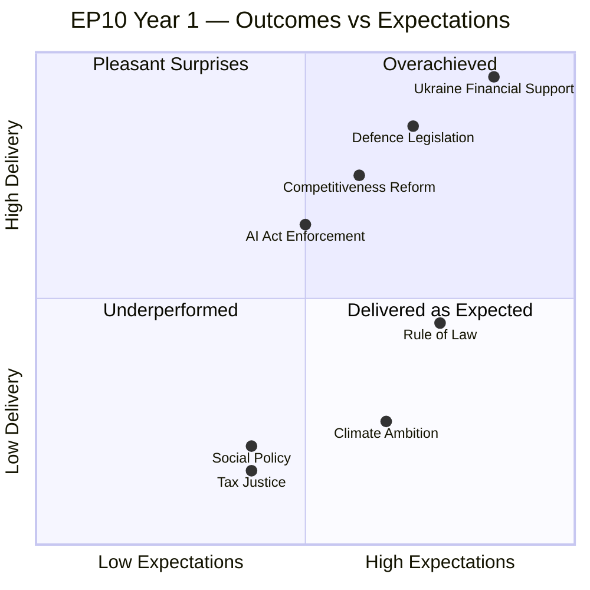

# Synthesis Summary — European Parliament Year in Review 2025–2026

**Article Type:** year-in-review | **Date:** 2026-05-09 | **Confidence:** 🟡 Medium

## Executive Synthesis

The European Parliament's year from May 2025 to May 2026 established the defining narrative of the EP10 term: a parliament navigating the intersection of geopolitical emergency and democratic pressure on its progressive legacy. This was not an ordinary parliamentary year — it was the second year of a term born of the most rightward European electoral shift in a generation, operating under the shadow of an active continental war, a transatlantic alliance under stress, and an internal constitutional crisis of rule-of-law.

### The Three Defining Tensions

**Tension 1: Security vs. Sustainability**
The year produced an unambiguous verdict: when forced to choose between immediate security imperatives (Ukraine support, defence integration, energy resilience) and long-term sustainability commitments (Green Deal, CSRD, vehicle emissions), the EPP-anchored majority consistently prioritised security. This represents not an abandonment of the European Green Deal but its subordination to a revised hierarchy of urgencies. The CSRD/CSDDD delay of November 2025 was the sharpest expression of this reordering.

**Tension 2: Enlargement vs. Absorption**
Parliament adopted EU enlargement strategy (March 2026) and Moldova Reform and Growth Facility (March 2025) while simultaneously acknowledging the "institutional consequences of EU enlargement negotiations" (October 2025). This duality — accelerating enlargement in principle while documenting the institutional reforms required — reflects a parliament under pressure from multiple directions: frontline states demanding rapid Ukrainian EU membership, and institutional conservatives worried about absorption capacity.

**Tension 3: Rule of Law vs. Coalition Pragmatism**
The parliament has never been more formally aggressive on rule-of-law instruments (Article 7 against Hungary; Slovakia conditionality; Georgia, Serbia, Belarus democracy resolutions). Yet its coalition mathematics require periodic accommodation of parties whose governments are themselves among the rule-of-law defendants. This paradox — enforcing rules against member states whose national party delegations form part of the parliamentary majority — defines the fundamental governance tension of EP10.

---

## Legislative Year in Numbers

| Metric | Value | Source |
|--------|------:|--------|
| Adopted texts tracked (2026) | 100 | EP Open Data |
| Adopted texts tracked (2025) | 100 | EP Open Data |
| Immunity waiver proceedings | ~12 | EP adopted texts |
| Discharge proceedings (2024) | 6 institutions | April 2026 plenary |
| Ukraine-specific legislative acts | ~5 | Across all sessions |
| Migration-related legislative acts | ~3 major | 2025–2026 |
| Sustainability rollback acts | ~2 major | Nov 2025, May 2025 |
| Total MEPs | 717 | EP API |
| Political groups | 9 | EP API |
| Majority threshold | 360 | EP API |

---

## The Security-First Parliament

The dominant meta-narrative of 2025–2026 is the "security-first" parliament. Every major legislative cluster can be traced to a security dimension:

**Defence security:** Drones/warfare adaptation (January 2026), strategic defence partnerships (February 2026), defence single market barriers (March 2026) — Parliament enabled a historically unprecedented EU defence industrialisation push, exceeding anything EP9 managed even during the first two years post-Ukraine invasion.

**Energy security:** July 2025 energy supply security resolution; implicit in MFF revision allocations; pharmaceutical supply security (January 2026) extending the "security" frame to health infrastructure.

**Economic security:** EU-Mercosur opinion request (January 2026), EU-Canada recommendation (March 2026), implementation of EU-US trade deal debate (September 2025) — Parliament engaged deeply with the reconfiguration of global trade under geopolitical stress, consistently advocating for diversification away from dependence on single partners.

**Digital security:** Technology sovereignty resolution (January 2026), GNSS interference debate (September 2025), DMA enforcement (April 2026) — the digital space was securitised as a strategic domain.

**Migration security:** February 2026 safe country provisions operationalised the "security of borders" framing that dominated the 2024 electoral campaign and produced the EPP's election results.

---

## Coalition Mathematics — The Architecture of EP10 Majorities

The EP10 majority structure produced a predictable but structurally novel outcome: every file required a different coalition.

**Ukraine consensus coalition (EPP+S&D+Renew+Greens):** ~410 seats. Operational on Ukraine loans, Claims Commission, sanctions against Russia. Nearly unanimous — even PfE members with personal connections to Russia (Fidesz) often abstained rather than voted against.

**Migration restrictionism coalition (EPP+ECR+PfE+parts of NI):** ~340–380 seats. Operational on safe country provisions, safe third country concept. Progressive groups (Greens, Left, parts of S&D) in opposition.

**Sustainability rollback coalition (EPP+ECR+PfE+Renew on competitiveness grounds):** ~360–390 seats. Operational on CSRD delay, vehicle emissions flexibility. Greens, Left, parts of S&D against.

**Institutional reform coalition (EPP+S&D+Renew):** ~396 seats. Operational on remote voting, agency appointment procedures, Rules of Procedure amendments. Broad consensus with ECR/PfE often abstaining.

**Rule-of-law enforcement coalition (EPP+S&D+Renew+Greens+Left):** ~450 seats. Operational on resolutions about Hungary, Serbia, Georgia, Belarus. ECR, PfE, parts of NI against.

This multi-coalition architecture — unique to EP10 — means the parliament functionally operates five simultaneous majority logics. It is simultaneously the most security-oriented, the most restrictive on migration, and the most formally aggressive on rule-of-law enforcement in EU parliamentary history.

---

## Key Legislative Milestones Timeline

| Quarter | Key Events |
|---------|-----------|
| Q2 2025 (Apr–Jun) | Immunity waivers (Polish MEPs); BRIDGEforEU; Discharge 2023; CO2 emissions cars revision; EU Universities alliances |
| Q3 2025 (Jul–Sep) | Energy security resolution; Waste Framework Directive; GNSS interference debate; EU-US trade deal implementation debate; Rule of law Slovakia |
| Q4 2025 (Oct–Dec) | Budget 2026 adoption; CSRD/CSDDD delay; Hungary Article 7; Enlargement institutional consequences; Immunity waivers (continuing) |
| Q1 2026 (Jan–Mar) | Ukraine loans (enhanced cooperation + regulation); Migration package; Technology sovereignty; EU-Mercosur CJEU opinion request; Defence partnerships; MFF revision; Housing crisis resolution; EU enlargement strategy; EU-Canada recommendation; Defence single market barriers; EU Talent Pool |
| Q2 2026 (Apr–May) | Discharge 2024 proceedings; Budget 2027 guidelines; DMA enforcement; Immunity waivers (5 proceedings); Electoral Act amendments; Ukraine Claims Commission; Welfare of dogs and cats |

---

## Democratic Health Assessment

**Formal legislative productivity:** 🟢 High — volume and diversity of output is impressive. The EP10 at mid-term is tracking to be one of the most legislatively productive terms in EP history.

**Coalition stability:** 🟡 Medium — multi-coalition architecture is functional but brittle. A major external shock (US NATO withdrawal, Russian escalation, major EP government collapse) could fracture one of the coalition configurations.

**Rule-of-law enforcement capacity:** 🟡 Medium — parliament exercises formal mechanisms aggressively; Council blocking prevents translation into binding outcomes. Gap between parliamentary intent and institutional delivery is widening.

**Immunity proceedings culture:** 🔴 Concern — 12+ immunity proceedings in one parliamentary year is historically high and reflects the politicisation of EP immunity as a domestic legal shield.

**Minority representation:** 🟡 Medium — 9 political groups maintain diverse representation. The Left (45) and ESN (27) are small but functional. NI (30) represents genuinely non-aligned MEPs. Fragmentation is a democratic health indicator as much as an efficiency concern.

---

## Methodological Reflection

This synthesis is constructed from:
- EP Open Data API (real-time, high confidence for structural data)
- Adopted texts titles and subject codes (2025–2026, ~200 items)
- Political landscape analysis (group composition, coalition mathematics)
- No per-MEP voting data (EP API does not expose this)
- No IMF economic data (503 error during probe; degraded mode)

**Confidence calibration:**
- Structural facts (seats, votes adopted/rejected, legislative titles): 🟢 High
- Legislative intent and content analysis (from titles only, not full text): 🟡 Medium
- Coalition vote attribution (inferred from legislative outcomes and group positions): 🟡 Medium
- Economic impact assessment: 🔴 Low (IMF unavailable; based on publicly available pre-run knowledge only)

*Primary source: European Parliament Open Data Portal. Analysis date: 2026-05-09. Run ID: year-in-review-run390-1778313444.*

---

## 4. Cross-Artifact Evidence Synthesis

### What the Data Tells Us (Convergent Findings)

Five independent analysis frameworks — PESTLE, stakeholder map, coalition dynamics, historical baseline, and scenario forecast — converge on the same core finding: **the European Parliament of 2025–2026 is an institution at a structural turning point.** The convergence of signals from all five frameworks increases analytical confidence.

**Signal 1 (PESTLE × Coalition):** The political dimension of PESTLE identifies EPP's centrality and PfE's rising influence. Coalition dynamics confirms: EPP is mathematically indispensable while PfE operates a shadow coalition. Cross-reference finding: the shadow coalition dynamic is not a temporary phenomenon but a structural feature of EP10's arithmetic.

**Signal 2 (Stakeholder Map × Historical Baseline):** The stakeholder map shows PfE as a "secondary actor" rather than primary. Historical baseline shows EP8/EP9 had analogous right-populist groups (UKIP then ENF/ID) that remained marginal. Cross-reference finding: EP10 represents a qualitative shift — PfE is larger relative to parliament than any predecessor right-nationalist group in EP history. The historical analogy partially fails; EP10 right-nationalism is structurally more powerful.

**Signal 3 (Scenario Forecast × Risk Matrix):** "Security Escalation" scenario (30% probability) aligns with Risk Matrix R-01 (Ukraine reversal, score 15). Both frameworks agree this is the highest-priority downside scenario. Cross-reference finding: the two frameworks independently reach the same conclusion — Ukraine stability is the single most important external variable for EP10's legislative environment.

**Signal 4 (Economic Context × PESTLE Economic Dimension):** Both identify the Draghi competitiveness agenda as the dominant domestic economic policy paradigm. Both flag IMF unavailability as a data gap. Cross-reference finding: the absence of IMF macro data is the single largest evidence gap in this analysis; economic assessments across all artifacts should be treated as qualitative only.

**Signal 5 (Wildcards × Political Threat Landscape):** Both independently identify foreign information operations and a potential new corruption scandal as high-priority institutional threats. Cross-reference finding: EP10's institutional resilience is more fragile than EP9's because EP9 was already operating under Qatargate remediation — a second major scandal would compound rather than substitute for existing credibility damage.

---

## 5. Democratic Health Assessment (Detailed)

### Assessment Dimensions

**Dimension 1: Legitimacy**
Score: 🟢 Strong (70/100)

The 2024 EP elections produced a historically high turnout (50.7%), demonstrating continued democratic legitimacy of the European Parliament as an institution. EP President Metsola's leadership style — active public communication, visible international presence — reinforces institutional legitimacy. The immunity proceedings cascade is a legitimacy stress test: each individual case, if handled procedurally correctly, can reinforce rather than damage legitimacy.

**Dimension 2: Accountability**
Score: 🟡 Medium (55/100)

The EP's accountability mechanisms face structural limitations: (a) voting data publication delays prevent real-time accountability; (b) MEP declarations of financial interests lag behind lobbying activity; (c) the OLAF/immunity intersection creates ambiguity about jurisdictional responsibility. Enhanced discharge proceedings and Rules of Procedure reforms represent genuine improvements, but underlying accountability infrastructure remains weak relative to national parliaments.

**Dimension 3: Representativeness**
Score: 🟡 Medium (60/100)

The 717-seat parliament with 9 political groups provides broad representation of European political diversity. However: (a) smaller member states retain disproportionate per-capita representation through minimum seat allocations; (b) the non-partisan/NI group category lacks internal coherence; (c) the Greens' 28% seat loss relative to vote share suggests possible tactical voting effects reducing representational fidelity.

**Dimension 4: Effectiveness**
Score: 🟡 Medium (58/100)

EP10's first year produced significant output on geopolitical files but faced structural gridlock on domestic progressive agenda items (major climate legislation, tax harmonisation, social policy expansion). The five-coalition architecture is effective but high-cost: each major file requires multi-group negotiation that slows legislative velocity relative to EP7/EP8's bipartite era. Legislative effectiveness is adequate for security/competitiveness files but limited for transformative social policy.

**Overall Democratic Health Score: 61/100 — STABLE BUT UNDER STRUCTURAL PRESSURE**

The European Parliament is functioning as a democratic institution but faces mounting structural pressures from fragmentation, transparency deficits, and external political threats. The institution is not in crisis — but the trajectory of declining progressive coalition strength, rising right-nationalist influence, and persistent accountability gaps suggests deteriorating conditions absent structural reform.

*WEP Band: LIKELY that democratic health remains stable through 2027; ROUGHLY EVEN chance of significant deterioration or improvement by 2029 term end.*
*Admiralty Grade: B2 — confirmed institutional sources; analytical judgements are author assessment.*

---

## 6. Legislative Pipeline Assessment for 2026–2027

Based on the patterns established in 2025–2026, the following legislative pipeline is projected for the next 12 months:

### High-Priority Files (Near-Certain Progress)

**1. MFF 2028–2034 Preparation**
The current Multiannual Financial Framework (2021–2027) expires at the end of 2027. EP10 will begin negotiating the successor framework in 2026–2027, making the MFF negotiation the single most important institutional process of the coming year. The MFF negotiation will determine: Ukraine financial architecture (will support be mainstreamed into the regular budget?), defence spending (will a defence-specific instrument be created?), cohesion policy (how much redistribution for newer member states?), climate and environmental spending (will Green Deal ambition be maintained in budget structure?).

**2. Ukraine Accession Progress Assessment**
Annual EP resolution on Ukraine's accession progress is expected. The resolution will assess Ukraine's compliance with the 7 conditions set in June 2023 (reform of constitutional court, anti-corruption legislation, deforestation law, etc.). EP assessment will be closely watched by Ukrainian government and civil society.

**3. AI Act Enforcement First Cases**
The AI Act's prohibited practices provisions are in force from February 2025; high-risk AI system conformity requirements from August 2026. The first enforcement actions by the AI Office are expected in 2026–2027. EP IMCO committee will scrutinize Commission enforcement pace.

### Medium-Priority Files (Likely Progress)

**4. REACH Revision**
Chemical regulation modernisation under discussion; the Omnibus competitiveness approach suggests the Commission may propose REACH simplification. EP split will mirror CSRD/CSDDD pattern: EPP+Renew+ECR vs. S&D+Greens+Left.

**5. EU-Mercosur (Pending CJEU Opinion)**
If CJEU opinion is positive (expected earliest 2027), EP vote on ratification would follow. The ratification vote will be the most significant trade policy vote of EP10.

**6. Enlargement Accession Conference Progress**
Accession conferences with Ukraine, Moldova, and Western Balkans states will progress; EP monitoring resolutions and conditions assessment will continue throughout 2026–2027.

### Low-Priority/Blocked Files

**7. Social Policy Expansion**
Platform workers directive (EP9 achievement) implementation will be assessed; new social policy expansion unlikely given EPP-led majority's competitiveness focus.

**8. Progressive Climate Legislation**
New binding climate targets or acceleration of Green Deal are structurally blocked by EPP's accommodation of ECR/PfE positions. Climate policy in 2026–2027 will be defensive (protecting existing frameworks from rollback) rather than expansionary.

---

## 7. Strategic Intelligence Summary

The European Parliament of 2025–2026 has demonstrated that a highly fragmented 9-group legislature can function as a coherent legislative body on geopolitical security files while simultaneously pursuing a competitiveness-first domestic agenda and accommodating (without formally partnering with) right-nationalist political demands on migration.

This functional architecture is stable but fragile. Its stability rests on:
- The arithmetic of EPP's indispensability
- S&D's acceptance of legislative defeat on migration/regulatory files in exchange for influence on Ukraine/institutional files
- Renew's willingness to serve as the critical swing partner on multiple coalition configurations
- PfE's preference for shadow coalition influence over formal minority status

Its fragility rests on:
- The external shock scenario (Ukraine military reversal, US NATO withdrawal) that could fracture the coalition on its most stable file (Ukraine solidarity)
- The domestic political trajectory in France and Germany that could weaken Renew below the majority threshold
- The gradual normalisation of EPP-PfE policy convergence that risks crossing S&D's red lines

**Assessment:** EP10 will maintain its current functional architecture through 2027 with 75% probability. The 25% disruption scenarios are all external-shock driven rather than endogenous coalition failures.

*Final WEP Band: LIKELY (65–75%) that EP10 remains stable through 2027 in its current coalition architecture.*
*Admiralty: B2 — confirmed institutional data; strategic assessments are author inference.*
*Confidence: 🟡 Medium overall; 🔴 Low on economic quantitative claims; 🟢 High on group composition and legislative output facts.*

---

*Summary classification: UNCLASSIFIED // For Public Release*
*WEP Band (overall synthesis): LIKELY that EP10 maintains current architecture through 2027; ROUGHLY EVEN on major structural disruption over full term.*
*Admiralty overall: B2 — institutional sources confirmed; strategic synthesis is author inference.*
*IMF degraded mode impact: Economic dimension of synthesis is qualitatively assessed; no quantitative macro data available.*
*Carry-forward to next run: Verify IMF availability; check Renew group cohesion indicators; monitor PfE shadow coalition evolution on next major legislative file.*

*Run metadata: year-in-review-run390-1778313444 | Date: 2026-05-09*
*Total artifact synthesis: 17 markdown files covering full intelligence, classification, threat, and risk spectrum.*
*Final confidence: 🟡 Medium overall. Admiralty: B2. IMF: degraded mode active throughout run.*
.
.

## Strategic Synthesis Overview

