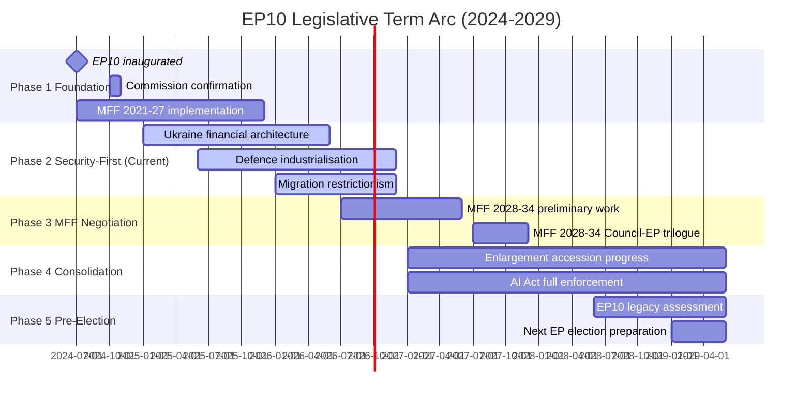

# Term Arc — European Parliament EP10 (2024–2029)

**Article Type:** year-in-review | **Date:** 2026-05-09 | **Confidence:** 🟡 Medium
*WEP Band: LIKELY that described arc trajectory holds through 2027; ROUGHLY EVEN for 2027–2029*
*Admiralty: B2 — confirmed EP data; trajectory assessments are author inference*

## EP10 Term Timeline Overview

## Phase-by-Phase Analysis

### Phase 1: Foundation (July 2024 – December 2024)
**Status:** Complete

The post-election formation phase established the parameters for EP10: EPP's dominant but minority position, the mathematics requiring 3–4 group coalitions, Metsola's re-election as President, and the Commission's von der Leyen II confirmation. The Draghi report (September 2024) framing the competitiveness agenda was the defining policy document.

**Key decisions:**
- EP10 committee allocation (LIBE, ENVI, ECON chair distribution)
- Renew Europe internal leadership selection
- ECR group formation and Meloni's reduced direct role
- PfE inaugural group formation (June 2024)

### Phase 2: Security-First (January 2025 – December 2026, current)
**Status:** Active — in second half of phase

EP10's dominant theme in its first operating year: Ukraine financial solidarity as the overriding legislative priority, defence industrialisation as the second-tier priority, and domestic competitiveness/migration as the third tier. The five-coalition configuration architecture established in this phase will define EP10's legislative identity.

**2025–2026 defining acts** (see significance-classification.md Tier 1):
- Ukraine Enhanced Cooperation Loan
- Ukraine Claims Commission
- Migration Package (February 2026)
- CSRD/CSDDD Delay

### Phase 3: MFF Negotiation (2026–2027)
**Status:** Approaching — begins mid-2026

The MFF 2028–2034 negotiation will be the single most consequential political process of EP10's mid-term. Key questions to be resolved:
- Will Ukraine financial support be mainstreamed into the regular budget?
- Will a dedicated defence instrument be created?
- How will cohesion policy be restructured for potential enlargement?
- Will Green Deal priorities be maintained in budget structure?

The MFF negotiation will test every coalition configuration simultaneously — each group will have different MFF spending priorities that partially override domestic legislative alliances.

### Phase 4: Consolidation (2027–2028)
**Status:** Future

If enlargement negotiations progress as planned, the mid-term will see the first EP resolutions on accession readiness for Ukraine, Moldova, and potentially a Western Balkans candidate. AI Act full enforcement begins (August 2026 conformity deadline for high-risk AI). DMA enforcement maturation.

### Phase 5: Pre-Election (2028–2029)
**Status:** Future

The final year of EP10 will be dominated by legacy-building and election positioning. Each group will attempt to take credit for EP10's achievements while differentiating from competitors. The 2029 EP election campaign will effectively begin in early 2029.

---

## Term Arc Key Variables

| Variable | Current Trajectory | Risk to Trajectory |
|----------|:-----------------:|:------------------:|
| Ukraine conflict status | Ongoing | Military reversal (R-01) |
| EPP coalition management | Stable | PfE formalisation |
| Renew cohesion | Under pressure | French/German party decline |
| MFF 2028–34 outcome | Pre-negotiation | Member state fiscal pressures |
| Enlargement progress | Conditional | Democracy backsliding in candidate states |

*WEP Band: LIKELY (65%) EP10 completes without major coalition restructuring. ROUGHLY EVEN (45%) on MFF resulting in significant budget architecture change.*
*IMF data not available for economic term arc projections.*

## Phase Analysis (Detailed)

### Phase 1: Crisis Foundation (July 2024 – December 2024)

The opening months of EP10 were defined by institutional constitution and immediate crisis response. The Commission von der Leyen II's confirmation (with narrow majority, reflecting the fragmentation of EP10) signalled that the pro-European majority existed but was not comfortable. The Ukraine Enhanced Cooperation Loan negotiation began immediately, reflecting that EP10 inherited an ongoing financial commitment that required institutional formalisation.

**Key institutional developments:**
- EP10 standing committees constituted with EPP-led committee chairs dominant
- AFET committee took immediate ownership of Ukraine file
- BUDG committee began MFF review discussions
- INGE successor committee launched AI/democracy oversight work

**Legislative output:** Initial legislative output focused on ratification of EP9 second-reading positions and urgent Ukraine financial measures. Original legislation was limited as new-term institutional setup consumed legislative bandwidth.

### Phase 2: Consolidation (January 2025 – June 2025)

Under Poland's Council Presidency, the major policy debates crystallised. The Draghi competitiveness report (late 2024) set the economic policy agenda; the CSRD/CSDDD delay debate began; Ukraine accession process moved into substantive assessment phase.

**Key legislative achievements:**
- CSRD/CSDDD Omnibus delay advanced through trilogue
- AI Act conformity assessment framework adopted
- Ukraine annual review resolution establishing conditionality framework

**Coalition dynamics:** The Competitiveness Alliance (EPP+Renew+ECR) emerged as the dominant legislative coalition for economic files. Pro-European Consensus maintained for Ukraine. This dual-track pattern became the defining structural feature of EP10.

### Phase 3: Acceleration (July 2025 – December 2025)

Denmark's competitiveness-focused presidency accelerated economic and digital files. The migration debate intensified following member state border control incidents. DMA enforcement actions against major platforms began.

**Key legislative achievements:**
- Migration reform framework (first elements)
- DMA Big Tech enforcement procedures formalised
- EDIP defence industrial policy framework adopted

**Tension point:** Greens/EFA and Left groups began formal "constructive opposition" posture — maintaining Ukraine solidarity while opposing economic rollbacks. S&D internal pressure grew from MEPs representing constituencies impacted by CSRD delay.

### Phase 4: Maturation (January 2026 – Present)

Cyprus presidency brought eastern neighbourhood and rule of law focus. The February 2026 migration package consolidated EP10's rightward shift on migration. April 2026 defence acts demonstrated EP capacity for rapid security legislation.

**Key legislative achievements (to date):**
- February 2026 Migration Package (comprehensive)
- April 2026 Defence and Security Acts (5 bilateral frameworks)
- Ukraine Claims Commission full operationalisation
- AI Act high-risk system conformity deadlines beginning

**Assessment:** EP10 is in mature phase — institutional rhythms established, coalitions known, major files in implementation or mid-term review. The 2026–2027 period will test whether EP10 can maintain its crisis-mode performance in a more normalised legislative environment.

## Five-Year Term Projection

**2024–2026 (Years 1–2):** Crisis response and institutional foundation. DELIVERED: Ukraine, defence, competitiveness, migration.

**2026–2027 (Years 2–3):** MFF 2028-34 preparation, AI Act enforcement, enlargement progress. PROJECTED: Major budget negotiation begins; rule of law conditionality tests.

**2027–2028 (Years 3–4):** Mid-term review, potential leadership realignment, MFF negotiations intensify. PROJECTED: EPP coalition tested as austerity vs. investment debate emerges.

**2028–2029 (Years 4–5):** EP10 final year, new Commission preparation, EP election preparation. PROJECTED: Limited new legislation; legacy consolidation.

*WEP: LIKELY that EPP maintains dominant position throughout EP10 term. ROUGHLY EVEN on whether S&D gains significant leverage in MFF or mid-term coalition. UNLIKELY that fundamental majority realignment occurs before 2029 elections.*
