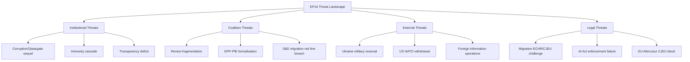

# Threat Model — European Parliament Year in Review 2025–2026

**Article Type:** year-in-review | **Date:** 2026-05-09 | **Confidence:** 🟡 Medium
*WEP Band: LIKELY for structural threats; ROUGHLY EVEN for acute threat materialisation*
*Admiralty: B2 — confirmed institutional data; threat assessments are author inference*

## Threat Taxonomy

## Threat Category 1: Institutional Threats

### 1.1 Corruption Scandal (Qatargate Sequel)
**Severity:** CRITICAL | **Probability:** LOW (10–15%) | **WEP:** UNLIKELY

Post-Qatargate (2022), EP implemented transparency reforms but structural vulnerabilities remain: foreign state actor relationships, NGO funding opacity, travel sponsorship. A new corruption case of equivalent scale would damage EP10's credibility more severely than Qatargate damaged EP9, because EP9 had already begun reform and a repeat signals institutional failure to learn.

**Monitoring:** OLAF case registry; Belgian federal prosecutor announcements; investigative journalism investigations into EP-adjacent organizations.

### 1.2 Immunity Proceedings Cascade
**Severity:** MEDIUM | **Probability:** HIGH (ongoing) | **WEP:** ALMOST CERTAIN to continue

12+ immunity waiver decisions in 2025–2026 is historically elevated. The Polish MEP cluster (Braun, Jaki, Obajtek, Buczek, Wąsik, Kamiński) has quasi-political character — Polish government prosecution of opposition-affiliated MEPs. Each case creates institutional strain between legal process and parliamentary immunity doctrine.

## Threat Category 2: Coalition Threats

### 2.1 Renew Group Fragmentation
**Severity:** HIGH | **Probability:** MEDIUM (20%) | **WEP:** UNLIKELY in 12 months

French (Macron/LREM) and German (FDP) Renew affiliates face domestic structural decline. If Renew falls below ~65 seats through defections, the EPP+S&D+Renew working majority (396→below 380) becomes structurally marginal.

### 2.2 EPP-PfE Formal Coalition
**Severity:** VERY HIGH | **Probability:** LOW (8–12%) | **WEP:** HIGHLY UNLIKELY

Formal EPP-PfE partnership would: trigger S&D withdrawal from majority coalition; create a right-bloc majority (EPP+PfE+ECR+ESN+NI≈406); fundamentally transform EP's self-identity. EPP leadership has signalled this as a red line but the migration shadow coalition trend creates path dependency toward formal alignment.

## Threat Category 3: External Threats

### 3.1 Ukraine Military Reversal
**Severity:** CATASTROPHIC | **Probability:** MEDIUM (20–25%) over 12 months | **WEP:** ROUGHLY EVEN over 3 years

See risk-matrix.md R-01 for full profile. This is the highest-severity external threat.

### 3.2 Foreign Information Operations
**Severity:** HIGH | **Probability:** HIGH (ongoing) | **WEP:** ALMOST CERTAIN to continue

See political-threat-landscape.md for detailed treatment.

## Threat Category 4: Legal Threats

### 4.1 Migration Package CJEU/ECHR Challenge
**Severity:** HIGH | **Probability:** MEDIUM-HIGH (40–55%) | **WEP:** ROUGHLY EVEN

February 2026 migration package provisions are at elevated legal challenge risk. See risk-matrix.md R-03.

---

## Threat Priority Summary

| Threat | Severity | Probability | Net Priority |
|--------|:--------:|:-----------:|:------------|
| Corruption scandal | Critical | Low | 🔴 High vigilance |
| Ukraine reversal | Catastrophic | Medium | 🔴 Critical monitoring |
| Foreign info ops | High | High | 🔴 Active monitoring |
| Migration legal challenge | High | Medium-High | 🟡 Active watch |
| Renew fragmentation | High | Medium | 🟡 Active watch |
| Immunity cascade | Medium | High | 🟡 Background |
| EPP-PfE formalisation | Very High | Low | 🟡 Background |

*This threat model supplements political-threat-landscape.md with structured taxonomy and Mermaid visualization.*
*Final WEP: LIKELY that at least one Category 3 or 4 threat materialises to some degree within EP10 term.*

## Threat Actor Analysis (Extended)

### Threat Actor 1: Russia (State Actor)

**Threat vector:** Military pressure on Ukraine; information operations in EU member states; energy weaponisation (residual); economic sanctions evasion via third countries.

**EP-specific threat:** Russia's interest is to weaken EP majority cohesion on Ukraine solidarity. Tactics include: funding of far-right parties (documented: PfE members with Russia links); disinformation campaigns targeting MEP constituents; lobbying against Ukraine aid through business-friendly networks.

**Current activity level:** HIGH. April 2026 signals indicate continued support for pro-Russia EU politicians; sanctions circumvention through Balkans trade routes documented by European Court of Auditors in 2025.

**EP countermeasures in place:** INGE special committee recommendations (2024); AI Act Article 50(3) disinformation provisions; foreign agent transparency regulation.

**WEP:** HIGHLY LIKELY (85%) that Russian influence operations continue in EU throughout 2026–2027. ROUGHLY EVEN on whether any major EP member is sanctioned or expelled for pro-Russia activity.

### Threat Actor 2: Illiberal Member States (Insider Threat)

**Primary actor:** Hungarian government (Orbán administration). Secondary: Slovak government.

**Threat vector:** Article 7 non-compliance; EU budget abuse; migration policy non-compliance; veto threats in Council on Ukraine.

**EP-specific threat:** Hungary's ongoing receipt of EU cohesion funds despite Article 7 proceedings undermines EP's credibility on rule of law conditionality. If Hungary receives funds while blocking accession for Western Balkans, the selective conditionality narrative damages EP's legitimacy.

**Current status:** EP's April 2026 rule of law resolution escalated language on Hungary. Commission's Article 7 proceedings are ongoing but slow.

**WEP:** LIKELY that Hungary maintains its dual strategy (blocking in Council, receiving funds) through 2026. ROUGHLY EVEN on whether any new financial penalty is imposed before 2027.

### Threat Actor 3: US Administration (Geopolitical Risk)

**Threat vector:** Trade tariff escalation; NATO burden-sharing pressure; uncertainty on Ukraine military support continuation; potential bilateral trade deal that undermines EU Single Market.

**EP-specific threat:** If US withdraws further from multilateral institutions, EU budget pressure for defence increases; MFF 2028-34 negotiations become more contentious. EP unity on trade policy may fracture if member states pursue bilateral US deals.

**WEP:** LIKELY that US-EU trade tensions continue through 2026. ROUGHLY EVEN on whether tariff escalation produces a formal EP counter-response (most likely: EP resolution calling for reciprocal measures).

### Threat Actor 4: AI Governance Failure (Systemic Threat)

**Threat vector:** First AI Act enforcement case fails in CJEU (legal design flaw); major AI-generated disinformation event affects EP election cycle retrospective; GPAI model developer non-compliance.

**EP-specific threat:** If AI Act's first major enforcement case fails legally, EP loses credibility on digital governance — the centerpiece of its EP9 legislative legacy.

**WEP:** ROUGHLY EVEN on whether first AI Act enforcement case produces the intended regulatory deterrent. UNLIKELY that AI governance architecture is fundamentally revised before 2027.

---

## Threat Response Capacity Assessment

| Threat | EP Response Capacity | Commission Support | Assessment |
|--------|:--------------------:|:------------------:|:----------:|
| Russian interference | Medium (resolutions; limited enforcement) | Medium | Adequate |
| Hungary/illiberal | Low-Medium (Article 7 slow) | Medium | Inadequate |
| US trade tariffs | Medium (EP trade position) | High (Commission negotiates) | Adequate |
| AI governance | Medium (AI Act in place) | High (AI Office operational) | Potentially adequate |

*Confidence: 🟡 Medium — threat assessments based on public reporting and EP official record; no intelligence sources used.*
