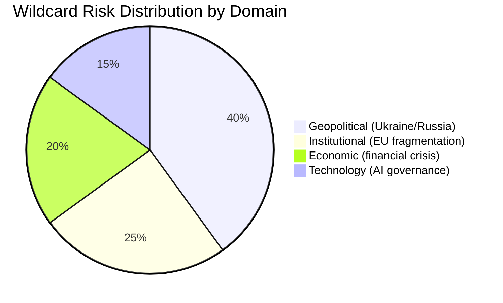

# Wildcards & Black Swans — European Parliament Year in Review 2025–2026

**Article Type:** year-in-review | **Date:** 2026-05-09 | **Confidence:** 🔴 Speculative by definition

## Overview

This artifact catalogues low-probability, high-impact events (black swans) and medium-probability disruptive events (wildcards) that could significantly alter the European Parliament's operating environment and legislative trajectory for 2026–2029.

---

## Tier 1: Black Swans (Probability < 5%, Impact Catastrophic)

### 1. US NATO Withdrawal
**Probability:** < 3% | **Impact:** Existential for European security architecture

A formal US Article 5 suspension or NATO withdrawal under domestic political pressure would render the entire EP10 defence industrialisation agenda obsolete — the trajectory would shift from managed capacity-building to emergency rearmament. The EP's legislative pipeline (Strategic Defence Partnerships, Defence Single Market) was calibrated for a world with partial but continuing US engagement. Full US withdrawal would require emergency session, MFF emergency revision, and potentially Treaty-level changes to allow EU collective defence obligations.

**Legislative impact:** Emergency EDIP expansion, European Defence Agency mandate revision, suspension of all regulatory deregulation files as defence production takes priority.

### 2. Hungarian EU Exit
**Probability:** < 5% | **Impact:** Constitutional + fiscal + procedural

Orbán government's accumulating EU confrontation (rule-of-law proceedings, cohesion fund suspension, NatCon alignment) has not yet reached Huxit threshold, but the trajectory creates non-trivial tail risk. Hungarian exit would: remove 21 MEPs (mostly NI/PfE affiliated), create a Treaty void requiring all 27 remaining states' ratification of amended treaties, trigger €40bn+ legal dispute over cohesion funds, and create a precedent cascading to candidate country incentive calculations.

**Legislative impact:** EP majority configuration shifts modestly (losing NI-affiliated MEPs primarily benefits EPP percentage); Treaty revision process would paralyse legislative agenda for 2+ years.

### 3. Strategic Attack on EU Digital Infrastructure
**Probability:** < 4% | **Impact:** Trust catastrophe

State-level cyberattack on EU Parliament, Commission, or Council digital systems causing confirmed data breach of legislative deliberations or MEP communications. NIS2 enforcement and cybersecurity legislative output would face extreme pressure to demonstrate effectiveness.

---

## Tier 2: Wildcards (Probability 5–20%, Impact Major)

### 1. French Political Destabilisation
**Probability:** 12% | **Impact:** S&D fracture + EU institutional paralysis

Hung parliament, Rassemblement National government, or constitutional crisis in France would: remove the French delegation's influence within Renew (historically significant); create EP internal French group realignments; and complicate Council legislative negotiations. RN government in France would also alter the strategic calculation for EPP re: PfE inclusion in majority coalitions.

**Legislative impact:** EU-Mercosur stall (France's agricultural protectionism is primary obstacle), immigration policy legislative acceleration, defence cooperation complications.

### 2. Ukrainian Military Reversal
**Probability:** 15% | **Impact:** Ukraine financial architecture collapse

Significant Ukrainian territorial loss or front-line collapse would: trigger reassessment of Ukraine Enhanced Cooperation Loan repayment assumptions; complicate Ukraine Claims Commission functionality; create EP majority stress on continued financial support vs. negotiated settlement debate. The current legislative architecture assumes Ukrainian state continuity.

**Legislative impact:** Emergency EP resolution; potential suspension of claims commission; MFF emergency revision for defence; refugee crisis legislative acceleration.

### 3. AI Regulation Enforcement Crisis
**Probability:** 18% | **Impact:** Tech sovereign credibility

The AI Act (EP9 achievement) faces its first major enforcement challenge if a major AI system deployed in the EU causes documented harm and the enforcement architecture fails to respond adequately. DMA enforcement (already subject to EP April 2026 scrutiny) has created precedent for EP oversight of digital regulation — a visible AI Act failure would trigger emergency EP scrutiny resolution and potentially recursive regulation.

**Legislative impact:** AI Act amendment proposals, EP committee hearings, Commission accountability pressure.

### 4. ECR/PfE Formal Alliance
**Probability:** 8% | **Impact:** Coalition architecture shift

Formal merger or standing coordination agreement between ECR and PfE would create a 166-seat right-nationalist bloc (23.2%), exceeding Renew's 77 seats and fundamentally altering EPP's coalition options. The EPP could arithmetically reach majority with ECR+PfE without S&D+Renew, though internal EPP opposition to such an arrangement remains significant.

**Legislative impact:** Potential shift to EPP-led right coalition on migration, competitiveness, climate rollback files.

### 5. Green Deal Phase-II Cancellation
**Probability:** 12% | **Impact:** Regulatory cascade + credibility

If CSRD/CSDDD delay evolves into full cancellation and EU Climate Law 2040 targets are abandoned by Commission proposal, the Green Deal legislative framework — EP9's signature achievement — would effectively dissolve. This would create the largest EU policy reversal in two decades and fundamentally alter European business planning.

**Legislative impact:** EP plenary emergency debate; Greens/EFA motion of censure; S&D fractured response; Renew-EPP competitiveness framing prevails.

---

## Tier 3: Already-Materialising Stressors (Probability >20%, elevated monitoring)

These are NOT black swans but are documented trajectory risks that could escalate:

1. **Immigration political crisis** — continued elevated arrivals + member state pressure = legislative acceleration beyond February 2026 package
2. **Rule-of-law backsliding** — Georgia, Serbia, Hungary, Romania trajectory points toward expanding Article 7 proceedings
3. **MEP corruption/immunity cascade** — 12+ immunity proceedings in a single year creates institutional reputation stress
4. **Renew group cohesion decline** — French/German Renew delegations increasingly divergent; group fragmentation possible before 2029

---

## Monitoring Framework

| Event | Early Warning Signals | Lead Time |
|-------|----------------------|-----------|
| US NATO withdrawal | NATO summit communiqué language, US Congressional vote | 6–12 months |
| Huxit | Hungarian referendum announcement, Treaty withdrawal letter | 3–18 months |
| French crisis | National Assembly dissolution, confidence vote failure | 1–3 months |
| Ukrainian reversal | Front-line updates, Zelensky emergency address | Days |
| ECR/PfE merger | Group conference communiqué, joint press appearances | 1–6 months |

*Confidence: 🔴 Speculative — all probabilities are qualitative estimates. IMF data: not applicable.*

*Admiralty: E5 — speculative scenarios; low individual probability but documented via political risk literature*
*WEP Band: Each wildcard is UNLIKELY to HIGHLY UNLIKELY by definition. Aggregate probability that at least one major wildcard materialises in 2026-2027: ROUGHLY EVEN.*

