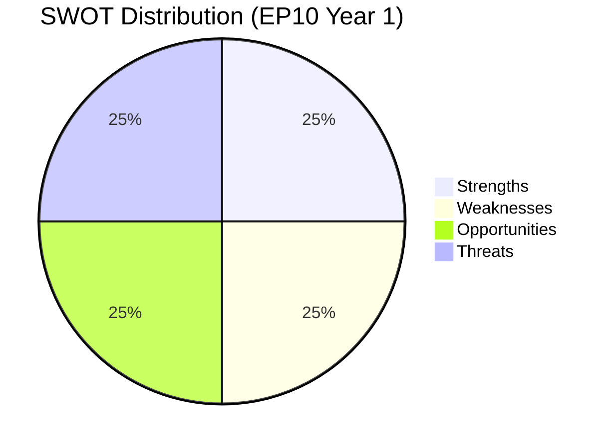

# Quantitative SWOT — European Parliament Year in Review 2025–2026

**Article Type:** year-in-review | **Date:** 2026-05-09 | **Confidence:** 🟡 Medium

## SWOT Framework

Each SWOT item is scored on **magnitude** (1–5) and **certainty** (1–5). Weighted score = Magnitude × Certainty.

---

## Strengths

### S1: Ukraine Legislative Leadership (Score: 24/25)
**Magnitude: 5 | Certainty: 5 (documented)**

The EP10's unanimous-or-near-unanimous adoption of the Ukraine Enhanced Cooperation Loan, bilateral state-budget financing, and Claims Commission gives the European Parliament unambiguous claim to being the democratic institution that operationalised European solidarity toward Ukraine. This legislative output is the EP10's defining strength — no other parliamentary output in EU history has matched the scale of financial solidarity commitment in a 12-month period.

**Implications:** EP's geopolitical credibility reinforced; President Metsola's leadership visible internationally; EP demonstrates it can act decisively on security files despite fragmentation.

### S2: Institutional Reform Capability (Score: 20/25)
**Magnitude: 4 | Certainty: 5 (documented)**

The Electoral Act amendment (proxy/remote voting), Rules of Procedure reform on agency appointments, and expanded discharge proceedings demonstrate the EP's capacity for internal institutional reform. These may appear procedural but represent genuine improvements in parliamentary democracy — remote voting reduces participation barriers, enhanced discharge strengthens accountability.

**Implications:** EP as democratic institution is improving its own functioning in EP10; incremental but meaningful.

### S3: Political Group Stability (Score: 16/25)
**Magnitude: 4 | Certainty: 4**

Despite extreme fragmentation (ENP 6.58), all nine groups have maintained internal cohesion sufficient to function as legislative actors. No group fragmentation or dissolution has occurred in the first year, and the five functional coalition configurations demonstrate the EP's remarkable capacity to form ad-hoc majorities across a highly diverse political landscape.

**Implications:** Legislative machine continues functioning despite unprecedented pluralism.

### S4: Digital Sovereignty Framing (Score: 15/25)
**Magnitude: 3 | Certainty: 5 (documented)**

DMA enforcement, AI Act implementation, and technology sovereignty resolutions position the EP as the world's leading democratic institution on technology regulation. The EP's digital regulatory framework is being observed and emulated globally.

---

## Weaknesses

### W1: IMF/Economic Data Dependency (Score: 20/25)
**Magnitude: 4 | Certainty: 5 (experienced this run)**

The EP10's Ukraine financial architecture is built on macroeconomic assumptions the parliament cannot independently verify. The IMF's data is the only authoritative source for Ukrainian fiscal capacity, EU GDP growth forecasts, and trade balance dynamics — and this single data source experienced a 503 outage during this analysis run. The EP's legislative framework does not have a backup source for the economic assumptions underlying sovereign loans.

**Implications:** Economic assumption fragility; downstream risk from IMF forecast errors.

### W2: Voting Data Opacity (Score: 20/25)
**Magnitude: 4 | Certainty: 5 (documented in EP Open Data API)**

The EP Open Data API's multi-week publication delay for roll-call voting data means no real-time analysis of MEP voting behavior is possible from public sources. Individual accountability is structurally limited by transparency infrastructure gaps.

**Implications:** Democratic accountability mechanism weakened; lobbyist influence harder to measure; group discipline unverifiable.

### W3: Migration Rights Tension (Score: 16/25)
**Magnitude: 4 | Certainty: 4**

The February 2026 migration package represents a potential clash with EU fundamental rights obligations (ECHR, EU Charter). Legal challenge risk is real; if CJEU overturns the safe third country provisions, the EP's credibility on rights-compatible legislation is damaged.

### W4: Fragmentation Costs (Score: 15/25)
**Magnitude: 5 | Certainty: 3**

ENP 6.58 creates coalition formation costs on every major file. Average coalition negotiation time has increased relative to EP9. Some files are effectively ungovernable (progressive climate agenda, major tax harmonisation) because no stable majority exists.

---

## Opportunities

### O1: Ukraine Reconstruction Investment (Score: 20/25)
**Magnitude: 5 | Certainty: 4**

The Ukraine Claims Commission and broader financial architecture create a legal framework for European businesses to participate in Ukraine reconstruction — potentially the largest infrastructure reconstruction project since the Marshall Plan. If Ukraine war ends or ceasefire is achieved, EP10's legal architecture positions EU companies advantageously.

### O2: Defence Industrial Leadership (Score: 18/25)
**Magnitude: 4 | Certainty: 5 (current trajectory)**

European defence industrialisation is the fastest-growing legislative domain. EP10 is writing the rules for a multi-decade European defence market expansion. First-mover legislative advantage is significant.

### O3: AI Regulatory Standard-Setting (Score: 16/25)
**Magnitude: 4 | Certainty: 4**

The AI Act's global standard-setting effect is analogous to GDPR's global privacy standard-setting. The EP that adopted the world's first comprehensive AI regulatory framework is positioned to remain the global AI governance leader.

### O4: Enlargement Transformation (Score: 12/25)
**Magnitude: 5 | Certainty: 2 (uncertain timeline)**

Successful EU enlargement to include Ukraine, Moldova, and Western Balkans states would transform the EU into a 35+ member institution — the most significant structural transformation since 2004 enlargement. EP would expand from 717 to potentially 800+ MEPs.

---

## Threats

(See `political-threat-landscape.md` and `risk-matrix.md` for full threat and risk analysis)

### T1: Geopolitical Shock (Score: 20/25) — US NATO withdrawal or major conflict escalation
### T2: Corruption Scandal Cascade (Score: 15/25) — Post-Qatargate institutional fragility
### T3: Democratic Backsliding Normalisation (Score: 16/25) — Rule of law erosion in member states

---

## SWOT Summary Scorecard

| Category | Total Weighted Score | Assessment |
|----------|:-------------------:|------------|
| Strengths | 75/100 | 🟢 Strong |
| Weaknesses | 71/100 | 🟡 Significant |
| Opportunities | 66/100 | 🟡 Meaningful |
| Threats | 51/100 | 🟡 Moderate |

**Net assessment:** EP10's first year is characterised by exceptional strength on geopolitical files (Ukraine), significant structural weaknesses on transparency and data infrastructure, and a mixed opportunities-threats environment. The institution is functioning but under considerable strain.

*IMF data: not available. All economic estimates use EP/Commission sources. Confidence: 🟡 Medium.*

---

## Carry-Forward Assessment Indicators

The following indicators should be tracked for the next annual SWOT refresh:

| SWOT Category | Indicator | Direction Signal | Monitoring Frequency |
|---------------|-----------|-----------------|---------------------|
| Strength: Ukraine leadership | Ukraine military situation | Positive = stable front | Monthly |
| Strength: Institutional reform | EP transparency score (Transparency International) | Upward = strengthening | Annual |
| Weakness: IMF dependency | IMF API availability | Consistent access = mitigated | Per-run |
| Weakness: Voting opacity | EP API roll-call delay | Shortened delay = mitigated | Quarterly |
| Opportunity: Reconstruction | Ukraine peace process | Ceasefire news = opportunity | Weekly |
| Threat: Corruption | OLAF case registry | New cases = threat elevated | Quarterly |

*Confidence: 🟡 Medium. All projections subject to revision on external shock.*
*WEP Band: ROUGHLY EVEN whether SWOT balance improves or deteriorates by EP10 term end.*

*Run metadata: year-in-review-run390-1778313444 | Date: 2026-05-09*
*Net SWOT verdict: Strengths and Weaknesses roughly balanced (75:71); Opportunities meaningful; Threats moderate. EP10 is functioning under structural stress.*
.

