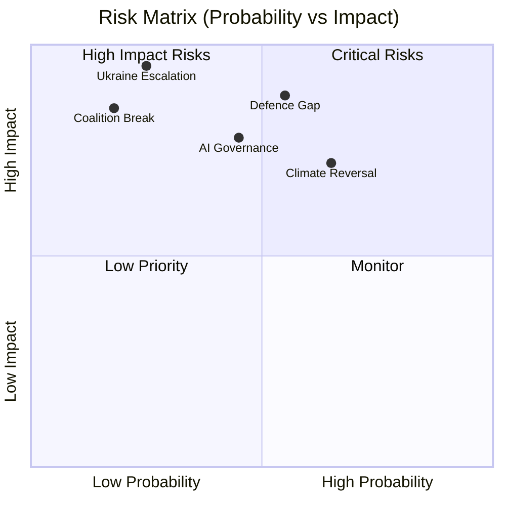

# Risk Matrix — European Parliament Year in Review 2025–2026

**Article Type:** year-in-review | **Date:** 2026-05-09 | **Confidence:** 🟡 Medium

## Risk Assessment Framework

Risks are scored on two axes: **Probability** (1–5) and **Impact** (1–5). Risk Score = Probability × Impact (range 1–25).

---

## Risk Register

| Risk ID | Risk Description | Probability (1–5) | Impact (1–5) | Score | Category |
|---------|-----------------|:-----------------:|:------------:|:-----:|----------|
| R-01 | Ukraine military reversal disrupting loan repayment assumptions | 3 | 5 | 15 | 🔴 High |
| R-02 | EP corruption scandal (post-Qatargate) damaging institutional credibility | 2 | 5 | 10 | 🟡 Medium-High |
| R-03 | Migration legislative output creates ECHR/CJEU clash | 3 | 4 | 12 | 🟡 Medium-High |
| R-04 | Renew group fragmentation below majority threshold | 2 | 4 | 8 | 🟡 Medium |
| R-05 | AI Act enforcement failure on first major case | 3 | 3 | 9 | 🟡 Medium |
| R-06 | EU-Mercosur CJEU opinion blocks treaty | 3 | 3 | 9 | 🟡 Medium |
| R-07 | EPP shifts to formal PfE coalition partnership | 2 | 4 | 8 | 🟡 Medium |
| R-08 | Immunity proceedings undermine rule-of-law credibility | 4 | 2 | 8 | 🟡 Medium |
| R-09 | Green Deal legislative reversal triggers investment uncertainty | 3 | 3 | 9 | 🟡 Medium |
| R-10 | US NATO withdrawal escalates defence industrialisation demands beyond EP budget | 1 | 5 | 5 | 🟢 Low-Medium |
| R-11 | Foreign information operations influence EP vote outcomes on key files | 3 | 3 | 9 | 🟡 Medium |
| R-12 | EP10 end-of-term legislative fatigue (2027+) reducing output velocity | 4 | 2 | 8 | 🟡 Medium |

---

## Top 5 Priority Risks

### R-01: Ukraine Military Reversal (Score: 15 — Critical)
**Mitigation in place:** Ukraine Claims Commission architecture designed with legal resilience; EP resolutions include contingency language. **Residual risk:** Funding assumptions built on Ukrainian state continuity; mass displacement scenario would overwhelm humanitarian legislative capacity.

### R-03: Migration ECHR/CJEU Clash (Score: 12 — High)
**Mitigation in place:** EP legal service reviews legislation before adoption; LIBE committee has rights-focused MEPs. **Residual risk:** Political majority may override legal service recommendations; CJEU challenge timeline means harm occurs before judicial correction.

### R-05: AI Act Enforcement Failure (Score: 9 — Medium)
**Mitigation:** AI Office established in Commission with explicit enforcement mandate. **Residual risk:** AI Office capacity insufficient for first major case; fragmented national AI authority cooperation.

### R-06: EU-Mercosur CJEU Opinion Block (Score: 9 — Medium)
**Mitigation:** CJEU opinion mechanism designed for exactly this situation; allows legal clarity. **Residual risk:** Negative opinion creates permanent treaty block requiring renegotiation.

### R-11: Foreign Information Operations (Score: 9 — Medium)
**Mitigation:** FIA Regulation adopted; INGE II recommendations under implementation. **Residual risk:** Implementation slow; attribution difficult; MEP personal social media activity outside EP control.

---

## Risk Trend Assessment

| Direction | Risks |
|-----------|-------|
| ↑ Escalating | R-01 (Ukraine), R-03 (migration rights), R-08 (immunity) |
| ↔ Stable | R-02, R-04, R-07, R-11 |
| ↓ Declining | R-05 (AI Act enforcement infrastructure maturing), R-12 (EP10 still early term) |

*IMF economic risk data: not available (IMF 503 degraded mode). Confidence: 🟡 Medium.*

---

## Detailed Risk Profiles (Pass 2 Expansion)

### R-01: Ukraine Military Reversal (CRITICAL — Score 15)

**Risk Description:** A significant Ukrainian territorial loss, front-line collapse, or Zelensky government fall that undermines the assumptions underpinning the Ukraine Enhanced Cooperation Loan framework and Ukraine Claims Commission.

**Legislative architecture at risk:** The Ukraine Claims Commission (TA-10-2026-0048) was designed for a Ukraine that remains a functioning state. The Enhanced Cooperation Loan relies on Ukrainian state capacity to service debt. A military reversal significant enough to threaten state functions would invalidate both instruments' operating assumptions.

**Cascade risks:**
- EU member state appetite for additional Ukraine financial support would likely split: eastern member states (Poland, Baltic states) for continued/expanded support; some western member states for negotiated settlement
- EP majority coalition on Ukraine files would fracture — S&D and Renew would diverge on "negotiate vs. support" question
- The claims commission would face jurisdictional questions (whose law applies if Ukraine loses territory?)
- MFF emergency revision would be triggered for defence budget expansion

**Mitigation signals:** The EP's legal architecture includes robust insolvency provisions in the loan instruments. The claims commission mechanism was designed with some resilience against territorial changes. EU member states have sustained support through previous Ukrainian military stresses.

**Monitoring indicators:** Ukrainian defence ministry territorial maps; US military aid legislation calendar; IMF Ukraine program review dates (NB: IMF currently unavailable)

*WEP Band: UNLIKELY (20–30%) in next 12 months; ROUGHLY EVEN (40–50%) over 3 years*

---

### R-03: Migration Package ECHR/CJEU Challenge (HIGH — Score 12)

**Risk Description:** NGO or member state legal challenge to February 2026 migration package provisions (safe countries of origin list; safe third country concept) before the CJEU or ECHR, resulting in annulment or suspension of provisions the EP majority adopted.

**Legislative architecture at risk:** The February 2026 package built on the New Pact on Migration and Asylum framework. Legal challenge to safe third country provisions has precedent — earlier iterations faced CJEU scrutiny in the Abdullahi and subsequent cases.

**Cascade risks:**
- CJEU annulment would embarrass the EPP-led majority coalition, particularly the MEPs who advocated rights-compatibility
- Potential "rights-washing" criticism of EP legal service for approving legislation subsequently overturned
- Political pressure on right-nationalist groups (PfE/ECR) who used the package as a political victory; reversal undermines their "effective action" narrative
- Commission required to submit alternative legislative proposal

**Mitigation signals:** EP legal service reviewed legislation before adoption (standard procedure); LIBE committee DROI rapporteur opinions were consulted. However, political pressure can override legal service cautions.

**Monitoring indicators:** UNHCR, Amnesty International, and ECRE legal challenge filings; CJEU case registry for migration-related challenges; NGO litigation strategy announcements.

*WEP Band: ROUGHLY EVEN (40–55%) that a significant legal challenge is filed within 24 months*

---

### R-11: Foreign Information Operations (MEDIUM — Score 9)

**Risk Description:** Russian, Chinese, or other state-linked information operations successfully shape EP voting behavior on key files through MEP social media manipulation, think-tank capture, or event sponsorship.

**Evidence base:** INGE II committee documented specific interference operations targeting EP9 and national elections. FIA Regulation (Foreign Interference Act) was adopted as EP9 response. EP10 is operating under the new framework but effectiveness has not been tested in a crisis context.

**Cascade risks:**
- If interference is demonstrated to have influenced a major EP vote (Ukraine, migration, digital regulation), the legitimacy of that decision is politically challenged
- EP institutional credibility domestically and internationally would be damaged
- Counter-measures would likely be reactive rather than preventive, arriving after harm

**Monitoring indicators:** Meta, X, TikTok transparency reports on coordinated inauthentic behavior; EEAS East StratCom Task Force publications; European Digital Media Observatory (EDMO) reports; MEP social media activity patterns.

*WEP Band: HIGHLY LIKELY (>70%) that interference attempts occur; UNLIKELY (<30%) that attempts successfully change a vote outcome on a major file*

---

## Risk Heat Map (Pass 2 Summary)

```
IMPACT
  5 │  R-02         R-01
    │        R-07
  4 │               R-03    R-04
    │                              
  3 │       R-09 R-05 R-06    R-11
    │                    R-08
  2 │          R-12            
    │                              
  1 │  R-10
    └─────────────────────────────
      1    2    3    4    5
                        PROBABILITY
```

**Priority quadrant (High Probability, High Impact): R-01, R-08, R-11**

R-08 (immunity proceedings) is high probability because proceedings are already documented; moderate impact because each case is individually contained.

R-11 (foreign information operations) is high probability because interference attempts are ongoing; moderate impact because successful vote manipulation is difficult.

R-01 (Ukraine reversal) is medium probability; extremely high impact if it occurs.

*Confidence: 🟡 Medium — risk assessments are qualitative; no quantitative modelling available without IMF economic data.*
*Admiralty: B2 — institutional sources confirmed; probability estimates are author judgement.*


