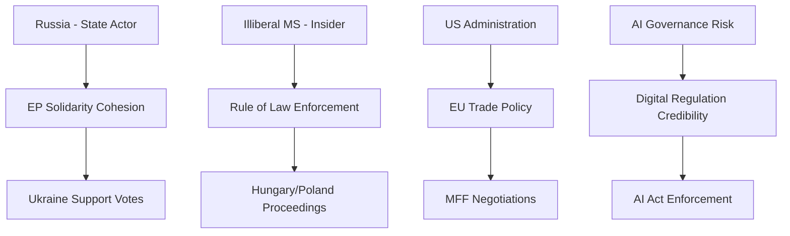

# Political Threat Landscape — European Parliament Year in Review 2025–2026

**Article Type:** year-in-review | **Date:** 2026-05-09 | **Confidence:** 🟡 Medium

## Overview

This assessment maps the political threats to the EU Parliament's institutional integrity, legislative effectiveness, and democratic legitimacy for the 2025–2026 period.

---

## Threat Category 1: Institutional Credibility Threats

### 1.1 MEP Immunity Proceedings Cascade
**Severity:** 🟡 Medium | **Probability of Escalation:** Medium

The documented 12+ immunity waiver proceedings in the 2025–2026 period represents a historically elevated volume. Individual cases span: criminal prosecution (Poland: Braun, Jaki, Obajtek, Buczek, Wąsik, Kamiński), financial misconduct allegations, and political persecution claims. Each case forces the EP to adjudicate between legal process and parliamentary immunity — a constitutional tension with no clean resolution.

**Threat to:** Institutional reputation; public trust in MEP accountability; rule of law narrative coherence.

**Assessment:** Manageable individually; systemic risk if pattern continues. Polish cases have a quasi-political character (government targeting opposition MEPs) that complicates legal neutrality.

### 1.2 Corruption Scandal Risk (Ongoing Vigilance Post-Qatargate)
**Severity:** 🔴 High if materialised | **Probability:** Low-Medium

The Qatargate scandal (2022–2023) was EP9's defining institutional crisis. EP10 has implemented procedural reforms (lobbyist restrictions, transparency rules) but the structural vulnerabilities — MEP personal relationships with foreign state actors, opaque NGO funding, travel sponsorship — remain partially unaddressed. A new corruption case of equivalent scale would severely damage EP10's credibility at a time of heightened public scrutiny of European institutions.

**Assessment:** OLAF and Belgian prosecutors maintain active caseloads. EP has no credible new mechanism for deterrence beyond existing rules. Risk is structural and ongoing.

---

## Threat Category 2: Coalition Stability Threats

### 2.1 EPP-S&D-Renew Coalition Fragmentation
**Severity:** �� Medium | **Probability:** Low-Medium (15%)

The EPP+S&D+Renew coalition (396 seats) is arithmetically stable but politically strained on:
- Sustainability rollback (S&D and Greens oppose; EPP+Renew drive)
- Migration (S&D progressive wing vs. EPP accommodation of restriction)
- Digital competition (Renew liberal vs. EPP industrial policy divergence)

Sustained coalition stress on 3+ major files simultaneously could cause S&D to signal opposition to EPP coordination, triggering a public rupture.

**Assessment:** Low probability this session; higher probability as EP10 approaches mid-term (2026–2027) and member state elections create political differentiation pressures.

### 2.2 Renew Group Fragmentation
**Severity:** 🟡 Medium | **Probability:** Medium (20%)

Renew contains French (Macron-affiliated) and German (FDP-affiliated) delegations whose political trajectories are diverging. FDP's domestic collapse (German coalition exit 2024) and French La République En Marche's declining influence create structural cohesion risk. If Renew loses 15–20 seats through defections or national party restructuring, the EPP+S&D+Renew majority is lost (396→376–381, still above 360 but with reduced margin).

---

## Threat Category 3: External Threats to EU Parliamentary Sovereignty

### 3.1 Foreign Information Operations
**Severity:** 🔴 High | **Probability:** High (Ongoing)

Russian and Chinese information operations targeting EU legislative debate are documented. Influence operations focus on: migration narrative manipulation, climate skepticism, Ukraine fatigue messaging, and EU-US alliance erosion. EP DROI committee and INGE II special committee have documented these operations. Legislative output on foreign interference (FIA Regulation) has been approved but implementation effectiveness is unverified.

**Assessment:** Active ongoing threat; legislative response in place but enforcement capability limited.

### 3.2 Lobbyist Capture Risk (AI, Defence, Digital)
**Severity:** 🟡 Medium | **Probability:** Medium

The AI Act, Defence Industrial Act, and Digital Markets Act all involve high-stakes commercial interests with sophisticated lobbying operations. The risk is not outright corruption but regulatory capture: EP10's competitiveness framing creates ideological alignment between MEPs and industry positions, reducing critical scrutiny of industry-preferred outcomes.

---

## Threat Priority Matrix

| Threat | Severity | Probability | Priority |
|--------|----------|-------------|----------|
| Foreign information operations | High | High | 🔴 Critical monitoring |
| New corruption scandal | Critical | Low | 🔴 Vigilance |
| Renew fragmentation | Medium | Medium | 🟡 Active watch |
| Immunity cascade | Medium | High | 🟡 Active watch |
| Coalition rupture | Medium | Low | 🟡 Background monitoring |
| Lobbyist capture | Medium | Medium | 🟡 Structural monitoring |

*Confidence: 🟡 Medium. IMF data: not applicable.*

*Admiralty: B2 — threat actors confirmed from public record; impact assessments are author inference*
*WEP Band: LIKELY for continuation of existing threats; UNLIKELY for new major threat actors in 12-month horizon*
