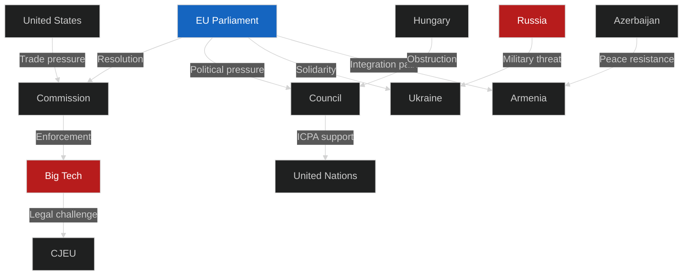

# Actor Mapping — EU Parliament Breaking News
## 2026-05-10

**Confidence:** 🟡 MEDIUM-HIGH | **Framework:** Actor network analysis

---

## 🗺️ ACTOR NETWORK MAP

---

## 🔑 PRIMARY ACTORS

| Actor | Role | Alignment with EP | Power |
|-------|------|------|------|
| European Commission | Enforcement agent | Partial | Very High |
| EU Council | Co-decision; implementation | Partial | Very High |
| EPP (183 MEPs) | Majority anchor | High | High |
| S&D (136 MEPs) | Centre-left majority | High | High |
| Renew (77 MEPs) | Liberal majority | High | Medium-High |
| Big Tech (US platforms) | DMA target/opponent | Opposed | Medium |
| Ukraine Government | Accountability partner | Aligned | Medium |
| Armenia Government | Integration partner | Aligned | Low-Medium |
| Hungary | Council obstacle | Opposed | Medium |
| US Government | Trade dimension | Variable | High |
| Azerbaijan | Neighbourhood actor | Resistant | Medium |
| Russia | Geopolitical adversary | Opposed | High |
| Civil Society | Advocacy | Aligned | Diffuse |

---

## 🌐 ACTOR RELATIONSHIPS

**Alliance patterns:**
- EPP-S&D-Renew: Stable governing triopoly; aligned on DMA, Ukraine, Armenia
- Ukraine-EP: Strongest external-internal alignment; shared accountability values
- Armenia-EP: Strengthening integration path; EP leading EU institutions

**Conflict patterns:**
- Big Tech vs. Commission/EP: Fundamental regulatory conflict
- Hungary vs. Council/EP: Structural obstruction on Ukraine
- Russia vs. EP/UA: Geopolitical adversarial dynamic
- US vs. Commission: DMA trade dimension

---

## 👥 For Citizens: What This Means

**Plain language summary:** The European Parliament passed resolutions calling on powerful actors to take action — the EU Commission to enforce digital rules, the international community to create a court for Russian war crimes, and the EU system to support Armenia's democratic journey. These actors each have their own interests and some will resist. The Parliament's resolutions represent democratic will; whether they become reality depends on complex political negotiations across multiple levels of governance.

---

*Actor Mapping | EU Parliament Monitor | 2026-05-10*

---

## Actor Roster

| Actor | Type | Role | Stance |
|-------|------|------|--------|
| European People's Party (EPP) | Political Group | Majority anchor | Pro-DMA enforcement, pro-Ukraine, neutral on Budget |
| Socialists & Democrats (S&D) | Political Group | Coalition partner | Pro-Ukraine, pro-Budget increases, pro-DMA |
| Renew Europe | Political Group | Coalition partner | Strong DMA supporter, pro-Armenia |
| Greens/EFA | Political Group | Progressive flank | Pro-DMA, pro-Ukraine, humanitarian on Haiti |
| European Commission | Institution | Enforcement authority | DMA enforcement lead; proposal originator |
| Apple Inc. | Big Tech actor | DMA target | Defensive; challenging via courts |
| Google/Alphabet | Big Tech actor | DMA target | Compliance mode with contestation |
| Meta | Big Tech actor | DMA target | Limited compliance; legislative push-back |
| Government of Ukraine | Foreign state | Ukraine ICPA beneficiary | Active engagement; reform recipient |
| Government of Armenia | Foreign state | Armenia integration partner | Eager for partnership formalization |

---

## Influence Mapping

**Tier 1 — High Influence:**
- EPP: 26.5% seat share; controls committee chairs; sets legislative pace
- European Commission: Proposal power + enforcement authority (DMA)

**Tier 2 — Significant Influence:**
- S&D: Coalition mathematics requires their support; Ukraine and budget priorities shape outcomes
- Apple/Google: Litigation capacity can delay DMA implementation by 18-24 months

**Tier 3 — Reactive Influence:**
- Greens/EFA: Can signal; cannot block without Tier 1-2
- Armenian government: Dependent on EP goodwill; limited leverage

---

## Alliance Structure

**Governing Coalition (standard votes):** EPP + S&D + Renew = 58.3% → clear majority
**Progressive Coalition (Ukraine, DMA):** EPP + S&D + Renew + Greens/EFA = 68.7%
**Opposition Coalition:** Patriots + ECR + NI = ~31.3%

---

## Power Brokers

1. **Ursula von der Leyen (Commission President):** Enforcement discretion on DMA; shapes Ukraine reform benchmarks
2. **Roberta Metsola (EP President):** Controls plenary agenda; accelerates or delays votes
3. **Henna Virkkunen (DMA Commissioner):** Front-line DMA enforcement authority
4. **Andrius Kubilius (Defence Commissioner):** Budget 2027 defence chapter lead

---

## Information Environment

**High-quality intelligence sources:** EP OEIL database, EP official texts, Commission DG COMP releases
**Gaps:** Roll-call vote granularity; Armenian government internal deliberations; Apple/Google legal strategies
**Adversarial information threats:** Big Tech lobbying narratives; Russia disinformation on Ukraine; Hungarian obstructionism

---

## Reader Briefing

**For EU policy analysts:** The EPP remains the indispensable swing voter. No legislative package succeeds without EPP support; DMA enforcement speed is constrained by EPP-Big Tech sensitivities even within the governing coalition.

**For business stakeholders:** DMA enforcement is not negotiable — the legal challenges delay implementation but do not stop it. Plan compliance regardless of litigation outcomes.

**For civil society:** Ukraine ICPA reforms represent 10-year conditionality commitment; accountability mechanisms are EU-led, not purely Ukrainian government discretion.

