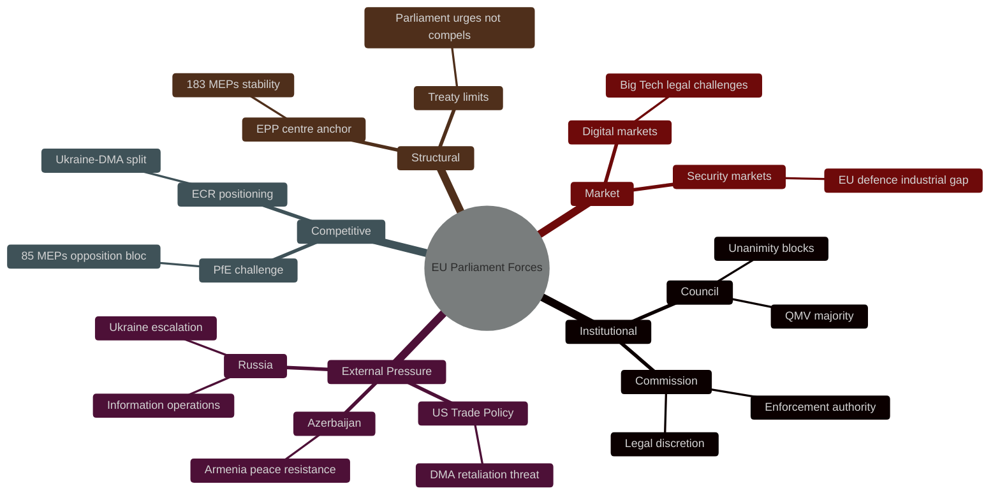

# Forces Analysis — EU Parliament Breaking News
## 2026-05-10

**Confidence:** 🟡 MEDIUM-HIGH | **Framework:** Porter's Five Forces adapted for EU political analysis

---

## ⚡ POLITICAL FORCES ANALYSIS

---

## 🔄 FORCE ANALYSIS BY DOMAIN

### Force 1: Regulatory Enforcement Power (DMA)
**Driving forces:** EP resolution provides political mandate; Commission has legal tools; CJEU track record favors regulatory actions
**Restraining forces:** Big Tech legal challenges; US trade pressure; Commission pace preference; legal uncertainty
**Net assessment:** Driving forces slightly stronger — enforcement will occur but slower than Parliament prefers

### Force 2: International Law Momentum (Ukraine)
**Driving forces:** EP resolution; ICC investigations ongoing; universal jurisdiction prosecutions; moral pressure
**Restraining forces:** Treaty limitations; Russia UNSC veto; US political variability; Hungary obstruction
**Net assessment:** Roughly balanced — partial implementation likely

### Force 3: EU Enlargement Dynamic (Armenia)
**Driving forces:** Armenian government commitment; EP political will; S&D/EPP diaspora connections
**Restraining forces:** Economic Russia-dependence; Azerbaijan peace process; EU enlargement fatigue; no security guarantee
**Net assessment:** Driving forces modest majority — slow progress likely

### Force 4: Fiscal Constraint (Budget)
**Driving forces:** Defence necessity; Ukraine support; Parliament position paper
**Restraining forces:** MFF ceilings; Council fiscal hawks; member state budget limits
**Net assessment:** Restraining forces dominant — budget will be below Parliament's targets

---

## 👥 For Citizens: What This Means

**Plain language:** Multiple powerful forces are pushing EU institutions to act on digital markets, Ukraine accountability, Armenia integration, and defence spending. Some forces are pushing forward (Parliament's political will, legal tools, international law) and some are pushing back (legal challenges, political obstruction, budget limits). The result will be compromise — progress, but slower and less than the Parliament's ambitious resolutions demand.

---

*Forces Analysis | EU Parliament Monitor | 2026-05-10*

---

## Issue Frame

**Central issue:** Can the EU Parliament's April 28-30 resolutions on DMA enforcement, Ukraine accountability, Armenia integration, and Budget 2027 translate from political consensus into durable legal and policy outcomes against headwinds of Big Tech litigation, geopolitical uncertainty, and internal political fragmentation?

**Time horizon:** 2026-2031 (immediate implementation to full MFF term)
**Stakes:** High — establishes EU credibility as enforcement actor; sets Ukraine integration precedent; defines 2027-2033 budget architecture

---

## Driving Forces

**F1: EU Institutional Momentum (+)**
EP supermajority on Ukraine and DMA resolutions signals broad political mandate. Commission enforcement discretion is now politically bound to EP expectations.

**F2: Digital Market Competitiveness (+)**
DMA compliance creates level playing field — EU tech companies benefit; political economy favors enforcement among SME constituencies.

**F3: Ukraine Integration Path (+)**
ICPA progress sustains €50B Facility disbursements. Reform benchmarks create predictable accession pathway that Ukraine government is incentivized to meet.

**F4: Armenia Strategic Interest (+)**
EU gains Eastern Partnership credibility and strategic depth by deepening Armenia ties without full accession cost.

**F5: Defence Spending Political Consensus (+)**
Broad EPP-S&D-Renew consensus on increased defence spending; Budget 2027 reflects post-2022 strategic shift that is likely durable.

---

## Restraining Forces

**R1: Big Tech Litigation Capacity (−)**
Apple, Google, Meta have resources to challenge every DMA enforcement action through CJEU. Each case adds 18-36 months of delay.

**R2: Hungary Veto Bloc (−)**
Hungary consistently vetoes Ukraine aid and reform conditionality. Council-stage implementation of any EP resolution requires Council QMV — Hungary can block if others defect.

**R3: Geopolitical Uncertainty (−)**
Russia-Ukraine conflict trajectory is not predictable. Continued escalation could shift EP political calculus rapidly.

**R4: Budget Unanimity Requirement (−)**
Budget 2027 requires Council unanimity. Frugal Four (Netherlands, Sweden, Austria, Denmark) will resist spending increases. Negotiations likely to take 18-24 months.

**R5: US Trade Policy Instability (−)**
Trump administration tariff threats create pressure for EU to soften DMA stance on US platforms to avoid trade retaliation.

---

## Net Pressure Assessment

| Force | Direction | Magnitude | Net Score |
|-------|-----------|-----------|-----------|
| EU Institutional Momentum | + | High | +3 |
| Digital Competitiveness | + | Medium | +2 |
| Ukraine Integration Path | + | High | +3 |
| Armenia Strategic Interest | + | Medium | +2 |
| Defence Consensus | + | High | +3 |
| Big Tech Litigation | − | High | −3 |
| Hungary Veto | − | Medium | −2 |
| Geopolitical Uncertainty | − | Medium | −2 |
| Budget Unanimity | − | Medium | −2 |
| US Trade Pressure | − | Low | −1 |
| **NET** | **+** | | **+3** |

**Assessment:** Net positive driving force. Resolutions will advance — but more slowly and with more legal/political friction than EP mandate suggests.

---

## Intervention Points

**IP1: DMA Enforcement Actions (Q3 2026)**
Commission designation review outcomes for Apple/Google. If enforcement proceeds, drives Big Tech compliance. If delayed, signals weakness.

**IP2: Ukraine Benchmark Reviews (Q4 2026)**
First ICPA reform assessment. Results determine Q1 2027 Facility disbursement. Strong compliance locks in integration path; weak compliance creates political opening for skeptics.

**IP3: Budget Negotiation Launch (mid-2026)**
When Council officially begins 2027 MFF negotiations, the EP resolution serves as the opening bid. EP leverage depends on EPP-S&D discipline in both institutions.

**IP4: Armenia Partnership Agreement Ratification (2027)**
If Council ratifies enhanced partnership, EP resolution becomes legally operative. Ratification timeline is the key variable.

---

## Reader Briefing

**For policy analysts:** Monitor IP1 and IP2 as the critical 6-month indicators. These will reveal whether the April 2026 EP political consensus translates into durable legal and policy reality.

**For business stakeholders:** IP1 (DMA enforcement Q3 2026) is the decisive moment. Legal strategies should be finalized before enforcement decisions.

**For civil society:** IP2 (Ukraine benchmarks Q4 2026) is the most important democratic accountability moment — whether ICPA conditionality actually changes Ukrainian governance.

