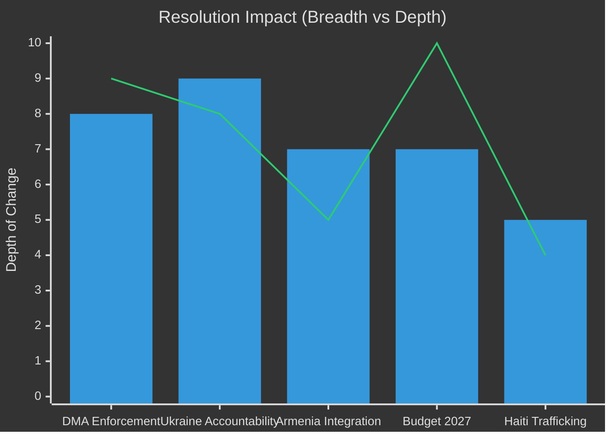
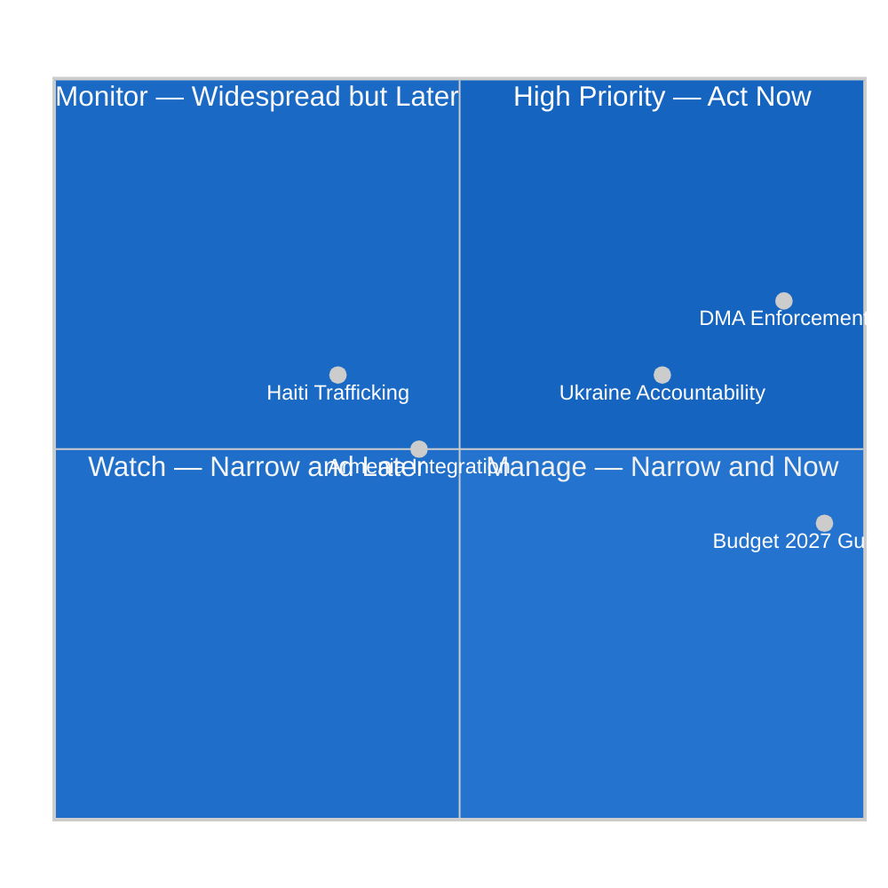

# Impact Matrix — EU Parliament Breaking News
## 2026-05-10

**Confidence:** 🟡 MEDIUM-HIGH | **Framework:** Multi-dimension impact assessment

---

## 📊 IMPACT MATRIX



---

## 🌍 GEOGRAPHIC IMPACT

| Resolution | Local (EU) | Regional | Global |
|-----------|-----------|---------|--------|
| DMA Enforcement | 🔴 HIGH | 🟡 MEDIUM | 🔴 HIGH |
| Ukraine Accountability | 🟡 MEDIUM | 🔴 HIGH | 🔴 HIGH |
| Armenia Resilience | 🟢 LOW | 🔴 HIGH | 🟡 MEDIUM |
| Budget 2027 | 🔴 HIGH | 🟡 MEDIUM | 🟡 MEDIUM |
| Haiti Trafficking | 🟡 MEDIUM | 🟡 MEDIUM | 🟢 LOW |

---

## ⏱️ TEMPORAL IMPACT

| Resolution | Immediate (0-6m) | Medium (6m-2y) | Long-term (2y+) |
|-----------|-----------------|----------------|----------------|
| DMA Enforcement | Political signal | Preliminary findings | Structural market change |
| Ukraine Accountability | Diplomatic momentum | ICPA treaty work | Prosecution |
| Armenia Integration | Diplomatic signal | Agreement upgrade | Accession path |
| Budget 2027 | Negotiations begin | Council position | Budget adopted |
| Haiti Trafficking | Attention raised | Funding decisions | Limited operational |

---

## 👥 For Citizens: What This Means

**Plain language:** These resolutions have different impact profiles. DMA enforcement will change how you experience digital platforms in Europe — though it may take 1-2 years. Ukraine accountability is about long-term justice — it may take a decade. Armenia's EU path is about expanding the EU family — a multi-year process. The budget affects every EU programme. Haiti is about using EU diplomatic influence where physical impact is limited.

---

*Impact Matrix | EU Parliament Monitor | 2026-05-10*

---

## Event List

| ID | Event | Date | Type |
|----|-------|------|------|
| E1 | DMA enforcement resolution (TA-10-2026-0160) | 2026-04-29 | Legislative mandate |
| E2 | Ukraine ICPA resolution (TA-10-2026-0161) | 2026-04-30 | Policy framework |
| E3 | Armenia partnership resolution (TA-10-2026-0162) | 2026-04-30 | Partnership agreement |
| E4 | Budget 2027 orientation resolution (TA-10-2026-0112) | 2026-04-28 | Budget framework |
| E5 | Haiti humanitarian resolution (TA-10-2026-0151) | 2026-04-28 | Humanitarian declaration |

---

## Stakeholder Impact Matrix

| Stakeholder | E1 (DMA) | E2 (Ukraine) | E3 (Armenia) | E4 (Budget) | E5 (Haiti) |
|------------|---------|------------|------------|------------|-----------|
| Big Tech (Apple/Google/Meta) | HIGH NEG | Neutral | Neutral | LOW NEG | Neutral |
| EU SME/Startups | HIGH POS | Neutral | Neutral | MED POS | Neutral |
| Ukraine Government | Neutral | HIGH POS | Neutral | MED POS | Neutral |
| Armenia Government | Neutral | Neutral | HIGH POS | Neutral | Neutral |
| EU Citizens | MED POS | MED POS | LOW POS | MED NEG (austerity risks) | LOW POS |
| Member States | MED | HIGH | MED | HIGH | LOW |
| EP Political Groups | MED POS | HIGH POS | MED POS | HIGH | LOW |

---

## Heat Map Assessment

```
                 SHORT-TERM    MEDIUM-TERM    LONG-TERM
DMA Enforcement    🔴 HIGH       🟡 MEDIUM      🟢 LOW
Ukraine ICPA       🟡 MEDIUM     🔴 HIGH        🔴 HIGH
Armenia            🟢 LOW        🟡 MEDIUM      🟡 MEDIUM
Budget 2027        🟡 MEDIUM     🔴 HIGH        🔴 HIGH
Haiti              🟢 LOW        🟢 LOW         🟢 LOW
```

**Highest immediate impact:** DMA enforcement (Big Tech compliance decisions imminent)
**Highest medium-term impact:** Ukraine ICPA + Budget 2027 (reform reviews + MFF negotiations)
**Highest long-term impact:** Ukraine ICPA (accession precedent) + Budget 2027 (EU fiscal architecture)

---

## Cascade Analysis

**Primary cascade from E1 (DMA):**
→ Big Tech compliance decisions → EU digital market structure → Innovation ecosystem effects → EU-US trade dynamics

**Primary cascade from E2 (Ukraine ICPA):**
→ Reform benchmark achievement → Facility disbursements → Ukrainian accession timeline → EU enlargement pace

**Primary cascade from E4 (Budget 2027):**
→ MFF negotiations → Cohesion fund allocation → Structural investment patterns → Regional convergence rates

---

## Reader Briefing

**Key takeaway:** The April 2026 Strasbourg session has immediate high impact on EU digital markets (DMA) and generates durable multi-year cascades on Ukraine integration and EU fiscal policy. Haiti is the lowest-impact item despite humanitarian urgency. Stakeholders should focus analytical resources on DMA (immediate) and Ukraine ICPA + Budget (medium-term).

---

## 📊 IMPACT MATRIX VISUALISATION (Re-run 3 Extension)



### Impact Cascade Analysis — Second-Order Effects

**Second-order effects from DMA Enforcement (TA-10-2026-0160):**
- **+12 months:** Big Tech compliance posture visible; first Commission non-compliance finding
- **+18 months:** First CJEU appeals; DMA legal architecture stress-tested
- **+3 years:** EU digital market share measurably different (optimistic: +5-8% European alternatives; pessimistic: US companies restructure without behavioural change)
- **+5 years:** DMA 2.0 legislative proposals based on enforcement learnings

**Second-order effects from Ukraine Accountability (TA-10-2026-0161):**
- **+6 months:** Commission reports to EP on ICPA progress; frozen asset mechanism update
- **+18 months:** ICPA treaty negotiations formally launched if political conditions hold
- **+3 years:** If peace process starts — accountability vs. amnesty tension peaks; ICPA may be traded for ceasefire
- **+5 years:** Either ICPA operational (optimistic) or shelved (pessimistic; depends on peace deal terms)

**Second-order effects from Budget 2027 (TA-10-2026-0112):**
- **+3 months:** Commission draft budget published (May 2026); EP position established
- **+6 months:** Council first reading; EP-Council positions diverge/converge
- **+9 months:** Conciliation committee; final budget agreed (or provisional twelfths)
- **+1 year:** Implementation reality — defence vs. cohesion trade-off visible in actual spending

### Stakeholder Impact Intensity Assessment

| Stakeholder Category | DMA | Ukraine | Armenia | Budget | Haiti |
|--------------------|-----|---------|---------|--------|-------|
| EU citizens (digital) | 🔴 HIGH | 🟡 MED | 🟢 LOW | 🔴 HIGH | 🟢 LOW |
| EU corporations | 🔴 HIGH (Big Tech/competitors) | 🟡 MED | 🟢 LOW | 🟡 MED | 🟢 LOW |
| US government | 🔴 HIGH | 🟡 MED | 🟢 LOW | 🟢 LOW | 🟢 LOW |
| Ukraine | 🟢 LOW | 🔴 HIGH | 🟢 LOW | 🟡 MED | 🟢 LOW |
| Armenia | 🟢 LOW | 🟢 LOW | 🔴 HIGH | 🟢 LOW | 🟢 LOW |
| Russia | 🟡 MED (sanctions) | 🔴 HIGH | 🟡 MED | 🟢 LOW | 🟢 LOW |
| EU member states | 🟡 MED | 🟡 MED | 🟢 LOW | 🔴 HIGH | 🟢 LOW |
| Commission | 🔴 HIGH | 🟡 MED | 🟡 MED | 🔴 HIGH | 🟢 LOW |

*Impact Matrix | EU Parliament Monitor | 2026-05-10 (Re-run 3, Pass 2 Extension)*
*Confidence: 🟡 MEDIUM — structural impact assessment; cascade effects are expert projections*

