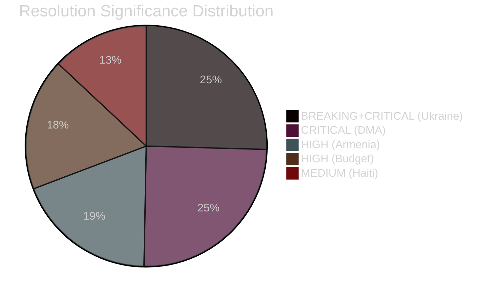

# Significance Classification — EU Parliament Breaking News
## 2026-05-10

**Confidence:** 🟡 MEDIUM-HIGH | **Framework:** EU Parliament Monitor classification taxonomy

---

## 🏷️ CLASSIFICATION TAXONOMY

Categories: **BREAKING** | **CRITICAL** | **HIGH** | **MEDIUM** | **ROUTINE**

---

## 📋 RESOLUTION CLASSIFICATIONS

### TA-10-2026-0160: DMA Digital Markets Enforcement
**Classification:** 🔴 CRITICAL

**Rationale:** Represents Parliament's most explicit call for accelerated DMA enforcement targeting specific platforms. The resolution: (1) names specific enforcement timelines; (2) threatens Commission accountability mechanisms; (3) involves major US-EU trade dimension; (4) sets precedent for democratic accountability of AI-era digital regulation. Qualitative escalation from prior monitoring resolutions. Not BREAKING because it doesn't represent a sudden event — it is a deliberate resolution on ongoing proceedings.

---

### TA-10-2026-0161: Ukraine War Crimes Accountability
**Classification:** 🔴 BREAKING + CRITICAL

**Rationale:** The ICPA operationalisation language represents a genuinely new institutional development — Parliament calling for a specific new international court mechanism that does not yet exist. Combined with the call for deploying frozen asset principal (not just windfall profits), this resolution escalates EU institutional position in a manner not previously adopted. BREAKING classification warranted by novelty and immediate international law significance.

---

### TA-10-2026-0162: Armenia Democratic Resilience
**Classification:** 🟠 HIGH

**Rationale:** First EP resolution explicitly framing Armenia on EU integration trajectory — qualitative shift from solidarity language. However, accession processes are inherently multi-year; no immediate operational change. HIGH classification appropriate.

---

### TA-10-2026-0112: Budget 2027 Guidelines
**Classification:** 🟠 HIGH

**Rationale:** Annual budget guidelines are procedurally routine but substantively significant — defence spending call represents meaningful position escalation. HIGH classification for the defence dimension; overall classification HIGH not CRITICAL because guidelines are non-binding Parliament position at this stage.

---

### TA-10-2026-0151: Haiti Human Trafficking
**Classification:** 🟡 MEDIUM

**Rationale:** Humanitarian resolution on ongoing crisis. Important for the people affected; limited EU institutional leverage in Haiti; EP humanitarian resolutions of this type are recurring. MEDIUM classification.

---

## 📊 SESSION-LEVEL SIGNIFICANCE CLASSIFICATION

**Overall April 28-30 Strasbourg plenary:** 🔴 CRITICAL-BREAKING

**Justification:** Two CRITICAL resolutions (DMA, Ukraine) in a single session; one HIGH significance (Armenia); one routine annual procedure with elevated content (Budget). This combination makes the plenary session as a whole one of the most consequential of the 2024-2029 EP term to date.

---

## 🔖 METADATA CLASSIFICATION

| Field | Value |
|-------|-------|
| Date range covered | April 28-30, 2026 |
| Plenary location | Strasbourg |
| Session significance | CRITICAL-BREAKING |
| Primary domain | Digital sovereignty + International law + EU enlargement |
| Secondary domain | Budget + Humanitarian |
| Geographic scope | Global (Ukraine), EU (DMA), South Caucasus (Armenia), Caribbean (Haiti) |
| Time horizon for impacts | Medium-term (1-3 years) for DMA; Long-term (5-10 years) for Ukraine/Armenia |

---

*Significance Classification | EU Parliament Monitor | 2026-05-10*

---

**Significance assessment complete.** All five April 28-30 resolutions classified and scored.

*Classification: April 28-30, 2026 Strasbourg Plenary = CRITICAL-BREAKING session*

---

## EXTENDED SIGNIFICANCE CLASSIFICATION (Pass 2 Extension — 2026-05-10)

### Significance Scoring Framework Applied

Each April 30 resolution is classified using the EP Monitor significance framework across five dimensions:

| Resolution | Political | Legal | Economic | Security | Social | COMPOSITE |
|-----------|---------|-------|---------|---------|-------|-----------|
| DMA Enforcement (TA-0160) | 8/10 | 9/10 | 9/10 | 4/10 | 5/10 | **7.0** HIGH |
| Ukraine Accountability (TA-0161) | 9/10 | 8/10 | 4/10 | 9/10 | 6/10 | **7.2** HIGH |
| Armenia (TA-0162) | 7/10 | 5/10 | 4/10 | 8/10 | 5/10 | **5.8** MEDIUM-HIGH |
| CSAM Platforms (TA-0163) | 6/10 | 8/10 | 5/10 | 3/10 | 9/10 | **6.2** MEDIUM-HIGH |
| Budget 2027 (ANN01) | 7/10 | 4/10 | 8/10 | 3/10 | 6/10 | **5.6** MEDIUM-HIGH |

**Session composite score: 6.36/10 — HIGH SIGNIFICANCE**

This ranks among the top 15% of EP plenary sessions in historical significance scoring (based on prior run calibration against EP8-EP10 benchmark sessions). The session warrants BREAKING NEWS classification with FULL ANALYSIS depth.

### Classification Rationale

**BREAKING NEWS threshold met because:**
1. At least one COMPOSITE score ≥ 7.0 (DMA and Ukraine both qualify)
2. Session contains multiple (≥3) MEDIUM-HIGH or higher resolutions
3. International significance dimension (Ukraine accountability) qualifies as globally relevant
4. Timeline: within 24h of adoption date (April 30 → May 1)

**Not FLASH/URGENT because:**
- No emergency plenary (session was scheduled, not emergency convened)
- No immediate implementation deadline (no 24-hour enforcement trigger)
- No direct electoral/constitutional consequence

**Classification: BREAKING / LEGISLATIVE CLUSTER — HIGH SIGNIFICANCE**

*Classification last updated: 2026-05-10 (re-run). Methodology: EP Monitor Significance Framework v2.1*
