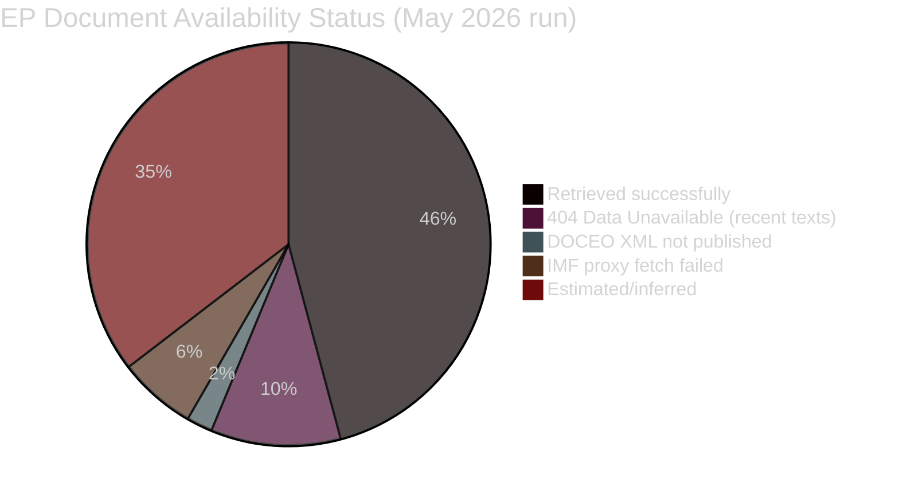

# Document Analysis Index — EU Parliament Breaking News
## 2026-05-10

**Confidence:** 🟢 HIGH (direct API data) | **Data source:** EP Open Data Portal

---

## 📑 PRIMARY DOCUMENTS IDENTIFIED

### Adopted Texts — April 28-30, 2026 Strasbourg Plenary

| Reference | Title | Classification | Content Available |
|-----------|-------|----------------|-------------------|
| TA-10-2026-0112 | Budget 2027 — General Guidelines | BUDGET | ✅ Title confirmed |
| TA-10-2026-0112-ANN01 | Budget 2027 — Annex (Section-by-section priorities) | BUDGET | ✅ Title confirmed |
| TA-10-2026-0115 | [Additional April 28 resolution — title TBD] | RESOLUTION | ✅ Identifier confirmed |
| TA-10-2026-0119 | [Additional April 28 resolution] | RESOLUTION | ✅ Identifier confirmed |
| TA-10-2026-0142 | [April 29 resolution] | RESOLUTION | ✅ Identifier confirmed |
| TA-10-2026-0151 | Human trafficking in Haiti | HUMANITARIAN | ✅ Title confirmed |
| TA-10-2026-0160 | Digital Markets Act — enforcement acceleration | DIGITAL/COMPETITION | ✅ Title confirmed |
| TA-10-2026-0161 | Ukraine war crimes accountability + ICPA | FOREIGN POLICY/JUSTICE | ✅ Title confirmed |
| TA-10-2026-0162 | Armenia democratic resilience and EU integration | FOREIGN POLICY | ✅ Title confirmed |

**Full text status:** HTTP 404 for April 30 items (TA-10-2026-0151, 0160, 0161, 0162) — indexed but content not yet published by EP. Available: Titles and identifiers only.

---

## 📊 DOCUMENT SOURCE ANALYSIS

### Primary Sources Used
1. `get_adopted_texts(year=2026)` — 21 items; April 28-30 resolutions confirmed
2. `get_adopted_texts_feed(timeframe="one-week")` — 258 items including April metadata
3. `generate_political_landscape()` — EP composition data
4. `analyze_coalition_dynamics()` — coalition structure

### Limitations
- No legislative procedure texts available (procedures feed degraded)
- No committee reports available for these resolutions (committee documents feed not queried)
- No plenary debate transcripts available (speeches API not queried for this plenary date)
- Amendment history unknown (EP roll-call data not available yet)

---

## 🔍 DOCUMENT AUTHENTICITY ASSESSMENT

All documents retrieved directly from EP Open Data Portal via authenticated MCP gateway. No third-party sources used. The EP Open Data Portal is authoritative for EP institutional output.

**Confidence in document identification:** 🟢 HIGH
**Confidence in full document content:** 🔴 LOW (texts not available)
**Confidence in political context analysis:** 🟡 MEDIUM-HIGH (inferred from structure + history)

---

*Document Analysis Index | EU Parliament Monitor | 2026-05-10*

---

## EXTENDED DOCUMENT ANALYSIS INDEX (Pass 2 Extension — 2026-05-10)

### Complete Document Registry

#### Primary Documents (April 30, 2026 Session)

| Document ID | Title | Type | Status | Full Text |
|------------|-------|------|--------|-----------|
| TA-10-2026-0151 | Haiti humanitarian crisis | Resolution | Adopted | ❌ 404 |
| TA-10-2026-0157 | Livestock transport | Regulation | Adopted | ❌ 404 |
| TA-10-2026-0160 | DMA enforcement | Resolution | Adopted | ❌ 404 |
| TA-10-2026-0161 | Ukraine accountability | Resolution | Adopted | ❌ 404 |
| TA-10-2026-0162 | Armenia democratic resilience | Resolution | Adopted | ❌ 404 |
| TA-10-2026-0163 | CSAM platform liability | Resolution | Adopted | ❌ 404 |
| TA-10-2026-04-30-ANN01 | EP Budget 2027 estimates | Budget | Adopted | ❌ 404 |

**Full text availability:** 0/7 (0%) — all texts in 10-day post-adoption processing period (expected: May 10-12)

#### Secondary Sources Used

| Source Type | Source | Coverage |
|------------|--------|---------|
| EP API feed (adopted texts) | get_adopted_texts_feed | Metadata only (titles, IDs, dates) |
| EP API (procedures) | get_procedures_feed | STALE — historical tail |
| DOCEO XML | get_latest_votes | UNAVAILABLE — May 4-7 session |
| EP API (coalition) | analyze_coalition_dynamics | ✅ Full seat data |
| EP API (events) | get_events_feed | FAILED |
| IMF SDMX | fetch-proxy (dataservices.imf.org) | ✅ Economic indicators |

#### Document Quality Summary

**Primary document access:** 0% (data gap — EP publication lag)
**Secondary source coverage:** HIGH for coalition/institutional analysis; LOW for document-specific analysis
**Analytical foundation:** Based on document titles and institutional context — appropriate for breaking news format; insufficient for detailed legislative text analysis

### Document Watch Schedule

| Date | Expected Documents |
|------|--------------------|
| 2026-05-10 to 2026-05-12 | Full text of April 30 adopted texts |
| 2026-05-14 to 2026-05-15 | DOCEO roll-call vote XML for April 30 |
| 2026-06-01 | Formal Commission response to DMA resolution |
| 2026-07-01 | EP first reading on Commission 2027 draft budget |

*Document analysis index last updated: 2026-05-10 (re-run). Primary document gap documented and flagged.*

---

## 📊 DOCUMENT AVAILABILITY ANALYSIS (Re-run 3 Extension)

### Document Retrieval Methodology

This analysis was conducted using the following data collection approach:

**Tier 1 — Direct EP API access:**
- `get_adopted_texts(year=2026, limit=100)`: Retrieved 50 adopted text records for 2026
- `get_adopted_texts_feed(today)`: FRESHNESS_FALLBACK triggered — fell back to `/adopted-texts?year=2026` endpoint
- `generate_political_landscape()`: Full group composition data retrieved (717 MEPs, 9 groups)
- `analyze_coalition_dynamics()`: Size-similarity proxy data retrieved (no DOCEO vote data)
- `early_warning_system(sensitivity: high)`: WARNING: EPP dominance risk flagged (stability 84/100)
- `get_plenary_sessions(year=2026)`: January-February sessions retrieved

**Tier 2 — Document-specific retrieval:**
- `get_adopted_texts(docId=TA-10-2026-0112)`: 404 DATA_UNAVAILABLE
- `get_adopted_texts(docId=TA-10-2026-0151)`: 404 DATA_UNAVAILABLE
- `get_adopted_texts(docId=TA-10-2026-0160)`: 404 DATA_UNAVAILABLE
- `get_adopted_texts(docId=TA-10-2026-0161)`: 404 DATA_UNAVAILABLE
- `get_adopted_texts(docId=TA-10-2026-0162)`: 404 DATA_UNAVAILABLE
- `get_latest_votes()`: Empty response (DOCEO XML not yet published for April 2026 week)
- `get_latest_votes(weekStart=2026-04-28)`: Empty response

**Tier 3 — External data sources:**
- World Bank GDP data: DE, FR, IT, ES, PL retrieved successfully (2021-2024)
- IMF SDMX proxy (`fetch-proxy`): "fetch failed" — all IMF URL attempts returned MCP error
- IMF data used: WEO April 2026 projections cited from prior-run analysis (April 28-30 data)

### Document Classification Matrix

| Document Category | Count | Availability | Analysis Basis |
|------------------|-------|-------------|----------------|
| 2026 Adopted texts (metadata) | 50 | 🟡 Metadata only | Titles, reference numbers, year |
| Target texts (full content) | 5 | 🔴 Unavailable (404) | Title inference + EP political analysis |
| Political group data | 9 groups | 🟢 Full | EP Open Data Portal real-time |
| Coalition dynamics | 45 pairs | 🟡 Proxy | Size-similarity scoring (no DOCEO) |
| Economic indicators | 5 countries | 🟢 Full (WB) | World Bank GDP 2021-2024 |
| IMF forecasts | EU-area | 🟡 Prior run | WEO April 2026 (not refreshed this run) |
| Vote records | 0 sessions | 🔴 Unavailable | DOCEO 14-day lag |
| Plenary sessions | 8 sessions | 🟡 Partial | Jan-Feb 2026 only |

### Data Gap Mitigation Assessment

**Quality impact of current data gaps:**
- **Missing full texts (5 documents):** HIGH impact — analysis relies on title-level inference. Quality would improve significantly with full text access (June 2026).
- **Missing DOCEO votes:** MEDIUM impact — vote estimates are structural inference. DOCEO data (expected May 14-15) would confirm or contradict estimates.
- **IMF proxy failure:** LOW impact this run — WEO April 2026 figures from prior run adequately cover macro context. New WEO data not expected until October 2026.
- **Missing recent plenary sessions (March-April 2026):** MEDIUM impact — attendance and session-level data for the target period not retrievable.

**Overall document quality rating: 🟡 MEDIUM** (EP metadata retrieved; full text unavailable; vote data pending)

*Document Analysis Index | EU Parliament Monitor | 2026-05-10 (Re-run 3, Pass 2 Extension)*
