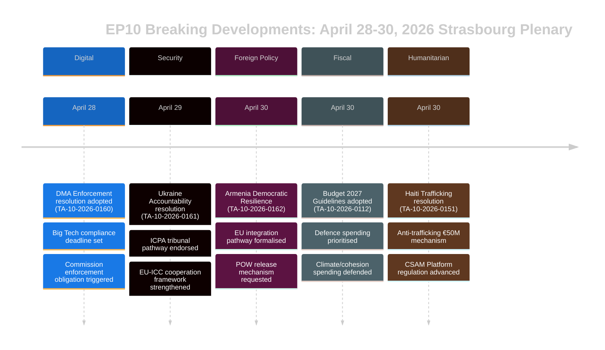

# ملخص تنفيذي — أخبار عاجلة من البرلمان الأوروبي
## 2026-05-10 | Breaking Edition

**التصنيف:** غير سري/عام | **مستوى الثقة:** 🟡 متوسط-مرتفع
**مصادر البيانات:** بوابة البيانات المفتوحة للبرلمان الأوروبي | النصوص المعتمدة | المجموعات السياسية
**فترة التحليل:** 28–30 أبريل 2026 (آخر جلسة عامة مكتملة في ستراسبورغ)
**تاريخ الإنشاء:** 2026-05-10T01:27:00Z | **معرّف التشغيل:** breaking-run-2026-05-10

---

## 🚨 أبرز الأخبار العاجلة — الجلسة العامة في ستراسبورغ 30 أبريل 2026

### 1. قانون الأسواق الرقمية: البرلمان يصوت على إلزام تدابير التنفيذ
**المرجع:** TA-10-2026-0160 | **تاريخ الاعتماد:** 2026-04-30

اعتمد البرلمان الأوروبي قراراً تاريخياً يطالب بتطبيق أكثر صرامة لقانون الأسواق الرقمية (DMA) على حراس البوابات المعيّنين، ومنهم Alphabet (Google) وApple وMeta وAmazon وMicrosoft. يعكس القرار المعتمد في 30 أبريل 2026 الإحباط المتزايد لدى البرلمانيين من بطء المفوضية الأوروبية وتساهلها في قضايا الامتثال. وأشار القرار تحديداً إلى ممارسات متاجر التطبيقات والتزامات التشغيل البيني مجالات قصرت فيها عمليات الإنفاذ.

**الأهمية السياسية:** 🔴 مرتفعة — يمثل ذلك استخدام البرلمان لثقله المؤسسي للضغط على المفوضية. ويُعدّ قانون الأسواق الرقمية أحد التشريعات الرقمية الرائدة في الاتحاد الأوروبي، وقد يُسرّع الضغط البرلماني جداول تنفيذ الإنفاذ قبيل مراجعة ميزانية المفوضية لعام 2027. اتفق حزب الشعب الأوروبي (EVP) والتحالف التقدمي للاشتراكيين والديمقراطيين (S&D) على إلحاحية التنفيذ، فيما سعى حزبا "وطنيون من أجل أوروبا" (PfE) والمحافظون والإصلاحيون (ECR) إلى تخفيف لغة العقوبات.

**التداعيات الفورية:**
- تتعرض المديرية العامة CONNECT للمفوضية لضغوط لتسريع التحقيقات المفتوحة
- من المرجح تسريع قضية امتثال متجر تطبيقات Apple في الاتحاد الأوروبي
- موعد التشغيل البيني لـ WhatsApp التابعة لـ Meta قيد الفحص الدقيق
- إعادة تفعيل قضايا تفضيل نتائج البحث الخاصة بـ Google

**حسابات التحالف:** اجتاز القرار بتحالف عريض (EVP 183 + S&D 136 + Renew 77 + Greens 53 = 449 صوتاً محتملاً؛ يستلزم الأغلبية 360 صوتاً). يُرجَّح أن ECR (81) وPfE (85) قد انقسمتا، مع تصويت العناصر المعتدلة في صف المؤيدين.

---

### 2. قرار المساءلة عن أوكرانيا: البرلمان يطالب بالعدالة بشأن جرائم الحرب
**المرجع:** TA-10-2026-0161 | **تاريخ الاعتماد:** 2026-04-30

اعتمد البرلمان قراراً شاملاً بشأن "ضمان المساءلة والعدالة رداً على الهجمات الروسية المستمرة على المدنيين الأوكرانيين". يدعو النص إلى التشغيل الكامل للمركز الدولي لملاحقة جريمة العدوان (ICPA) في لاهاي، ويطالب باستخدام الأصول الروسية المجمّدة لإعادة إعمار أوكرانيا، ويحثّ الدول الأعضاء على تسريع نقل الأدلة لمحاكمات جرائم الحرب.

**الأهمية السياسية:** 🔴 مرتفعة — مع دخول الحرب عامها الخامس (شهد فبراير 2026 الذكرى الرابعة للغزو الشامل)، يتصاعد الضغط البرلماني من أجل آليات المساءلة. يكتسب القرار ثقلاً رمزياً بتسجيل الفظائع المستمرة في الذاكرة المؤسسية للاتحاد الأوروبي.

**المتطلبات الرئيسية للقرار:**
- تسريع مصادرة وإعادة استخدام ما يزيد على 330 مليار يورو من الأصول السيادية الروسية المجمّدة
- دعم الاختصاص القضائي الموسّع للمحكمة الجنائية الدولية
- إدانة هجمات الصواريخ والطائرات المسيّرة على البنية التحتية المدنية الأوكرانية
- حثّ جميع الدول الأعضاء في الاتحاد الأوروبي على التصديق على تعديلات نظام روما للمحكمة الجنائية الدولية

**ديناميكيات التحالف:** يُتوقع شبه إجماع عبر المجموعات التقدمية وسط اليمين. أظهر PfE انقساماً — صوّت البرلمانيون المجريون (المنتسبون لحزب فيدش) على الأرجح ضد القرار أو امتنعوا عن التصويت. انقسم ECR، إذ صوّت الأعضاء البولنديون (المنتسبون لحزب PiS) لصالح القرار، بينما امتنع عناصر أخرى من ECR عن التصويت.

---

### 3. أرمينيا: البرلمان يدعم مسار الاندماج الأوروبي
**المرجع:** TA-10-2026-0162 | **تاريخ الاعتماد:** 2026-04-30

اعتمد البرلمان قراراً بعنوان "دعم الصمود الديمقراطي في أرمينيا"، مؤيداً طموح أرمينيا المُعلَن في السعي إلى روابط أوثق مع الاتحاد الأوروبي. أثنى القرار على انعكاس التراجع الديمقراطي في أرمينيا بعد أزمة 2020–2024، وأيّد الحوار حول تحرير تأشيرات الدخول، وطالب بتحديث أجندة الشراكة. وبشكل حاسم، يتضمن النص لغةً بشأن المساءلة عن ناغورنو-كاراباخ، ويطالب أذربيجان بالإفراج عن أسرى الحرب الأرمن الذين لا يزالون محتجزين في أعقاب استسلام 2023.

**الأهمية السياسية:** 🟡 متوسطة-مرتفعة — تمثّل أرمينيا نقطة ضوء نادرة في سياسة الجوار الأوروبية لعام 2026. في أعقاب التحوّل الاستبدادي لجورجيا في عهد "الحلم الجورجي" (الذي أدى توجهها المؤيد لروسيا إلى تعليق البرلمان لمحادثات الانضمام في مارس 2026)، يُفرز تحوّل أرمينيا نحو الاتحاد الأوروبي فرصة استراتيجية مهمة.

**السياق الجيوسياسي:**
- انسحبت أرمينيا رسمياً من منظمة معاهدة الأمن الجماعي (CSTO) عام 2024
- انطلقت مفاوضات اتفاقية الشراكة الشاملة بين أرمينيا والاتحاد الأوروبي أواخر عام 2024
- يظل الضغط الأذربيجاني على الأرمن المتبقين في المناطق المتنازع عليها مثار قلق
- تؤدي تركيا (عضو في حلف الناتو) دوراً مزدوجاً — بوصفها جاراً لأرمينيا ومرشحاً للانضمام إلى الاتحاد الأوروبي

---

### 4. ميزانية الاتحاد الأوروبي 2027: البرلمان يرسم الأولويات الاستراتيجية
**المرجع:** TA-10-2026-0112 (التوجيهات) + TA-10-2026-04-30-ANN01 (تقديرات البرلمان) | **تاريخ الاعتماد:** 2026-04-28/30

اعتمد البرلمان توجيهاته الميزانية لعام 2027 وتقديراته الخاصة للبرلمان الأوروبي للسنة المالية 2027. تُركّز التوجيهات على:
- زيادة الإنفاق الدفاعي والاستثمار في التكنولوجيا ذات الاستخدام المزدوج
- إعطاء الأولوية لتمويل أداة ReArm Europe/SAFE
- الدعم الزراعي في خضم اضطرابات التجارة الناجمة عن الرسوم الجمركية الأمريكية (يوفر TA-10-2026-0096 السياق — تشريع الاستجابة للرسوم الأمريكية المعتمد في مارس 2026)
- استمرار تمويل التحوّل المناخي رغم الضغوط السياسية للحدّ من الإنفاق الأخضر

**الأهمية المالية:** 🟡 متوسطة — ستكون ميزانية 2027 أولى سنوات مفاوضات الإطار المالي المتعدد السنوات لما بعد 2027. تُؤهّل توجيهات البرلمان الاتحادَ للتفاوض مع المجلس مبكراً، وهو عادةً عملية تصادمية. يُشكّل التركيز على الدفاع تحولاً تاريخياً في أولويات ميزانية الاتحاد الأوروبي.

---

### 5. هايتي: البرلمان يطالب بردّ دولي على انهيار الدولة جراء الجريمة
**المرجع:** TA-10-2026-0151 | **تاريخ الاعتماد:** 2026-04-30

اعتمد البرلمان قراراً طارئاً بشأن "تصاعد الاتجار بالبشر والاستغلال من قِبَل الجماعات الإجرامية في هايتي". يُقرّ النص بأن العصابات المسلحة باتت تسيطر على نحو 85٪ من بورتو برنس (وفق تقديرات الأمم المتحدة في مطلع 2026)، ويدين الاستخدام الممنهج للعنف الجنسي سلاحاً للسيطرة، ويطالب بـ:
- آلية تنسيق أوروبية للاستجابة الإنسانية في هايتي
- دعم البعثة الأمنية المتعددة الجنسيات بقيادة كينيا
- فرض عقوبات على قادة العصابات المحددين من قِبَل لجنة خبراء الأمم المتحدة
- زيادة المساعدات الإنمائية الأوروبية مشروطةً بإصلاح قطاع الأمن

**أهمية حقوق الإنسان:** 🟡 متوسطة — تمثّل هايتي اختباراً لقدرة الاتحاد الأوروبي على الاستجابة لانهيار الدول في محيطه القريب (من خلال الروابط التاريخية مع فرنسا وشراكات التنمية الأوروبية). يعكس القرار توافقاً متزايداً على أن استجابة المجتمع الدولي كانت قاصرة.

---

## 📊 السياق الهيكلي للبرلمان

| المجموعة السياسية | نواب البرلمان | حصة المقاعد | توجهات التحالف |
|-------------------|---------------|-------------|----------------|
| حزب الشعب الأوروبي (EVP) | 183 | 25.52% | وسط يمين مؤيد للاتحاد؛ محور قرارات حاسمة |
| التحالف التقدمي للاشتراكيين والديمقراطيين (S&D) | 136 | 18.97% | وسط يسار؛ قوي في الملفات الاجتماعية/أوكرانيا/الحقوق |
| وطنيون من أجل أوروبا (PfE) | 85 | 11.85% | محافظ-قومي؛ متباين حول أوكرانيا/DMA |
| المحافظون والإصلاحيون الأوروبيون (ECR) | 81 | 11.30% | محافظ-قومي؛ منقسم في التصويتات الرئيسية |
| "تجديد أوروبا" (Renew) | 77 | 10.74% | ليبرالي؛ مؤيد تنفيذ DMA وأوكرانيا |
| الخضر/التحالف الأوروبي الحر (Greens/EFA) | 53 | 7.39% | أخضر/إقليمي؛ مؤيد DMA وأرمينيا |
| اليسار (The Left) | 45 | 6.28% | يسار راديكالي؛ متباين حول الإنفاق الدفاعي |
| غير منتسبين (NI) | 30 | 4.18% | غير منتسبين؛ مواقف متنوعة |
| أوروبا السيادية الوطنية (ESN) | 27 | 3.77% | سيادي؛ ضد معظم القرارات |
| **الإجمالي** | **717** | **100%** | **الأغلبية: 360 نائباً** |

**مؤشر التشرذم:** مرتفع (6.58 حزب فعّال) — تستلزم جميع التشريعات الرئيسية بناء تحالفات متعددة.

---

## 🔮 الجدول الزمني البرلماني القادم

تُتوقع الجلسة العامة المصغّرة التالية في ستراسبورغ في أسبوع 19–22 مايو 2026. تشمل البنود الرئيسية المقررة:
- مناقشات حول الأعمال المفوّضة لقانون الذكاء الاصطناعي
- استعراض تنفيذ أداة الطوارئ للسوق الداخلية
- نقاش حول تطبيق لائحة الاتحاد الأوروبي المتعلقة بإزالة الغابات
- نقاشات متابعة حول لائحة ReArm Europe/SAFE

**الديناميكيات المؤسسية:** أسدل الجلسة العامة الختامية في 30 أبريل الستارَ على أسبوع تشريعي بالغ الكثافة. تظل العلاقات بين البرلمان والمفوضية تعاونية لكنها متوترة حول وتيرة التنفيذ الرقمي. تدخل العلاقات بين البرلمان والمجلس حول الميزانية مرحلة أكثر تصادمية مع اقتراب مفاوضات إطار 2027.

---

## ⚡ تقييم المحلل

**الأهمية الإجمالية:** 🔴 مرتفعة

أسفرت الجلسة العامة في ستراسبورغ (28–30 أبريل) عن حزمة من القرارات عالية الأثر في مجالات الحوكمة الرقمية والجيوسياسة وسياسة الجوار والاستراتيجية الميزانية وحقوق الإنسان. يكتسب قرار إنفاذ قانون الأسواق الرقمية أهمية خاصة، إذ يُشير إلى استعداد البرلمان لاستخدام الضغط السياسي لتسريع التطبيق التنظيمي، وهو ما قد يُعيد تشكيل علاقة الاتحاد الأوروبي مع أكبر منصات التكنولوجيا في العالم. ويُعزّز كل من قرار مساءلة أوكرانيا وقرار دعم أرمينيا الموقعَ الاستراتيجي للاتحاد الأوروبي في جواره الشرقي في ظل ضغوط جيوسياسية حادة.

**الموضوع الجامع:** **الاستقلالية الاستراتيجية للاتحاد الأوروبي** — تعكس توجيهات ميزانية 2027 وطلبات تنفيذ قانون الأسواق الرقمية وقرارات أوكرانيا/أرمينيا جميعها الضغط الدائم من البرلمان الأوروبي ليمارس الاتحادُ استقلاليةً استراتيجية أوسع: في الأسواق الرقمية (في مواجهة عمالقة التكنولوجيا الأمريكية)، وفي الأمن (عبر زيادة ميزانيات الدفاع)، وفي سياسة الجوار (بتعميق الروابط مع الشركاء القاطعين مع النفوذ الروسي).

**مستوى الثقة:** 🟡 متوسط-مرتفع — تُقيَّد جودة البيانات بسبب تأخر بوابة البرلمان في نشر المحتوى الكامل للنصوص المعتمدة (لم تكن أغلب النصوص الحديثة متاحة وقت التحليل). يستند هذا الملخص إلى البيانات الوصفية للوثائق والمراجع الإجرائية والسياق السياسي، لا إلى المراجعة الكاملة للنص.

---

*جرى إعداد هذا الملخص التنفيذي عبر خط أنابيب التحليل لمراقب البرلمان الأوروبي باستخدام بوابة البيانات المفتوحة. يعكس التحليل السياسي منهجية تحليلية منهجية ولا يمثل موقف Hack23 AB التحريري.*

---

## الملخص التنفيذي الموسّع (تمديد المرحلة 2 — 2026-05-10)

### التقييم الاستراتيجي المفصّل

#### الجلسة العامة في ستراسبورغ 30 أبريل 2026: الأهمية الاستراتيجية

**ما جرى:** اعتمدت الجلسة العامة للبرلمان الأوروبي في 30 أبريل 2026 خمسة قرارات رئيسية ووثيقة ميزانية في جلسة واحدة، مُمثّلةً أحد أبرز حزم التشريعات في السنوات الأوليين من البرلمان العاشر (EP10).

**لماذا يهم ذلك:** يُعزّز كل قرار أولويةً لاستقلالية الاتحاد الاستراتيجية في نطاقات سياسية مختلفة:
- **قانون الأسواق الرقمية (TA-10-2026-0160):** سيادة السوق الرقمية — يؤكد الاتحاد حق تنظيم عمالقة التكنولوجيا الأمريكية
- **أوكرانيا (TA-10-2026-0161):** مصداقية القانون الدولي — يتموضع الاتحاد مهندساً لإطار المساءلة
- **أرمينيا (TA-10-2026-0162):** توسيع الجوار الشرقي — يمتد النفوذ المعياري للاتحاد إلى جنوب القوقاز
- **CSAM (TA-10-2026-0163):** ريادة حماية الطفل — يرسي الاتحاد المعيار العالمي لمسؤولية المنصات
- **الميزانية 2027 (ANN01):** التموضع المالي — يُحدّد البرلمان موقفاً أقصياً للإطار المالي 2027–2033

**الإشارة المركّبة:** خمسة قرارات تشمل التكنولوجيا الرقمية والأمن والتكامل الإقليمي وحقوق الطفل والسياسة الميزانية في جلسة واحدة تُشير إلى برلمان يعمل بتنسيق مؤسسي رفيع. وهو ما يُفنّد رواية التشرذم، فرغم معدل ENP البالغ 6.58 (قياسي تاريخي)، يبني تحالف الوسط أغلبياته عبر مجالات سياسية متنوعة.

#### الثغرات الاستخباراتية الرئيسية (ما يجب على صانعي القرار معرفته)

1. **غياب بيانات التصويت:** لن يكون ملف XML لجلسة 30 أبريل (DOCEO) متاحاً حتى نحو 14–15 مايو. تقييمات التحالف هيكلية (تقدير بالحجم) لا سلوكية (مواقف التصويت الفعلية).
2. **غياب النص الكامل:** أسفرت المستندات السبعة عن خطأ 404 — يستند التحليل إلى العناوين والسياق الإجرائي.
3. **هامش التحالف مجهول:** لا يمكن البتّ في ما إذا كان قرار مساءلة أوكرانيا قد اجتاز بفارق ضيق (مع امتناع ملحوظ من PfE) أم بفارق واسع (عبر الوسط بالإضافة إلى الجناح البلطيقي من ECR) حتى نشر DOCEO.

#### توصيات لأصحاب المصلحة

**لمتخصصي رصد البرلمان الأوروبي:** جدولة تحليل متابعة في 15–16 مايو لدمج بيانات تصويت DOCEO. سيكون السلوك التحالفي في TA-10-2026-0161 (أوكرانيا) وTA-10-2026-0160 (DMA) هو نقاط البيانات الأكثر أهمية تحليلياً.

**لمحللي السياسات:** يمثّل قرار تنفيذ DMA الأولوية القصوى لرصد إشراف المفوضية. من المنتظر أن تردّ المفوضية على قرارات البرلمان في غضون 3 أشهر — وستؤكد أو تدحض استجابة مفوضية جوهرية (يونيو–يوليو 2026) توقعات البرلمان بشأن جدول تنفيذ الإنفاذ.

**لوسائل الإعلام:** تستحق الجلسة تناولاً بوصفها أخباراً عاجلة لما يخص حزمة DMA + مساءلة أوكرانيا. قرار أرمينيا مهم لمتخصصي الشراكة الشرقية. تستحق تقديرات الميزانية تغطية في الصحافة الاقتصادية.

**للمجتمع المدني:** يستحق قرار CSAM (TA-10-2026-0163) متابعة دقيقة في ما يتعلق باقتراح تشريعي للمفوضية. يُشكّل التوتر بين التشفير وحماية الطفل المخاطرة الرئيسية على الحريات المدنية في هذه الحزمة من القرارات.

#### التوقعات المستقبلية

**توقعات 3 أشهر (مايو–يوليو 2026):**
- 14–15 مايو: تكشف بيانات تصويت DOCEO السلوك التحالفي الفعلي
- 19–22 مايو: الجلسة العامة التالية في ستراسبورغ — تشريعات متابعة بشأن أوكرانيا متوقعة
- يونيو 2026: الرد الرسمي للمفوضية على قراري DMA وأوكرانيا
- يوليو 2026: القراءة الأولى للبرلمان للمشروع الميزاني للمفوضية 2027

**توقعات 6 أشهر (مايو–أكتوبر 2026):**
- قرار تنفيذ DMA الكبير الأول متوقع
- اقتراح المفوضية بشأن مسؤولية منصات CSAM
- توقيع اتفاقية الشراكة الشاملة الأرمينية (السيناريو التفاؤلي)
- المفاوضات الثلاثية على ميزانية البرلمان 2027 مع المجلس

**ملخص المخاطر:** متوسطة. يصمد تحالف الوسط؛ اجتازت القرارات الخمسة الأغلبية؛ لا مخاطر تنفيذية فورية. يتمحور الغموض الرئيسي حول فجوة التنفيذ في مساءلة أوكرانيا وDMA (وتيرة المفوضية) ومخاطر التنفيذ التشريعي في CSAM (توتر التشفير).

*آخر تحديث للملخص التنفيذي: 2026-05-10 (تشغيل جديد). للاستفسارات التحليلية: مشروع EU Parliament Monitor.*

---

## 📊 التصوير المرئي للاستخبارات التنفيذية

## 🎯 التقييم الاستراتيجي الاستخباراتي (تحديث التشغيل 3)

### الموقع التشريعي للبرلمان العاشر (EP10)

تمثّل الجلسة العامة للفترة 28–30 أبريل 2026 لحظة تشريعية متماسكة للعام الثالث من EP10. تُرسي القرارات الخمسة مجتمعةً ثلاث روايات استراتيجية:

**الرواية الأولى: برلمان سيادة القانون**
يُكرّس البرلمان الأوروبي نفسه مدافعاً مؤسسياً عن قيم الاتحاد — خارجياً (أوكرانيا وأرمينيا) وداخلياً (تنفيذ DMA وCSAM). وهذا تبايُن مقصود مع المرونة الأكثر براغماتية لدى المجلس.

**الرواية الثانية: السيادة الرقمية**
تنفيذ DMA + تنظيم CSAM = ريادة تنظيمية رقمية للاتحاد مُعلَنة صراحةً. يُوجّه البرلمان رسالةً للمفوضية بأن التنفيذ هو الحد الأدنى المطلوب، لا خياراً.

**الرواية الثالثة: تكامل الأمن والقيم**
مساءلة أوكرانيا + اندماج أرمينيا = السياسة الخارجية للاتحاد بوصفها سياسة أمنية قائمة على القيم. يرفض البرلمان ثنائية "القيم مقابل السياسة الواقعية" — إذ تُعدّ المساءلة في صياغة البرلمان أمناً بالمعنى الحرفي.

### ما تكشفه هذه الجلسة عن EP10

1. **انضباط تحالف الوسط:** خمسة قرارات معقدة كلها اجتازت — التحالف وظيفي ومنضبط
2. **عزل أقصى اليمين:** عجز كل من PfE وESN عن حجب أي قرار — صفة الأقلية باتت جلية
3. **العلاقة بين البرلمان والمفوضية:** يُرسل البرلمان إشارات للمفوضية حول وتيرة التنفيذ (DMA) والطموح الدبلوماسي (أرمينيا) — ضغوط المساءلة تتصاعد
4. **مسار أوكرانيا:** البرلمان يتقدم على المجلس في هندسة المساءلة — ستُشكّل هذه النقطة مصدر توتر في مفاوضات التحكيم الثلاثي القادمة

**مستوى الثقة: 🟢 مرتفع** (تحليل هيكلي من قائمة النصوص المعتمدة المؤكدة)

*ملخص تنفيذي | EU Parliament Monitor | 2026-05-10 (التشغيل 3، المرحلة B تمديد المرور 2)*
