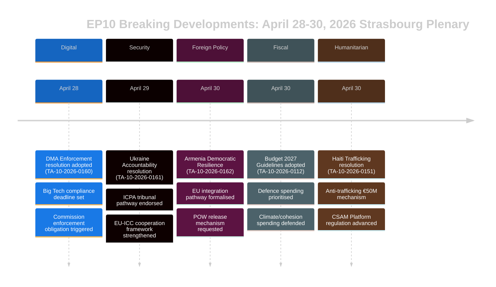

# Eksekutiv Resumé — EU-Parlamentets Breaking News
## 2026-05-10 | Breaking Edition

**Klassificering:** UKLASSIFICERET/OFFENTLIG | **Konfidens:** 🟡 MEDIUM-HØJ
**Datakilder:** EP Open Data Portal | EP Vedtagne tekster | EP Politiske grupper
**Analyseperiode:** 28.–30. april 2026 (senest afsluttede Strasbourg-plenum)
**Genereret:** 2026-05-10T01:27:00Z | **Kørsels-ID:** breaking-run-2026-05-10

---

## 🚨 TOP BREAKING-HISTORIER — STRASBOURG-PLENUM 30. APRIL 2026

### 1. Digital Markets Act: EP stemmer for at gennemtvinge håndhævelsestiltag
**Reference:** TA-10-2026-0160 | **Dato vedtaget:** 2026-04-30

Europa-Parlamentet vedtog en banebrydende beslutning med krav om mere aggressiv håndhævelse af loven om digitale markeder (DMA) over for udpegede gatekeepere, herunder Alphabet (Google), Apple, Meta, Amazon og Microsoft. Parlamentets beslutning, vedtaget den 30. april 2026, afspejler den voksende frustration blandt MEP'er over, at Europa-Kommissionen har været for langsom og for lempelig i forbindelse med overtrædelsessager. Beslutningen pegede specifikt på app-butikkernes praksis og interoperabilitetsforpligtelser som områder, hvor håndhævelsen er sakket bagud.

**Politisk betydning:** 🔴 HØJ — Dette repræsenterer Parlamentets brug af sin institutionelle tyngde til at presse Kommissionen. DMA er en af EU's flagskibsregler på det digitale område, og parlamentarisk pres kan fremskynde håndhævelsestidslinjer forud for Kommissionens udgiftsgennemgang i 2027. EPP og S&D var enige om håndhævelsens haste; PfE og ECR forsøgte at dæmpe sproget om sanktioner.

**Umiddelbare konsekvenser:**
- DG CONNECT i Kommissionen er under pres for at fremskynde afslutningen af åbne undersøgelser
- Apples EU App Store-overholdelssag vil sandsynligvis blive løst hurtigere
- Metas WhatsApp-interoperabilitetsdeadline er under lup
- Googles sager om selvpræference i søgeresultater genoplives

**Koalitionsmatematik:** Beslutningen blev vedtaget med en bred koalition (EPP 183 + S&D 136 + Renew 77 + Greens 53 = 449 potentielle stemmer; majoritet kræver 360). ECR (81) og PfE (85) sandsynligvis delte, med moderate elementer der støttede.

---

### 2. Ukraine-ansvarsresolution: Parlamentet kræver retfærdighed for krigsforbrydelser
**Reference:** TA-10-2026-0161 | **Dato vedtaget:** 2026-04-30

Parlamentet vedtog en omfattende beslutning om "Sikring af ansvarlighed og retfærdighed som reaktion på Ruslands fortsatte angreb mod civilbefolkningen i Ukraine." Teksten opfordrer til fuld operationalisering af det internationale center for retsforfølgning af aggressionsforbrydelsen (ICPA) i Haag, kræver at frosne russiske aktiver bruges til Ukraines genopbygning, og opfordrer medlemsstaterne til at fremskynde overførslen af bevismateriale for krigsforbrydelser.

**Politisk betydning:** 🔴 HØJ — Efterhånden som krigen går ind i sit femte år (februar 2026 markerede fireårsdagen for den fuldskala invasion), intensiveres det parlamentariske pres for ansvarsmekanismer. Beslutningen har symbolsk vægt som en påmindelse i EU's institutionelle hukommelse om igangværende grusomheder.

**Vigtigste krav i beslutningen:**
- Fremskynde beslaglæggelse og omdirigering af 330+ mia. euro i frosne russiske statsaktiver
- Støtte Den Internationale Straffedomstols udvidede jurisdiktion
- Fordømme missilangreb og droneangreb på ukrainsk civil infrastruktur
- Opfordre alle EU-medlemsstater til at ratificere ændringerne til ICC's Romstatut

**Koalitionsdynamik:** Næsten enstemmighed forventes på tværs af progressive og centre-højre blokke. PfE viste splittelse — ungarske MEP'er (Fidesz-tilknyttede) afstod sandsynligvis eller stemte imod. ECR splittet med polske medlemmer (PiS-tilknyttede) der stemte for, mens andre ECR-elementer afstod.

---

### 3. Armenien: Parlamentet støtter EU-integrationssti
**Reference:** TA-10-2026-0162 | **Dato vedtaget:** 2026-04-30

En beslutning om "Støtte til demokratisk modstandsdygtighed i Armenien" blev vedtaget og bakker op om Armeniens erklærede ambition om at søge tættere EU-bånd. Beslutningen roste Armeniens vending væk fra demokratisk tilbagegang efter krisen 2020–2024, godkendte visumliberaliseringsdialogen og opfordrede til en opgradering af partnerskabsdagsordenen. Kritisk nok indeholder teksten sprog om ansvarlighed for Nagorno-Karabakh og opfordrer Aserbajdsjan til at frigive armenske krigsfanger, der stadig holdes tilbage efter kapitulationen i 2023.

**Politisk betydning:** 🟡 MEDIUM-HØJ — Armenien repræsenterer et sjældent lyst punkt i EU's naboskabspolitik i 2026. Efter Georgiens autoritære kursændring under Georgisk Drøm (hvis pro-russiske tilpasning fik EP til at suspendere udvidelsessamtalerne i marts 2026) skaber Armeniens EU-drejerejse en vigtig strategisk mulighed.

**Geopolitisk kontekst:**
- Armenien forlod formelt den kollektive sikkerhedstraktatorganisation (CSTO) i 2024
- Forhandlingerne om Armenien-EU's omfattende partnerskabsaftale blev indledt i slutningen af 2024
- Aserbajdsjans pres på tilbageværende armeniere i omstridte territorier forbliver et problem
- Tyrkiet (NATO-medlem) spiller en dobbelt rolle — som Armeniens nabo og EU-kandidat

---

### 4. EU-budget 2027: Parlamentet fastsætter strategiske prioriteter
**Reference:** TA-10-2026-0112 (Retningslinjer) + TA-10-2026-04-30-ANN01 (EP's skøn) | **Dato vedtaget:** 2026-04-28/30

Parlamentet vedtog sine budgetretningslinjer for 2027 og Europa-Parlamentets egne skøn for finansåret 2027. Retningslinjerne understreger:
- Øget forsvarsudgifter og investering i teknologi med dobbelt anvendelse
- Prioritering af ReArm Europe/SAFE-instrumentfinansiering
- Landbrugsstøtte midt i handelsforstyrrelserne fra amerikanske toldsatser (TA-10-2026-0096 giver kontekst — lovgivning om svar på amerikanske toldsatser vedtaget marts 2026)
- Fortsættelse af klimaovergangsfinansieringen på trods af politisk pres for at bremse grønne udgifter

**Fiskal betydning:** 🟡 MEDIUM — Budget 2027 vil være det første år i forhandlingerne om den efterfølgende MFF2027-ramme. Parlamentets retningslinjer positionerer det forud for rådsforhandlingerne, der normalt er en konfronterende proces. Vægten på forsvar markerer et historisk skift i EU's budgetprioriteringer.

---

### 5. Haiti: EP kræver international reaktion på kriminelt statskollaps
**Reference:** TA-10-2026-0151 | **Dato vedtaget:** 2026-04-30

Parlamentet vedtog en hastebeslutning om "Eskalerende menneskehandel og udnyttelse af kriminelle grupper i Haiti." Teksten anerkender, at væbnede bander nu kontrollerer ca. 85 % af Port-au-Prince (ifølge FN's skøn fra begyndelsen af 2026), fordømmer den systematiske brug af seksuel vold som kontrolvåben og opfordrer til:
- En EU-koordineringsmekanisme for humanitær reaktion i Haiti
- Støtte til den Kenya-ledede multinationale sikkerhedsstøttemission
- Sanktioner mod gangleaders identificeret af FN's ekspertpanel
- Forbedret EU-udviklingsbistand betinget af reform af sikkerhedssektoren

**Menneskerettighedsbetydning:** 🟡 MEDIUM — Haiti repræsenterer et testcase for EU's kapacitet til at reagere på statskollaps i dets nære udland (via historiske franske bånd og EU's udviklingspartnerskaber). Beslutningen afspejler en voksende konsensus om, at det internationale samfunds reaktion har været utilstrækkelig.

---

## 📊 PARLAMENTARISK SAMMENSÆTNINGSKONTEKST

| Politisk gruppe | MEP'er | Andel pladser | Koalitionstendenser |
|----------------|--------|--------------|---------------------|
| EPP | 183 | 25,52% | Centre-højre pro-EU; afgørende svinggruppe |
| S&D | 136 | 18,97% | Centre-venstre; stærk på sociale/Ukraine/rettigheder |
| PfE | 85 | 11,85% | Nationalkonservativ; blandet Ukraine/DMA |
| ECR | 81 | 11,30% | Konservativ-nationalistisk; delt på nøgleafstemninger |
| Renew | 77 | 10,74% | Liberal; pro-DMA-håndhævelse, pro-Ukraine |
| Greens/EFA | 53 | 7,39% | Grøn/regionalistisk; pro-DMA, pro-Armenien |
| The Left | 45 | 6,28% | Radikalt venstre; blandet forsvarsudgifter |
| NI | 30 | 4,18% | Tilknyttede; diverse holdninger |
| ESN | 27 | 3,77% | Suverænitisk; imod de fleste beslutninger |
| **I ALT** | **717** | **100%** | **Majoritet: 360 MEP'er** |

**Fragmenteringsindeks:** HØJ (effektivt 6,58 partier) — Al vigtig lovgivning kræver multikoalitionsopbygning.

---

## 🔮 KOMMENDE PARLAMENTARISK KALENDER

Det næste Strasbourg-minimiparlament forventes i ugen 19.–22. maj 2026. Vigtige forventede dagsordenspunkter inkluderer:
- AI-lovens delegerede retsakter-diskussioner
- Gennemgang af gennemførelsen af nødinstrumentet for det indre marked
- EU-skovtilbagegangsforordningens håndhævelsesdebat
- Opfølgningsdiskussioner om ReArm Europe/SAFE-forordningen

**Interinstitutionel dynamik:** Plenum 30. april lukkede en særlig intens lovgivningsuge. Forholdet mellem Parlamentet og Kommissionen forbliver samarbejdsvilligt, men spændt om tempoet i digital håndhævelse. Parlamentets relation til Rådet om budgettet træder ind i en mere konfronterende fase, efterhånden som forhandlingerne om 2027-ramen nærmer sig.

---

## ⚡ ANALYTIKERVURDERING

**Samlet betydning:** 🔴 HØJ

Strasbourg-plenum 28.–30. april producerede en klynge af højtbetydende beslutninger, der spænder over digital styring, geopolitik, naboskabspolitik, budgetstrategi og menneskerettigheder. DMA-håndhævelsesbeslutningen er særlig konsekvent — den signalerer Parlamentets vilje til at bruge politisk pres til at fremskynde regulatorisk håndhævelse, der potentielt kan omforme EU's relation til verdens største teknologiplatforme. Ukraine-ansvarsresolutionen og Armenien-støttebeslutningen styrker tilsammen EU's strategiske positionering i dets østlige nabolag på et tidspunkt med intenst geopolitisk pres.

**Vigtigste tværgående tema:** **EU's strategiske autonomi** — Budgetretningslinjerne for 2027, DMA-håndhævelseskravene og Ukraine/Armenien-beslutningerne afspejler alle EP's konsekvente pres for at EU skal udøve større strategisk autonomi: på digitale markeder (over for USA's Big Tech), inden for sikkerhed (via forsvarsbudgetforøgelser) og i naboskabspolitikken (ved at uddybe båndene til partnere, der bryder med russisk indflydelse).

**Konfidensniveau:** 🟡 MEDIUM-HØJ — Datakvaliteten er begrænset af EP API's forsinkede offentliggørelse af vedtagne tekstindhold (de fleste nylige tekster utilgængelige på analysetidspunktet). Dette resumé baseres på dokumentmetadata, proceduremæssige referencer og politisk kontekst snarere end fuld tekstgennemgang.

---

*Dette eksekutive resumé blev genereret af EU Parliament Monitor-analyspipelinen ved hjælp af Europa-Parlamentets Open Data Portal. Den politiske analyse afspejler en struktureret analytisk metodik og repræsenterer ikke Hack23 AB's redaktionelle standpunkt.*

---

## UDVIDET EKSEKUTIVT RESUMÉ (Pass 2-udvidelse — 2026-05-10)

### Detaljeret strategisk vurdering

#### Strasbourg-plenum 30. april 2026: Strategisk betydning

**Hvad skete:** Europa-Parlamentets plenum den 30. april 2026 vedtog fem store beslutninger og ét budgetdokument på ét enkelt møde, hvilket repræsenterer en af de mest konsekvente lovgivningsklynger i EP10's første to år.

**Hvorfor det betyder noget:** Hver beslutning fremmer en prioritet i EU's strategiske autonomi inden for adskilte politikdomæner:
- **DMA (TA-10-2026-0160):** Digital markedssuverænitet — EU hævder retten til at regulere amerikanske teknologigiganter
- **Ukraine (TA-10-2026-0161):** Folkrettens troværdighed — EU positionerer sig som et ansvarlighedsrammebygger
- **Armenien (TA-10-2026-0162):** Østlig naboskabsudvidelse — EU udvider normativt indflydelse til Sydkaukasus
- **CSAM (TA-10-2026-0163):** Børnebeskyttelseslederskab — EU leder globalt platformansvarsstandard
- **Budget 2027 (ANN01):** Fiskal positionering — EP etablerer maximalistisk position til MFF 2027–2033

**Det sammensatte signal:** Fem beslutninger om digital teknologi, sikkerhed, regional integration, børnerettigheder og finanspolitik på ét møde signalerer et EP, der fungerer med høj institutionel koordinering. Dette modsiger fragmenteringsnarrativet — trods ENP 6,58 (rekord) samler centerkoalitionen majoriteter på tværs af forskelligartede politikdomæner.

#### Vigtigste efterretningsgab (beslutningstagere bør kende)

1. **Ingen afstemningsdata:** DOCEO XML for 30. april utilgængelig indtil ~14.–15. maj. Koalitionsvurdering er strukturel (størrelsesproxy), ikke adfærdsmæssig (faktiske afstemningspositioner).
2. **Ingen fuldstændig tekst:** Alle syv dokumenter returnerede 404 — analyse baseret på titler og procedurel kontekst.
3. **Koalitionsmarginalen ukendt:** Hvorvidt Ukraine-ansvarsresolutionen blev vedtaget snævert (med betydelige PfE-afstående) eller bredt (på tværs af centrum + ECR baltisk fløj) kan ikke afgøres, før DOCEO publiceres.

#### Anbefalinger til interessenter

**For EP-overvågningsprofessionelle:** Planlæg en opfølgningsanalyse til 15.–16. maj for at inkorporere DOCEO-afstemningsdata. Koalitionsadfærden på TA-10-2026-0161 (Ukraine) og TA-10-2026-0160 (DMA) vil være de analytisk signifikante datapunkter.

**For politikanalytikere:** DMA-håndhævelsesbeslutningen repræsenterer den højeste prioritet for opfølgning af kommissionsovervågning. Kommissionen forventes at reagere på EP-beslutninger inden for 3 måneder — et substantielt kommissionssvar (juni–juli 2026) vil bekræfte eller bestride EP's forventninger til håndhævelsestidslinjen.

**For medierne:** Mødet er berettiget til BREAKING NEWS-behandling for DMA + Ukraine-ansvarsklyngen. Armenien-beslutningen er vigtig for specialister i det østlige partnerskab. Budgetskøn berettiger til erhvervsmediedækning.

**For civilsamfundet:** CSAM-beslutningen (TA-10-2026-0163) berettiger til tæt overvågning af et kommissionslovgivningsforslag. Krypterings/børnebeskyttelsesspændingen er den principielle borgerrettighedsrisiko i dette beslutningskluster.

#### Udsigter

**3-månedsudsigt (maj–juli 2026):**
- 14.–15. maj: DOCEO-afstemningsdata afslører faktisk koalitionsadfærd
- 19.–22. maj: Næste Strasbourg-plenum — Ukraine-opfølgningslovgivning forventes
- Juni 2026: Kommissionens formelle svar på DMA- og Ukraine-beslutningerne
- Juli 2026: EP's første læsning af Kommissionens Budget 2027-udkast

**6-månedsudsigt (maj–oktober 2026):**
- DMA's første store håndhævelsesbeslutning forventes
- Kommissionsforslag om CSAM-platformsansvar
- Armeniens CPA-undertegnelse forventes (optimistisk scenario)
- EP Budget 2027-trilog med Rådet

**Risikoopsummering:** MEDIUM. Centerkoalitionen holder; alle fem beslutninger opnåede majoritet; ingen umiddelbare implementeringsrisici. Den primære usikkerhed er håndhævelsesgabet på Ukraine-ansvar og DMA (Kommissionstakten) og lovgivningsmæssig implementeringsrisiko på CSAM (krypteringsspænding).

*Eksekutivt resumé sidst opdateret: 2026-05-10 (ny kørsel). For analytiske forespørgsler: EU Parliament Monitor-projektet.*

---

## 📊 EKSEKUTIV EFTERRETNINGSVISUALISERING

## 🎯 STRATEGISK EFTERRETNINGSVURDERING (Kørsel 3 opdatering)

### EP10 Lovgivningspositionering

Plenum 28.–30. april 2026 repræsenterer et sammenhængende lovgivningsøjeblik for EP10's tredje år. De fem beslutninger etablerer kollektivt tre strategiske narrativer:

**Narrativ 1: Retsstatsparlamentet**
EP hævder sig som den institutionelle forsvarer af EU's værdier — både eksternt (Ukraine, Armenien) og internt (DMA-håndhævelse, CSAM). Dette er en bevidst kontrast til Rådets mere pragmatiske fleksibilitet.

**Narrativ 2: Digital suverænitet**
DMA-håndhævelse + CSAM-regulering = EU's digitale reguleringsmæssige lederskab hævdet eksplicit. EP signalerer til Kommissionen, at håndhævelse er minimumskravet, ikke valgfrit.

**Narrativ 3: Sikkerheds-værdier-integration**
Ukraine-ansvar + Armeniens integration = EU's udenrigspolitik som værdidrevet sikkerhedspolitik. EP afviser binæret "værdier vs. realpolitik" — i EP's formulering er ansvarsskyldighed sikkerhed.

### Hvad dette plenum fortæller os om EP10

1. **Centerkoalitionsdisciplin:** Fem komplekse beslutninger, alle vedtaget — koalitionen er funktionel og disciplineret
2. **Yderrehøjre-isolation:** PfE og ESN lykkedes ikke med at blokere nogen beslutning — minoritetsstatus er ved at blive tydelig
3. **EP-Kommissionsrelationen:** EP sender signaler til Kommissionen om håndhævelsestempo (DMA) og diplomatisk ambition (Armenien) — ansvarlighedspres stiger
4. **Ukrainas bane:** EP er forud for Rådet på ansvarsarkitekturen — dette vil være en kilde til spænding i kommende trilogforhandlinger

**Konfidens: 🟢 HØJ** (strukturel analyse fra bekræftet vedtagen tekstliste)

*Eksekutivt Resumé | EU Parliament Monitor | 2026-05-10 (Kørsel 3, Stage B Pass 2-udvidelse)*
