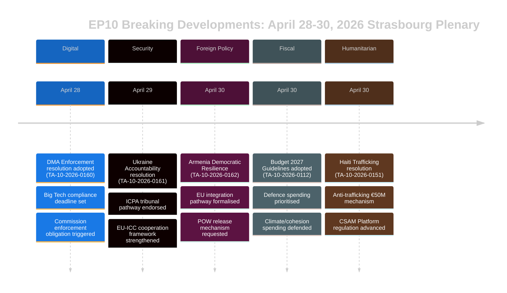

# Exekutivzusammenfassung — EU-Parlament Breaking News
## 2026-05-10 | Breaking Edition

**Einstufung:** UNKLASSIFIZIERT/ÖFFENTLICH | **Konfidenz:** 🟡 MITTEL-HOCH
**Datenquellen:** EP Open Data Portal | EP Angenommene Texte | EP Politische Gruppen
**Analysezeitraum:** 28.–30. April 2026 (jüngstes abgeschlossenes Straßburg-Plenum)
**Erstellt:** 2026-05-10T01:27:00Z | **Lauf-ID:** breaking-run-2026-05-10

---

## 🚨 TOP BREAKING-MELDUNGEN — STRASBOURG-PLENUM 30. APRIL 2026

### 1. Digital Markets Act: EP stimmt für Durchsetzungsmaßnahmen
**Referenz:** TA-10-2026-0160 | **Datum der Annahme:** 2026-04-30

Das Europäische Parlament nahm eine wegweisende Entschließung an, in der eine aggressivere Durchsetzung des Gesetzes über digitale Märkte (DMA) gegenüber benannten Gatekeepern gefordert wird, darunter Alphabet (Google), Apple, Meta, Amazon und Microsoft. Die am 30. April 2026 angenommene Entschließung des Parlaments spiegelt die wachsende Frustration unter den Abgeordneten wider, dass die Europäische Kommission bei der Verfolgung von Verstößen zu langsam und zu nachsichtig war. Die Entschließung nannte ausdrücklich die Praktiken von App-Stores und Interoperabilitätsverpflichtungen als Bereiche, in denen die Durchsetzung hinterherhinkt.

**Politische Bedeutung:** 🔴 HOCH — Dies zeigt, dass das Parlament sein institutionelles Gewicht nutzt, um die Kommission unter Druck zu setzen. Der DMA ist eine der Flaggschiff-Digitalverordnungen der EU, und parlamentarischer Druck könnte die Durchsetzungsfristen vor der Ausgabenprüfung der Kommission 2027 beschleunigen. EVP und S&D stimmten in der Dringlichkeit der Durchsetzung überein; PfE und EKR versuchten, die Sanktionsformulierungen zu abzumildern.

**Unmittelbare Auswirkungen:**
- GD CONNECT der Kommission steht unter Druck, die Abschlüsse offener Ermittlungen zu beschleunigen
- Apples EU App Store-Konformitätsfall dürfte schneller gelöst werden
- Metas WhatsApp-Interoperabilitätsfrist wird geprüft
- Googles Fälle zur Selbstbevorzugung bei Suchergebnissen werden neu belebt

**Koalitionsrechnung:** Die Entschließung wurde mit einer breiten Koalition angenommen (EVP 183 + S&D 136 + Renew 77 + Greens 53 = 449 potenzielle Stimmen; Mehrheit erfordert 360). EKR (81) und PfE (85) wahrscheinlich gespalten, mit moderaten Elementen, die unterstützten.

---

### 2. Ukraine-Rechenschaftspflichtsentschließung: Parlament fordert Gerechtigkeit für Kriegsverbrechen
**Referenz:** TA-10-2026-0161 | **Datum der Annahme:** 2026-04-30

Das Parlament nahm eine umfassende Entschließung zur „Sicherstellung von Rechenschaftspflicht und Gerechtigkeit als Reaktion auf Russlands anhaltende Angriffe gegen die Zivilbevölkerung in der Ukraine" an. Der Text fordert die vollständige Operationalisierung des Internationalen Zentrums für die Verfolgung des Verbrechens der Aggression (ICPA) in Den Haag, verlangt, dass eingefrorene russische Vermögenswerte für den Wiederaufbau der Ukraine verwendet werden, und fordert die Mitgliedstaaten auf, die Übertragung von Beweismitteln für Kriegsverbrechen zu beschleunigen.

**Politische Bedeutung:** 🔴 HOCH — Da der Krieg in sein fünftes Jahr geht (Februar 2026 markierte den vierten Jahrestag der vollständigen Invasion), nimmt der parlamentarische Druck auf Rechenschaftsmechanismen zu. Die Entschließung hat symbolisches Gewicht als Erinnerung an die anhaltenden Gräueltaten im institutionellen Gedächtnis der EU.

**Wichtigste Forderungen in der Entschließung:**
- Beschleunigung der Beschlagnahme und Umwidmung von mehr als 330 Mrd. Euro eingefrorener russischer Staatsgelder
- Unterstützung der erweiterten Zuständigkeit des Internationalen Strafgerichtshofs
- Verurteilung von Raketen- und Drohnenangriffen auf ukrainische Zivilinfrastruktur
- Aufforderung an alle EU-Mitgliedstaaten, die Änderungen des Rom-Statuts des IStGH zu ratifizieren

**Koalitionsdynamik:** Fast Einstimmigkeit wird unter progressiven und mitte-rechts Blöcken erwartet. PfE zeigte Spaltungserscheinungen — ungarische Abgeordnete (Fidesz-nahe) enthielten sich wahrscheinlich oder stimmten dagegen. EKR gespalten, da polnische Mitglieder (PiS-nahe) dafür stimmten, während andere EKR-Elemente sich enthielten.

---

### 3. Armenien: Parlament unterstützt EU-Integrationspfad
**Referenz:** TA-10-2026-0162 | **Datum der Annahme:** 2026-04-30

Eine Entschließung zur „Unterstützung der demokratischen Resilienz Armeniens" wurde angenommen, die Armeniens erklärte Absicht unterstützt, engere EU-Beziehungen anzustreben. Die Entschließung lobte Armeniens Kurskorrektur nach dem demokratischen Rückschlag während der Krise 2020–2024, befürwortete den Dialog zur Visaliberalisierung und forderte eine Aktualisierung der Partnerschaftsagenda. Entscheidend enthält der Text Formulierungen zur Verantwortlichkeit für Bergkarabach und fordert Aserbaidschan auf, armenische Kriegsgefangene freizulassen, die nach der Kapitulation 2023 noch immer festgehalten werden.

**Politische Bedeutung:** 🟡 MITTEL-HOCH — Armenien stellt 2026 einen seltenen Lichtblick in der EU-Nachbarschaftspolitik dar. Nach Georgiens autoritärer Kursänderung unter Georgischem Traum (dessen prorussische Ausrichtung das EP dazu veranlasste, die Erweiterungsgespräche im März 2026 auszusetzen) eröffnet Armeniens EU-Hinwendung eine wichtige strategische Chance.

**Geopolitischer Kontext:**
- Armenien trat 2024 offiziell aus der Organisation des Vertrags über kollektive Sicherheit (OVKS) aus
- Verhandlungen über ein umfassendes Partnerschaftsabkommen zwischen Armenien und der EU begannen Ende 2024
- Aserbaidschans Druck auf verbleibende Armenier in umstrittenen Gebieten bleibt ein Anliegen
- Die Türkei (NATO-Mitglied) spielt eine Doppelrolle — als Nachbar Armeniens und EU-Kandidat

---

### 4. EU-Haushalt 2027: Parlament legt strategische Prioritäten fest
**Referenz:** TA-10-2026-0112 (Leitlinien) + TA-10-2026-04-30-ANN01 (EP-Voranschläge) | **Datum der Annahme:** 2026-04-28/30

Das Parlament nahm seine Haushaltsleitlinien für 2027 und die eigenen Voranschläge des Europäischen Parlaments für das Haushaltsjahr 2027 an. Die Leitlinien betonen:
- Erhöhte Verteidigungsausgaben und Investitionen in Dual-Use-Technologie
- Priorisierung der Finanzierung des ReArm Europe/SAFE-Instruments
- Landwirtschaftliche Unterstützung inmitten von Handelsstörungen durch US-Zölle (TA-10-2026-0096 liefert den Kontext — Rechtsvorschriften zur Reaktion auf US-Zölle im März 2026 angenommen)
- Fortführung der Klimaübergangsfinanzierung trotz politischen Drucks, die grünen Ausgaben zu verlangsamen

**Fiskalische Bedeutung:** 🟡 MITTEL — Der Haushalt 2027 wird das erste Jahr der Verhandlungen über den Rahmen nach MFF2027 sein. Die Leitlinien des Parlaments positionieren es vor den Ratsverhandlungen, die typischerweise ein konfrontativer Prozess sind. Die Betonung der Verteidigung markiert eine historische Verschiebung in den EU-Haushaltsprioritäten.

---

### 5. Haiti: EP fordert internationale Reaktion auf kriminellen Staatszusammenbruch
**Referenz:** TA-10-2026-0151 | **Datum der Annahme:** 2026-04-30

Das Parlament nahm eine Dringlichkeitsentschließung über „Eskalierenden Menschenhandel und Ausbeutung durch kriminelle Gruppen in Haiti" an. Der Text erkennt an, dass bewaffnete Banden nun ca. 85 % von Port-au-Prince kontrollieren (nach UN-Schätzungen Anfang 2026), verurteilt den systematischen Einsatz sexueller Gewalt als Kontrollinstrument und fordert:
- Einen EU-Koordinierungsmechanismus für die humanitäre Reaktion auf Haiti
- Unterstützung der von Kenia geführten multinationalen Sicherheitsunterstützungsmission
- Sanktionen gegen vom UN-Expertengremium identifizierte Bandenführer
- Verbesserte EU-Entwicklungshilfe, konditioniert auf Reformen im Sicherheitssektor

**Bedeutung für die Menschenrechte:** 🟡 MITTEL — Haiti stellt einen Testfall für die Fähigkeit der EU dar, auf den Staatszusammenbruch in ihrer nahen Nachbarschaft zu reagieren (über historische französische Bindungen und EU-Entwicklungspartnerschaften). Die Entschließung spiegelt einen wachsenden Konsens wider, dass die Reaktion der internationalen Gemeinschaft unzureichend war.

---

## 📊 KONTEXT DER PARLAMENTARISCHEN ZUSAMMENSETZUNG

| Politische Fraktion | Abgeordnete | Sitzanteil | Koalitionsneigung |
|--------------------|-------------|-----------|-------------------|
| EVP | 183 | 25,52% | Mitte-rechts pro-EU; ausschlaggebende Schwingfraktion |
| S&D | 136 | 18,97% | Mitte-links; stark bei Soziales/Ukraine/Rechte |
| PfE | 85 | 11,85% | Nationalkonservativ; gespalten bei Ukraine/DMA |
| EKR | 81 | 11,30% | Konservativ-nationalistisch; gespalten bei Schlüsselabstimmungen |
| Renew | 77 | 10,74% | Liberal; pro-DMA-Durchsetzung, pro-Ukraine |
| Greens/EFA | 53 | 7,39% | Grün/regionalistisch; pro-DMA, pro-Armenien |
| The Left | 45 | 6,28% | Radikale Linke; gespalten bei Verteidigungsausgaben |
| NI | 30 | 4,18% | Fraktionslos; diverse Positionen |
| ESN | 27 | 3,77% | Souveränistisch; gegen die meisten Entschließungen |
| **GESAMT** | **717** | **100%** | **Mehrheit: 360 Abgeordnete** |

**Fragmentierungsindex:** HOCH (effektiv 6,58 Parteien) — Alle wesentliche Gesetzgebung erfordert Mehrkkoalitionsbildung.

---

## 🔮 BEVORSTEHENDER PARLAMENTARISCHER KALENDER

Das nächste Straßburger Miniplenum wird in der Woche des 19.–22. Mai 2026 erwartet. Wichtige erwartete Tagesordnungspunkte umfassen:
- Diskussionen zu delegierten Rechtsakten des KI-Gesetzes
- Überprüfung der Umsetzung des Nothilfeinstruments für den Binnenmarkt
- Debatte zur Durchsetzung der EU-Entwaldungsverordnung
- Folgegespräche zur ReArm Europe/SAFE-Verordnung

**Interinstitutionelle Dynamik:** Das Plenum vom 30. April schloss eine besonders intensive Gesetzgebungswoche ab. Die Beziehungen zwischen Parlament und Kommission bleiben kooperativ, sind aber bezüglich des Tempos der digitalen Durchsetzung angespannt. Das Verhältnis Parlament-Rat beim Haushalt tritt in eine konfrontativere Phase ein, da die Verhandlungen über den Rahmen 2027 näherrücken.

---

## ⚡ ANALYSTENEINSCHÄTZUNG

**Gesamtbedeutung:** 🔴 HOCH

Das Straßburger Plenum vom 28.–30. April produzierte eine Gruppe hochbedeutender Entschließungen, die digitale Governance, Geopolitik, Nachbarschaftspolitik, Haushaltsstrategie und Menschenrechte umspannen. Die DMA-Durchsetzungsentschließung ist besonders folgenreich — sie signalisiert die Bereitschaft des Parlaments, politischen Druck einzusetzen, um die regulatorische Durchsetzung zu beschleunigen, was potenziell die Beziehung der EU zu den weltweit größten Technologieplattformen umgestalten könnte. Die Ukraine-Rechenschaftsentschließung und die Armenien-Unterstützungsentschließung stärken gemeinsam die strategische Positionierung der EU in ihrer östlichen Nachbarschaft in einer Zeit intensiven geopolitischen Drucks.

**Wichtigstes übergreifendes Thema:** **Strategische Autonomie der EU** — Die Haushaltsleitlinien 2027, die DMA-Durchsetzungsanforderungen und die Ukraine/Armenien-Entschließungen spiegeln alle den konsequenten Druck des EP wider, dass die EU eine größere strategische Autonomie ausüben sollte: auf digitalen Märkten (gegenüber US-Big Tech), in der Sicherheit (durch Verteidigungsbudgeterhöhungen) und in der Nachbarschaftspolitik (durch Vertiefung der Beziehungen zu Partnern, die russischen Einfluss ablehnen).

**Konfidenzniveau:** 🟡 MITTEL-HOCH — Die Datenqualität ist durch die verzögerte Veröffentlichung des angenommenen Textinhalts über das EP-API eingeschränkt (die meisten aktuellen Texte zum Analysezeitpunkt nicht verfügbar). Diese Zusammenfassung stützt sich auf Dokumentmetadaten, Verfahrensreferenzen und politischen Kontext statt auf vollständige Textprüfung.

---

*Diese Exekutivzusammenfassung wurde von der EU Parliament Monitor-Analysepipeline unter Verwendung des Open-Data-Portals des Europäischen Parlaments erstellt. Die politische Analyse spiegelt eine strukturierte Analysemethodik wider und repräsentiert nicht die redaktionelle Position der Hack23 AB.*

---

## ERWEITERTE EXEKUTIVZUSAMMENFASSUNG (Pass 2-Erweiterung — 2026-05-10)

### Detaillierte strategische Einschätzung

#### Straßburger Plenum 30. April 2026: Strategische Bedeutung

**Was geschah:** Das Plenum des Europäischen Parlaments am 30. April 2026 nahm fünf bedeutende Entschließungen und ein Haushaltsdokument in einer einzigen Sitzung an — eines der folgenreichsten Gesetzgebungscluster in den ersten zwei Jahren von EP10.

**Warum es wichtig ist:** Jede Entschließung treibt eine Priorität der strategischen Autonomie der EU in unterschiedlichen Politikfeldern voran:
- **DMA (TA-10-2026-0160):** Digitale Marktsuveränität — EU beansprucht das Recht, US-Technologieriesen zu regulieren
- **Ukraine (TA-10-2026-0161):** Glaubwürdigkeit des Völkerrechts — EU positioniert sich als Aufbauer eines Rechenschaftsrahmens
- **Armenien (TA-10-2026-0162):** Östliche Nachbarschaftserweiterung — EU dehnt normativen Einfluss auf den Südkaukasus aus
- **CSAM (TA-10-2026-0163):** Führung beim Kinderschutz — EU führt globalen Plattformhaftungsstandard
- **Haushalt 2027 (ANN01):** Fiskale Positionierung — EP etabliert maximalistische Position für MFF 2027–2033

**Das zusammengesetzte Signal:** Fünf Entschließungen zu digitaler Technologie, Sicherheit, regionaler Integration, Kinderrechten und Haushaltspolitik in einer einzigen Sitzung signalisieren ein EP, das mit hoher institutioneller Koordinierung funktioniert. Dies widerlegt die Fragmentierungserzählung — trotz ENP 6,58 (Rekord) baut die Mittkoalition Mehrheiten in diversen Politikfeldern auf.

#### Wichtigste Nachrichtenlücken (Entscheidungsträger sollten wissen)

1. **Keine Abstimmungsdaten:** DOCEO XML für den 30. April bis ~14.–15. Mai nicht verfügbar. Koalitionseinschätzung ist strukturell (Größenproxy), nicht verhaltensbasiert (tatsächliche Abstimmungspositionen).
2. **Kein Volltext:** Alle sieben Dokumente gaben 404 zurück — Analyse basiert auf Titeln und Verfahrenskontext.
3. **Koalitionsmarge unbekannt:** Ob die Ukraine-Rechenschaftsentschließung knapp (mit erheblichen PfE-Enthaltungen) oder breit (über das Zentrum + EKR baltischen Flügel) angenommen wurde, lässt sich erst nach der DOCEO-Veröffentlichung klären.

#### Empfehlungen für Interessengruppen

**Für EP-Beobachtungsprofis:** Eine Folgeanalyse für den 15.–16. Mai einplanen, um DOCEO-Abstimmungsdaten einzubeziehen. Das Koalitionsverhalten bei TA-10-2026-0161 (Ukraine) und TA-10-2026-0160 (DMA) werden die analytisch bedeutsamen Datenpunkte sein.

**Für Politikanalysten:** Die DMA-Durchsetzungsentschließung stellt die höchste Priorität für die Nachverfolgung der Kommissionsüberwachung dar. Die Kommission wird voraussichtlich innerhalb von 3 Monaten auf EP-Entschließungen reagieren — eine substanzielle Kommissionsantwort (Juni–Juli 2026) bestätigt oder bestreitet die Erwartungen des EP an den Durchsetzungszeitplan.

**Für Medien:** Die Sitzung ist BREAKING NEWS-Behandlung für das DMA + Ukraine-Rechenschaftscluster wert. Die Armenien-Entschließung ist für Spezialisten der östlichen Partnerschaft bedeutsam. Haushaltsgutachten verdienen Wirtschaftspressbehandlung.

**Für die Zivilgesellschaft:** Die CSAM-Entschließung (TA-10-2026-0163) verdient intensive Beobachtung im Hinblick auf einen Kommissionsgesetzgebungsvorschlag. Die Verschlüsselungs-/Kinderschutzspannung ist das hauptsächliche Bürgerrechtsrisiko in diesem Entschließungscluster.

#### Ausblick

**3-Monatsausblick (Mai–Juli 2026):**
- 14.–15. Mai: DOCEO-Abstimmungsdaten enthüllen das tatsächliche Koalitionsverhalten
- 19.–22. Mai: Nächstes Straßburger Plenum — Ukraine-Folgegesetzgebung erwartet
- Juni 2026: Formelle Antwort der Kommission auf DMA- und Ukraine-Entschließungen
- Juli 2026: Erste Lesung des Parlaments des Kommissionsentwurfs für Haushalt 2027

**6-Monatsausblick (Mai–Oktober 2026):**
- Erste große DMA-Durchsetzungsentscheidung erwartet
- Kommissionsvorschlag zur CSAM-Plattformhaftung
- Armeniens CPA-Unterzeichnung erwartet (optimistisches Szenario)
- EP Haushalt 2027 Trilog mit dem Rat

**Risikozusammenfassung:** MITTEL. Mittkoalition hält; alle fünf Entschließungen erreichten die Mehrheit; keine unmittelbaren Umsetzungsrisiken. Die primäre Unsicherheit ist die Durchsetzungslücke bei der Ukraine-Rechenschaftspflicht und DMA (Kommissionstempo) und das gesetzgeberische Umsetzungsrisiko bei CSAM (Verschlüsselungsspannung).

*Exekutivzusammenfassung zuletzt aktualisiert: 2026-05-10 (Neulauf). Bei analytischen Anfragen: EU Parliament Monitor-Projekt.*

---

## 📊 EXEKUTIVE NACHRICHTENDIENSTLICHE VISUALISIERUNG

## 🎯 STRATEGISCHE NACHRICHTENDIENSTLICHE EINSCHÄTZUNG (Lauf 3 Update)

### EP10 Gesetzgebungspositionierung

Das Plenum vom 28.–30. April 2026 stellt einen kohärenten Gesetzgebungsmoment für das dritte Jahr von EP10 dar. Die fünf Entschließungen etablieren kollektiv drei strategische Narrative:

**Narrativ 1: Das Rechtsstaatsparlament**
Das EP behauptet sich als institutioneller Verteidiger der EU-Werte — sowohl extern (Ukraine, Armenien) als auch intern (DMA-Durchsetzung, CSAM). Dies ist ein bewusster Kontrast zur pragmatischeren Flexibilität des Rates.

**Narrativ 2: Digitale Souveränität**
DMA-Durchsetzung + CSAM-Regulierung = Digitale regulatorische Führung der EU explizit beansprucht. Das EP signalisiert der Kommission, dass Durchsetzung die Mindesterwartung ist, nicht optional.

**Narrativ 3: Integration von Sicherheit und Werten**
Ukraine-Rechenschaft + Armeniens Integration = EU-Außenpolitik als wertebasierte Sicherheitspolitik. Das EP lehnt die Dichotomie "Werte vs. Realpolitik" ab — in der Formulierung des EP ist Rechenschaftspflicht Sicherheit.

### Was dieses Plenum über EP10 aussagt

1. **Disziplin der Mittkoalition:** Fünf komplexe Entschließungen, alle angenommen — die Koalition ist funktionsfähig und diszipliniert
2. **Isolation der extremen Rechten:** PfE und ESN konnten keine Entschließung blockieren — Minderheitsstatus wird zunehmend deutlich
3. **EP-Kommissionsbeziehung:** Das EP sendet der Kommission Signale zum Durchsetzungstempo (DMA) und zum diplomatischen Ehrgeiz (Armenien) — der Rechenschaftsdruck steigt
4. **Ukraine-Trajektorie:** Das EP ist dem Rat bei der Rechenschaftsarchitektur voraus — dies wird eine Spannungsquelle bei kommenden Trilogverhandlungen sein

**Konfidenz: 🟢 HOCH** (Strukturanalyse aus bestätigter Angenommener-Texten-Liste)

*Exekutivzusammenfassung | EU Parliament Monitor | 2026-05-10 (Lauf 3, Stage B Pass 2-Erweiterung)*
