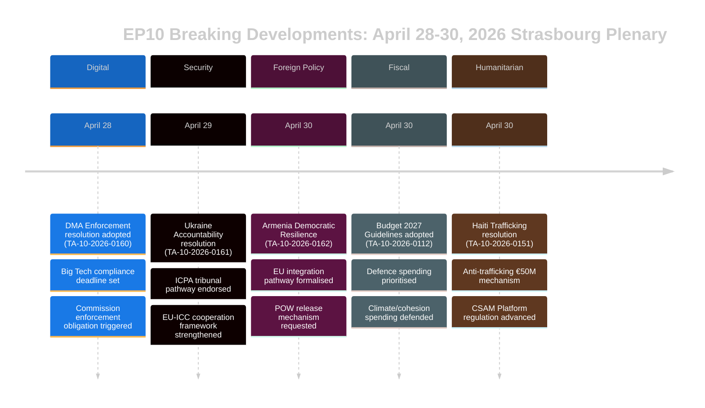

# Resumen Ejecutivo — Noticias de Última Hora del Parlamento Europeo
## 2026-05-10 | Breaking Edition

**Clasificación:** NO CLASIFICADO/PÚBLICO | **Confianza:** 🟡 MEDIO-ALTO
**Fuentes de datos:** EP Open Data Portal | EP Textos adoptados | EP Grupos políticos
**Período de análisis:** 28–30 de abril de 2026 (último pleno de Estrasburgo completado)
**Generado:** 2026-05-10T01:27:00Z | **ID de ejecución:** breaking-run-2026-05-10

---

## 🚨 NOTICIAS PRINCIPALES — PLENO DE ESTRASBURGO DEL 30 DE ABRIL DE 2026

### 1. Ley de Mercados Digitales: el PE vota para obligar medidas de ejecución
**Referencia:** TA-10-2026-0160 | **Fecha de adopción:** 2026-04-30

El Parlamento Europeo adoptó una resolución histórica que exige una aplicación más agresiva de la Ley de Mercados Digitales (DMA) contra los guardianes de acceso designados, incluidos Alphabet (Google), Apple, Meta, Amazon y Microsoft. La resolución del Parlamento, adoptada el 30 de abril de 2026, refleja la creciente frustración entre los eurodiputados por la lentitud y la indulgencia de la Comisión Europea en la persecución de casos de incumplimiento. La resolución señaló específicamente las prácticas de las tiendas de aplicaciones y las obligaciones de interoperabilidad como áreas donde la aplicación ha sido insuficiente.

**Significado político:** 🔴 ALTO — Esto representa al Parlamento utilizando su peso institucional para presionar a la Comisión. La DMA es una de las regulaciones digitales insignia de la UE, y la presión parlamentaria podría acelerar los plazos de ejecución antes de la revisión del gasto de la Comisión en 2027. El PPE y el S&D coincidieron en la urgencia de la ejecución; PfE y ECR buscaron suavizar el lenguaje sobre sanciones.

**Implicaciones inmediatas:**
- La DG CONNECT de la Comisión está bajo presión para acelerar el cierre de las investigaciones abiertas
- El caso de cumplimiento de la App Store de Apple en la UE probablemente se resolverá más rápido
- El plazo de interoperabilidad de WhatsApp de Meta está siendo examinado
- Los casos de autofavorecimiento de resultados de búsqueda de Google se reactivan

**Matemática de la coalición:** La resolución se aprobó con una amplia coalición (PPE 183 + S&D 136 + Renew 77 + Greens 53 = 449 votos potenciales; la mayoría requiere 360). ECR (81) y PfE (85) probablemente divididos, con elementos moderados apoyando.

---

### 2. Resolución de responsabilidad sobre Ucrania: el Parlamento exige justicia por crímenes de guerra
**Referencia:** TA-10-2026-0161 | **Fecha de adopción:** 2026-04-30

El Parlamento adoptó una resolución integral sobre «Garantizar la responsabilidad y la justicia en respuesta a los ataques continuos de Rusia contra la población civil de Ucrania». El texto pide la plena operacionalización del Centro Internacional para el Enjuiciamiento del Crimen de Agresión (ICPA) en La Haya, exige que los activos rusos congelados se usen para la reconstrucción de Ucrania y exhorta a los Estados miembros a acelerar la transmisión de pruebas para los enjuiciamientos por crímenes de guerra.

**Significado político:** 🔴 ALTO — A medida que la guerra entra en su quinto año (febrero de 2026 marcó el cuarto aniversario de la invasión a gran escala), la presión parlamentaria por mecanismos de rendición de cuentas se intensifica. La resolución tiene peso simbólico al recordar en la memoria institucional de la UE las atrocidades en curso.

**Demandas clave de la resolución:**
- Acelerar la incautación y reutilización de más de 330.000 millones de euros en activos soberanos rusos congelados
- Apoyar la jurisdicción ampliada del Tribunal Penal Internacional
- Condenar los ataques con misiles y drones contra infraestructuras civiles ucranianas
- Instar a todos los Estados miembros de la UE a ratificar las enmiendas al Estatuto de Roma de la CPI

**Dinámica de coalición:** Se espera casi unanimidad en los bloques progresistas y de centro-derecha. PfE mostró divisiones — los eurodiputados húngaros (afiliados a Fidesz) probablemente se abstuvieron o votaron en contra. ECR dividido, con los miembros polacos (afiliados al PiS) votando a favor mientras que otros elementos del ECR se abstuvieron.

---

### 3. Armenia: el Parlamento apoya el camino de integración en la UE
**Referencia:** TA-10-2026-0162 | **Fecha de adopción:** 2026-04-30

Se adoptó una resolución «Apoyo a la resiliencia democrática en Armenia», respaldando la ambición declarada de Armenia de buscar vínculos más estrechos con la UE. La resolución elogió la inversión del retroceso democrático de Armenia tras la crisis de 2020–2024, apoyó el diálogo sobre liberalización de visados y pidió una actualización de la agenda de asociación. Crucialmente, el texto contiene lenguaje sobre la responsabilidad por Nagorno-Karabaj y pide a Azerbaiyán que libere a los prisioneros de guerra armenios aún detenidos tras la capitulación de 2023.

**Significado político:** 🟡 MEDIO-ALTO — Armenia representa un raro punto de luz en la política de vecindad de la UE en 2026. Tras el giro autoritario de Georgia bajo Sueño Georgiano (cuya alineación pro-rusa llevó al PE a suspender las conversaciones de adhesión en marzo de 2026), el pivote de Armenia hacia la UE crea una importante oportunidad estratégica.

**Contexto geopolítico:**
- Armenia se retiró oficialmente de la Organización del Tratado de Seguridad Colectiva (OTSC) en 2024
- Las negociaciones del Acuerdo de Asociación Integral Armenia-UE comenzaron a finales de 2024
- La presión de Azerbaiyán sobre los armenios restantes en territorios disputados sigue siendo una preocupación
- Turquía (miembro de la OTAN) desempeña un papel dual — como vecino de Armenia y candidato a la UE

---

### 4. Presupuesto UE 2027: el Parlamento establece prioridades estratégicas
**Referencia:** TA-10-2026-0112 (Orientaciones) + TA-10-2026-04-30-ANN01 (Previsiones del PE) | **Fecha de adopción:** 2026-04-28/30

El Parlamento adoptó sus orientaciones presupuestarias para 2027 y las propias previsiones del Parlamento Europeo para el ejercicio presupuestario 2027. Las orientaciones enfatizan:
- Mayor gasto en defensa e inversión en tecnología de doble uso
- Priorización de la financiación del instrumento ReArm Europe/SAFE
- Apoyo agrícola en medio de las perturbaciones comerciales derivadas de los aranceles estadounidenses (TA-10-2026-0096 proporciona contexto — legislación sobre la respuesta a los aranceles de EE.UU. adoptada en marzo de 2026)
- Continuación de la financiación de la transición climática a pesar de la presión política para frenar el gasto verde

**Significado fiscal:** 🟡 MEDIO — El presupuesto 2027 será el primer año de las negociaciones del marco posterior al MFP 2027. Las orientaciones del Parlamento lo posicionan por adelantado a las negociaciones del Consejo, que típicamente es un proceso de confrontación. El énfasis en la defensa marca un cambio histórico en las prioridades presupuestarias de la UE.

---

### 5. Haití: el PE exige una respuesta internacional al colapso criminal del Estado
**Referencia:** TA-10-2026-0151 | **Fecha de adopción:** 2026-04-30

El Parlamento adoptó una resolución de urgencia sobre «La escalada de tráfico y explotación por grupos criminales en Haití». El texto reconoce que las bandas armadas controlan ahora aproximadamente el 85% de Puerto Príncipe (según estimaciones de la ONU a principios de 2026), condena el uso sistemático de la violencia sexual como arma de control y pide:
- Un mecanismo de coordinación de la UE para la respuesta humanitaria en Haití
- Apoyo a la misión multinacional de apoyo a la seguridad liderada por Kenia
- Sanciones contra los líderes de bandas identificados por el Panel de Expertos de la ONU
- Mayor ayuda al desarrollo de la UE condicionada a la reforma del sector de seguridad

**Significado para los derechos humanos:** 🟡 MEDIO — Haití representa un caso de prueba para la capacidad de la UE de responder al colapso del Estado en su vecindad cercana (a través de vínculos históricos con Francia y las asociaciones de desarrollo de la UE). La resolución refleja un consenso creciente de que la respuesta de la comunidad internacional ha sido insuficiente.

---

## 📊 CONTEXTO DE LA COMPOSICIÓN PARLAMENTARIA

| Grupo político | Eurodiputados | Cuota de escaños | Tendencia de coalición |
|----------------|---------------|-----------------|------------------------|
| PPE | 183 | 25,52% | Centro-derecha pro-UE; grupo bisagra decisivo |
| S&D | 136 | 18,97% | Centro-izquierda; fuerte en social/Ucrania/derechos |
| PfE | 85 | 11,85% | Nacional-conservador; mixto en Ucrania/DMA |
| ECR | 81 | 11,30% | Conservador-nacionalista; dividido en votaciones clave |
| Renew | 77 | 10,74% | Liberal; pro-ejecución DMA, pro-Ucrania |
| Greens/EFA | 53 | 7,39% | Verde/regionalista; pro-DMA, pro-Armenia |
| The Left | 45 | 6,28% | Izquierda radical; mixto en gasto de defensa |
| NI | 30 | 4,18% | No inscritos; posiciones diversas |
| ESN | 27 | 3,77% | Soberanista; contra la mayoría de resoluciones |
| **TOTAL** | **717** | **100%** | **Mayoría: 360 eurodiputados** |

**Índice de fragmentación:** ALTO (6,58 partidos efectivos) — Toda la legislación importante requiere construcción de multicoaliciones.

---

## 🔮 PRÓXIMO CALENDARIO PARLAMENTARIO

El siguiente minipleno de Estrasburgo se espera para la semana del 19–22 de mayo de 2026. Los principales puntos del orden del día previstos incluyen:
- Debates sobre actos delegados de la Ley de IA
- Revisión de la implementación del Instrumento de Emergencia para el Mercado Interior
- Debate sobre la aplicación del Reglamento de la UE sobre Deforestación
- Debates de seguimiento del Reglamento ReArm Europe/SAFE

**Dinámica interinstitucional:** El pleno del 30 de abril cerró una semana legislativa particularmente intensa. Las relaciones entre el Parlamento y la Comisión siguen siendo cooperativas pero tensas en el ritmo de ejecución digital. Las relaciones Parlamento-Consejo sobre el presupuesto están entrando en una fase más confrontacional a medida que se acercan las negociaciones del marco 2027.

---

## ⚡ EVALUACIÓN DEL ANALISTA

**Importancia general:** 🔴 ALTO

El pleno de Estrasburgo del 28–30 de abril produjo un conjunto de resoluciones de alto impacto que abarcan la gobernanza digital, la geopolítica, la política de vecindad, la estrategia presupuestaria y los derechos humanos. La resolución de ejecución de la DMA es particularmente significativa — señala la voluntad del Parlamento de usar presión política para acelerar la aplicación regulatoria, lo que podría remodelar la relación de la UE con las mayores plataformas tecnológicas del mundo. La resolución de responsabilidad de Ucrania y la resolución de apoyo a Armenia refuerzan colectivamente el posicionamiento estratégico de la UE en su vecindad oriental en un momento de intensa presión geopolítica.

**Principal tema transversal:** **Autonomía estratégica de la UE** — Las orientaciones presupuestarias 2027, las exigencias de ejecución de la DMA y las resoluciones Ucrania/Armenia reflejan todas la presión constante del PE para que la UE ejerza mayor autonomía estratégica: en mercados digitales (frente al Big Tech estadounidense), en seguridad (mediante aumentos del presupuesto de defensa) y en política de vecindad (profundizando lazos con socios que rompen con la influencia rusa).

**Nivel de confianza:** 🟡 MEDIO-ALTO — La calidad de los datos está limitada por el retraso del EP API en la publicación del contenido completo de los textos adoptados (la mayoría de los textos recientes no estaban disponibles al momento del análisis). Este resumen se basa en metadatos documentales, referencias procedimentales y contexto político en lugar de una revisión completa del texto.

---

*Este resumen ejecutivo fue generado por la canalización de análisis de EU Parliament Monitor usando el Portal de Datos Abiertos del Parlamento Europeo. El análisis político refleja una metodología analítica estructurada y no representa la posición editorial de Hack23 AB.*

---

## RESUMEN EJECUTIVO AMPLIADO (Extensión Pass 2 — 2026-05-10)

### Evaluación estratégica detallada

#### Pleno de Estrasburgo del 30 de abril de 2026: importancia estratégica

**Lo que ocurrió:** El pleno del Parlamento Europeo del 30 de abril de 2026 adoptó cinco resoluciones importantes y un documento presupuestario en una sola sesión, representando uno de los grupos legislativos más significativos de los dos primeros años del EP10.

**Por qué importa:** Cada resolución hace avanzar una prioridad de la autonomía estratégica de la UE en dominios políticos distintos:
- **DMA (TA-10-2026-0160):** Soberanía del mercado digital — la UE afirma el derecho a regular a los gigantes tecnológicos estadounidenses
- **Ucrania (TA-10-2026-0161):** Credibilidad del derecho internacional — la UE se posiciona como arquitecta del marco de responsabilidad
- **Armenia (TA-10-2026-0162):** Expansión de la vecindad oriental — la UE extiende la influencia normativa al Cáucaso Sur
- **CSAM (TA-10-2026-0163):** Liderazgo en protección infantil — la UE lidera el estándar global de responsabilidad de plataformas
- **Presupuesto 2027 (ANN01):** Posicionamiento fiscal — el PE establece posición maximalista para el MFP 2027–2033

**La señal compuesta:** Cinco resoluciones sobre tecnología digital, seguridad, integración regional, derechos de la infancia y política presupuestaria en una sola sesión señalan un PE que funciona con alta coordinación institucional. Esto desmiente el relato de fragmentación — a pesar del ENP 6,58 (récord), la coalición del centro está construyendo mayorías en diversos ámbitos políticos.

#### Principales brechas de inteligencia (los responsables de decisiones deben conocer)

1. **Sin datos de votación:** El XML de DOCEO del 30 de abril no estará disponible hasta el ~14–15 de mayo. La evaluación de la coalición es estructural (aproximación por tamaño), no conductual (posiciones de voto reales).
2. **Sin texto completo:** Los siete documentos devolvieron 404 — el análisis se basa en títulos y contexto procedimental.
3. **Margen de coalición desconocido:** Si la resolución de responsabilidad de Ucrania pasó de forma estrecha (con abstenciones significativas de PfE) o ampliamente (en todo el centro + ala báltica del ECR) no puede resolverse hasta que se publique DOCEO.

#### Recomendaciones para las partes interesadas

**Para profesionales de seguimiento del PE:** Programar un análisis de seguimiento para el 15–16 de mayo para incorporar datos de votación de DOCEO. El comportamiento de la coalición en TA-10-2026-0161 (Ucrania) y TA-10-2026-0160 (DMA) serán los puntos de datos analíticamente significativos.

**Para analistas de políticas:** La resolución de ejecución de la DMA representa la prioridad más alta para el seguimiento de la supervisión de la Comisión. Se espera que la Comisión responda a las resoluciones del PE en 3 meses — una respuesta sustancial de la Comisión (junio–julio de 2026) confirmará o refutará las expectativas del PE sobre el plazo de ejecución.

**Para los medios:** La sesión merece tratamiento de ÚLTIMA HORA para el conjunto DMA + responsabilidad Ucrania. La resolución sobre Armenia es importante para los especialistas en la Asociación Oriental. Las previsiones presupuestarias merecen cobertura en la prensa económica.

**Para la sociedad civil:** La resolución CSAM (TA-10-2026-0163) merece estrecha vigilancia en relación con una propuesta legislativa de la Comisión. La tensión cifrado/protección infantil es el principal riesgo para las libertades civiles en este conjunto de resoluciones.

#### Perspectivas

**Perspectivas a 3 meses (mayo–julio de 2026):**
- 14–15 de mayo: Los datos de votación de DOCEO revelan el comportamiento real de la coalición
- 19–22 de mayo: Próximo pleno de Estrasburgo — se espera legislación de seguimiento sobre Ucrania
- Junio 2026: Respuesta formal de la Comisión a las resoluciones DMA y Ucrania
- Julio 2026: Primera lectura del PE del proyecto de Presupuesto 2027 de la Comisión

**Perspectivas a 6 meses (mayo–octubre de 2026):**
- Se espera la primera gran decisión de ejecución de la DMA
- Propuesta de la Comisión sobre la responsabilidad de las plataformas CSAM
- Se espera la firma del CPA armenio (escenario optimista)
- Trílogo PE Presupuesto 2027 con el Consejo

**Resumen de riesgos:** MEDIO. La coalición del centro aguanta; las cinco resoluciones alcanzaron la mayoría; no hay riesgos de implementación inmediatos. La principal incertidumbre es la brecha de ejecución en la responsabilidad de Ucrania y la DMA (ritmo de la Comisión) y el riesgo de implementación legislativa en el CSAM (tensión de cifrado).

*Resumen ejecutivo última actualización: 2026-05-10 (nueva ejecución). Para consultas analíticas: proyecto EU Parliament Monitor.*

---

## 📊 VISUALIZACIÓN DE INTELIGENCIA EJECUTIVA

## 🎯 EVALUACIÓN ESTRATÉGICA DE INTELIGENCIA (Actualización Ejecución 3)

### Posicionamiento legislativo EP10

El pleno del 28–30 de abril de 2026 representa un momento legislativo coherente para el tercer año del EP10. Las cinco resoluciones establecen colectivamente tres narrativas estratégicas:

**Narrativa 1: El Parlamento del Estado de derecho**
El PE se afirma como el defensor institucional de los valores de la UE — tanto externamente (Ucrania, Armenia) como internamente (aplicación de la DMA, CSAM). Esto es un contraste deliberado con la flexibilidad más pragmática del Consejo.

**Narrativa 2: Soberanía digital**
Ejecución de la DMA + regulación CSAM = Liderazgo regulatorio digital de la UE reclamado explícitamente. El PE señala a la Comisión que la ejecución es la expectativa mínima, no opcional.

**Narrativa 3: Integración seguridad-valores**
Responsabilidad Ucrania + integración de Armenia = política exterior de la UE como política de seguridad basada en valores. El PE rechaza el binario «valores vs. realpolitik» — en la formulación del PE, la responsabilidad es seguridad.

### Lo que este pleno nos dice sobre el EP10

1. **Disciplina de la coalición del centro:** Cinco resoluciones complejas, todas adoptadas — la coalición es funcional y disciplinada
2. **Aislamiento de la extrema derecha:** PfE y ESN no lograron bloquear ninguna resolución — el estatus de minoría se está volviendo claro
3. **Relación PE-Comisión:** El PE está enviando señales a la Comisión sobre el ritmo de ejecución (DMA) y la ambición diplomática (Armenia) — la presión de responsabilidad aumenta
4. **Trayectoria de Ucrania:** El PE está por delante del Consejo en la arquitectura de responsabilidad — esto será una fuente de tensión en las próximas negociaciones en trílogo

**Confianza: 🟢 ALTO** (análisis estructural a partir de la lista de textos adoptados confirmada)

*Resumen Ejecutivo | EU Parliament Monitor | 2026-05-10 (Ejecución 3, Stage B Extensión Pass 2)*
