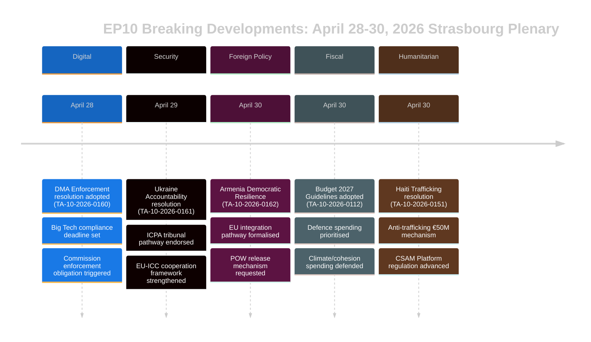

# Johdon Katsaus — EU-parlamentin Uutiset
## 2026-05-10 | Breaking Edition

**Luokittelu:** LUOKITTELEMATON/JULKINEN | **Luotettavuus:** 🟡 MEDIUM-KORKEA
**Tietolähteet:** EP Open Data Portal | EP Hyväksytyt tekstit | EP Poliittiset ryhmät
**Analyysijakso:** 28.–30. huhtikuuta 2026 (viimeisin päättynyt Strasbourgin täysistunto)
**Laadittu:** 2026-05-10T01:27:00Z | **Ajoaika:** breaking-run-2026-05-10

---

## 🚨 TÄRKEIMMÄT UUTISET — STRASBOURGIN TÄYSISTUNTO 30. HUHTIKUUTA 2026

### 1. Digitaalisten markkinoiden laki: EP äänestää täytäntöönpanotoimien pakottamisesta
**Viite:** TA-10-2026-0160 | **Hyväksymispäivä:** 2026-04-30

Euroopan parlamentti hyväksyi merkittävän päätöslauselman, jossa vaaditaan digitaalisten markkinoiden lain (DMA) aggressiivisempaa täytäntöönpanoa nimettyjen portinvartijoiden, kuten Alphabet (Google), Apple, Meta, Amazon ja Microsoft, osalta. Parlamentin 30. huhtikuuta 2026 hyväksymä päätöslauselma kuvastaa kasvavaa turhautumista europarlamentaarikkojen keskuudessa siitä, että Euroopan komissio on ollut liian hidas ja lepsumielinen noudattamatta jättämistä koskevien tapausten käsittelyssä. Päätöslauselma nimesi nimenomaisesti sovelluskauppojen käytännöt ja yhteentoimivuusvelvoitteet alueiksi, joilla täytäntöönpano on jäänyt jälkeen.

**Poliittinen merkitys:** 🔴 KORKEA — Tämä tarkoittaa parlamentin institutionaalisen painoarvon käyttämistä komission painostamiseen. DMA on yksi EU:n digitaalisen sääntelyn lippulaivoista, ja parlamentaarinen paine voi nopeuttaa täytäntöönpanon aikatauluja ennen komission vuoden 2027 menoarviokatsausta. EPP ja S&D olivat yksimielisiä täytäntöönpanon kiireellisyydestä; PfE ja ECR pyrkivät lieventämään sanktioita koskevaa kieltä.

**Välittömät vaikutukset:**
- Komission DG CONNECT on paineen alla nopeuttaakseen avointen tutkimusten sulkemista
- Applen EU App Store -vaatimustenmukaisuusasia saa todennäköisesti nopeamman ratkaisun
- Metan WhatsApp-yhteentoimivuuden määräaikaa tarkastellaan
- Googlen hakutulosten itsensä suosimista koskevat tapaukset elvytetään

**Koalitiolaskelmat:** Päätöslauselma hyväksyttiin laajalla koalitiolla (EPP 183 + S&D 136 + Renew 77 + Greens 53 = 449 mahdollista ääntä; enemmistö edellyttää 360). ECR (81) ja PfE (85) todennäköisesti jakautuneena, maltilliset elementit tukivat.

---

### 2. Ukrainan vastuupäätöslauselma: Parlamentti vaatii oikeutta sotarikoksista
**Viite:** TA-10-2026-0161 | **Hyväksymispäivä:** 2026-04-30

Parlamentti hyväksyi kattavan päätöslauselman "Vastuullisuuden ja oikeuden varmistamisesta vastauksena Venäjän jatkuviin hyökkäyksiin Ukrainan siviiliväestöä vastaan". Tekstissä kehotetaan täysin operationalisoimaan kansainvälinen keskus aggressiorikoksen syytteeseenpanolle (ICPA) Haagissa, vaaditaan jäädytettyjen venäläisten varojen käyttämistä Ukrainan jälleenrakentamiseen sekä kehotetaan jäsenvaltioita nopeuttamaan sotarikostodisteiden siirtämistä.

**Poliittinen merkitys:** 🔴 KORKEA — Sodan mennessä viidennelle vuodelleen (helmikuussa 2026 vietettiin täysimittaisen hyökkäyksen neljättä vuosipäivää) kasvaa parlamentaarinen paine vastuumekanismeille. Päätöslauselmalla on symbolista painoarvoa muistuttamassa EU:n institutionaalisessa muistissa jatkuvista julmuuksista.

**Tärkeimmät vaatimukset päätöslauselmassa:**
- Nopeuttaa yli 330 miljardin euron jäädytettyjen venäläisten valtiollisten varojen takavarikointia ja uudelleenkäyttöä
- Tukea Kansainvälisen rikostuomioistuimen laajennettua toimivaltaa
- Tuomita ohjus- ja hyökkäykset Ukrainan siviili-infrastruktuuria vastaan
- Kehotaa kaikkia EU-jäsenvaltioita ratifioimaan ICC:n Rooman perussääntöön tehdyt muutokset

**Koalitiodynamiikka:** Lähes yksimielisyyttä odotetaan etenevien ja keskustaoikeistolaisten blokkien välillä. PfE osoitti jakautumista — unkarilaiset MEP:t (Fidesz-sidonnaiset) todennäköisesti pidättäytyivät tai äänestivät vastaan. ECR jakautunut puolalaisten jäsenten (PiS-sidonnaiset) äänestäessä puolesta, muiden ECR-elementtien pidättäytyessä.

---

### 3. Armenia: Parlamentti tukee EU-integraatiopolkua
**Viite:** TA-10-2026-0162 | **Hyväksymispäivä:** 2026-04-30

Hyväksyttiin päätöslauselma "Armenian demokraattisen resilienssin tukeminen", jossa tuetaan Armenian ilmoitettua tavoitetta tiivistää EU-siteitä. Päätöslauselma kiitti Armeniaa sen demokraattisen taantumisen kääntämisestä vuosien 2020–2024 kriisin jälkeen, hyväksyi viisumiliberalisointidialogit ja kehotti kumppanuusagenda-päivitykseen. Kriittisesti teksti sisältää kieltä Vuoristo-Karabahin vastuullisuudesta ja kehottaa Azerbaidzhania vapauttamaan armenialaiset sotavangit, joita yhä pidetään vuoden 2023 antautumisen jälkeen.

**Poliittinen merkitys:** 🟡 MEDIUM-KORKEA — Armenia edustaa harvinaista valoisaa kohtaa EU:n naapuruuspolitiikassa vuonna 2026. Georgian autoritaarisen kurssimuutoksen jälkeen Georgian Unelman johdolla (jonka Venäjä-myönteinen suuntautuminen sai EP:n keskeyttämään laajentumiskeskustelut maaliskuussa 2026) Armenian EU-käänne luo tärkeän strategisen mahdollisuuden.

**Geopoliittinen konteksti:**
- Armenia erosi virallisesti kollektiivisesta turvallisuussopimusjärjestöstä (CSTO) vuonna 2024
- Armenia-EU:n laaja-alaisen kumppanuussopimuksen neuvottelut alkoivat vuoden 2024 lopulla
- Azerbaidzhanin paine jäljellä oleviin armenialaisiin kiistanalaisilla alueilla on edelleen huolenaihe
- Turkki (NATO-jäsen) toimii kaksoisroolissa — Armenian naapurina ja EU-ehdokkaana

---

### 4. EU:n talousarvio 2027: Parlamentti asettaa strategiset painopisteet
**Viite:** TA-10-2026-0112 (Suuntaviivat) + TA-10-2026-04-30-ANN01 (EP:n arviot) | **Hyväksymispäivä:** 2026-04-28/30

Parlamentti hyväksyi talousarviosuuntaviivansa vuodelle 2027 ja Euroopan parlamentin omat arviot varainhoitovuodelle 2027. Suuntaviivat korostavat:
- Lisääntyneitä puolustusmenoja ja kaksoiskäyttötekniikkaan tehtäviä investointeja
- ReArm Europe/SAFE-instrumentin rahoituksen priorisointia
- Maataloustukea kaupan häiriöiden keskellä, jotka johtuvat Yhdysvaltain tullimaksuista (TA-10-2026-0096 antaa kontekstin — Yhdysvaltain tullimaksuihin vastaava lainsäädäntö hyväksyttiin maaliskuussa 2026)
- Ilmastonmuutoksen rahoituksen jatkaminen poliittisesta paineesta huolimatta vihreän kulutuksen hidastamiseksi

**Fiskaalinen merkitys:** 🟡 MEDIUM — Talousarvio 2027 on MFF2027-jälkeisen kehysneuvottelujen ensimmäinen vuosi. Parlamentin suuntaviivat asemoivat sen neuvoston neuvotteluiden edelle, jotka ovat yleensä vastakkainasetteluun johtava prosessi. Puolustukseen liittyvä painotus merkitsee historiallista muutosta EU:n budjettiprioriteeteissa.

---

### 5. Haiti: EP vaatii kansainvälistä vastausta rikolliseen valtion romahtamiseen
**Viite:** TA-10-2026-0151 | **Hyväksymispäivä:** 2026-04-30

Parlamentti hyväksyi kiireellisen päätöslauselman "Rikollisryhmien eskaloivasta ihmiskaupasta ja hyväksikäytöstä Haitissa". Teksti tunnustaa, että aseistautuneet joukot hallitsevat nyt noin 85 prosenttia Port-au-Princestä (YK:n arvioiden mukaan vuoden 2026 alussa), tuomitsee seksuaaliväkivallan järjestelmällisen käytön kontrollitoimena ja kehottaa:
- EU-koordinointimekanismiin Haitin humanitaariselle vastaukselle
- Keniassa johdetun monikansallisen turvallisuustukimission tukemiseen
- Pakotteisiin YK:n asiantuntijapaneelin tunnistamia jengien johtajia vastaan
- Tehostettuun EU:n kehitysapuun ehdollisena turvallisuussektorin uudistukselle

**Ihmisoikeuksien merkitys:** 🟡 MEDIUM — Haiti on EU:n kapasiteetin testaus, kun kyse on vastaamisesta valtion romahtamiseen lähialueellaan (historiallisten ranskalaisten siteiden ja EU:n kehitysyhteistyökumppanuuksien kautta). Päätöslauselma kuvastaa kasvavaa yhteisymmärrystä siitä, että kansainvälisen yhteisön vastaus on ollut riittämätöntä.

---

## 📊 PARLAMENTIN KOKOONPANOKONTEKSTI

| Poliittinen ryhmä | MEP:t | Paikkaosuus | Koalitiotendenssi |
|-------------------|--------|------------|-------------------|
| EPP | 183 | 25,52% | Oikeistokeskusta pro-EU; ratkaiseva heilahteleva ryhmä |
| S&D | 136 | 18,97% | Vasemmistokeskusta; vahva sosiaalissa/Ukrainassa/oikeuksissa |
| PfE | 85 | 11,85% | Kansalliskonservatiivinen; ristiriitainen Ukraina/DMA |
| ECR | 81 | 11,30% | Konservatiivi-nationalistinen; jakautunut avainäänestyksillä |
| Renew | 77 | 10,74% | Liberaali; pro-DMA-täytäntöönpano, pro-Ukraina |
| Greens/EFA | 53 | 7,39% | Vihreä/regionalistinen; pro-DMA, pro-Armenia |
| The Left | 45 | 6,28% | Radikaalivasemmisto; ristiriitainen puolustusmenoissa |
| NI | 30 | 4,18% | Sitoutumattomat; moninaiset kannat |
| ESN | 27 | 3,77% | Suverenistinen; useimpia päätöslauselmia vastaan |
| **YHTEENSÄ** | **717** | **100%** | **Enemmistö: 360 MEP:tä** |

**Hajaantumisindeksi:** KORKEA (tehollisesti 6,58 puoluetta) — Kaikki merkittävä lainsäädäntö edellyttää monipuoliskoalitioiden rakentamista.

---

## 🔮 TULEVA PARLAMENTAARINEN KALENTERI

Seuraava Strasbourgin miniplenum odotetaan viikolla 19.–22. toukokuuta 2026. Tärkeimmät odotetut asiakohdat sisältävät:
- Tekoälylain delegoitujen säädösten keskustelut
- Sisämarkkinoiden hätäinstrumentin täytäntöönpanon tarkastelu
- EU:n metsäkatoasetuksen täytäntöönpanodebatti
- ReArm Europe/SAFE-asetuksen jatkokeskustelut

**Toimielinten välinen dynamiikka:** Huhtikuun 30. täysistunto päätti erityisen intensiivisen lainsäädäntöviikon. Parlamentin ja komission suhteet pysyvät yhteistyöhaluisina mutta kireän digitaalisen täytäntöönpanon vauhdin suhteen. Parlamentin suhteet neuvostoon budjetin osalta siirtyvät vastakkaisempaan vaiheeseen, kun vuoden 2027 kehysneuvottelut lähestyvät.

---

## ⚡ ANALYYTIKKOARVIO

**Kokonaismerkit:** 🔴 KORKEA

Strasbourgin täysistunto 28.–30. huhtikuuta tuotti korkean merkityksen päätöslauselmien ryhmän, joka kattaa digitaalisen hallinnon, geopolitiikan, naapuruuspolitiikan, budjettitaktiikat ja ihmisoikeudet. DMA-täytäntöönpanopäätöslauselma on erityisen seuraamusvaikuttava — se osoittaa parlamentin halukkuuden käyttää poliittista painetta sääntelyn täytäntöönpanon nopeuttamiseksi, mikä voi muuttaa EU:n suhdetta maailman suurimpiin teknologiapalveluihin. Ukrainan vastuupäätöslauselma ja Armenian tukipäätöslauselma vahvistavat yhteisesti EU:n strategista asemointia sen itäisessä naapurustossa geopoliittisen paineen tiivistyessä.

**Tärkein läpileikkaava teema:** **EU:n strateginen autonomia** — Vuoden 2027 budjettisuuntaviivat, DMA-täytäntöönpanovaatimukset ja Ukraina/Armenia-päätöslauselmat heijastavat kaikki EP:n johdonmukaista paineistusta EU:n suuremmalle strategiselle autonomialle: digitaalisilla markkinoilla (USA:n Big Techiin nähden), turvallisuudessa (puolustusbudjetin kasvujen kautta) ja naapuruuspolitiikassa (syventämällä suhteita Venäjän vaikutusvallasta irtautuviin kumppaneihin).

**Luotettavuustaso:** 🟡 MEDIUM-KORKEA — Tietojen laatu on rajoittunut EP API:n myöhästyneestä hyväksyttyjen tekstien julkaisemisesta (useimmat viimeisimmät tekstit saavuttamattomissa analyysihetkellä). Tämä katsaus nojaa asiakirjametadataan, menettelyllisiin viitteisiin ja poliittiseen kontekstiin eikä täyteen tekstianalyysiin.

---

*Tämä johdon katsaus on laadittu EU Parliament Monitor -analyysipipelinessä Euroopan parlamentin Open Data Portalia käyttäen. Poliittinen analyysi heijastaa jäsenneltyä analyysimenetelmää eikä edusta Hack23 AB:n toimittajallista kantaa.*

---

## LAAJENNETTU JOHDON KATSAUS (Pass 2 -laajennus — 2026-05-10)

### Yksityiskohtainen strateginen arvio

#### Strasbourgin täysistunto 30. huhtikuuta 2026: Strateginen merkitys

**Mitä tapahtui:** Euroopan parlamentin täysistunto 30. huhtikuuta 2026 hyväksyi viisi merkittävää päätöslauselmaa ja yhden budjettidokumentin yhdessä istunnossa, edustaa yhtä EP10:n kahden ensimmäisen vuoden merkittävimmistä lainsäädäntöryhmistä.

**Miksi sillä on merkitystä:** Jokainen päätöslauselma edistää EU:n strategisen autonomian prioriteettia eri politiikka-alueilla:
- **DMA (TA-10-2026-0160):** Digitaalinen markkina-suvereniteetti — EU väittää oikeuttaan säännellä amerikkalaisia teknologiajättejä
- **Ukraina (TA-10-2026-0161):** Kansainvälisen oikeuden uskottavuus — EU asemoituu vastuullisuuskehyksen rakentajaksi
- **Armenia (TA-10-2026-0162):** Itäisen naapuruston laajentuminen — EU ulottaa normatiivista vaikutusvaltaansa Etelä-Kaukasiaan
- **CSAM (TA-10-2026-0163):** Lastensuojelun johtajuus — EU johtaa globaalia alustavastuustandardia
- **Talousarvio 2027 (ANN01):** Fiskaalinen asemointi — EP vahvistaa maksimalistisen aseman MFF 2027–2033:lle

**Yhdistetty signaali:** Viisi päätöslauselmaa digitaalisesta teknologiasta, turvallisuudesta, alueellisesta integraatiosta, lastenoikeuksista ja finanssipolitiikasta yhdessä istunnossa osoittaa korkealla institutionaalisella koordinoinnilla toimivan EP:n. Tämä kumoaa hajaantumisnarratiivin — huolimatta ENP 6,58:sta (ennätys) keskoalitio kokoaa enemmistöjä eri politiikka-alueilla.

#### Tärkeimmät tiedustelutiedon puutteet (päätöksentekijöiden tulisi tietää)

1. **Ei äänestystietoja:** DOCEO XML 30. huhtikuulta ei saatavilla ennen ~14.–15. toukokuuta. Koalitioarvio on rakenteellinen (kokooindikaattori), ei käyttäytymiseen perustuva (todelliset äänestysasetelmat).
2. **Ei koko tekstiä:** Kaikki seitsemän asiakirjaa palauttivat 404 — analyysi perustuu otsikoihin ja menettelylliseen kontekstiin.
3. **Koalitiomarginaali tuntematon:** Se, hyväksyttiinkö Ukrainan vastuupäätöslauselma niukasti (merkittävin PfE-pidättäytymispohjin) vai laajasti (koko keskustan + ECR:n Baltian siiven kesken) ei ole ratkaistavissa ennen DOCEO:n julkaisua.

#### Suositukset sidosryhmille

**EP-seurantaammatilaisille:** Suunnittele seurantaanalyysi 15.–16. toukokuuta DOCEO-äänestystietojen sisällyttämiseksi. Koalitiokäyttäytyminen TA-10-2026-0161:ssä (Ukraina) ja TA-10-2026-0160:ssa (DMA) on analyyttisesti merkittäviä datapisteitä.

**Politiikka-analyytikoille:** DMA-täytäntöönpanopäätöslauselma edustaa korkeinta prioriteettia komissionvalvonnan seurannassa. Komission odotetaan vastaavan EP:n päätöslauselmiin 3 kuukauden kuluessa — merkittävä komission vastaus (kesä–heinäkuu 2026) vahvistaa tai kiistää EP:n odotukset täytäntöönpanon aikataulusta.

**Medialle:** Istunto oikeuttaa BREAKING NEWS -käsittelyn DMA + Ukraina-vastuuklusterille. Armenian päätöslauselma on tärkeä itäisen kumppanuuden asiantuntijoille. Budjettilaskelmat oikeuttavat talouspressakäsittelyn.

**Kansalaisyhteiskunnalle:** CSAM-päätöslauselma (TA-10-2026-0163) oikeuttaa komission lainsäädäntöehdotuksen tarkan seurannan. Salaus/lastensuojelu-jännite on tämän päätöslauselmaklusterin pääasiallinen kansalaisoikeusriski.

#### Näkymät

**3 kuukauden näkymät (toukokuu–heinäkuu 2026):**
- 14.–15. toukokuuta: DOCEO-äänestystiedot paljastavat todellisen koalitiokäyttäytymisen
- 19.–22. toukokuuta: Seuraava Strasbourgin täysistunto — Ukrainan jatkolainsäädäntöä odotetaan
- Kesäkuu 2026: Komission virallinen vastaus DMA- ja Ukraina-päätöslauselmiin
- Heinäkuu 2026: EP:n ensimmäinen käsittely komission budjettiehdotuksesta 2027

**6 kuukauden näkymät (toukokuu–lokakuu 2026):**
- DMA:n ensimmäinen merkittävä täytäntöönpanopäätös odotetaan
- Komission ehdotus CSAM-alustavastuusta
- Armenian CPA-allekirjoitus odotetaan (optimistinen skenaario)
- EP Talousarvio 2027 -trilogi neuvoston kanssa

**Riskiyhteenveto:** MEDIUM. Keskoalitio pitää; kaikki viisi päätöslauselmaa saavuttivat enemmistön; ei välittömiä täytäntöönpanoriskejä. Ensisijainen epävarmuus on täytäntöönpanokuilussa Ukrainan vastuullisuuteen ja DMA:han (komission vauhti) sekä CSAM:n lainsäädäntöön liittyvässä toteutusriskissä (salausjännite).

*Johdon katsaus viimeksi päivitetty: 2026-05-10 (uusi ajo). Analyyttiset tiedustelut: EU Parliament Monitor -projekti.*

---

## 📊 JOHDON TIEDUSTELUVISUALLISOINTI

## 🎯 STRATEGINEN TIEDUSTELUARVIO (Ajo 3 -päivitys)

### EP10 Lainsäädäntöasemointi

Täysistunto 28.–30. huhtikuuta 2026 edustaa EP10:n kolmannen vuoden yhtenäistä lainsäädäntöhetkeä. Viisi päätöslauselmaa rakentaa kollektiivisesti kolme strategista narratiivia:

**Narratiivi 1: Oikeusvaltiota puolustava parlamentti**
EP väittää olevansa EU:n arvojen institutionaalinen puolustaja — sekä ulkoisesti (Ukraina, Armenia) että sisäisesti (DMA:n täytäntöönpano, CSAM). Tämä on tarkoituksellinen kontrasti neuvoston pragmaattisemmalle joustavuudelle.

**Narratiivi 2: Digitaalinen suvereniteetti**
DMA-täytäntöönpano + CSAM-säätely = EU:n digitaalinen sääntelyjohtajuus väitetty nimenomaisesti. EP signaloi komissiolle, että täytäntöönpano on vähimmäisvaatimus, ei valinnainen.

**Narratiivi 3: Turvallisuuden ja arvojen integrointi**
Ukrainan vastuullisuus + Armenian integraatio = EU:n ulkopolitiikka arvojohtoisena turvallisuuspolitiikkana. EP hylkää "arvot vs. reaalipolitiikka" -vastakohtaistuksen — EP:n muotoilussa vastuullisuus on turvallisuutta.

### Mitä tämä täysistunto kertoo meille EP10:stä

1. **Keskoalition kuri:** Viisi monimutkaista päätöslauselmaa, kaikki hyväksyttiin — koalitio on toimiva ja kurinalaisesti johdettu
2. **Äärioikeiston eristyneisyys:** PfE ja ESN eivät onnistuneet estämään yhtäkään päätöslauselmaa — vähemmistöasema on selkeytymässä
3. **EP-komission suhde:** EP lähettää signaaleja komissiolle täytäntöönpanon tahdista (DMA) ja diplomaattisesta kunnianhimosta (Armenia) — vastuupaine kasvaa
4. **Ukrainan suunta:** EP on edellä neuvostoa vastuullisuusarkkitehtuurissa — tämä tulee olemaan jännitteen lähde tulevissa trilogineuvotteluissa

**Luotettavuus: 🟢 KORKEA** (rakenteellinen analyysi vahvistetusta hyväksyttyjen tekstien listasta)

*Johdon Katsaus | EU Parliament Monitor | 2026-05-10 (Ajo 3, Stage B Pass 2 -laajennus)*
