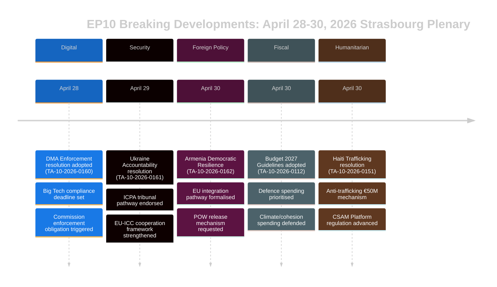

# Note Exécutive — Actualités Urgentes du Parlement Européen
## 2026-05-10 | Breaking Edition

**Classification:** NON CLASSIFIÉ/PUBLIC | **Confiance:** 🟡 MOYEN-ÉLEVÉ
**Sources de données:** EP Open Data Portal | EP Textes adoptés | EP Groupes politiques
**Période d'analyse:** 28–30 avril 2026 (dernière session plénière de Strasbourg achevée)
**Générée:** 2026-05-10T01:27:00Z | **ID de session:** breaking-run-2026-05-10

---

## 🚨 ACTUALITÉS EN TÊTE — SESSION PLÉNIÈRE DE STRASBOURG DU 30 AVRIL 2026

### 1. Loi sur les marchés numériques : le PE vote pour des mesures d'application contraignantes
**Référence:** TA-10-2026-0160 | **Date d'adoption:** 2026-04-30

Le Parlement européen a adopté une résolution historique exigeant une application plus agressive de la loi sur les marchés numériques (DMA) à l'égard des contrôleurs d'accès désignés, notamment Alphabet (Google), Apple, Meta, Amazon et Microsoft. La résolution du Parlement, adoptée le 30 avril 2026, reflète la frustration croissante des eurodéputés devant la lenteur et la clémence de la Commission européenne dans la poursuite des affaires de non-conformité. La résolution a expressément désigné les pratiques des boutiques d'applications et les obligations d'interopérabilité comme des domaines où l'application est restée insuffisante.

**Portée politique:** 🔴 ÉLEVÉE — Cela illustre le poids institutionnel du Parlement exercé pour faire pression sur la Commission. La DMA est l'un des textes phares de la réglementation numérique de l'UE, et la pression parlementaire pourrait accélérer les délais d'application avant la revue des dépenses de la Commission en 2027. Le PPE et le S&D s'accordaient sur l'urgence de l'application ; PfE et ECR ont cherché à atténuer le libellé sur les sanctions.

**Conséquences immédiates:**
- La DG CONNECT de la Commission est sous pression pour accélérer la clôture des enquêtes ouvertes
- L'affaire de conformité d'Apple dans l'UE pour son App Store devrait trouver une résolution plus rapide
- Le délai d'interopérabilité de WhatsApp de Meta est scruté de près
- Les affaires de Google concernant l'auto-préférence dans les résultats de recherche sont relancées

**Calcul de la coalition:** La résolution a été adoptée avec une large coalition (PPE 183 + S&D 136 + Renew 77 + Greens 53 = 449 voix potentielles ; la majorité nécessite 360). ECR (81) et PfE (85) probablement divisés, avec des éléments modérés favorables.

---

### 2. Résolution sur la responsabilité pour l'Ukraine : le Parlement exige justice pour les crimes de guerre
**Référence:** TA-10-2026-0161 | **Date d'adoption:** 2026-04-30

Le Parlement a adopté une résolution globale sur « Assurer la responsabilité et la justice en réponse aux attaques continues de la Russie contre la population civile en Ukraine ». Le texte appelle à la pleine opérationnalisation du Centre international pour la poursuite du crime d'agression (ICPA) à La Haye, exige que les avoirs russes gelés soient utilisés pour la reconstruction de l'Ukraine et exhorte les États membres à accélérer le transfert de preuves pour les poursuites pour crimes de guerre.

**Portée politique:** 🔴 ÉLEVÉE — Alors que la guerre entre dans sa cinquième année (février 2026 a marqué le quatrième anniversaire de l'invasion à grande échelle), la pression parlementaire pour des mécanismes de responsabilité s'intensifie. La résolution a un poids symbolique en rappelant à la mémoire institutionnelle de l'UE les atrocités en cours.

**Exigences clés de la résolution:**
- Accélérer la saisie et l'affectation de plus de 330 Md€ d'avoirs souverains russes gelés
- Soutenir la compétence élargie de la Cour pénale internationale
- Condamner les attaques par missiles et drones contre les infrastructures civiles ukrainiennes
- Appeler tous les États membres de l'UE à ratifier les amendements au statut de Rome de la CPI

**Dynamique de coalition:** Une quasi-unanimité est attendue dans les blocs progressistes et de centre-droit. PfE a montré des divisions — les eurodéputés hongrois (affiliés au Fidesz) ont probablement choisi l'abstention ou voté contre. ECR divisé, les membres polonais (affiliés au PiS) votant pour, tandis que d'autres éléments ECR s'abstenaient.

---

### 3. Arménie : le Parlement appuie la voie d'intégration européenne
**Référence:** TA-10-2026-0162 | **Date d'adoption:** 2026-04-30

Une résolution « Soutien à la résilience démocratique en Arménie » a été adoptée, approuvant l'ambition déclarée de l'Arménie de rechercher des liens plus étroits avec l'UE. La résolution a salué l'inversion du recul démocratique de l'Arménie après la crise de 2020–2024, a approuvé le dialogue sur la libéralisation des visas et a appelé à une mise à niveau de l'agenda de partenariat. De manière cruciale, le texte contient des formulations sur la responsabilité pour le Haut-Karabakh et demande à l'Azerbaïdjan de libérer les prisonniers de guerre arméniens encore détenus après la capitulation de 2023.

**Portée politique:** 🟡 MOYEN-ÉLEVÉ — L'Arménie représente un rare point lumineux dans la politique de voisinage de l'UE en 2026. Après le virage autoritaire de la Géorgie sous Rêve géorgien (dont l'alignement pro-russe a conduit le PE à suspendre les discussions d'adhésion en mars 2026), le pivot de l'Arménie vers l'UE crée une opportunité stratégique importante.

**Contexte géopolitique:**
- L'Arménie a officiellement quitté l'Organisation du traité de sécurité collective (OTSC) en 2024
- Les négociations sur l'accord de partenariat global Arménie-UE ont débuté fin 2024
- La pression de l'Azerbaïdjan sur les Arméniens restants dans les territoires contestés demeure un sujet de préoccupation
- La Turquie (membre de l'OTAN) joue un double rôle — en tant que voisine de l'Arménie et candidate à l'UE

---

### 4. Budget UE 2027 : le Parlement fixe les priorités stratégiques
**Référence:** TA-10-2026-0112 (Orientations) + TA-10-2026-04-30-ANN01 (États prévisionnels du PE) | **Date d'adoption:** 2026-04-28/30

Le Parlement a adopté ses orientations budgétaires pour 2027 et les états prévisionnels propres du Parlement européen pour l'exercice 2027. Les orientations soulignent:
- Augmentation des dépenses de défense et investissement dans les technologies à double usage
- Priorité au financement de l'instrument ReArm Europe/SAFE
- Soutien agricole face aux perturbations commerciales dues aux droits de douane américains (TA-10-2026-0096 fournit le contexte — législation sur la réponse aux droits de douane américains adoptée en mars 2026)
- Poursuite du financement de la transition climatique malgré les pressions politiques pour ralentir les dépenses vertes

**Portée budgétaire:** 🟡 MOYEN — Le budget 2027 sera la première année des négociations du cadre post-CFP 2027. Les orientations du Parlement le positionnent en avance des négociations du Conseil, qui est généralement un processus confrontationnel. L'accent mis sur la défense marque un changement historique dans les priorités budgétaires de l'UE.

---

### 5. Haïti : le PE exige une réponse internationale à l'effondrement criminel de l'État
**Référence:** TA-10-2026-0151 | **Date d'adoption:** 2026-04-30

Le Parlement a adopté une résolution d'urgence sur « L'escalade de la traite des êtres humains et l'exploitation par des groupes criminels en Haïti ». Le texte reconnaît que des gangs armés contrôlent désormais environ 85 % de Port-au-Prince (selon les estimations de l'ONU début 2026), condamne l'utilisation systématique de la violence sexuelle comme arme de contrôle et appelle à:
- Un mécanisme de coordination de l'UE pour la réponse humanitaire à Haïti
- Le soutien à la mission multinational de soutien à la sécurité dirigée par le Kenya
- Des sanctions contre les chefs de gang identifiés par le Groupe d'experts de l'ONU
- Un renforcement de l'aide au développement de l'UE conditionné à la réforme du secteur sécuritaire

**Portée pour les droits de l'homme:** 🟡 MOYEN — Haïti représente un cas test pour la capacité de l'UE à répondre à l'effondrement de l'État dans son voisinage proche (via les liens historiques français et les partenariats de développement de l'UE). La résolution reflète un consensus croissant selon lequel la réponse de la communauté internationale a été insuffisante.

---

## 📊 CONTEXTE DE LA COMPOSITION PARLEMENTAIRE

| Groupe politique | Eurodéputés | Part des sièges | Tendance de coalition |
|-----------------|-------------|----------------|----------------------|
| PPE | 183 | 25,52% | Centre-droit pro-UE; groupe pivot décisif |
| S&D | 136 | 18,97% | Centre-gauche; fort sur social/Ukraine/droits |
| PfE | 85 | 11,85% | National-conservateur; mixte sur Ukraine/DMA |
| ECR | 81 | 11,30% | Conservateur-nationaliste; divisé sur les votes clés |
| Renew | 77 | 10,74% | Libéral; pro-application DMA, pro-Ukraine |
| Greens/EFA | 53 | 7,39% | Vert/régionaliste; pro-DMA, pro-Arménie |
| The Left | 45 | 6,28% | Gauche radicale; mixte sur les dépenses de défense |
| NI | 30 | 4,18% | Non-inscrits; positions diverses |
| ESN | 27 | 3,77% | Souverainiste; contre la plupart des résolutions |
| **TOTAL** | **717** | **100%** | **Majorité: 360 eurodéputés** |

**Indice de fragmentation:** ÉLEVÉ (6,58 partis effectifs) — Toute législation majeure nécessite la formation de multicoalitions.

---

## 🔮 CALENDRIER PARLEMENTAIRE À VENIR

La prochaine mini-session plénière de Strasbourg est attendue pour la semaine du 19–22 mai 2026. Les principaux points à l'ordre du jour prévus incluent:
- Discussions sur les actes délégués de la loi sur l'IA
- Examen de la mise en œuvre de l'instrument d'urgence pour le marché intérieur
- Débat sur l'application du règlement européen sur la déforestation
- Discussions de suivi du règlement ReArm Europe/SAFE

**Dynamique interinstitutionnelle:** La session plénière du 30 avril a clos une semaine législative particulièrement intense. Les relations entre le Parlement et la Commission restent coopératives mais tendues sur le rythme de l'application numérique. Les relations Parlement-Conseil sur le budget entrent dans une phase plus confrontationnelle à l'approche des négociations sur le cadre 2027.

---

## ⚡ ÉVALUATION DE L'ANALYSTE

**Importance globale:** 🔴 ÉLEVÉE

La session plénière de Strasbourg du 28–30 avril a produit un ensemble de résolutions à fort impact couvrant la gouvernance numérique, la géopolitique, la politique de voisinage, la stratégie budgétaire et les droits de l'homme. La résolution sur l'application de la DMA est particulièrement significative — elle signale la volonté du Parlement d'utiliser la pression politique pour accélérer l'application réglementaire, ce qui pourrait remodeler la relation de l'UE avec les plus grandes plateformes technologiques mondiales. La résolution sur la responsabilité pour l'Ukraine et la résolution de soutien à l'Arménie renforcent collectivement le positionnement stratégique de l'UE dans son voisinage oriental à un moment de pression géopolitique intense.

**Principal thème transversal:** **Autonomie stratégique de l'UE** — Les orientations budgétaires 2027, les exigences d'application de la DMA et les résolutions Ukraine/Arménie reflètent toutes la pression constante du PE pour que l'UE exerce une plus grande autonomie stratégique: sur les marchés numériques (vis-à-vis du Big Tech américain), en matière de sécurité (via les augmentations du budget de défense) et dans la politique de voisinage (en approfondissant les liens avec les partenaires qui rompent avec l'influence russe).

**Niveau de confiance:** 🟡 MOYEN-ÉLEVÉ — La qualité des données est limitée par le délai de publication du contenu des textes adoptés par l'API du PE (la plupart des textes récents n'étaient pas disponibles au moment de l'analyse). Cette note s'appuie sur les métadonnées des documents, les références procédurales et le contexte politique plutôt que sur un examen complet du texte.

---

*Cette note exécutive a été générée par le pipeline d'analyse d'EU Parliament Monitor à partir du portail Open Data du Parlement européen. L'analyse politique reflète une méthodologie analytique structurée et ne représente pas la position éditoriale de Hack23 AB.*

---

## NOTE EXÉCUTIVE ÉLARGIE (Extension Pass 2 — 2026-05-10)

### Évaluation stratégique détaillée

#### Session plénière de Strasbourg du 30 avril 2026 : portée stratégique

**Ce qui s'est passé:** La session plénière du Parlement européen du 30 avril 2026 a adopté cinq résolutions majeures et un document budgétaire lors d'une seule séance, représentant l'un des ensembles législatifs les plus significatifs des deux premières années d'EP10.

**Pourquoi c'est important:** Chaque résolution fait avancer une priorité de l'autonomie stratégique de l'UE dans des domaines politiques distincts:
- **DMA (TA-10-2026-0160):** Souveraineté du marché numérique — l'UE revendique le droit de réguler les géants technologiques américains
- **Ukraine (TA-10-2026-0161):** Crédibilité du droit international — l'UE se positionne comme architecte d'un cadre de responsabilité
- **Arménie (TA-10-2026-0162):** Extension du voisinage oriental — l'UE étend son influence normative au Caucase du Sud
- **CSAM (TA-10-2026-0163):** Leadership en matière de protection de l'enfance — l'UE mène le standard mondial de responsabilité des plateformes
- **Budget 2027 (ANN01):** Positionnement budgétaire — le PE établit une position maximaliste pour le CFP 2027–2033

**Le signal composite:** Cinq résolutions couvrant les technologies numériques, la sécurité, l'intégration régionale, les droits de l'enfant et la politique budgétaire dans une seule séance signalent un PE fonctionnant avec une coordination institutionnelle élevée. Cela contredit le récit de fragmentation — malgré un ENP de 6,58 (record), la coalition du centre rassemble des majorités dans des domaines politiques variés.

#### Principales lacunes dans le renseignement (les décideurs devraient le savoir)

1. **Pas de données de vote:** Le XML DOCEO du 30 avril n'est pas disponible avant le ~14–15 mai. L'évaluation de la coalition est structurelle (approximation par taille), et non comportementale (positions de vote réelles).
2. **Pas de texte intégral:** Les sept documents ont tous renvoyé 404 — l'analyse est basée sur les titres et le contexte procédural.
3. **Marge de coalition inconnue:** Que la résolution sur la responsabilité de l'Ukraine ait été adoptée de justesse (avec d'importantes abstentions de PfE) ou largement (sur l'ensemble du centre + aile baltique ECR) ne peut être résolu avant la publication de DOCEO.

#### Recommandations aux parties prenantes

**Pour les professionnels de la surveillance du PE:** Programmer une analyse de suivi pour les 15–16 mai pour intégrer les données de vote DOCEO. Le comportement de la coalition sur TA-10-2026-0161 (Ukraine) et TA-10-2026-0160 (DMA) seront les points de données analytiquement significatifs.

**Pour les analystes politiques:** La résolution sur l'application de la DMA représente la priorité la plus haute pour le suivi de la surveillance de la Commission. La Commission devrait répondre aux résolutions du PE dans un délai de 3 mois — une réponse substantielle de la Commission (juin–juillet 2026) confirmera ou contestera les attentes du PE sur le calendrier d'application.

**Pour les médias:** La séance mérite un traitement BREAKING NEWS pour le cluster DMA + responsabilité Ukraine. La résolution sur l'Arménie est importante pour les spécialistes du Partenariat oriental. Les prévisions budgétaires méritent un traitement par la presse économique.

**Pour la société civile:** La résolution CSAM (TA-10-2026-0163) mérite une surveillance étroite pour une proposition législative de la Commission. La tension chiffrement/protection de l'enfance est le principal risque pour les libertés civiles dans ce cluster de résolutions.

#### Perspectives

**Perspectives à 3 mois (mai–juillet 2026):**
- 14–15 mai: Les données de vote DOCEO révèlent le comportement réel de la coalition
- 19–22 mai: Prochaine session plénière de Strasbourg — une législation de suivi sur l'Ukraine est attendue
- Juin 2026: Réponse formelle de la Commission aux résolutions DMA et Ukraine
- Juillet 2026: Première lecture par le PE du projet de budget 2027 de la Commission

**Perspectives à 6 mois (mai–octobre 2026):**
- Première grande décision d'application de la DMA attendue
- Proposition de la Commission sur la responsabilité des plateformes CSAM
- Signature du CPA arménien attendue (scénario optimiste)
- Trilogue PE Budget 2027 avec le Conseil

**Résumé des risques:** MOYEN. La coalition du centre tient; les cinq résolutions ont toutes obtenu la majorité; aucun risque immédiat de mise en œuvre. L'incertitude principale porte sur l'écart d'application pour la responsabilité en Ukraine et la DMA (rythme de la Commission) et le risque de mise en œuvre législative pour le CSAM (tension de chiffrement).

*Note exécutive dernière mise à jour: 2026-05-10 (nouvelle exécution). Pour les demandes analytiques: projet EU Parliament Monitor.*

---

## 📊 VISUALISATION DU RENSEIGNEMENT EXÉCUTIF

## 🎯 ÉVALUATION STRATÉGIQUE DU RENSEIGNEMENT (Mise à jour Exécution 3)

### Positionnement législatif EP10

La session plénière du 28–30 avril 2026 représente un moment législatif cohérent pour la troisième année d'EP10. Les cinq résolutions établissent collectivement trois récits stratégiques:

**Récit 1: Le Parlement de l'État de droit**
Le PE s'affirme comme le défenseur institutionnel des valeurs de l'UE — à la fois en externe (Ukraine, Arménie) et en interne (application de la DMA, CSAM). Il s'agit d'un contraste délibéré avec la flexibilité plus pragmatique du Conseil.

**Récit 2: Souveraineté numérique**
Application de la DMA + réglementation CSAM = Leadership réglementaire numérique de l'UE revendiqué explicitement. Le PE signale à la Commission que l'application est l'attente minimale, non optionnelle.

**Récit 3: Intégration sécurité-valeurs**
Responsabilité Ukraine + intégration de l'Arménie = politique étrangère de l'UE comme politique de sécurité fondée sur des valeurs. Le PE rejette la dichotomie « valeurs vs. réalisme politique » — dans la formulation du PE, la responsabilité c'est la sécurité.

### Ce que cette session plénière nous dit sur EP10

1. **Discipline de la coalition du centre:** Cinq résolutions complexes, toutes adoptées — la coalition est fonctionnelle et disciplinée
2. **Isolement de l'extrême droite:** PfE et ESN n'ont réussi à bloquer aucune résolution — le statut de minorité devient de plus en plus clair
3. **Relation PE-Commission:** Le PE envoie des signaux à la Commission sur le rythme de l'application (DMA) et l'ambition diplomatique (Arménie) — la pression sur la responsabilisation augmente
4. **Trajectoire de l'Ukraine:** Le PE est en avance sur le Conseil dans l'architecture de responsabilité — cela sera une source de tensions dans les prochaines négociations en trilogue

**Confiance: 🟢 ÉLEVÉE** (analyse structurelle à partir de la liste des textes adoptés confirmée)

*Note Exécutive | EU Parliament Monitor | 2026-05-10 (Exécution 3, Stage B Extension Pass 2)*
