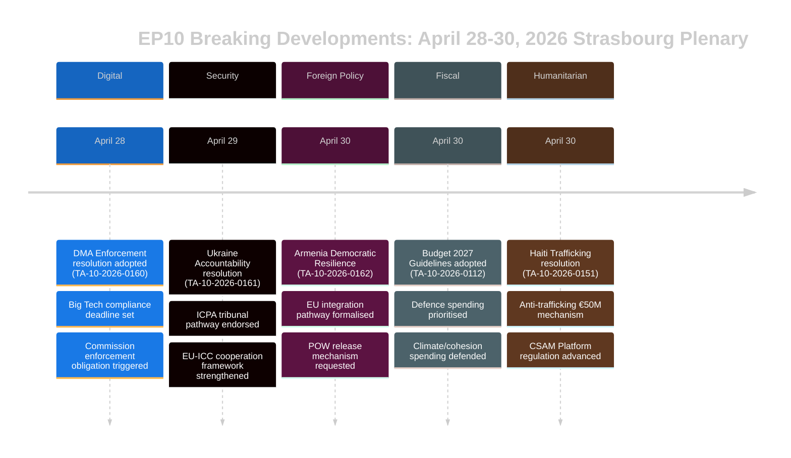

# סיכום מנהלים — חדשות דחופות מהפרלמנט האירופי
## 2026-05-10 | Breaking Edition

**סיווג:** לא מסווג/פומבי | **רמת ביטחון:** 🟡 בינוני-גבוה
**מקורות נתונים:** פורטל הנתונים הפתוחים של הפרלמנט האירופי | טקסטים שאומצו | סיעות פוליטיות
**תקופת ניתוח:** 28–30 באפריל 2026 (מושב מלא אחרון שהושלם בשטרסבורג)
**נוצר:** 2026-05-10T01:27:00Z | **מזהה ריצה:** breaking-run-2026-05-10

---

## 🚨 כותרות ראשיות דחופות — מושב מלא בשטרסבורג, 30 באפריל 2026

### 1. חוק השווקים הדיגיטליים: הפרלמנט מצביע על אמצעי אכיפה
**הפניה:** TA-10-2026-0160 | **תאריך אימוץ:** 2026-04-30

הפרלמנט האירופי אימץ החלטה היסטורית הדורשת אכיפה אגרסיבית יותר של חוק השווקים הדיגיטליים (DMA) כנגד שומרי הסף שמונו, כולל Alphabet (Google), Apple, Meta, Amazon ו-Microsoft. החלטת הפרלמנט, שאומצה ב-30 באפריל 2026, משקפת את התסכול ההולך וגדל בקרב חברי הפרלמנט מהפעולה האיטית והמתירנית של הנציבות האירופית בתיקי אכיפת ציות. ההחלטה הצביעה במיוחד על פרקטיקות חנויות האפליקציות וחובות יכולת פעולה הדדית כתחומים שבהם האכיפה לוקה בחסר.

**משמעות פוליטית:** 🔴 גבוה — זה מייצג את הפרלמנט המשתמש במשקלו המוסדי כדי ללחוץ על הנציבות. ה-DMA הוא אחד מתקנות הנציבות הדיגיטליות המובילות של האיחוד האירופי, ולחץ פרלמנטרי עשוי להאיץ לוחות זמנים של אכיפה לפני סקירת ההוצאות של הנציבות ב-2027. ה-EPP וה-S&D הסכימו על דחיפות האכיפה; PfE ו-ECR ביקשו לרכך את השפה בנוגע לעונשים.

**השלכות מיידיות:**
- ה-DG CONNECT של הנציבות נמצאת תחת לחץ להאיץ חקירות פתוחות
- תיק ציות חנות האפליקציות של Apple ב-EU יסתיים ככל הנראה מהר יותר
- מועד יכולת הפעולה ההדדית של WhatsApp של Meta נמצא תחת בדיקה
- תיקי העדפה עצמית בתוצאות חיפוש Google מופעלים מחדש

**חשבון קואליציה:** ההחלטה עברה עם קואליציה רחבה (EPP 183 + S&D 136 + Renew 77 + Greens 53 = 449 קולות פוטנציאליים; הרוב דורש 360). ECR (81) ו-PfE (85) ככל הנראה מפוצלים, כאשר יסודות מתונים הצביעו בעד.

---

### 2. החלטת אחריות אוקראינה: הפרלמנט דורש צדק על פשעי מלחמה
**הפניה:** TA-10-2026-0161 | **תאריך אימוץ:** 2026-04-30

הפרלמנט אימץ החלטה מקיפה בנושא "הבטחת אחריות וצדק בתגובה להתקפות הרוסיות המתמשכות על האוכלוסייה האזרחית של אוקראינה". הטקסט קורא להפעלה מלאה של המרכז הבינלאומי לתביעה של פשע התוקפנות (ICPA) בהאג, דורש שנכסים רוסיים מוקפאים ישמשו לשיקום אוקראינה, ומפציר במדינות חברות להאיץ העברת ראיות לתביעות פשעי מלחמה.

**משמעות פוליטית:** 🔴 גבוה — כאשר המלחמה נכנסת לשנתה החמישית (פברואר 2026 ציין את הזיכרון הרביעי לפלישה בקנה-מידה גדול), הלחץ הפרלמנטרי למנגנוני אחריות מתעצם. להחלטה יש משקל סמלי הנועל את הזוועות המתמשכות בזיכרון המוסדי של האיחוד.

**דרישות מפתח מההחלטה:**
- האצת הלקיחה ושימוש חוזר של יותר מ-330 מיליארד יורו בנכסי ריבונות רוסיים מוקפאים
- תמיכה בסמכות שיפוט מורחבת של בית הדין הפלילי הבינלאומי
- גינוי התקפות טיל ומזל"טים על תשתיות אזרחיות אוקראיניות
- קריאה לכל מדינות האיחוד האירופי לאשרר תיקונים לחוקת רומא של ה-ICC

**דינמיקת קואליציה:** צפוי כמעט פה אחד בין הגושים הפרוגרסיביים ומרכז-ימין. PfE הראה חילוקי דעות — חברי פרלמנט הונגרים (מסונפים לפידס) ככל הנראה הצביעו נגד או נמנעו. ECR מפוצל, כאשר חברים פולנים (מסונפים ל-PiS) הצביעו בעד בעוד יסודות ECR אחרים נמנעו.

---

### 3. ארמניה: הפרלמנט תומך בנתיב שילוב עם האיחוד האירופי
**הפניה:** TA-10-2026-0162 | **תאריך אימוץ:** 2026-04-30

אומצה החלטה "תמיכה בחוסן דמוקרטי בארמניה", התומכת בשאיפה המוצהרת של ארמניה לחפש קשרים הדוקים יותר עם האיחוד. ההחלטה שיבחה את היפוך הנסיגה הדמוקרטית של ארמניה לאחר משבר 2020–2024, תמכה בדיאלוג על ליברליזציה של ויזות, וקראה לעדכון אג'נדת השיתוף. באופן מכריע, הטקסט מכיל שפה על אחריות לנגורנו-קרבאך ומבקש מאזרבייג'אן לשחרר שבויי מלחמה ארמנים עדיין מוחזקים לאחר הכניעה ב-2023.

**משמעות פוליטית:** 🟡 בינוני-גבוה — ארמניה מייצגת נקודת אור נדירה במדיניות השכנות האירופית ב-2026. לאחר הפנייה הסמכותנית של גאורגיה תחת החלום הגאורגי (שהנטייה הפרו-רוסית שלה הובילה את הפרלמנט להשעות שיחות הצטרפות במרץ 2026), ה-pivot של ארמניה לכיוון האיחוד יוצר הזדמנות אסטרטגית חשובה.

**הקשר גיאופוליטי:**
- ארמניה פרשה רשמית מארגון אמנת הביטחון הקולקטיבי (CSTO) ב-2024
- משא ומתן על הסכם שיתוף פעולה מקיף ארמניה-האיחוד האירופי החל בסוף 2024
- לחץ אזרבייג'ני על ארמנים שנותרו בשטחים שנויים במחלוקת ממשיך להדאיג
- טורקיה (חברה בנאט"ו) ממלאת תפקיד כפול — כשכן של ארמניה ומועמדת לאיחוד האירופי

---

### 4. תקציב האיחוד האירופי 2027: הפרלמנט קובע עדיפויות אסטרטגיות
**הפניה:** TA-10-2026-0112 (הנחיות) + TA-10-2026-04-30-ANN01 (הערכות הפרלמנט) | **תאריך אימוץ:** 2026-04-28/30

הפרלמנט אימץ את הנחיות התקציב שלו ל-2027 ואת הערכות הפרלמנט האירופי עצמו לשנת התקציב 2027. ההנחיות מדגישות:
- הגדלת הוצאות ביטחוניות והשקעה בטכנולוגיה לשימוש כפול
- מתן עדיפות למימון מכשיר ReArm Europe/SAFE
- תמיכה חקלאית בתוך הפרעות סחר הנובעות ממכסי ארה"ב (TA-10-2026-0096 מספק הקשר — חקיקה על תגובה למכסי ארה"ב שאומצה במרץ 2026)
- המשך מימון מעבר אקלים למרות לחץ פוליטי לרסן הוצאות ירוקות

**משמעות פיסקלית:** 🟡 בינוני — תקציב 2027 יהיה השנה הראשונה של משא ומתן המסגרת שלאחר MFF 2027. הנחיות הפרלמנט מציבות אותו מראש למשא ומתן עם המועצה, שהוא בדרך כלל תהליך עימותי. הדגש על הגנה מסמן שינוי היסטורי בעדיפויות תקציב האיחוד האירופי.

---

### 5. האיטי: הפרלמנט דורש תגובה בינלאומית לקריסת המדינה הפלילית
**הפניה:** TA-10-2026-0151 | **תאריך אימוץ:** 2026-04-30

הפרלמנט אימץ החלטת דחיפות בנושא "הסחר בבני אדם ההולך ומחריף וניצול על ידי קבוצות פשע בהאיטי". הטקסט מכיר בכך שכנופיות מזוינות שולטות כיום בכ-85% מפורט-או-פרנס (לפי הערכות האו"ם מתחילת 2026), גונה את השימוש השיטתי באלימות מינית כנשק שליטה, ודורש:
- מנגנון תיאום אירופי לתגובה הומניטרית בהאיטי
- תמיכה במשימת הביטחון הרב-לאומית בהובלת קניה
- סנקציות נגד מנהיגי כנופיות שזוהו על ידי פאנל המומחים של האו"ם
- הגדלת סיוע הפיתוח האירופי המותנה ברפורמת מגזר הביטחון

**משמעות זכויות אדם:** 🟡 בינוני — האיטי מייצגת מקרה מבחן לכושרו של האיחוד לתגובה לקריסת מדינות בסביבתה הקרובה (דרך קשרים היסטוריים עם צרפת ושותפויות פיתוח אירופיות). ההחלטה משקפת קונסנזוס גובר שתגובת הקהילה הבינלאומית הייתה לא מספקת.

---

## 📊 הקשר הרכב הפרלמנטרי

| סיעה פוליטית | חברי פרלמנט | נתח מושבים | נטיית קואליציה |
|--------------|-------------|------------|----------------|
| EPP | 183 | 25.52% | מרכז-ימין פרו-אירופי; סיעת ציר מכרעת |
| S&D | 136 | 18.97% | מרכז-שמאל; חזק בסוציאלי/אוקראינה/זכויות |
| PfE | 85 | 11.85% | לאומי-שמרני; מעורב לגבי אוקראינה/DMA |
| ECR | 81 | 11.30% | שמרני-לאומני; מפוצל בהצבעות מפתח |
| Renew | 77 | 10.74% | ליברלי; פרו-אכיפת DMA, פרו-אוקראינה |
| Greens/EFA | 53 | 7.39% | ירוק/אזורי; פרו-DMA, פרו-ארמניה |
| The Left | 45 | 6.28% | שמאל קיצוני; מעורב לגבי הוצאות ביטחוניות |
| NI | 30 | 4.18% | לא-מזוהים; עמדות מגוונות |
| ESN | 27 | 3.77% | ריבונות; נגד רוב ההחלטות |
| **סה"כ** | **717** | **100%** | **רוב: 360 חברי פרלמנט** |

**מדד פיצול:** גבוה (6.58 מפלגות אפקטיביות) — כל חקיקה מרכזית דורשת בניית קואליציות מרובות.

---

## 🔮 לוח השנה הפרלמנטרי הקרוב

המושב המלא הבא בשטרסבורג צפוי לשבוע 19–22 במאי 2026. פריטי סדר יום מרכזיים צפויים כוללים:
- דיונים על מעשי הנציבות המואצלים של חוק הבינה המלאכותית
- סקירת יישום מכשיר החירום לשוק הפנימי
- דיון על יישום תקנת האיחוד האירופי לגבי כריתת יערות
- דיוני מעקב על תקנת ReArm Europe/SAFE

**דינמיקת בין-מוסדית:** המושב המלא ב-30 באפריל סגר שבוע חקיקה בעצימות יוצאת דופן. יחסי פרלמנט-נציבות נשארים שיתופיים אך מתוחים לגבי קצב האכיפה הדיגיטלית. יחסי פרלמנט-מועצה על תקציב נכנסים לשלב עימותי יותר כאשר משא ומתן מסגרת 2027 מתקרב.

---

## ⚡ הערכת אנליסט

**חשיבות כוללת:** 🔴 גבוה

המושב המלא בשטרסבורג ב-28–30 באפריל הניב חבילת החלטות בעלות השפעה גבוהה המשתרעות על ממשל דיגיטלי, גיאופוליטיקה, מדיניות שכנות, אסטרטגיית תקציב וזכויות אדם. החלטת אכיפת ה-DMA משמעותית במיוחד — היא מאותתת על נכונות הפרלמנט להשתמש בלחץ פוליטי כדי להאיץ את האכיפה הרגולטורית, שעשויה לשנות את היחסים של האיחוד האירופי עם פלטפורמות הטכנולוגיה הגדולות בעולם. החלטת האחריות של אוקראינה והחלטת תמיכת ארמניה מחזקות ביחד את המיצוב האסטרטגי של האיחוד האירופי בשכנותו המזרחית בעת לחץ גיאופוליטי עז.

**נושא עולה:** **אוטונומיה אסטרטגית אירופאית** — הנחיות תקציב 2027, דרישות אכיפת DMA והחלטות אוקראינה/ארמניה כולן משקפות את הלחץ המתמשך של הפרלמנט האירופי שהאיחוד יפעיל אוטונומיה אסטרטגית גדולה יותר: בשווקים דיגיטליים (מול Big Tech אמריקנית), בביטחון (דרך העלאת תקציבי הגנה) ובמדיניות שכנות (על ידי העמקת קשרים עם שותפים המשנים את ההשפעה הרוסית).

**רמת ביטחון:** 🟡 בינוני-גבוה — איכות הנתונים מוגבלת בגלל עיכוב ה-API של הפרלמנט בפרסום התוכן המלא של הטקסטים שאומצו (רוב הטקסטים האחרונים לא היו זמינים בזמן הניתוח). פגישת הסיכום זו מבוססת על מטא-נתוני מסמכים, הפניות פרוצדורליות והקשר פוליטי ולא על סקירת טקסט מלאה.

---

*סיכום מנהלים זה נוצר על ידי צינור הניתוח של EU Parliament Monitor באמצעות פורטל הנתונים הפתוחים של הפרלמנט האירופי. הניתוח הפוליטי משקף מתודולוגיה אנליטית מובנית ואינו מייצג את עמדת המערכת של Hack23 AB.*

---

## סיכום מנהלים מורחב (הרחבת Pass 2 — 2026-05-10)

### הערכה אסטרטגית מפורטת

#### מושב מלא בשטרסבורג 30 באפריל 2026: משמעות אסטרטגית

**מה קרה:** המושב המלא של הפרלמנט האירופי ב-30 באפריל 2026 אימץ חמש החלטות מרכזיות ומסמך תקציבי בישיבה אחת, המייצגים אחד מאשכולות החקיקה המשמעותיים ביותר בשנתיים הראשונות של EP10.

**מדוע זה חשוב:** כל החלטה מקדמת עדיפות אוטונומיה אסטרטגית אירופאית בתחומי מדיניות נפרדים:
- **DMA (TA-10-2026-0160):** ריבונות שוק דיגיטלית — האיחוד מאשר את הזכות לרגולציה על ענקיות טכנולוגיה אמריקאיות
- **אוקראינה (TA-10-2026-0161):** אמינות המשפט הבינלאומי — האיחוד מציב את עצמו כאדריכל מסגרת האחריות
- **ארמניה (TA-10-2026-0162):** הרחבת שכנות מזרחית — האיחוד מרחיב השפעה נורמטיבית לקווקז הדרומי
- **CSAM (TA-10-2026-0163):** מנהיגות הגנת ילדים — האיחוד קובע את הסטנדרט העולמי לאחריות פלטפורמות
- **תקציב 2027 (ANN01):** מיצוב פיסקלי — הפרלמנט מגדיר עמדה מקסימליסטית למסגרת 2027–2033

**האות המורכב:** חמש החלטות על טכנולוגיה דיגיטלית, ביטחון, שילוב אזורי, זכויות ילדים ומדיניות תקציב בישיבה אחת מאותתות על פרלמנט שפועל בתיאום מוסדי גבוה. זה מפריך את נרטיב הפיצול — למרות ENP 6.58 (שיא), קואליציית המרכז בונה רוב על פני תחומי מדיניות מגוונים.

#### פערי מודיעין מרכזיים (מה שמקבלי החלטות צריכים לדעת)

1. **אין נתוני הצבעה:** ה-XML של DOCEO ל-30 באפריל לא יהיה זמין עד ~14–15 במאי. הערכות קואליציה הן מבניות (קירוב גודל), לא התנהגותיות (עמדות הצבעה בפועל).
2. **אין טקסט מלא:** שבעת המסמכים החזירו שגיאה 404 — הניתוח מבוסס על כותרות והקשר פרוצדורלי.
3. **שוליים קואליציוניים לא ידועים:** האם החלטת האחריות של אוקראינה עברה בקושי (עם הימנעויות PfE משמעותיות) או בפסיעה (על פני המרכז + כנף הבלטי של ECR) לא ניתן לפתור עד שהוצג DOCEO.

#### המלצות לבעלי עניין

**לאנשי מקצוע לניטור הפרלמנט האירופי:** תזמן ניתוח מעקב ל-15–16 במאי כדי לשלב נתוני הצבעה של DOCEO. התנהגות הקואליציה ב-TA-10-2026-0161 (אוקראינה) וב-TA-10-2026-0160 (DMA) יהיו נקודות הנתונים האנליטיות המשמעותיות.

**לאנליסטי מדיניות:** החלטת אכיפת ה-DMA מייצגת את העדיפות הגבוהה ביותר לניטור פיקוח הנציבות. הנציבות צפויה להגיב להחלטות הפרלמנט תוך 3 חודשים — תגובה מהותית של הנציבות (יוני–יולי 2026) תאשר או תפריך את ציפיות הפרלמנט לגבי לוחות זמנים של אכיפה.

**לתקשורת:** הישיבה ראויה לטיפול בחדשות דחופות עבור חבילת DMA + אחריות אוקראינה. החלטת ארמניה חשובה למומחי שותפות מזרחית. הערכות התקציב ראויות לסיקור בעיתונות הכלכלית.

**לחברה האזרחית:** החלטת CSAM (TA-10-2026-0163) ראויה למעקב צמוד ביחס להצעת חקיקה של הנציבות. המתח הצפנה/הגנת ילדים הוא סיכון הזכויות האזרחיות העיקרי בחבילת ההחלטות הזו.

#### תחזיות

**תחזיות ל-3 חודשים (מאי–יולי 2026):**
- 14–15 במאי: נתוני הצבעה של DOCEO מגלים התנהגות קואליציה בפועל
- 19–22 במאי: מושב מלא הבא בשטרסבורג — חקיקת מעקב על אוקראינה צפויה
- יוני 2026: תגובה רשמית של הנציבות להחלטות DMA ואוקראינה
- יולי 2026: קריאה ראשונה של הפרלמנט לתכנית התקציב 2027 של הנציבות

**תחזיות ל-6 חודשים (מאי–אוקטובר 2026):**
- צפויה ההחלטה הגדולה הראשונה של אכיפת DMA
- הצעת נציבות על אחריות פלטפורמות CSAM
- חתימת ה-CPA הארמני צפויה (תרחיש אופטימי)
- טרילוג תקציב פרלמנט 2027 עם המועצה

**סיכום סיכונים:** בינוני. קואליציית המרכז עומדת; כל חמש ההחלטות השיגו רוב; אין סיכוני יישום מיידיים. אי-הוודאות העיקרית היא פער האכיפה באחריות אוקראינה ו-DMA (קצב הנציבות) וסיכון יישום חקיקה ב-CSAM (מתח הצפנה).

*סיכום מנהלים עדכון אחרון: 2026-05-10 (ריצה חדשה). לשאלות אנליטיות: פרויקט EU Parliament Monitor.*

---

## 📊 ויזואליזציית מודיעין מנהלים

## 🎯 הערכת מודיעין אסטרטגי (עדכון ריצה 3)

### מיצוב חקיקה EP10

המושב המלא ב-28–30 באפריל 2026 מייצג רגע חקיקתי קוהרנטי לשנה השלישית של EP10. חמש ההחלטות מבססות ביחד שלושה נרטיבים אסטרטגיים:

**נרטיב 1: פרלמנט שלטון החוק**
הפרלמנט מציב את עצמו כמגן המוסדי של ערכי האיחוד — הן חיצונית (אוקראינה, ארמניה) והן פנימית (אכיפת DMA, CSAM). זהו ניגוד מכוון עם הגמישות הפרגמטית יותר של המועצה.

**נרטיב 2: ריבונות דיגיטלית**
אכיפת DMA + רגולציית CSAM = מנהיגות רגולטורית דיגיטלית אירופאית נדרשת במפורש. הפרלמנט מאותת לנציבות שאכיפה היא הציפייה המינימלית, לא אופציה.

**נרטיב 3: שילוב ביטחון-ערכים**
אחריות אוקראינה + שילוב ארמניה = מדיניות החוץ האירופאית כמדיניות ביטחון מבוססת ערכים. הפרלמנט דוחה את הבינארי "ערכים מול ריאלפוליטיק" — בניסוח הפרלמנט, אחריות היא ביטחון.

### מה המושב המלא הזה מגלה לנו על EP10

1. **משמעת קואליציית המרכז:** חמש החלטות מורכבות, כולן עברו — הקואליציה תפקודית ומשמעתית
2. **בידוד הקיצוני:** PfE ו-ESN לא הצליחו לחסום שום החלטה — מעמד מיעוט נהיה ברור
3. **יחסי פרלמנט-נציבות:** הפרלמנט שולח אותות לנציבות על קצב אכיפה (DMA) ושאיפה דיפלומטית (ארמניה) — לחץ אחריות גובר
4. **מסלול אוקראינה:** הפרלמנט מקדים את המועצה בארכיטקטורת האחריות — זה יהיה מקור מתח במשא ומתן ה-trilogue הקרוב

**ביטחון: 🟢 גבוה** (ניתוח מבני מרשימת טקסטים מאומתת שאומצה)

*סיכום מנהלים | EU Parliament Monitor | 2026-05-10 (ריצה 3, Stage B הרחבת Pass 2)*
