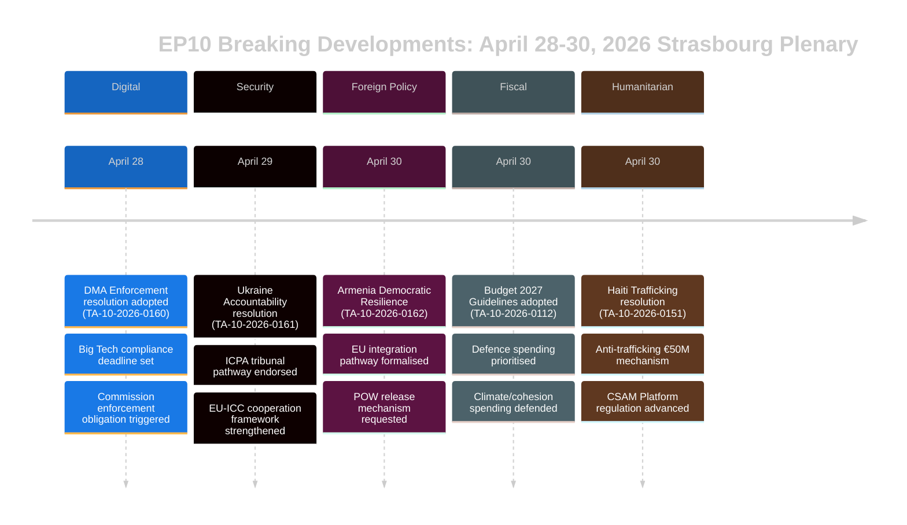

# エグゼクティブ・ブリーフ — 欧州議会 速報ニュース
## 2026-05-10 | Breaking Edition

**分類:** 非機密/公開 | **信頼度:** 🟡 中〜高
**データソース:** EP Open Data Portal | EP採択テキスト | EP政治グループ
**分析期間:** 2026年4月28〜30日（最新ストラスブール本会議完了）
**生成日時:** 2026-05-10T01:27:00Z | **実行ID:** breaking-run-2026-05-10

---

## 🚨 速報主要記事 — 2026年4月30日 ストラスブール本会議

### 1. デジタル市場法：欧州議会がゲートキーパーへの執行措置を可決
**参照:** TA-10-2026-0160 | **採択日:** 2026-04-30

欧州議会は、Alphabet (Google)・Apple・Meta・Amazon・Microsoftを含む指定ゲートキーパーに対するデジタル市場法（DMA）のより積極的な執行を求める画期的な決議を採択した。2026年4月30日に採択されたこの決議は、コンプライアンス事案における欧州委員会の対応が遅く寛容であることへの議員間の高まる不満を反映している。決議では特にアプリストアの慣行と相互運用性義務が執行不足の領域として指摘された。

**政治的意義:** 🔴 高 — 議会が欧州委員会への圧力に機関的な重みを用いた事例である。DMAはEU主要デジタル規制の一つであり、議会の圧力は2027年の欧州委員会支出見直し前に執行スケジュールを加速させる可能性がある。EPP（欧州人民党）とS&D（社会民主進歩同盟）は執行の緊急性で一致；PfEとECRは制裁に関する文言の軟化を求めた。

**直近の影響:**
- 欧州委員会DG CONNECTが進行中の調査加速への圧力にさらされている
- AppleのEUアプリストアコンプライアンス案件が早期に決着する見込み
- MetaのWhatsApp相互運用性期限が精査されている
- Googleの検索結果自己優遇案件が再活性化

**連立の計算:** 広い連立で可決（EPP 183 + S&D 136 + Renew 77 + Greens 53 = 潜在449票；過半数360票必要）。ECR（81）とPfE（85）は分裂の可能性が高く、穏健派は賛成投票。

---

### 2. ウクライナ責任決議：欧州議会が戦争犯罪への正義を要求
**参照:** TA-10-2026-0161 | **採択日:** 2026-04-30

議会は「ウクライナの民間人に対するロシアの継続的攻撃への対応における責任と正義の確保」に関する包括的決議を採択した。文書はハーグの国際侵略犯罪追訴センター（ICPA）の完全運用を求め、凍結ロシア資産をウクライナ再建に充てることを要求し、加盟国に戦争犯罪訴追のための証拠移送の加速を促している。

**政治的意義:** 🔴 高 — 戦争が5年目に入る中（2026年2月が大規模侵攻4周年）、議会の責任メカニズムへの圧力は高まっている。決議は継続する残虐行為をEU機関の記憶に刻む象徴的重みを持つ。

**決議の主要要求:**
- 3,300億ユーロを超える凍結ロシア主権資産の差し押さえと再利用の加速
- 国際刑事裁判所（ICC）の管轄権拡大を支持
- ウクライナ民間インフラへのミサイル・ドローン攻撃を非難
- 全EU加盟国にICC「ローマ規程」改正の批准を促す

**連立のダイナミクス:** 革新系・中道右派ブロック全体でほぼ全会一致が予想される。PfEは分裂を見せた — ハンガリー議員（フィデス系）は反対票または棄権の公算が高い。ECRは分裂し、ポーランド議員（PiS系）は賛成したが、ECRの他の要素は棄権。

---

### 3. アルメニア：欧州議会がEU統合の道筋を支持
**参照:** TA-10-2026-0162 | **採択日:** 2026-04-30

「アルメニアにおける民主的回復力の支援」決議が採択され、EUとのより緊密な関係を求めるアルメニアの宣言的野心を支持した。決議は2020〜2024年の危機後のアルメニアの民主後退の転換を称え、査証自由化に関する対話を支持し、連合アジェンダの更新を求めた。重要なことに、テキストはナゴルノ・カラバフの責任に関する言語を含み、アゼルバイジャンに2023年降伏後も拘留されているアルメニア人捕虜の解放を求めている。

**政治的意義:** 🟡 中〜高 — アルメニアは2026年のEU近隣政策における稀な希望の光を代表する。グルジア夢党下のグルジアの権威主義的転換（親ロシア的方向性が欧州議会に2026年3月の加盟交渉停止をもたらした）を経て、アルメニアのEUへのピボットは重要な戦略的機会を創出している。

**地政学的背景:**
- アルメニアは2024年に集団安全保障条約機構（CSTO）から正式に脱退
- アルメニア・EU包括的パートナーシップ協定（CPA）交渉は2024年末に開始
- 係争地域に残るアルメニア人へのアゼルバイジャンの圧力が懸念事項として継続
- トルコ（NATO加盟国）はアルメニアの隣国かつEU候補国として二重の役割を果たす

---

### 4. EU予算2027：欧州議会が戦略的優先事項を設定
**参照:** TA-10-2026-0112（指針）+ TA-10-2026-04-30-ANN01（EP概算）| **採択日:** 2026-04-28/30

議会は2027年の予算指針と欧州議会自身の2027会計年度概算を採択した。指針は以下を強調する：
- 防衛費の増加とデュアルユース技術への投資
- ReArm Europe/SAFE手段の資金調達を優先
- 米国関税による貿易混乱の中での農業支援（TA-10-2026-0096が背景を提供 — 2026年3月採択の米国関税対応立法）
- グリーン支出を抑制する政治的圧力にもかかわらず気候移行資金の継続

**財政的意義:** 🟡 中 — 2027年予算は2027年以降の多年次財政枠組み（MFF）交渉の初年度となる。議会の指針は通常対立的なプロセスである理事会交渉に先手を打つ形で議会を位置づける。防衛への重点はEU予算優先事項の歴史的な転換を示す。

---

### 5. ハイチ：欧州議会が犯罪的国家崩壊への国際的対応を要求
**参照:** TA-10-2026-0151 | **採択日:** 2026-04-30

議会は「ハイチにおける犯罪グループによる人身売買と搾取の激化」に関する緊急決議を採択した。テキストは武装ギャングが現在ポルトープランスの約85%を支配していると認識し（2026年初頭の国連推計）、支配の武器としての組織的な性暴力の使用を非難し、以下を求めた：
- ハイチへの人道的対応のためのEU調整メカニズム
- ケニア主導の多国籍安全保障任務支援
- 国連専門家パネルが特定したギャングリーダーへの制裁
- 安全保障部門改革を条件とするEU開発援助の増加

**人権的意義:** 🟡 中 — ハイチは（フランスとの歴史的つながりとEU開発パートナーシップを通じた）近接地域での国家崩壊に対応するEUの能力の試金石を代表する。決議は国際社会の対応が不十分であるという高まるコンセンサスを反映している。

---

## 📊 議会構成の背景

| 政治グループ | 議員数 | 議席比率 | 連立傾向 |
|------------|--------|----------|----------|
| EPP | 183 | 25.52% | 中道右派・親EU；決定的な要の議席 |
| S&D | 136 | 18.97% | 中道左派；社会/ウクライナ/権利で強力 |
| PfE | 85 | 11.85% | 国家保守主義；ウクライナ/DMAで混在 |
| ECR | 81 | 11.30% | 保守的民族主義；主要投票で分裂 |
| Renew | 77 | 10.74% | 自由主義；親DMA執行・親ウクライナ |
| Greens/EFA | 53 | 7.39% | 緑/地域主義；親DMA・親アルメニア |
| The Left | 45 | 6.28% | 急進左派；防衛費で混在 |
| NI | 30 | 4.18% | 非登録；多様な立場 |
| ESN | 27 | 3.77% | 主権主義；ほとんどの決議に反対 |
| **合計** | **717** | **100%** | **過半数：360議員** |

**分断指数:** 高（実効政党数6.58）— 主要法案はすべて複数連立の構築を要する。

---

## 🔮 今後の議会日程

次のストラスブール・ミニ本会議は2026年5月19〜22日の週に予定されている。主要な議題には以下が含まれる：
- AI法委任行為に関する討論
- 単一市場緊急手段の実施審査
- EUの森林破壊規制の適用に関する討論
- ReArm Europe/SAFE規制に関するフォローアップ討論

**機関間ダイナミクス:** 4月30日の本会議は特に激しい立法週を締めくくった。デジタル執行ペースについて議会・委員会関係は協力的だが緊張が続いている。MFF2027交渉が近づくにつれ、予算に関する議会・理事会関係はより対立的な段階に入りつつある。

---

## ⚡ アナリストの評価

**総合的な意義:** 🔴 高

4月28〜30日のストラスブール本会議は、デジタルガバナンス・地政学・近隣政策・予算戦略・人権にわたる高インパクトな決議のクラスターをもたらした。DMA執行決議は特に重要であり、規制執行を加速させるために政治的圧力を用いる議会の意欲を示し、世界最大のテクノロジープラットフォームとのEUの関係を再形成する可能性がある。ウクライナ責任決議とアルメニア支援決議は、激しい地政学的圧力の時期にEUの東部近隣における戦略的ポジショニングを集合的に強化している。

**横断的テーマ:** **EU戦略的自律性** — 2027年予算指針、DMA執行要求、ウクライナ/アルメニア決議はすべて、EUがより大きな戦略的自律性を行使するよう欧州議会からの継続的圧力を反映している：デジタル市場では（米国Big Techに対抗して）、安全保障では（防衛予算増加を通じて）、近隣政策では（ロシアの影響力と決別するパートナーとの関係深化を通じて）。

**信頼度:** 🟡 中〜高 — データ品質は採択テキストの全文公開に関するEP APIの遅延により制限されている（最近のテキストのほとんどは分析時点では利用不可だった）。このブリーフィングは文書メタデータ、手続き参照、政治的背景に基づいており、全文審査によるものではない。

---

*このエグゼクティブ・ブリーフは、EU Parliament Monitorの分析パイプラインが欧州議会オープンデータポータルを使用して生成した。政治分析は構造化された分析手法を反映しており、Hack23 ABの編集方針を代表するものではない。*

---

## 拡張エグゼクティブ・ブリーフ（Pass 2拡張 — 2026-05-10）

### 詳細な戦略評価

#### ストラスブール本会議2026年4月30日：戦略的重要性

**何が起きたか:** 欧州議会本会議2026年4月30日は、1回の会議で5つの主要決議と予算文書を採択し、EP10の最初の2年間で最も重要な立法クラスターの一つを代表した。

**なぜ重要か:** 各決議は別々の政策領域でEU戦略的自律性の優先事項を推進している：
- **DMA（TA-10-2026-0160）:** デジタル市場主権 — EUは米国テック大企業を規制する権利を主張
- **ウクライナ（TA-10-2026-0161）:** 国際法の信頼性 — EUは責任枠組みの設計者として位置づけ
- **アルメニア（TA-10-2026-0162）:** 東部近隣拡大 — EUは規範的影響力を南コーカサスに拡大
- **CSAM（TA-10-2026-0163）:** 子どもの保護リーダーシップ — EUはプラットフォーム責任のグローバル標準を設定
- **予算2027（ANN01）:** 財政的ポジショニング — EUはMFF 2027–2033の最大主義的立場を確立

**複合シグナル:** デジタルテクノロジー・安全保障・地域統合・子どもの権利・予算政策に関する5つの決議が一つの会議で生まれたことは、高い機関的調整で機能する議会を示している。これは分断の物語を否定している — ENP 6.58（記録的）にもかかわらず、中道連立は多様な政策領域で過半数を構築している。

#### 主要なインテリジェンスギャップ（意思決定者が知るべきこと）

1. **投票データなし:** 4月30日のDOCEO XMLは〜5月14〜15日まで利用不可。連立評価は構造的（規模による近似）であり、行動的（実際の投票立場）ではない。
2. **全文なし:** 7つの文書はすべて404エラー — 分析はタイトルと手続き的背景に基づいている。
3. **連立マージン不明:** ウクライナ責任決議が僅差で可決されたか（PfEの重大な棄権を伴って）または広く（中道 + ECRのバルト派翼）はDOCEOが公表されるまで解決できない。

#### 利害関係者への推奨事項

**EP監視の専門家へ:** DOCEO投票データを組み込むために5月15〜16日のフォローアップ分析をスケジュールする。TA-10-2026-0161（ウクライナ）とTA-10-2026-0160（DMA）における連立行動が分析的に重要なデータポイントとなる。

**政策アナリストへ:** DMA執行決議は欧州委員会監視の最優先事項を代表する。欧州委員会は3か月以内に欧州議会決議に対応することが期待されている — 実質的な欧州委員会の対応（2026年6〜7月）が執行スケジュールに関する議会の期待を確認または反証する。

**メディアへ:** この会議はDMA + ウクライナ責任パッケージについて速報扱いが値する。アルメニア決議は東部パートナーシップ専門家にとって重要。予算概算は財務報道での報道が値する。

**市民社会へ:** CSAM決議（TA-10-2026-0163）は欧州委員会の立法提案との関連で緊密な監視が値する。暗号化/子ども保護の緊張は、この決議クラスターにおける主要な市民的自由リスクである。

#### 見通し

**3か月の見通し（2026年5〜7月）:**
- 5月14〜15日: DOCEO投票データが実際の連立行動を明らかに
- 5月19〜22日: 次のストラスブール本会議 — ウクライナに関するフォローアップ立法が予想される
- 2026年6月: DMAとウクライナ決議に対する欧州委員会の正式な対応
- 2026年7月: 欧州委員会の予算提案2027に対する欧州議会の第一読会

**6か月の見通し（2026年5〜10月）:**
- 最初の大きなDMA執行決定が予想される
- CSAMプラットフォーム責任に関する欧州委員会提案
- アルメニアCPA署名が予想される（楽観的シナリオ）
- 理事会との欧州議会予算2027三者協議

**リスク要約:** 中程度。中道連立は持続；5つの決議すべてが過半数に到達；直近の実施リスクなし。主な不確実性はウクライナの責任とDMAにおける執行ギャップ（欧州委員会のペース）、およびCSAMにおける立法実施リスク（暗号化の緊張）である。

*エグゼクティブ・ブリーフ最終更新日: 2026-05-10（新規実行）。分析に関するお問い合わせ: EU Parliament Monitorプロジェクト。*

---

## 📊 エグゼクティブ・インテリジェンス可視化

## 🎯 戦略的インテリジェンス評価（実行3更新）

### EP10の立法的ポジショニング

2026年4月28〜30日の本会議はEP10第3年の一貫した立法的瞬間を代表する。5つの決議は集合的に3つの戦略的物語を確立している：

**物語1：法の支配議会**
欧州議会はEU価値の機関的守護者として自らを位置づけている — 対外的（ウクライナ、アルメニア）と対内的（DMA執行、CSAM）の両方において。これは理事会のより実用主義的な柔軟性との意図的な対比である。

**物語2：デジタル主権**
DMA執行 + CSAM規制 = EUのデジタル規制リーダーシップを明示的に主張。欧州議会は執行が最低限の期待であり、選択肢ではないと欧州委員会に示している。

**物語3：安全保障・価値統合**
ウクライナの責任 + アルメニア統合 = 価値に基づく安全保障政策としてのEU対外政策。欧州議会は「価値対リアルポリティーク」という二項対立を拒否している — 欧州議会の定式化では、責任は安全保障である。

### この本会議がEP10について示すもの

1. **中道連立の規律:** 5つの複雑な決議がすべて可決 — 連立は機能的で規律があり
2. **極右の孤立:** PfEとESNはいずれの決議も阻止できず — 少数派の立場が明確になりつつある
3. **欧州議会・欧州委員会関係:** 欧州議会は欧州委員会に執行ペース（DMA）と外交的野心（アルメニア）について信号を送っている — 説明責任の圧力が増大
4. **ウクライナの軌跡:** 欧州議会は責任アーキテクチャにおいて理事会を先行している — これが今後の三者協議交渉での緊張の源となる

**信頼度: 🟢 高**（確認された採択テキストリストからの構造的分析）

*エグゼクティブ・ブリーフ | EU Parliament Monitor | 2026-05-10（実行3、Stage B拡張Pass 2）*
