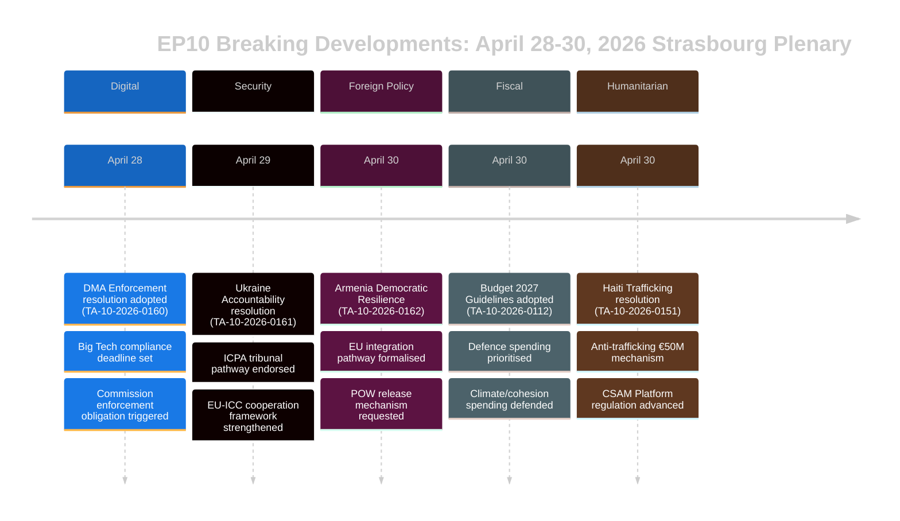

# 집행 브리핑 — 유럽의회 속보 뉴스
## 2026-05-10 | Breaking Edition

**분류:** 비기밀/공개 | **신뢰도:** 🟡 중간-높음
**데이터 출처:** EP Open Data Portal | EP 채택 텍스트 | EP 정치 그룹
**분석 기간:** 2026년 4월 28~30일 (가장 최근 완료된 스트라스부르 본회의)
**생성일:** 2026-05-10T01:27:00Z | **실행 ID:** breaking-run-2026-05-10

---

## 🚨 주요 속보 — 2026년 4월 30일 스트라스부르 본회의

### 1. 디지털시장법: 유럽의회가 게이트키퍼 집행 조치 의결
**참조:** TA-10-2026-0160 | **채택일:** 2026-04-30

유럽의회는 Alphabet (Google)·Apple·Meta·Amazon·Microsoft를 포함한 지정 게이트키퍼에 대해 디지털시장법(DMA)의 보다 공격적인 집행을 촉구하는 획기적인 결의안을 채택했다. 2026년 4월 30일 채택된 이 결의안은 준수 사안에 대한 유럽위원회의 느리고 관대한 대응에 대한 의원들의 증가하는 좌절감을 반영한다. 결의안은 특히 앱스토어 관행과 상호운용성 의무가 집행이 부족한 영역으로 지목했다.

**정치적 중요성:** 🔴 높음 — 의회가 유럽위원회에 압력을 가하기 위해 기관적 비중을 활용한 사례다. DMA는 EU의 주요 디지털 규정 중 하나로, 의회의 압력은 2027년 유럽위원회 지출 검토 전에 집행 일정을 가속화할 수 있다. EPP와 S&D는 집행의 긴박성에 동의했으며; PfE와 ECR은 제재 관련 문구를 완화하고자 했다.

**즉각적인 영향:**
- 유럽위원회 DG CONNECT가 진행 중인 조사를 가속화해야 할 압력에 직면
- EU에서의 Apple 앱스토어 준수 사건이 조기에 해결될 가능성
- Meta의 WhatsApp 상호운용성 기한이 검토 대상
- Google 검색 결과 자사 우선 사건 재활성화

**연립 계산:** 광범위한 연립으로 통과 (EPP 183 + S&D 136 + Renew 77 + Greens 53 = 잠재 449표; 과반수 360표 필요). ECR (81)과 PfE (85)는 분열 가능성이 높으며, 온건파는 찬성 투표.

---

### 2. 우크라이나 책임 결의안: 유럽의회가 전쟁범죄 정의 요구
**참조:** TA-10-2026-0161 | **채택일:** 2026-04-30

의회는 "우크라이나 민간인에 대한 러시아의 지속적인 공격에 대응하여 책임과 정의 보장"에 관한 포괄적 결의안을 채택했다. 이 문서는 헤이그의 국제침략범죄소추센터(ICPA)의 완전한 운영화를 촉구하고, 동결된 러시아 자산을 우크라이나 재건에 사용할 것을 요구하며, 회원국들에게 전쟁범죄 기소를 위한 증거 이송 가속화를 촉구한다.

**정치적 중요성:** 🔴 높음 — 전쟁이 5년째에 접어들면서 (2026년 2월은 대규모 침공 4주년), 책임 메커니즘에 대한 의회의 압력이 강화되고 있다. 결의안은 진행 중인 잔혹 행위를 EU 기관 기억에 새기는 상징적 의의를 가진다.

**결의안 핵심 요구사항:**
- 3,300억 유로 이상의 동결 러시아 주권 자산 압류 및 재사용 가속화
- 국제형사재판소(ICC)의 확장된 관할권 지지
- 우크라이나 민간 인프라에 대한 미사일 및 드론 공격 규탄
- 모든 EU 회원국에 ICC 로마 규정 개정 비준 촉구

**연립 역학:** 진보적·중도우파 블록 전반에서 거의 만장일치 예상. PfE는 분열을 보였으며 — 헝가리 의원들(피데스 계열)은 반대 또는 기권 가능성이 높다. ECR은 분열하여, 폴란드 의원들(PiS 계열)은 찬성한 반면 ECR의 다른 요소들은 기권.

---

### 3. 아르메니아: 유럽의회가 EU 통합 경로 지지
**참조:** TA-10-2026-0162 | **채택일:** 2026-04-30

"아르메니아의 민주적 회복력 지원" 결의안이 채택되어, EU와의 더 긴밀한 관계를 추구하는 아르메니아의 공표된 야망을 지지했다. 결의안은 2020~2024년 위기 이후 아르메니아의 민주적 후퇴 역전을 칭찬하고, 비자 자유화 대화를 지지하며, 연합 어젠다 업데이트를 요구했다. 중요하게도, 문서는 나고르노-카라바흐에 대한 책임에 관한 언어를 포함하고 있으며, 아제르바이잔에게 2023년 항복 이후 여전히 억류 중인 아르메니아 전쟁포로 석방을 요청한다.

**정치적 중요성:** 🟡 중간-높음 — 아르메니아는 2026년 EU 인접 정책에서 희귀한 밝은 점을 대표한다. 조지아 드림 하의 조지아의 권위주의적 전환(친러 성향으로 인해 유럽의회가 2026년 3월 가입 협상을 중단시켰다) 이후, 아르메니아의 EU로의 피벗은 중요한 전략적 기회를 만들어낸다.

**지정학적 맥락:**
- 아르메니아는 2024년 집단안보조약기구(CSTO)에서 공식 탈퇴
- 아르메니아-EU 포괄적파트너십협정(CPA) 협상이 2024년 말 시작
- 분쟁 지역의 잔존 아르메니아인에 대한 아제르바이잔의 압력이 우려 사항으로 지속
- 터키(NATO 회원국)는 아르메니아의 이웃이자 EU 후보국으로서 이중 역할을 수행

---

### 4. EU 예산 2027: 유럽의회가 전략적 우선순위 설정
**참조:** TA-10-2026-0112 (지침) + TA-10-2026-04-30-ANN01 (EP 추산) | **채택일:** 2026-04-28/30

의회는 2027년 예산 지침과 2027 회계연도에 대한 유럽의회 자체 추산을 채택했다. 지침은 다음을 강조한다:
- 방위비 지출 증가 및 이중 용도 기술 투자
- ReArm Europe/SAFE 수단 재원 조달 우선화
- 미국 관세로 인한 무역 혼란 속 농업 지원 (TA-10-2026-0096이 맥락 제공 — 2026년 3월 채택된 미국 관세 대응 입법)
- 녹색 지출을 억제하려는 정치적 압력에도 불구하고 기후 전환 자금 지원 지속

**재정적 중요성:** 🟡 중간 — 2027년 예산은 2027년 이후 다년간 재정 프레임워크(MFF) 협상의 첫 해가 될 것이다. 의회의 지침은 통상 대결적인 과정인 이사회 협상에 앞서 의회를 선제적으로 위치시킨다. 방위에 대한 강조는 EU 예산 우선순위의 역사적 전환을 표시한다.

---

### 5. 아이티: 유럽의회가 범죄 국가 붕괴에 대한 국제적 대응 촉구
**참조:** TA-10-2026-0151 | **채택일:** 2026-04-30

의회는 "아이티에서 범죄 집단에 의한 인신매매 및 착취 증가"에 관한 긴급 결의안을 채택했다. 이 문서는 무장 갱단이 현재 포르토프랭스의 약 85%를 지배하고 있다고 인정하며 (2026년 초 유엔 추정치), 통제 무기로서 성폭력의 체계적 사용을 규탄하고 다음을 요구한다:
- 아이티에 대한 인도적 대응을 위한 EU 조정 메커니즘
- 케냐 주도 다국적 안보 지원 임무 지원
- 유엔 전문가 패널이 확인한 갱단 지도자들에 대한 제재
- 안보 부문 개혁을 조건으로 한 EU 개발 원조 증가

**인권적 중요성:** 🟡 중간 — 아이티는 (프랑스와의 역사적 연결 및 EU 개발 파트너십을 통해) 근접 환경에서의 국가 붕괴에 대응하는 EU의 능력에 대한 시험 사례를 나타낸다. 결의안은 국제 사회의 대응이 불충분했다는 높아지는 합의를 반영한다.

---

## 📊 의회 구성 맥락

| 정치 그룹 | 의원 수 | 의석 비율 | 연립 성향 |
|-----------|---------|----------|----------|
| EPP | 183 | 25.52% | 중도우파 친EU; 결정적 핵심 그룹 |
| S&D | 136 | 18.97% | 중도좌파; 사회/우크라이나/권리에 강점 |
| PfE | 85 | 11.85% | 국가보수주의; 우크라이나/DMA에서 혼합 |
| ECR | 81 | 11.30% | 보수민족주의; 핵심 투표에서 분열 |
| Renew | 77 | 10.74% | 자유주의; 친DMA 집행·친우크라이나 |
| Greens/EFA | 53 | 7.39% | 녹색/지역주의; 친DMA·친아르메니아 |
| The Left | 45 | 6.28% | 급진좌파; 방위비에서 혼합 |
| NI | 30 | 4.18% | 무소속; 다양한 입장 |
| ESN | 27 | 3.77% | 주권주의; 대부분 결의안에 반대 |
| **합계** | **717** | **100%** | **과반수: 360 의원** |

**분열 지수:** 높음 (실효 정당 수 6.58) — 모든 주요 입법은 다중 연립 구축이 필요하다.

---

## 🔮 향후 의회 일정

다음 스트라스부르 미니 본회의는 2026년 5월 19~22일 주에 예정되어 있다. 주요 예정 의제 항목에는 다음이 포함된다:
- AI법 위임 행위에 관한 토론
- 단일 시장 긴급 수단 이행 검토
- EU 산림 벌채 규정 적용에 관한 토론
- ReArm Europe/SAFE 규정에 대한 후속 토론

**기관 간 역학:** 4월 30일 본회의는 특히 집중적인 입법 주간을 마무리했다. 디지털 집행 속도에 대해 의회-위원회 관계는 협력적이지만 긴장된 상태를 유지하고 있다. MFF 2027 협상이 다가옴에 따라 예산에 관한 의회-이사회 관계는 더욱 대결적인 단계에 접어들고 있다.

---

## ⚡ 분석가 평가

**전체적인 중요성:** 🔴 높음

4월 28~30일 스트라스부르 본회의는 디지털 거버넌스, 지정학, 인접 정책, 예산 전략, 인권에 걸친 고영향력 결의안 클러스터를 도출했다. DMA 집행 결의안은 특히 중요한데 — 규제 집행을 가속화하기 위해 정치적 압력을 사용하려는 의회의 의지를 보여주며, 이는 세계 최대 기술 플랫폼들과의 EU 관계를 재형성할 수 있다. 우크라이나 책임 결의안과 아르메니아 지원 결의안은 집합적으로 격심한 지정학적 압력의 시기에 동부 근린 지역에서 EU의 전략적 포지셔닝을 강화하고 있다.

**횡단적 주제:** **EU 전략적 자율성** — 2027년 예산 지침, DMA 집행 요구, 우크라이나/아르메니아 결의안은 모두 EU가 더 큰 전략적 자율성을 행사하도록 유럽의회의 지속적인 압력을 반영한다: 디지털 시장에서는 (미국 빅테크에 대항하여), 안보에서는 (방위 예산 증가를 통해), 인접 정책에서는 (러시아 영향력과 결별하는 파트너들과의 관계 심화를 통해).

**신뢰도:** 🟡 중간-높음 — 데이터 품질은 채택 텍스트의 전체 내용 발표에 대한 EP API 지연으로 제한된다 (최근 텍스트 대부분은 분석 시점에 이용 불가능했다). 이 브리핑은 전체 텍스트 검토가 아니라 문서 메타데이터, 절차적 참조, 정치적 맥락에 기반한다.

---

*이 집행 브리핑은 유럽의회 오픈 데이터 포털을 사용하는 EU Parliament Monitor 분석 파이프라인이 생성했다. 정치 분석은 구조화된 분석 방법론을 반영하며 Hack23 AB의 편집 입장을 대표하지 않는다.*

---

## 확장 집행 브리핑 (Pass 2 확장 — 2026-05-10)

### 상세 전략 평가

#### 스트라스부르 본회의 2026년 4월 30일: 전략적 중요성

**무슨 일이 있었나:** 유럽의회 본회의 2026년 4월 30일은 단일 회기에서 5개의 주요 결의안과 예산 문서를 채택하여, EP10의 첫 2년에서 가장 중요한 입법 클러스터 중 하나를 대표했다.

**왜 중요한가:** 각 결의안은 별도의 정책 영역에서 EU 전략적 자율성 우선순위를 진전시킨다:
- **DMA (TA-10-2026-0160):** 디지털 시장 주권 — EU는 미국 빅테크 규제 권리를 주장
- **우크라이나 (TA-10-2026-0161):** 국제법 신뢰성 — EU는 책임 프레임워크의 설계자로 포지셔닝
- **아르메니아 (TA-10-2026-0162):** 동부 인접 지역 확장 — EU는 남코카서스로 규범적 영향력 확대
- **CSAM (TA-10-2026-0163):** 아동 보호 리더십 — EU는 플랫폼 책임의 글로벌 표준 설정
- **예산 2027 (ANN01):** 재정적 포지셔닝 — 유럽의회는 MFF 2027–2033을 위한 최대주의 입장 설정

**복합적 신호:** 디지털 기술, 안보, 지역 통합, 아동 권리, 예산 정책에 관한 5개 결의안이 단일 회기에서 통과된 것은 높은 기관적 조율로 작동하는 의회를 보여준다. 이는 분열 서사를 반박한다 — ENP 6.58 (기록)에도 불구하고, 중도 연립은 다양한 정책 영역에서 과반수를 구축하고 있다.

#### 주요 정보 격차 (의사결정자가 알아야 할 사항)

1. **투표 데이터 없음:** 4월 30일 DOCEO XML은 ~5월 14~15일까지 이용 불가. 연립 평가는 구조적(규모 근사)이며 행동적(실제 투표 입장)이 아니다.
2. **전체 텍스트 없음:** 7개 문서 모두 404 오류 반환 — 분석은 제목과 절차적 맥락에 기반.
3. **연립 마진 불명:** 우크라이나 책임 결의안이 근소하게 통과했는지 (PfE의 상당한 기권과 함께) 아니면 넓게 (중도 전체 + ECR 발트 연안 파벌과 함께) 통과했는지는 DOCEO 발표까지 확인 불가.

#### 이해관계자 권고사항

**EP 모니터링 전문가에게:** DOCEO 투표 데이터를 통합하기 위해 5월 15~16일 후속 분석을 예약한다. TA-10-2026-0161 (우크라이나)와 TA-10-2026-0160 (DMA)에서의 연립 행동이 분석적으로 중요한 데이터 포인트가 될 것이다.

**정책 분석가에게:** DMA 집행 결의안은 유럽위원회 감독 모니터링의 최고 우선순위를 대표한다. 유럽위원회는 3개월 이내에 유럽의회 결의안에 대응할 것으로 예상된다 — 실질적인 유럽위원회 대응 (2026년 6~7월)이 집행 일정에 대한 의회의 기대를 확인하거나 반박할 것이다.

**미디어에게:** 이 회기는 DMA + 우크라이나 책임 패키지에 대해 속보 취급이 가치 있다. 아르메니아 결의안은 동부 파트너십 전문가들에게 중요하다. 예산 추산은 재무 언론에서 보도 가치가 있다.

**시민사회에게:** CSAM 결의안 (TA-10-2026-0163)은 유럽위원회 입법 제안과의 관계에서 면밀한 모니터링이 가치 있다. 암호화/아동 보호 긴장이 이 결의안 클러스터에서 주요 시민적 자유 위험이다.

#### 전망

**3개월 전망 (2026년 5~7월):**
- 5월 14~15일: DOCEO 투표 데이터가 실제 연립 행동 공개
- 5월 19~22일: 다음 스트라스부르 본회의 — 우크라이나 관련 후속 입법 예상
- 2026년 6월: DMA 및 우크라이나 결의안에 대한 유럽위원회 공식 대응
- 2026년 7월: 유럽위원회 예산안 2027에 대한 유럽의회 1차 독회

**6개월 전망 (2026년 5~10월):**
- 최초 주요 DMA 집행 결정 예상
- CSAM 플랫폼 책임에 관한 유럽위원회 제안
- 아르메니아 CPA 서명 예상 (낙관적 시나리오)
- 이사회와의 유럽의회 예산 2027 삼자 협의

**위험 요약:** 중간. 중도 연립 유지; 5개 결의안 모두 과반수 달성; 즉각적인 구현 위험 없음. 주요 불확실성은 우크라이나 책임과 DMA에서의 집행 격차 (유럽위원회 속도)와 CSAM에서의 입법 구현 위험 (암호화 긴장)이다.

*집행 브리핑 최종 업데이트: 2026-05-10 (신규 실행). 분석 문의: EU Parliament Monitor 프로젝트.*

---

## 📊 집행 정보 시각화

## 🎯 전략적 정보 평가 (실행 3 업데이트)

### EP10 입법적 포지셔닝

2026년 4월 28~30일 본회의는 EP10 3년째를 위한 일관된 입법적 순간을 대표한다. 5개의 결의안은 집합적으로 3가지 전략적 서사를 확립한다:

**서사 1: 법치주의 의회**
유럽의회는 EU 가치의 기관적 수호자로 자신을 포지셔닝한다 — 외부적으로는 (우크라이나, 아르메니아) 그리고 내부적으로는 (DMA 집행, CSAM). 이는 이사회의 더 실용주의적인 유연성과의 의도적인 대비이다.

**서사 2: 디지털 주권**
DMA 집행 + CSAM 규제 = EU 디지털 규제 리더십이 명시적으로 주장됨. 유럽의회는 집행이 최소한의 기대이지 선택사항이 아니라는 신호를 유럽위원회에 보내고 있다.

**서사 3: 안보-가치 통합**
우크라이나 책임 + 아르메니아 통합 = 가치 기반 안보 정책으로서의 EU 외교 정책. 유럽의회는 "가치 대 현실정치" 이분법을 거부한다 — 유럽의회의 공식에서 책임은 안보이다.

### 이 본회의가 EP10에 대해 말해주는 것

1. **중도 연립의 규율:** 복잡한 5개 결의안 모두 통과 — 연립은 기능적이고 규율 있음
2. **극우 고립:** PfE와 ESN은 어떤 결의안도 차단하지 못함 — 소수 지위가 명확해지고 있음
3. **유럽의회-위원회 관계:** 유럽의회는 집행 속도 (DMA)와 외교적 야망 (아르메니아)에 대해 유럽위원회에 신호를 보내고 있음 — 책임 압력 증가
4. **우크라이나 궤도:** 유럽의회는 책임 아키텍처에서 이사회를 앞서가고 있음 — 이는 다가오는 삼자 협의 협상에서 긴장의 원천이 될 것

**신뢰도: 🟢 높음** (확인된 채택 텍스트 목록의 구조적 분석)

*집행 브리핑 | EU Parliament Monitor | 2026-05-10 (실행 3, Stage B 확장 Pass 2)*
