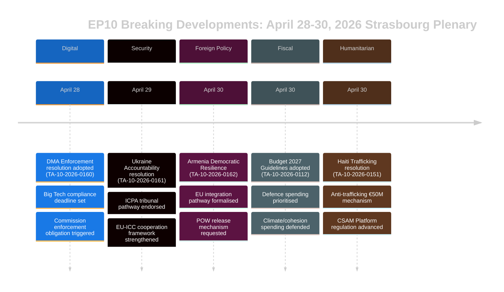

# Uitvoerend Briefing — Nieuwste Berichten Europees Parlement
## 2026-05-10 | Breaking Edition

**Classificatie:** NIET GERUBRICEERD/OPENBAAR | **Vertrouwensniveau:** 🟡 MIDDEN-HOOG
**Gegevensbronnen:** EP Open Data Portal | EP Aangenomen teksten | EP Politieke fracties
**Analyseperiode:** 28–30 april 2026 (laatste voltooide plenaire vergadering Straatsburg)
**Gegenereerd:** 2026-05-10T01:27:00Z | **Uitvoerings-ID:** breaking-run-2026-05-10

---

## 🚨 BREAKING HOOFDVERHALEN — PLENAIRE VERGADERING STRAATSBURG 30 APRIL 2026

### 1. Digital Markets Act: EP stemt voor afdwingingsmaatregelen poortwachters
**Referentie:** TA-10-2026-0160 | **Aannamesdatum:** 2026-04-30

Het Europees Parlement nam een baanbrekende resolutie aan die agressievere handhaving van de Digital Markets Act (DMA) vereist tegen aangewezen poortwachters, waaronder Alphabet (Google), Apple, Meta, Amazon en Microsoft. De resolutie van het Parlement, aangenomen op 30 april 2026, weerspiegelt de groeiende frustratie onder Parlementsleden over het trage en toegeeflijke optreden van de Europese Commissie bij nalevingszaken. De resolutie wees specifiek op app-store-praktijken en interoperabiliteitsverplichtingen als gebieden waar de handhaving tekortschoot.

**Politieke betekenis:** 🔴 HOOG — Dit vertegenwoordigt het Parlement dat zijn institutioneel gewicht inzet om druk op de Commissie te zetten. De DMA is een van de vlaggenschip digitale regelgevingen van de EU, en parlementaire druk kan handhavingstijdlijnen versnellen vóór de begrotingsevaluatie van de Commissie in 2027. EVP en S&D waren het eens over de urgentie van handhaving; PfE en ECR zochten de taal over sancties te verzachten.

**Onmiddellijke implicaties:**
- DG CONNECT van de Commissie staat onder druk om lopende onderzoeken te versnellen
- Nalevingszaak App Store van Apple in de EU zal waarschijnlijk sneller worden afgerond
- Interoperabiliteitsdeadline WhatsApp van Meta onder scrutinie
- Zelfbevorderingszaken Google zoekresultaten heractiveerd

**Coalitierekenkunde:** De resolutie werd aangenomen met een brede coalitie (EVP 183 + S&D 136 + Renew 77 + Greens 53 = 449 potentiële stemmen; meerderheid vereist 360). ECR (81) en PfE (85) waarschijnlijk verdeeld, met gematigde elementen die steunend stemden.

---

### 2. Verantwoordelijkheidsresolutie Oekraïne: EP eist gerechtigheid voor oorlogsmisdaden
**Referentie:** TA-10-2026-0161 | **Aannamesdatum:** 2026-04-30

Het Parlement nam een alomvattende resolutie aan over «Zorgen voor verantwoording en gerechtigheid als reactie op aanhoudende Russische aanvallen op de burgerbevolking van Oekraïne». De tekst roept op tot volledige operationalisering van het Internationaal Centrum voor de Vervolging van het Misdrijf van Agressie (ICPA) in Den Haag, eist dat bevroren Russische activa worden gebruikt voor de wederopbouw van Oekraïne, en dringt er bij lidstaten op aan de overdracht van bewijs voor oorlogsmisdaadvervolging te versnellen.

**Politieke betekenis:** 🔴 HOOG — Nu de oorlog zijn vijfde jaar ingaat (februari 2026 markeerde de vierde verjaardag van de grootschalige invasie), intensificeert de parlementaire druk voor verantwoordingsmechanismen. De resolutie heeft symbolisch gewicht door aanhoudende gruweldaden in het institutionele geheugen van de EU vast te leggen.

**Kernvereisten van de resolutie:**
- Versnellen van de inbeslagneming en hergebruik van meer dan 330 miljard euro aan bevroren Russische soevereine activa
- Ondersteunen van uitgebreide jurisdictie van het Internationaal Strafhof
- Veroordelen van raket- en drone-aanvallen op Oekraïense civiele infrastructuur
- Alle EU-lidstaten aandringen op ratificering van amendementen op het Statuut van Rome van het ICC

**Coalitiedynamiek:** Bijna unanimiteit verwacht over progressieve en centrum-rechtse blokken. PfE vertoonde verdeeldheid — Hongaarse Parlementsleden (Fidesz-gelieerde) stemden waarschijnlijk tegen of onthielden zich. ECR verdeeld, waarbij Poolse leden (PiS-gelieerde) vóór stemden terwijl andere ECR-elementen zich onthielden.

---

### 3. Armenië: EP steunt EU-integratietraject
**Referentie:** TA-10-2026-0162 | **Aannamesdatum:** 2026-04-30

Een resolutie «Ondersteuning van democratische veerkracht in Armenië» werd aangenomen, die de verklaarde ambitie van Armenië steunt om nauwere banden met de EU te zoeken. De resolutie prees de ommekeer van democratische achteruitgang van Armenië na de crisis van 2020–2024, steunde dialoog over visaliberalisering en vroeg om een bijgewerkte associatieagenda. Cruciaal bevat de tekst taal over verantwoording voor Nagorno-Karabach en verzoekt Azerbeidzjan Armeense krijgsgevangenen vrij te laten die nog worden vastgehouden na de capitulatie van 2023.

**Politieke betekenis:** 🟡 MIDDEN-HOOG — Armenië vertegenwoordigt een zeldzaam lichtpunt in het EU-nabuurschapsbeleid in 2026. Na de autoritaire wending van Georgië onder Georgische Droom (waarvan de pro-Russische oriëntatie ertoe leidde dat het EP de toetredingsgesprekken in maart 2026 opschortte), creëert de pivot van Armenië naar de EU een belangrijke strategische kans.

**Geopolitieke context:**
- Armenië trok zich officieel terug uit de Collectieve Veiligheidsverdragsorganisatie (CVVO) in 2024
- Onderhandelingen over het Uitgebreid Partnerschapsakkoord Armenië-EU begonnen eind 2024
- Azerbeidzjaanse druk op resterende Armeniërs in omstreden gebieden blijft een zorg
- Turkije (NAVO-lid) speelt een dubbele rol — als buurland van Armenië en EU-kandidaat

---

### 4. EU-begroting 2027: EP stelt strategische prioriteiten
**Referentie:** TA-10-2026-0112 (Richtsnoeren) + TA-10-2026-04-30-ANN01 (EP-raming) | **Aannamesdatum:** 2026-04-28/30

Het Parlement nam zijn begrotingsrichtsnoeren voor 2027 en de eigen raming van het Europees Parlement voor het begrotingsjaar 2027 aan. De richtsnoeren benadrukken:
- Verhoogde defensie-uitgaven en investeringen in tweeërlei-gebruik-technologie
- Prioritering van financiering voor het ReArm Europe/SAFE-instrument
- Landbouwsteun te midden van handelsverstoring door Amerikaanse tarieven (TA-10-2026-0096 biedt context — wetgeving over de reactie op Amerikaanse tarieven aangenomen in maart 2026)
- Voortzetting van klimaattransitiefinanciering ondanks politieke druk om groene uitgaven te temperen

**Fiscale betekenis:** 🟡 MIDDEN — De begroting 2027 wordt het eerste jaar van de post-MFK 2027-onderhandelingen. De richtsnoeren van het Parlement positioneren het vooraf op de Raadsonderhandelingen, wat doorgaans een confronterend proces is. De nadruk op defensie markeert een historische verschuiving in EU-begrotingsprioriteiten.

---

### 5. Haïti: EP eist internationale respons op criminale staatsineenstorting
**Referentie:** TA-10-2026-0151 | **Aannamesdatum:** 2026-04-30

Het Parlement nam een spoedresolutie aan over «Escalerende mensenhandel en uitbuiting door criminele groepen in Haïti». De tekst erkent dat gewapende bendes nu ongeveer 85% van Port-au-Prince controleren (VN-schattingen begin 2026), veroordeelt het stelselmatig gebruik van seksueel geweld als controlewapen en vraagt om:
- Een EU-coördinatiemechanisme voor humanitaire respons in Haïti
- Steun voor de door Kenia geleide multinationale veiligheidsmissie
- Sancties tegen bendekoppen geïdentificeerd door het VN-Panel van Experts
- Meer EU-ontwikkelingshulp voorwaardelijk gemaakt aan hervorming van de veiligheidssector

**Mensenrechtenbetekenis:** 🟡 MIDDEN — Haïti vertegenwoordigt een testgeval voor het vermogen van de EU te reageren op staatsineenstorting in haar directe omgeving (via historische banden met Frankrijk en EU-ontwikkelingspartnerschappen). De resolutie weerspiegelt een groeiende consensus dat de internationale gemeenschap ontoereikend heeft gereageerd.

---

## 📊 CONTEXT PARLEMENTAIRE SAMENSTELLING

| Politieke fractie | Parlementsleden | Zetelquote | Coalitietendens |
|-------------------|-----------------|------------|----------------|
| EVP | 183 | 25,52% | Centrum-rechts pro-EU; beslissende scharnierfractie |
| S&D | 136 | 18,97% | Centrum-links; sterk in sociaal/Oekraïne/rechten |
| PfE | 85 | 11,85% | Nationaal-conservatief; gemengd over Oekraïne/DMA |
| ECR | 81 | 11,30% | Conservatief-nationalistisch; verdeeld bij sleutelstemmingen |
| Renew | 77 | 10,74% | Liberaal; pro-DMA-handhaving, pro-Oekraïne |
| Greens/EFA | 53 | 7,39% | Groen/regionalistisch; pro-DMA, pro-Armenië |
| The Left | 45 | 6,28% | Radicaal-links; gemengd over defensie-uitgaven |
| NI | 30 | 4,18% | Niet-ingeschrevenen; diverse posities |
| ESN | 27 | 3,77% | Soevereinistisch; tegen de meeste resoluties |
| **TOTAAL** | **717** | **100%** | **Meerderheid: 360 Parlementsleden** |

**Fragmentatie-index:** HOOG (6,58 effectieve partijen) — Alle grote wetgeving vereist multi-coalitieconstructie.

---

## 🔮 KOMENDE PARLEMENTAIRE AGENDA

De volgende plenaire mini-vergadering in Straatsburg wordt verwacht in de week van 19–22 mei 2026. Verwachte grote agendapunten omvatten:
- Debatten over gedelegeerde handelingen van de AI-wet
- Beoordeling van de implementatie van het Noodinstrument voor de Interne Markt
- Debat over de tenuitvoerlegging van de EU-Ontbosseringsverordening
- Vervolgdebatten over de verordening ReArm Europe/SAFE

**Interinstitutionele dynamiek:** De plenaire vergadering van 30 april sloot een bijzonder intensieve wetgevingsweek af. De Parlement-Commissie-relaties blijven coöperatief maar gespannen over het digitale handhavingstempo. Parlement-Raad-relaties over de begroting gaan een meer confronterende fase in naarmate de MFK 2027-onderhandelingen naderen.

---

## ⚡ ANALISTBEOORDELING

**Algemene betekenis:** 🔴 HOOG

De plenaire vergadering van Straatsburg van 28–30 april produceerde een reeks resoluties met hoge impact die digitale governance, geopolitiek, nabuurschapsbeleid, begrotingsstrategie en mensenrechten omspannen. De DMA-handhavingsresolutie is bijzonder significant — het signaleert de bereidheid van het Parlement politieke druk te gebruiken om de wettelijke handhaving te versnellen, wat de relatie van de EU met de grootste technologieplatforms ter wereld kan hervormen. De verantwoordelijkheidsresolutie over Oekraïne en de steunresolutie over Armenië versterken gezamenlijk de strategische positionering van de EU in haar oostelijke nabuurschap op een moment van intense geopolitieke druk.

**Overkoepelend thema:** **EU Strategische Autonomie** — De begrotingsrichtsnoeren 2027, de DMA-handhavingseisen en de Oekraïne/Armenië-resoluties weerspiegelen allemaal de aanhoudende druk van het EP op de EU om meer strategische autonomie uit te oefenen: op digitale markten (tegenover Amerikaanse Big Tech), op veiligheid (via defensiebegrotingsverhogingen) en in nabuurschapsbeleid (door banden te verdiepen met partners die de Russische invloed breken).

**Vertrouwensniveau:** 🟡 MIDDEN-HOOG — De gegevenskwaliteit wordt beperkt door de vertraging van de EP API bij het publiceren van de volledige inhoud van aangenomen teksten (de meeste recente teksten waren niet beschikbaar ten tijde van de analyse). Dit briefingdocument is gebaseerd op documentmetadata, procedurele referenties en politieke context in plaats van volledige tekstbeoordeling.

---

*Dit uitvoerend briefingdocument werd gegenereerd door de analysepijplijn van EU Parliament Monitor met het EP Open Data Portal. Politieke analyse weerspiegelt een gestructureerde analytische methodologie en vertegenwoordigt niet het redactionele standpunt van Hack23 AB.*

---

## UITGEBREID UITVOEREND BRIEFINGDOCUMENT (Pass 2-uitbreiding — 2026-05-10)

### Gedetailleerde strategische beoordeling

#### Plenaire vergadering Straatsburg 30 april 2026: strategische betekenis

**Wat er gebeurde:** De plenaire vergadering van het Europees Parlement van 30 april 2026 nam vijf grote resoluties en een begrotingsdocument aan in één enkele zitting, wat een van de meest significante wetgevingsclusters vertegenwoordigt in de eerste twee jaar van EP10.

**Waarom het belangrijk is:** Elke resolutie bevordert een prioriteit van EU strategische autonomie op afzonderlijke beleidsterreinen:
- **DMA (TA-10-2026-0160):** Digitale marktsoevereiniteit — de EU bevestigt het recht om Amerikaanse technologiegiganten te reguleren
- **Oekraïne (TA-10-2026-0161):** Geloofwaardigheid internationaal recht — de EU positioneert zichzelf als architect van het verantwoordingskader
- **Armenië (TA-10-2026-0162):** Oostelijke nabuurschapsuitbreiding — de EU breidt normatieve invloed uit naar de Zuidelijke Kaukasus
- **CSAM (TA-10-2026-0163):** Leiderschap kinderbescherming — de EU zet de mondiale standaard voor platformverantwoordelijkheid
- **Begroting 2027 (ANN01):** Fiscale positionering — het EP stelt maximalistische positie in voor MFK 2027–2033

**Het samengestelde signaal:** Vijf resoluties over digitale technologie, veiligheid, regionale integratie, kinderrechten en begrotingsbeleid in één zitting signaleren een EP dat werkt met hoge institutionele coördinatie. Dit weerspreekt het fragmentatieverhaal — ondanks ENP 6,58 (historisch record), bouwt de centrumcoalitie meerderheden over diverse beleidsterreinen.

#### Voornaamste inlichtingslacunes (beleidsmakers moeten dit weten)

1. **Geen stemmingsdata:** De DOCEO XML van 30 april zal niet beschikbaar zijn tot ~14–15 mei. Coalitiebeoordelingen zijn structureel (groottebenadering), niet gedragsmatig (werkelijke stemmingsposities).
2. **Geen volledige tekst:** Alle zeven documenten leverden 404-fouten — analyse is gebaseerd op titels en procedurele context.
3. **Onbekende coalitie-marge:** Of de Oekraïne-verantwoordelijkheidsresolutie krap slaagde (met significante PfE-onthoudingen) of breed (over het centrum + Baltische EVP-vleugel) kan niet worden opgelost totdat DOCEO wordt gepubliceerd.

#### Aanbevelingen voor belanghebbenden

**Voor EP-monitoringprofessionals:** Plan een vervolganalyse voor 15–16 mei om DOCEO-stemmingsdata te verwerken. Het coalitiegedrag bij TA-10-2026-0161 (Oekraïne) en TA-10-2026-0160 (DMA) zijn de analytisch significante datapunten.

**Voor beleidsanalisten:** De DMA-handhavingsresolutie vertegenwoordigt de hoogste prioriteit voor de monitoring van Commissie-toezicht. De Commissie wordt verwacht te reageren op EP-resoluties binnen 3 maanden — een substantiële Commissie-reactie (juni–juli 2026) zal de EP-verwachtingen over handhavingstijdlijnen bevestigen of weerleggen.

**Voor media:** De zitting verdient BREAKING NEWS-behandeling voor het DMA + Oekraïne-verantwoordelijkheidspakket. De Armenië-resolutie is belangrijk voor specialisten in het Oostelijk Partnerschap. De begrotingsraming verdient dekking in de financiële pers.

**Voor maatschappelijk middenveld:** De CSAM-resolutie (TA-10-2026-0163) verdient nauwlettende aandacht in relatie tot een wetgevend voorstel van de Commissie. De versleuteling/kinderbeschermingsspanning is het voornaamste burgerrechtenrisico in dit resolutie-cluster.

#### Vooruitzichten

**3-maandsvooruitzichten (mei–juli 2026):**
- 14–15 mei: DOCEO-stemmingsdata onthult werkelijk coalitiegedrag
- 19–22 mei: Volgende plenaire vergadering Straatsburg — vervolgwetgeving over Oekraïne verwacht
- Juni 2026: Formele Commissie-reactie op DMA- en Oekraïne-resoluties
- Juli 2026: Eerste EP-lezing van het Commissie-begrotingsvoorstel 2027

**6-maandsvooruitzichten (mei–oktober 2026):**
- Eerste grote DMA-handhavingsbeslissing verwacht
- Commissievoorstel over CSAM-platformverantwoordelijkheid
- Armeens CPA-ondertekening verwacht (optimistisch scenario)
- EP Begroting 2027-triloog met de Raad

**Risicosamenvatting:** MIDDEN. Centrumcoalitie houdt stand; alle vijf resoluties bereikten de meerderheid; geen onmiddellijke implementatierisico's. De voornaamste onzekerheid is de handhavingskloof bij Oekraïne-verantwoording en DMA (Commissietempo) en het wetgevingsimplementatierisico bij CSAM (versleutelingsspanning).

*Uitvoerend briefingdocument laatste update: 2026-05-10 (nieuwe uitvoering). Voor analytische vragen: EU Parliament Monitor project.*

---

## 📊 VISUALISATIE UITVOERENDE INLICHTINGEN

## 🎯 STRATEGISCHE INLICHTINGENBEOORDELING (Uitvoering 3-update)

### Wetgevende positionering EP10

De plenaire vergadering van 28–30 april 2026 vertegenwoordigt een coherent wetgevend moment voor het derde jaar van EP10. De vijf resoluties stellen gezamenlijk drie strategische narratieven vast:

**Narratief 1: Het Rechtsstaat-Parlement**
Het EP stelt zichzelf in als de institutionele verdediger van EU-waarden — zowel extern (Oekraïne, Armenië) als intern (DMA-handhaving, CSAM). Dit is een bewust contrast met de meer pragmatische flexibiliteit van de Raad.

**Narratief 2: Digitale Soevereiniteit**
DMA-handhaving + CSAM-regulering = Digitaal regelgevend leiderschap van de EU expliciet geclaimd. Het EP geeft de Commissie het signaal dat handhaving de minimale verwachting is, niet optioneel.

**Narratief 3: Veiligheid-Waarden Integratie**
Oekraïne-verantwoording + Armenië-integratie = EU buitenlandbeleid als waardegebaseerd veiligheidsbeleid. Het EP verwerpt de «waarden vs. realpolitiek»-tweedeling — in de EP-formulering ís verantwoording veiligheid.

### Wat deze plenaire vergadering ons vertelt over EP10

1. **Centrumcoalitiediscipline:** Vijf complexe resoluties, allemaal aangenomen — de coalitie is functioneel en gedisciplineerd
2. **Extreem-rechts isolement:** PfE en ESN slaagden er niet in een resolutie te blokkeren — minderheidsstatus wordt duidelijk
3. **EP-Commissie-relatie:** Het EP stuurt signalen naar de Commissie over handhavingstempo (DMA) en diplomatieke ambitie (Armenië) — verantwoordingsdruk neemt toe
4. **Oekraïne-traject:** Het EP loopt voor op de Raad inzake verantwoordingsarchitectuur — dit zal een bron van spanning zijn in aankomende trioloogonderhandelingen

**Vertrouwen: 🟢 HOOG** (structurele analyse van bevestigde lijst aangenomen teksten)

*Uitvoerend Briefingdocument | EU Parliament Monitor | 2026-05-10 (Uitvoering 3, Stage B Extensie Pass 2)*
