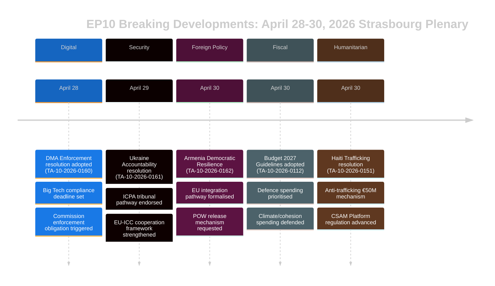

# Eksekutiv Sammendrag — EU-parlamentets Breaking News
## 2026-05-10 | Breaking Edition

**Klassifisering:** UGRADERT/OFFENTLIG | **Konfidens:** 🟡 MEDIUM-HØY
**Datakilder:** EP Open Data Portal | EP Vedtatte tekster | EP Politiske grupper
**Analyseperiode:** 28.–30. april 2026 (sist avholdte Strasbourg-plenum)
**Generert:** 2026-05-10T01:27:00Z | **Kjørings-ID:** breaking-run-2026-05-10

---

## 🚨 TOPPNYHETER — STRASBOURG-PLENUM 30. APRIL 2026

### 1. Digital Markets Act: EP stemmer for å tvinge frem håndhevingstiltak
**Referanse:** TA-10-2026-0160 | **Dato vedtatt:** 2026-04-30

Europaparlamentet vedtok en banebrytende resolusjon med krav om mer aggressiv håndhevelse av loven om digitale markeder (DMA) mot utpekte portvakter, inkludert Alphabet (Google), Apple, Meta, Amazon og Microsoft. Parlamentets resolusjon, vedtatt 30. april 2026, gjenspeiler den voksende frustrasjonen blant MEP-er over at EU-kommisjonen har vært for langsom og for ettergiven i forfølgelsen av saker om manglende etterlevelse. Resolusjonen pekte spesifikt på app-butikkpraksis og interoperabilitetsforpliktelser som områder der håndhevingen har sakket etter.

**Politisk betydning:** 🔴 HØY — Dette representerer Parlamentets bruk av sin institusjonelle tyngde til å presse Kommisjonen. DMA er ett av EUs flaggskip-digitale regelverk, og parlamentarisk press kan fremskynde håndhevingstidslinjer foran Kommisjonens utgiftsgjennomgang i 2027. EPP og S&D var enige om håndhevelsesbehovet; PfE og ECR søkte å dempe språket om sanksjoner.

**Umiddelbare konsekvenser:**
- DG CONNECT i Kommisjonen er under press for å fremskynde avslutningen av åpne undersøkelser
- Apples EU App Store-etterlevelsessak vil sannsynligvis løses raskere
- Metas WhatsApp-interoperabilitetsdeadline er under lupen
- Googles saker om selvpreferanse i søkeresultater gjenopptas

**Koalisjonsmatematikk:** Resolusjonen ble vedtatt med en bred koalisjon (EPP 183 + S&D 136 + Renew 77 + Greens 53 = 449 potensielle stemmer; majoritet krever 360). ECR (81) og PfE (85) sannsynligvis delt, med moderate elementer som støttet.

---

### 2. Ukrainas ansvarsresolusjon: Parlamentet krever rettferdighet for krigsforbrytelser
**Referanse:** TA-10-2026-0161 | **Dato vedtatt:** 2026-04-30

Parlamentet vedtok en omfattende resolusjon om «Sikring av ansvarlighet og rettferdighet som svar på Russlands fortsatte angrep mot sivilbefolkningen i Ukraina». Teksten oppfordrer til full operasjonalisering av det internasjonale senteret for rettsforfølgelse av aggresjonsforbrytelsen (ICPA) i Haag, krever at frosne russiske eiendeler brukes til Ukrainas gjenoppbygging og oppfordrer medlemsstatene til å fremskynde overføring av bevis for krigsforbrytelser.

**Politisk betydning:** 🔴 HØY — Ettersom krigen går inn i sitt femte år (februar 2026 markerte fireårsdagen for den fullskala invasjonen), intensiveres parlamentarisk press for ansvarsmekanismer. Resolusjonen har symbolsk vekt som en påminnelse i EUs institusjonelle hukommelse om pågående grusomheter.

**Sentrale krav i resolusjonen:**
- Fremskynde beslag og omforming av 330+ mrd. euro i frosne russiske statsmidler
- Støtte Den internasjonale straffedomstolens utvidede jurisdiksjon
- Fordømme missil- og droneangrep på ukrainsk sivil infrastruktur
- Oppfordre alle EU-medlemsstater til å ratifisere endringene i ICC-Roma-vedtektene

**Koalisjonsynamikk:** Nær enstemmighet forventes på tvers av progressive og sentrum-høyre blokker. PfE viste splittelse — ungarske MEP-er (Fidesz-tilknyttede) avsto sannsynligvis eller stemte mot. ECR splittet med polske medlemmer (PiS-tilknyttede) som stemte for, mens andre ECR-elementer avsto.

---

### 3. Armenia: Parlamentet støtter EU-integrasjonssti
**Referanse:** TA-10-2026-0162 | **Dato vedtatt:** 2026-04-30

En resolusjon «Støtte til demokratisk motstandskraft i Armenia» ble vedtatt, som støtter Armenias erklærte ambisjon om å søke tettere EU-bånd. Resolusjonen roste Armenias reversering av demokratisk tilbakegang etter krisen 2020–2024, godkjente visumsliberaliseringsdialogen og oppfordret til en oppgradering av partnerskapsagendaen. Kritisk nok inneholder teksten språk om ansvarlighet for Nagorno-Karabakh og oppfordrer Aserbajdsjan til å frigi armenske krigsfanger som fortsatt holdes etter kapitulasjonen i 2023.

**Politisk betydning:** 🟡 MEDIUM-HØY — Armenia representerer et sjeldent lyspunkt i EUs naboskapspolitikk i 2026. Etter Georgias autoritære kursendring under Georgiske drøm (hvis pro-russiske tilpasning fikk EP til å suspendere utvidelsessamtalene i mars 2026) skaper Armenias EU-dreiement en viktig strategisk mulighet.

**Geopolitisk kontekst:**
- Armenia forlot formelt den kollektive sikkerhetsavtaleorganisasjonen (CSTO) i 2024
- Armenia-EUs forhandlinger om en omfattende partnerskapsavtale startet i slutten av 2024
- Aserbajdsjans press mot gjenværende armeniere i omstridte territorier forblir en bekymring
- Tyrkia (NATO-medlem) spiller en dobbel rolle — som Armenias nabo og EU-kandidat

---

### 4. EU-budsjettet 2027: Parlamentet fastsetter strategiske prioriteringer
**Referanse:** TA-10-2026-0112 (Retningslinjer) + TA-10-2026-04-30-ANN01 (EPs anslag) | **Dato vedtatt:** 2026-04-28/30

Parlamentet vedtok sine budsjettretningslinjer for 2027 og Europaparlamentets egne anslag for budsjettåret 2027. Retningslinjene understreker:
- Økte forsvarsutgifter og investering i teknologi med dobbel bruk
- Prioritering av ReArm Europe/SAFE-instrumentfinansiering
- Landbruksstøtte midt i handelsforstyrrelsene fra amerikanske tollsatser (TA-10-2026-0096 gir kontekst — lovgivning om svar på amerikanske tollsatser vedtatt mars 2026)
- Fortsettelse av klimaomstillingsfinansiering til tross for politisk press om å bremse grønne utgifter

**Fiskal betydning:** 🟡 MEDIUM — Budsjett 2027 vil være det første året av den etterfølgende MFF2027-rammens forhandlinger. Parlamentets retningslinjer posisjonerer det foran rådsforhandlingene, som typisk er en konfronterende prosess. Vekten på forsvar markerer et historisk skifte i EUs budsjettprioriteringer.

---

### 5. Haiti: EP krever internasjonal respons på kriminelt statssammenbrudd
**Referanse:** TA-10-2026-0151 | **Dato vedtatt:** 2026-04-30

Parlamentet vedtok en hastereasolusjon om «Eskalerende menneskehandel og utnyttelse av kriminelle grupper i Haiti». Teksten erkjenner at væpnede gjenger nå kontrollerer ca. 85 % av Port-au-Prince (ifølge FN-anslag fra begynnelsen av 2026), fordømmer systematisk bruk av seksuell vold som kontrollvåpen og oppfordrer til:
- En EU-koordineringsmekanisme for humanitær respons for Haiti
- Støtte til Kenyas ledete multinasjonale sikkerhetsstøttemisjon
- Sanksjoner mot gjengleiadere identifisert av FN-ekspertpanelet
- Forbedret EU-utviklingsbistand betinget av reform av sikkerhetssektoren

**Menneskerettighets-betydning:** 🟡 MEDIUM — Haiti representerer en testcase for EUs kapasitet til å svare på statssammenbrudd i sitt nære utland (via historiske franske bånd og EUs utviklingspartnerskap). Resolusjonen gjenspeiler en voksende konsensus om at det internasjonale samfunnets respons har vært utilstrekkelig.

---

## 📊 PARLAMENTARISK SAMMENSETNINGSKONTEKST

| Politisk gruppe | MEP-er | Andel plasser | Koalisjonsmessig tendenser |
|----------------|--------|--------------|--------------------------|
| EPP | 183 | 25,52% | Sentrum-høyre pro-EU; avgjørende svinggruppe |
| S&D | 136 | 18,97% | Sentrum-venstre; sterk på sosiale/Ukraina/rettigheter |
| PfE | 85 | 11,85% | Nasjonalkonservativ; blandet Ukraine/DMA |
| ECR | 81 | 11,30% | Konservativ-nasjonalistisk; delt på nøkkelvoter |
| Renew | 77 | 10,74% | Liberal; pro-DMA-håndhevelse, pro-Ukraina |
| Greens/EFA | 53 | 7,39% | Grønn/regionalistisk; pro-DMA, pro-Armenia |
| The Left | 45 | 6,28% | Radikalt venstre; blandet forsvarsutgifter |
| NI | 30 | 4,18% | Ikke-tilknyttede; diverse posisjoner |
| ESN | 27 | 3,77% | Suverenistisk; mot de fleste resolusjoner |
| **TOTALT** | **717** | **100%** | **Majoritet: 360 MEP-er** |

**Fragmenteringsindeks:** HØY (effektivt 6,58 partier) — All viktig lovgivning krever multikoalisjonsbygging.

---

## 🔮 KOMMENDE PARLAMENTARISK KALENDER

Neste Strasbourg-miniplenum forventes i uken 19.–22. mai 2026. Viktige forventede agendapunkter inkluderer:
- AI-lovens delegerte akter-diskusjoner
- Gjennomgang av gjennomføringen av nødinstrumentet for det indre markedet
- EU-avskogsingsforordningens håndhevelsesdebatt
- Oppfølgingsdiskusjoner om ReArm Europe/SAFE-forordningen

**Interinstitusjonell dynamikk:** Plenum 30. april avsluttet en særlig intensiv lovgivningsuke. Forholdet mellom Parlamentet og Kommisjonen er fortsatt samarbeidsvillig, men anspent om digitalt håndhevingstempo. Parlamentets relasjon til Rådet om budsjettet går inn i en mer konfronterende fase ettersom 2027-rammeforhandlingene nærmer seg.

---

## ⚡ ANALYTIKERVURDERING

**Samlet betydning:** 🔴 HØY

Strasbourg-plenum 28.–30. april produserte en klynge av høyprofilerte resolusjoner som spenner over digital styring, geopolitikk, naboskapspolitikk, budsjettrategi og menneskerettigheter. DMA-håndhevelsesresolusjonen er særlig konsekvensrik — den signaliserer Parlamentets vilje til å bruke politisk press for å fremskynde regulatorisk håndhevelse, som potensielt kan omforme EUs relasjon til verdens største teknologiplatformer. Ukrainas ansvarsresolusjon og Armenias støtteresolusjon styrker samlet EUs strategiske posisjonering i sitt østlige nabolag i en tid med intenst geopolitisk press.

**Viktigste tverrgående tema:** **EUs strategiske autonomi** — Budsjettretningslinjene for 2027, DMA-håndhevingskravene og Ukraina/Armenia-resolusjonene gjenspeiler alle EPs konsekvente press for at EU skal utøve større strategisk autonomi: på digitale markeder (overfor USAs Big Tech), innen sikkerhet (via forsvarsbudsjettøkninger) og i naboskapspolitikken (ved å fordype båndene til partnere som bryter med russisk innflytelse).

**Konfidensnivå:** 🟡 MEDIUM-HØY — Datakvaliteten er begrenset av EP API-forsinket publisering av vedtatt tekstinnhold (de fleste nylige tekster utilgjengelige på analysetidspunktet). Dette sammendraget baserer seg på dokumentmetadata, prosessuelle referanser og politisk kontekst fremfor full tekstgjennomgang.

---

*Dette eksekutive sammendraget ble generert av EU Parliament Monitor-analyspipelinen ved hjelp av Europaparlamentets Open Data Portal. Den politiske analysen gjenspeiler en strukturert analytisk metodikk og representerer ikke Hack23 ABs redaksjonelle standpunkt.*

---

## UTVIDET EKSEKUTIVT SAMMENDRAG (Pass 2-utvidelse — 2026-05-10)

### Detaljert strategisk vurdering

#### Strasbourg-plenum 30. april 2026: Strategisk betydning

**Hva skjedde:** Europaparlamentets plenum 30. april 2026 vedtok fem store resolusjoner og ett budsjettdokument på ett enkelt møte, noe som representerer en av de mest konsekvente lovgivningsklyngene i EP10s første to år.

**Hvorfor det betyr noe:** Hver resolusjon fremmer en prioritet i EUs strategiske autonomi på tvers av ulike politikkdomener:
- **DMA (TA-10-2026-0160):** Digital markedssuverenitet — EU hevder retten til å regulere amerikanske teknologigiganter
- **Ukraina (TA-10-2026-0161):** Folkerettens troverdighet — EU posisjonerer seg som en ansvarlighetsramme-bygger
- **Armenia (TA-10-2026-0162):** Østlig naboskapsutvidelse — EU utvider normativ innflytelse til Sørlige Kaukasus
- **CSAM (TA-10-2026-0163):** Barnebeskyttelsesledelse — EU leder globalt plattformansvarsstandard
- **Budsjett 2027 (ANN01):** Fiskal posisjonering — EP etablerer maksimalistisk posisjon for MFF 2027–2033

**Det sammensatte signalet:** Fem resolusjoner som spenner over digital teknologi, sikkerhet, regional integrasjon, barnerettigheter og finanspolitikk på ett møte signaliserer et EP som fungerer med høy institusjonell koordinering. Dette imøtegår fragmenteringsnarrativet — til tross for ENP 6,58 (rekord) bygger sentrumskoalisjonen majoriteter på tvers av ulike politikkdomener.

#### Viktigste etterretningsgap (beslutningstakere bør kjenne til)

1. **Ingen stemmedata:** DOCEO XML for 30. april utilgjengelig frem til ~14.–15. mai. Koalisjonsanalyse er strukturell (størrelsesproxy), ikke atferdsbasert (faktiske stemmeposisjoner).
2. **Ingen fullstendig tekst:** Alle syv dokumenter returnerte 404 — analyse basert på titler og prosessuell kontekst.
3. **Koalisjonsmarginen ukjent:** Hvorvidt Ukrainas ansvarsresolusjon ble vedtatt smalt (med betydelige PfE-avholdelser) eller bredt (på tvers av sentrum + ECR baltisk fløy) er uløselig inntil DOCEO publiseres.

#### Anbefalinger til interessenter

**For EP-overvåkingsprofesjonelle:** Planlegg en oppfølgingsanalyse til 15.–16. mai for å inkorporere DOCEO-stemmedata. Koalisjonsatferden på TA-10-2026-0161 (Ukraina) og TA-10-2026-0160 (DMA) vil være de analytisk signifikante datapunktene.

**For politikkanalytikere:** DMA-håndhevelsesresolusjonen representerer høyest prioritet for oppfølging av kommisjonsovervåking. Kommisjonen forventes å svare på EP-resolusjoner innen 3 måneder — et substansielt kommisjonssvar (juni–juli 2026) vil bekrefte eller bestride EPs forventninger til håndhevingstidslinjen.

**For mediene:** Møtet berettiger BREAKING NEWS-behandling for DMA + Ukraina-ansvarsklyngen. Armenia-resolusjonen er viktig for spesialister på det østlige partnerskap. Budsjettanslag berettiger finanspressebehandling.

**For sivilsamfunnet:** CSAM-resolusjonen (TA-10-2026-0163) berettiger tett overvåking for et kommisjonslovgivningsforslag. Krypterings/barnebeskyttelsesspennigen er den prinsipielle sivilrettighetsrisikoen i dette resolusjonskluseret.

#### Utsikter

**3-månedsutsikter (mai–juli 2026):**
- 14.–15. mai: DOCEO-stemmedata avslører faktisk koalisjonsatferd
- 19.–22. mai: Neste Strasbourg-plenum — Ukraina-oppfølgningslovgivning forventes
- Juni 2026: Kommisjonens formelle svar på DMA- og Ukraina-resolusjonene
- Juli 2026: EPs første lesning av Kommisjonens Budsjett 2027-utkast

**6-månedsutsikter (mai–oktober 2026):**
- DMAs første store håndhevingsbeslutning forventes
- Kommisjonsforslag om CSAM-plattformsansvar
- Armenias CPA-underskrift forventes (optimistisk scenario)
- EP Budsjett 2027-trilog med Rådet

**Risikosammendrag:** MEDIUM. Sentrumskoalisjonen holder; alle fem resolusjoner oppnådde majoritet; ingen umiddelbare implementeringsrisici. Den primære usikkerheten er håndhevelsesgapet for Ukraina-ansvar og DMA (kommisjonshastighet) og lovgivningsmessig implementeringsrisiko på CSAM (krypteringsspenning).

*Eksekutivt sammendrag sist oppdatert: 2026-05-10 (ny kjøring). For analytiske forespørsler: EU Parliament Monitor-prosjektet.*

---

## 📊 EKSEKUTIV ETTERRETNINGSVISUALISERING

## 🎯 STRATEGISK ETTERRETNINGSVURDERING (Kjøring 3 oppdatering)

### EP10 Lovgivningsposisjonering

Plenum 28.–30. april 2026 representerer et sammenhengende lovgivningsøyeblikk for EP10s tredje år. De fem resolusjonene etablerer kollektivt tre strategiske narrativer:

**Narrativ 1: Rettsstats-parlamentet**
EP hevder seg som den institusjonelle forsvareren av EUs verdier — både eksternt (Ukraina, Armenia) og internt (DMA-håndhevelse, CSAM). Dette er en bevisst kontrast til Rådets mer pragmatiske fleksibilitet.

**Narrativ 2: Digital suverenitet**
DMA-håndhevelse + CSAM-regulering = EUs digitale regulatoriske lederskap hevdet eksplisitt. EP signaliserer til Kommisjonen at håndhevelse er minimumskravet, ikke valgfritt.

**Narrativ 3: Sikkerhets-verdier-integrasjon**
Ukraina-ansvar + Armenias integrasjon = EUs utenrikspolitikk som verdidrevet sikkerhetspolitikk. EP avviser binæret «verdier vs. realpolitikk» — i EPs formulering er ansvarsskyldighet sikkerhet.

### Hva dette plenum forteller oss om EP10

1. **Sentrumskoalisjonsdisiplin:** Fem komplekse resolusjoner, alle vedtatt — koalisjonen er funksjonell og disiplinert
2. **Yttrehøyre-isolering:** PfE og ESN klarte ikke å blokkere noen resolusjon — minoritetsstatus begynner å bli tydelig
3. **EP-Kommisjonsforholdet:** EP sender signaler til Kommisjonen om håndhevingstempo (DMA) og diplomatisk ambisjon (Armenia) — ansvarspress øker
4. **Ukrainas bane:** EP ligger foran Rådet på ansvarlighetsarkitekturen — dette vil være en kilde til spenning i kommende trilogforhandlinger

**Konfidens: 🟢 HØY** (strukturell analyse fra bekreftet vedtatt tekstliste)

*Eksekutivt Sammendrag | EU Parliament Monitor | 2026-05-10 (Kjøring 3, Stage B Pass 2-utvidelse)*
