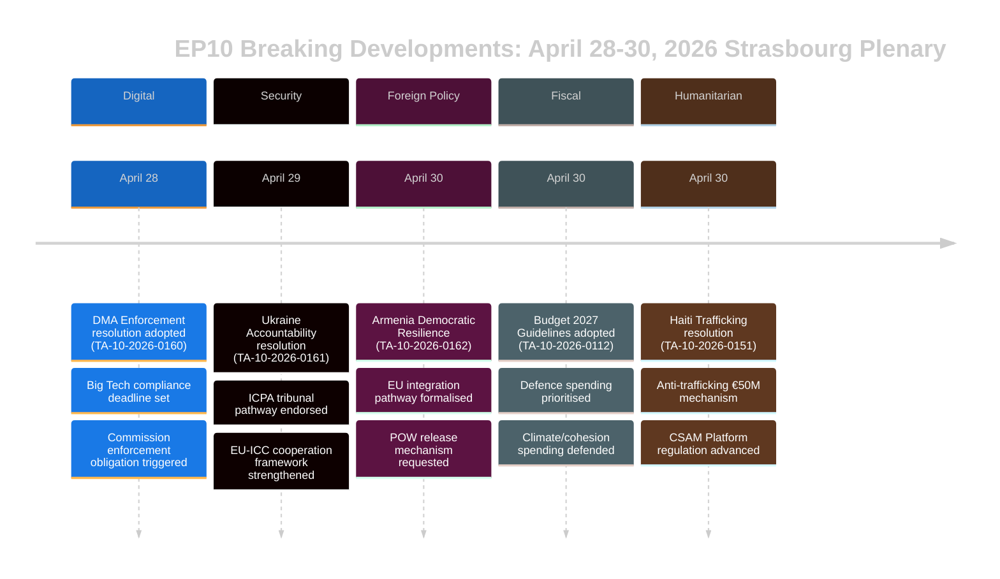

# Exekutiv Sammanfattning — EU-parlamentets Breaking News
## 2026-05-10 | Breake Edition

**Klassificering:** OKLASSIFICERAD/OFFENTLIG | **Konfidens:** 🟡 MEDIUM-HÖG
**Datakällor:** EP Open Data Portal | EP Antagna texter | EP Politiska grupper
**Analysperiod:** 28–30 april 2026 (senast avslutade Strasbourg-plenum)
**Genererad:** 2026-05-10T01:27:00Z | **Körnings-ID:** breaking-run-2026-05-10

---

## 🚨 TOPPNYHETER — STRASBOURG-PLENUM 30 APRIL 2026

### 1. Digital Markets Act: EP röstar för påtvingande av tillsynsåtgärder
**Referens:** TA-10-2026-0160 | **Datum antagen:** 2026-04-30

Europaparlamentet antog en banbrytande resolution med krav på mer aggressiv tillämpning av lagen om digitala marknader (DMA) mot utsedda grindvakter, inklusive Alphabet (Google), Apple, Meta, Amazon och Microsoft. Parlamentets resolution, antagen den 30 april 2026, återspeglar den växande frustrationen bland ledamöter av Europaparlamentet (MEP) över att Europeiska kommissionen har varit för långsam och för mild när det gäller att driva fall om bristande efterlevnad. Resolutionen pekade specifikt på appbutikernas praxis och interoperabilitetsskyldigheter som områden där tillsynen har halkat efter.

**Politisk betydelse:** 🔴 HÖG — Detta innebär att parlamentet använder sin institutionella tyngd för att pressa kommissionen. DMA är en av EU:s flaggskeppsregler på det digitala området, och parlamentstrycket kan påskynda verkstädan inför kommissionens utgiftsgranskning 2027. EPP och S&D var samstämmiga om brådskande åtgärder för tillämpning; PfE och ECR försökte dämpa skrivningen om påföljder.

**Omedelbara konsekvenser:**
- GD CONNECT i kommissionen står under press att påskynda avslutandet av pågående utredningar
- Apples EU App Store-efterlevnadsärende väntas hanteras snabbare
- Metas deadline för WhatsApp-interoperabilitet granskas
- Googles fall om självpreferens i sökresultat återupptas

**Koalitionsmatematik:** Resolutionen antogs med en bred koalition (EPP 183 + S&D 136 + Renew 77 + Greens 53 = 449 potentiella röster; majoritet kräver 360). ECR (81) och PfE (85) sannolikt delade, med moderata element som stödde.

---

### 2. Ukrainas ansvarsresolution: Parlamentet kräver rättvisa för krigsbrott
**Referens:** TA-10-2026-0161 | **Datum antagen:** 2026-04-30

Parlamentet antog en övergripande resolution om "Säkerställa ansvarsskyldighet och rättvisa som svar på Rysslands fortsatta angrepp mot civilbefolkningen i Ukraina." Texten uppmanar till full operationalisering av det internationella centret för åtal för brottet aggression (ICPA) i Haag, kräver att frysta ryska tillgångar används för Ukrainas återuppbyggnad och uppmanar medlemsstaterna att påskynda överlämning av bevis för krigsbrott.

**Politisk betydelse:** 🔴 HÖG — I takt med att kriget går in på sitt femte år (februari 2026 markerade fyraårsdagen av den fullskaliga invasionen) ökar parlamentets tryck på ansvarsskyldighetsmekanismer. Resolutionen har symbolisk vikt som en påminnelse om pågående grymheter i EU:s institutionella minne.

**Viktigaste krav i resolutionen:**
- Påskynda beslagtagande och omvandling av 330+ miljarder euro i frysta ryska statsegendomar
- Stödja Internationella brottmålsdomstolens utvidgade jurisdiktion
- Fördöma missil- och drönarattacker mot ukrainsk civil infrastruktur
- Uppmanar alla EU-medlemsstater att ratificera ändringarna av ICC:s Romstadga

**Koalitionsdynamik:** Nästan enhällighet förväntas bland progressiva och centerkonservativa block. PfE visade splittring — ungerska MEP:er (Fidesz-anknutna) avstod sannolikt eller röstade emot. ECR delad med polska ledamöter (PiS-anknutna) röstade för medan andra ECR-element lade ner rösterna.

---

### 3. Armenien: Parlamentet stöder EU-integrationsväg
**Referens:** TA-10-2026-0162 | **Datum antagen:** 2026-04-30

En resolution "Stöd för demokratisk motståndskraft i Armenien" antogs och stödjer Armeniens uttalade ambition att söka tätare EU-band. Resolutionen berömde Armeniens vändning från demokratisk tillbakagång efter krisen 2020–2024, stödde dialogen om viseringsfriheter och uppmanade till en uppgradering av partnerskapsagendan. Kritiskt sett innehåller texten formuleringar om ansvarsskyldighet för Nagorno-Karabach och uppmanar Azerbajdzjan att frigöra armeniska krigsfångar som fortfarande hålls efter 2023 års kapitulation.

**Politisk betydelse:** 🟡 MEDIUM-HÖG — Armenien representerar en sällsynt ljuspunkt i EU:s grannskapspolitik 2026. Efter Georgiens auktoritära kursändring under Georgiska drömmen (vars pro-ryska inriktning fick EP att avbryta utvidgningssamtalen i mars 2026) skapar Armeniens EU-vridning en viktig strategisk möjlighet.

**Geopolitisk kontext:**
- Armenien lämnade formellt den kollektiva säkerhetsfördragsorganisationen (CSTO) 2024
- Armenien-EU:s förhandlingar om ett övergripande partnerskapsavtal inleddes i slutet av 2024
- Azerbajdzjans tryck mot kvarvarande armenier i omstridda territorier är fortsatt ett problem
- Turkiet (NATO-medlem) spelar en dubbel roll — som Armeniens granne och EU-kandidat

---

### 4. EU-budget 2027: Parlamentet fastställer strategiska prioriteringar
**Referens:** TA-10-2026-0112 (Riktlinjer) + TA-10-2026-04-30-ANN01 (EP:s uppskattningar) | **Datum antagen:** 2026-04-28/30

Parlamentet antog sina budgetriktlinjer för 2027 och Europaparlamentets egna uppskattningar för budgetåret 2027. Riktlinjerna betonar:
- Ökad försvarsutgift och investering i teknik för dubbla användningsområden
- Prioritering av finansiering för ReArm Europe/SAFE-instrumentet
- Jordbruksstöd mitt i handelsstörningarna från USA:s tullar (TA-10-2026-0096 ger sammanhang — lagstiftning om svar på USA:s tullar antogs mars 2026)
- Fortsättning av finansiering för klimatomställning trots politiskt tryck för att bromsa gröna utgifter

**Fiskal betydelse:** 🟡 MEDIUM — Budget 2027 kommer att vara det första året i förhandlingarna om MFF2027+-ramen. Parlamentets riktlinjer positionerar det inför rådsförhandlingarna, vilket vanligen är en konfrontativ process. Betoningen på försvar markerar en historisk förändring i EU:s budgetprioriteringar.

---

### 5. Haiti: EP kräver internationellt svar på kriminellt statskollaps
**Referens:** TA-10-2026-0151 | **Datum antagen:** 2026-04-30

Parlamentet antog en angelägenresolution om "Eskalerende handel och utnyttjande av kriminella grupper i Haiti." Texten erkänner att väpnade gäng nu kontrollerar ungefär 85 % av Port-au-Prince (per FN:s uppskattningar i början av 2026), fördömer det systematiska användandet av sexuellt våld som kontrollvapen och uppmanar till:
- En EU-koordineringsmekanism för humanitärt svar för Haiti
- Stöd för Kenyas multinationella säkerhetsstödmission
- Sanktioner mot gängledaridentifierade av FN:s expertpanel
- Förbättrat EU-bistånd villkorat av reform av säkerhetssektorn

**Mänskliga rättigheters betydelse:** 🟡 MEDIUM — Haiti är ett testfall för EU:s kapacitet att svara på statskollaps i sitt nära utland (via historiska franska band och EU:s utvecklingspartnerskap). Resolutionen återspeglar en växande konsensus om att det internationella samfundets svar har varit otillräckligt.

---

## 📊 PARLAMENTARISK SAMMANSÄTTNINGSKONTEXT

| Politisk grupp | MEP:er | Andel platser | Koalitionstendenser |
|----------------|--------|--------------|---------------------|
| EPP | 183 | 25,52% | Centerräger pro-EU; avgörande svänggrupp |
| S&D | 136 | 18,97% | Centervänster; stark på social/Ukraina/rättigheter |
| PfE | 85 | 11,85% | Nationalkkonservativ; blandad Ukraina/DMA |
| ECR | 81 | 11,30% | Konservativ-nationalistisk; delad på nyckelomröstningar |
| Renew | 77 | 10,74% | Liberal; pro-DMA-tillämpning, pro-Ukraina |
| Greens/EFA | 53 | 7,39% | Grön/regionalistisk; pro-DMA, pro-Armenien |
| The Left | 45 | 6,28% | Radikal vänster; blandad försvarsutgifter |
| NI | 30 | 4,18% | Icke-ansluten; diversa ståndpunkter |
| ESN | 27 | 3,77% | Suveränistisk; mot de flesta resolutioner |
| **TOTALT** | **717** | **100%** | **Majoritet: 360 MEP:er** |

**Fragmenteringsindex:** HÖG (effektivt 6,58 partier) — All viktig lagstiftning kräver multikoalitionsbyggande.

---

## 🔮 KOMMANDE PARLAMENTARISK KALENDER

Nästa Strasbourg-minimiparlament förväntas i veckan 19–22 maj 2026. Viktiga förväntade dagordningspunkter inkluderar:
- Diskussioner om delegerade akter för AI-lagen
- Granskning av genomförandet av nödinstrumentet för den inre marknaden
- EU:s debatt om tillämpning av avskogningsförordningen
- Uppföljningsdiskussioner om ReArm Europe/SAFE-förordningen

**Interinstitutionell dynamik:** Plenum 30 april avslutade en särskilt intensiv lagstiftningsvecka. Relationerna mellan parlamentet och kommissionen förblir samarbetsinriktade men spända när det gäller tempo för digitalt tillsynsarbete. Parlamentets relationer med rådet kring budgeten träder in i en mer konfrontativ fas när förhandlingarna om 2027-ramen närmar sig.

---

## ⚡ ANALYTIKERBEDÖMNING

**Övergripande betydelse:** 🔴 HÖG

Strasbourg-plenum 28–30 april producerade ett kluster av resolutioner av hög vikt som spänner över digital styrning, geopolitik, grannpolitik, budgetstrategi och mänskliga rättigheter. DMA-tillämpningsresolutionen är särskilt konsekvensrik — den signalerar parlamentets vilja att använda politiskt tryck för att påskynda regulatorisk tillämpning, vilket potentiellt kan omforma EU:s relation med världens största teknikplattformar. Ukrainas ansvarsskyldighetsresolution och Armeniens stödresolution förstärker sammantaget EU:s strategiska hållning i sitt östra grannskap vid en tid av intensivt geopolitiskt tryck.

**Viktigaste tvärtemäet:** **EU:s strategiska autonomi** — Budgetriktlinjerna för 2027, DMA-tillämpningskraven och Ukraina/Armenien-resolutionerna återspeglar alla EP:s konsekventa strävan efter att EU ska utöva mer strategisk autonomi: på digitala marknader (gentemot USA:s Big Tech), inom säkerhet (via budgetökningar för försvar) och i grannpolitiken (genom att fördjupa banden till partner som bryter med ryskt inflytande).

**Konfidensnivå:** 🟡 MEDIUM-HÖG — Datakvaliteten begränsas av EP API:s försenade publicering av antagna textinnehåll (de flesta aktuella texter otillgängliga vid tidpunkten för analysen). Denna sammanfattning förlitar sig på dokumentmetadata, processuella hänvisningar och politiskt sammanhang snarare än full textgranskning.

---

*Denna exekutiva sammanfattning genererades av EU Parliament Monitor-analyspipeline med hjälp av Europaparlamentets Open Data Portal. Den politiska analysen återspeglar en strukturerad analytisk metodik och representerar inte Hack23 AB:s redaktionella ståndpunkt.*

---

## UTVIDGAD EXEKUTIV SAMMANFATTNING (Pass 2-tillägg — 2026-05-10)

### Detaljerad strategisk bedömning

#### Strasbourg-plenum 30 april 2026: Strategisk betydelse

**Vad hände:** Europaparlamentets plenum den 30 april 2026 antog fem stora resolutioner och ett budgetdokument vid ett enda sammanträde, vilket representerar ett av de mest konsekvensrika lagstiftningsklusterna under EP10:s första två år.

**Varför det spelar roll:** Varje resolution driver framåt en prioritering av EU:s strategiska autonomi inom skilda politikområden:
- **DMA (TA-10-2026-0160):** Digital marknadssuveränitet — EU hävdar rätten att reglera amerikanska teknikjättar
- **Ukraina (TA-10-2026-0161):** Folkrättens trovärdighet — EU positionerar sig som ett ramverk för ansvarsskyldighet
- **Armenien (TA-10-2026-0162):** Expansion av det östra grannskapet — EU utökar normativt inflytande till södra Kaukasus
- **CSAM (TA-10-2026-0163):** Ledarskap för barnets rättigheter — EU leder globalt ansvarighetsstandard för plattformar
- **Budget 2027 (ANN01):** Fiskal positionering — EP etablerar maximalistisk position inför MFF 2027–2033

**Den sammansatta signalen:** Fem resolutioner som spänner över digital teknologi, säkerhet, regional integration, barns rättigheter och finanspolitik vid ett och samma tillfälle signalerar ett EP som fungerar med hög institutionell koordinering. Detta motbevisar fragmenteringsnarrativet — trots ENP 6,58 (rekord) är centrumkoalitionen aktiv med att bygga majoriteter inom olika politikområden.

#### Viktigaste underrättelseluckor (som beslutsfattare bör känna till)

1. **Inga röstdata:** DOCEO XML för 30 april otillgänglig förrän ~14–15 maj. Koalitionsbedömning är strukturell (storleksindikator), inte beteendemässig (faktiska röstpositioner).
2. **Ingen fullständig text:** Alla sju dokument returnerade 404 — analys baserad på titlar och processuell kontext.
3. **Koalitionsmarginalen okänd:** Huruvida Ukrainas ansvarsskyldighetsresolution antogs snävt (med betydande PfE-avstående) eller brett (i hela centrum + ECR baltisk flygel) är olösbart tills DOCEO publiceras.

#### Rekommendationer till intressenter

**För EP-övervakningsproffs:** Planera en uppföljningsanalys för 15–16 maj för att inkorporera DOCEO-röstdata. Koalitionsbeteendet avseende TA-10-2026-0161 (Ukraina) och TA-10-2026-0160 (DMA) kommer att vara de analytiskt signifikanta datapunkterna.

**För politiska analytiker:** DMA-tillämpningsresolutionen representerar den högsta prioriteringen för uppföljning av kommissionsövervakning. Kommissionen förväntas svara på EP-resolutioner inom 3 månader — ett substantiellt kommissionssvar (juni–juli 2026) bekräftar eller bestrider EP:s förväntningar på tillämpningens tidslinje.

**För media:** Sessionen motiverar BREAKING NEWS-behandling för DMA + Ukraina-ansvarighetsklustern. Armenien-resolutionen är viktig för specialister på det östra partnerskapet. Budgetuppskattningar motiverar ekonomipress.

**För civilsamhälle:** CSAM-resolutionen (TA-10-2026-0163) motiverar noga uppföljning med tanke på ett kommissionslagstiftningsförslag. Spänningen kryptering/barnens rättigheter är den principiella civila rättighetsrisken i detta resolutionskluster.

#### Utsikt

**3-månaders utsikt (maj–juli 2026):**
- 14–15 maj: DOCEO-röstdata avslöjar faktiskt koalitionsbeteende
- 19–22 maj: Nästa Strasbourg-plenum — uppföljningslagstiftning om Ukraina förväntas
- Juni 2026: Kommissionens formella svar på DMA- och Ukraina-resolutionerna
- Juli 2026: EP:s första läsning av kommissionens budgetförslag 2027

**6-månaders utsikt (maj–oktober 2026):**
- DMA:s första stora tillämpningsbeslut förväntas
- Kommissionsförslag om CSAM-plattformsansvar
- Armeniens CPA-undertecknande förväntas (optimistiskt scenario)
- EP:s budget-2027-trilog med rådet

**Risksammanfattning:** MEDIUM. Centrumkoalitionen håller; alla fem resolutioner uppnådde majoritet; inga omedelbara genomföranderisker. Den primära osäkerheten är tillämpningsgapet för Ukraina-ansvarsrätten och DMA (kommissionstakten) samt legislativ genomföranderisk för CSAM (krypteringsspänning).

*Exekutiv sammanfattning senast uppdaterad: 2026-05-10 (ny körning). För analytiska frågor: EU Parliament Monitor-projektet.*

---

## 📊 EXEKUTIV UNDERRÄTTELSEVISUALISERING

## 🎯 STRATEGISK UNDERRÄTTELSEBEDÖMNING (Körning 3 uppdatering)

### EP10 Lagstiftningspositionering

Plenum 28–30 april 2026 representerar ett sammanhängande lagstiftningsmoment för EP10:s tredje år. De fem resolutionerna skapar kollektivt tre strategiska narrativ:

**Narrativ 1: Rättsstatsparlamentet**
EP hävdar sig som den institutionella försvararen av EU:s värderingar — både externt (Ukraina, Armenien) och internt (DMA-tillämpning, CSAM). Detta är en avsiktlig kontrast mot rådet, som är mer pragmatiskt flexibelt.

**Narrativ 2: Digital suveränitet**
DMA-tillämpning + CSAM-reglering = EU:s digitala regulatoriska ledarskap kräver uttryckligen. EP signalerar till kommissionen att tillämpning är minimikravet, inte valfritt.

**Narrativ 3: Integration av säkerhet och värderingar**
Ukraina-ansvar + Armeniens integration = EU:s utrikespolitik som värdedriven säkerhetspolitik. EP avvisar binären "värderingar vs. realpolitik" — i EP:s formulering är ansvar säkerhet.

### Vad detta plenum berättar om EP10

1. **Centrumkoalitionens disciplin:** Fem komplexa resolutioner, alla antagna — koalitionen är funktionell och disciplinerad
2. **Ytterhögerns isolering:** PfE och ESN lyckades inte blockera någon resolution — minoritetsstatus håller på att bli tydlig
3. **EP-kommissionsrelationen:** EP sänder signaler till kommissionen om tillämpningstakten (DMA) och diplomatisk ambition (Armenien) — ansvarstrycket ökar
4. **Ukrainas bana:** EP ligger före rådet på ansvarsskyldighetsarkitekturen — detta kommer att vara en källa till spänning i kommande trilogförhandlingar

**Konfidens: 🟢 HÖG** (strukturell analys från bekräftad antagen textlista)

*Exekutiv sammanfattning | EU Parliament Monitor | 2026-05-10 (Körning 3, Stage B Pass 2-tillägg)*
