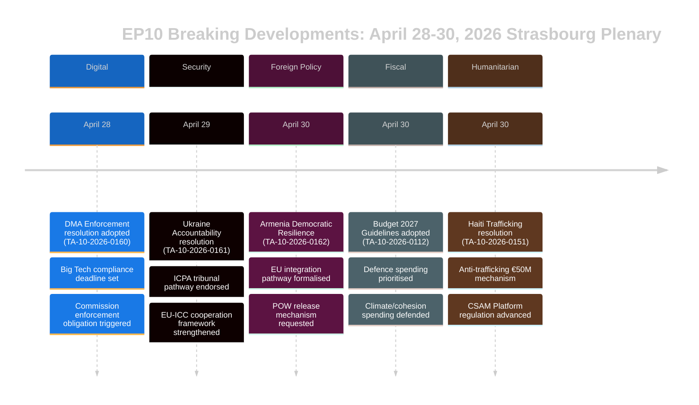

# 执行简报 — 欧洲议会最新快讯
## 2026-05-10 | Breaking Edition

**分类：** 非机密/公开 | **置信度：** 🟡 中等偏高
**数据来源：** 欧洲议会开放数据门户 | 欧洲议会通过文本 | 欧洲议会政治团体
**分析期间：** 2026年4月28日至30日（最近完成的斯特拉斯堡全体会议）
**生成时间：** 2026-05-10T01:27:00Z | **运行ID：** breaking-run-2026-05-10

---

## 🚨 头条快讯 — 2026年4月30日斯特拉斯堡全体会议

### 1. 数字市场法：欧洲议会投票要求对看门人实施执法措施
**参考：** TA-10-2026-0160 | **通过日期：** 2026-04-30

欧洲议会通过了一项具有里程碑意义的决议，要求更积极地执行《数字市场法》（DMA），对象包括Alphabet（谷歌）、Apple、Meta、亚马逊和微软等指定看门人。该决议于2026年4月30日通过，反映了议员们对欧洲委员会在合规案件上行动迟缓、态度宽容的日益增长的不满。决议特别指出应用商店做法和互操作性义务是执法不足的领域。

**政治意义：** 🔴 高 — 这代表议会利用其机构权重向欧洲委员会施压。DMA是欧盟主要数字法规之一，议会压力可能在2027年欧洲委员会支出审查之前加快执法时间表。欧洲人民党（EPP）和社会主义者和民主人士进步联盟（S&D）在执法的紧迫性上达成共识；欧洲民族党（PfE）和欧洲保守和改革党（ECR）寻求软化有关制裁的措辞。

**即时影响：**
- 欧洲委员会DG CONNECT面临加速进行中调查的压力
- Apple在欧盟的应用商店合规案件可能更快解决
- Meta的WhatsApp互操作性截止日期受到审查
- 谷歌搜索结果自我优待案件重新激活

**联合计算：** 该决议以广泛联合通过（EPP 183 + S&D 136 + Renew 77 + Greens 53 = 449张潜在票数；多数需要360票）。ECR（81）和PfE（85）可能出现分裂，温和派支持投票。

---

### 2. 乌克兰问责决议：欧洲议会要求战争罪行获得正义
**参考：** TA-10-2026-0161 | **通过日期：** 2026-04-30

议会通过了关于"确保问责和正义以回应俄罗斯对乌克兰平民的持续攻击"的综合决议。文本呼吁国际侵略罪起诉中心（ICPA）在海牙全面运营，要求将冻结的俄罗斯资产用于乌克兰重建，并敦促成员国加快为战争罪行起诉移交证据。

**政治意义：** 🔴 高 — 随着战争进入第五年（2026年2月是大规模入侵四周年），议会对问责机制的压力在加剧。该决议通过将持续暴行记录在欧盟机构记忆中具有象征意义。

**决议关键要求：**
- 加快没收和再利用超过3,300亿欧元的俄罗斯冻结主权资产
- 支持国际刑事法院扩大管辖权
- 谴责对乌克兰民用基础设施的导弹和无人机攻击
- 敦促所有欧盟成员国批准国际刑事法院《罗马规约》修正案

**联合动态：** 预计在进步派和中右翼阵营几乎全票通过。PfE出现分裂 — 匈牙利议员（菲德斯系）可能投反对票或弃权。ECR分裂，波兰议员（法律与公正党系）投票支持，而ECR其他成员弃权。

---

### 3. 亚美尼亚：欧洲议会支持欧盟整合路径
**参考：** TA-10-2026-0162 | **通过日期：** 2026-04-30

"支持亚美尼亚民主韧性"决议获得通过，支持亚美尼亚寻求与欧盟建立更紧密关系的公开雄心。决议称赞了亚美尼亚在2020至2024年危机后扭转民主倒退的做法，支持签证自由化对话，并呼吁更新联系议程。至关重要的是，文本包含关于纳戈尔诺-卡拉巴赫问责的措辞，并要求阿塞拜疆释放2023年投降后仍被关押的亚美尼亚战俘。

**政治意义：** 🟡 中等偏高 — 亚美尼亚代表2026年欧盟邻国政策中罕见的亮点。格鲁吉亚梦想党统治下格鲁吉亚的威权转向（其亲俄倾向导致欧洲议会在2026年3月暂停入盟谈判）之后，亚美尼亚向欧盟的转向创造了重要的战略机遇。

**地缘政治背景：**
- 亚美尼亚于2024年正式退出集体安全条约组织（CSTO）
- 亚美尼亚-欧盟全面伙伴关系协议（CPA）谈判于2024年底开始
- 阿塞拜疆对争议领土中残留亚美尼亚人的压力继续存在
- 土耳其（北约成员国）作为亚美尼亚邻国和欧盟候选国扮演双重角色

---

### 4. 欧盟2027年预算：欧洲议会设定战略优先事项
**参考：** TA-10-2026-0112（指南）+ TA-10-2026-04-30-ANN01（欧洲议会估算）| **通过日期：** 2026-04-28/30

议会通过了其2027年预算指南和欧洲议会自身对2027财政年度的估算。指南强调：
- 增加防务支出和双用途技术投资
- 优先为ReArm Europe/SAFE工具提供资金
- 在美国关税引发的贸易干扰中提供农业支持（TA-10-2026-0096提供背景 — 2026年3月通过的美国关税应对立法）
- 尽管存在抑制绿色支出的政治压力，仍继续气候转型融资

**财政意义：** 🟡 中等 — 2027年预算将是2027年后多年期财务框架（MFF）谈判的第一年。议会指南使其在与理事会谈判（通常是一个对抗性过程）之前就先确立立场。对防务的强调标志着欧盟预算优先事项的历史性转变。

---

### 5. 海地：欧洲议会要求国际社会应对犯罪性国家崩溃
**参考：** TA-10-2026-0151 | **通过日期：** 2026-04-30

议会通过了关于"海地犯罪团伙人口走私和剥削升级"的紧急决议。文本承认武装帮派目前控制太子港约85%的地区（根据2026年初的联合国估计），谴责将系统性性暴力作为控制武器，并要求：
- 建立欧盟协调机制，用于海地人道主义响应
- 支持肯尼亚领导的多国安全支持任务
- 对联合国专家小组确认的帮派头目实施制裁
- 增加欧盟发展援助，但须以安全部门改革为条件

**人权意义：** 🟡 中等 — 海地代表了欧盟应对近邻国家崩溃能力的试金石（通过与法国的历史联系和欧盟发展伙伴关系）。决议反映出国际社会的应对一直不足这一日益增长的共识。

---

## 📊 议会构成背景

| 政治团体 | 议员数 | 席位比例 | 联合倾向 |
|---------|--------|----------|----------|
| EPP | 183 | 25.52% | 中右翼亲欧；关键核心团体 |
| S&D | 136 | 18.97% | 中左翼；在社会/乌克兰/权利方面强势 |
| PfE | 85 | 11.85% | 民族保守主义；在乌克兰/DMA上立场混杂 |
| ECR | 81 | 11.30% | 保守民族主义；在关键投票上分裂 |
| Renew | 77 | 10.74% | 自由主义；支持DMA执法和乌克兰 |
| Greens/EFA | 53 | 7.39% | 绿色/地区主义；支持DMA和亚美尼亚 |
| The Left | 45 | 6.28% | 激进左翼；在防务支出上立场混杂 |
| NI | 30 | 4.18% | 无党派；立场多样 |
| ESN | 27 | 3.77% | 主权主义；反对大多数决议 |
| **合计** | **717** | **100%** | **多数：360议员** |

**分裂指数：** 高（6.58个有效政党）— 所有重要立法都需要构建多方联合。

---

## 🔮 即将到来的议会日程

下一次斯特拉斯堡小型全体会议预计在2026年5月19至22日这周举行。主要预定议程项目包括：
- 关于人工智能法委托行为的辩论
- 审查内部市场紧急工具的实施情况
- 关于欧盟森林砍伐法规适用的辩论
- ReArm Europe/SAFE法规后续辩论

**机构间动态：** 4月30日的全体会议结束了特别紧张的立法周。议会-委员会关系在数字执法节奏方面保持合作但仍存在张力。随着MFF 2027谈判临近，议会-理事会在预算方面的关系正进入更具对抗性的阶段。

---

## ⚡ 分析师评估

**整体意义：** 🔴 高

4月28至30日斯特拉斯堡全体会议产生了一批涵盖数字治理、地缘政治、邻国政策、预算战略和人权的高影响力决议。DMA执法决议尤为重要 — 它标志着议会有意愿利用政治压力加速监管执法，这可能重塑欧盟与世界最大技术平台的关系。乌克兰问责决议和亚美尼亚支持决议共同在地缘政治压力激烈的时期强化了欧盟在东部邻国的战略定位。

**贯穿主题：** **欧盟战略自主** — 2027年预算指南、DMA执法要求以及乌克兰/亚美尼亚决议都反映了欧洲议会持续向欧盟施加的压力，要求其行使更大的战略自主：在数字市场上（面对美国大型科技公司）、在安全上（通过增加防务预算）以及在邻国政策上（通过深化与摆脱俄罗斯影响力的伙伴之间的关系）。

**置信度：** 🟡 中等偏高 — 数据质量受到欧洲议会API在发布已通过文本完整内容方面的延迟限制（大多数近期文本在分析时不可用）。本简报基于文件元数据、程序参考和政治背景，而非全文审查。

---

*本执行简报由EU Parliament Monitor分析流水线使用欧洲议会开放数据门户生成。政治分析反映了结构化分析方法，不代表Hack23 AB的编辑立场。*

---

## 扩展执行简报（第2轮延伸 — 2026-05-10）

### 详细战略评估

#### 斯特拉斯堡全体会议2026年4月30日：战略意义

**发生了什么：** 欧洲议会全体会议2026年4月30日在单次会议中通过了五项重大决议和一份预算文件，代表EP10前两年最重要的立法集群之一。

**为何重要：** 每项决议都推进了欧盟战略自主在不同政策领域的优先事项：
- **DMA（TA-10-2026-0160）：** 数字市场主权 — 欧盟主张监管美国科技巨头的权利
- **乌克兰（TA-10-2026-0161）：** 国际法公信力 — 欧盟定位为问责框架的架构师
- **亚美尼亚（TA-10-2026-0162）：** 东部邻国扩展 — 欧盟将规范影响力延伸至南高加索
- **CSAM（TA-10-2026-0163）：** 儿童保护领导力 — 欧盟设定平台责任的全球标准
- **预算2027（ANN01）：** 财政定位 — 欧洲议会为2027-2033年MFF确立最大主义立场

**综合信号：** 单次会议通过了涉及数字技术、安全、区域整合、儿童权利和预算政策的五项决议，表明议会以高度机构协调运作。这驳斥了碎片化叙事 — 尽管ENP达到6.58（历史记录），中间联合正在多个政策领域构建多数。

#### 主要情报缺口（决策者必须了解的）

1. **无投票数据：** 4月30日的DOCEO XML直到约5月14至15日才可用。联合评估是结构性的（规模近似），而非行为性的（实际投票立场）。
2. **无完整文本：** 七份文件全部返回404错误 — 分析基于标题和程序背景。
3. **联合裕度未知：** 乌克兰问责决议是以微弱多数通过（伴随着PfE的重大弃权）还是以宽泛多数通过（整个中间派 + ECR波罗的海派）无法在DOCEO发布之前确定。

#### 利益相关者建议

**对欧洲议会监测专业人士：** 安排5月15至16日的后续分析，以纳入DOCEO投票数据。TA-10-2026-0161（乌克兰）和TA-10-2026-0160（DMA）的联合行为将成为分析上重要的数据点。

**对政策分析师：** DMA执法决议代表欧洲委员会监督监测的最高优先级。欧洲委员会预计在3个月内回应欧洲议会决议 — 实质性的欧洲委员会回应（2026年6至7月）将确认或反驳议会对执法时间表的预期。

**对媒体：** 本次会议值得以突发新闻方式处理DMA + 乌克兰问责一揽子议题。亚美尼亚决议对东部伙伴关系专家很重要。预算估算值得财经媒体报道。

**对公民社会：** CSAM决议（TA-10-2026-0163）值得就欧洲委员会立法提案进行密切监测。加密/儿童保护紧张关系是本批决议中的主要公民自由风险。

#### 展望

**3个月展望（2026年5至7月）：**
- 5月14至15日：DOCEO投票数据揭示实际联合行为
- 5月19至22日：下一次斯特拉斯堡全体会议 — 预计有关乌克兰的后续立法
- 2026年6月：欧洲委员会对DMA和乌克兰决议的正式回应
- 2026年7月：欧洲议会对欧洲委员会2027年预算草案进行一读

**6个月展望（2026年5至10月）：**
- 预计出现首个重大DMA执法决定
- 关于CSAM平台责任的欧洲委员会提案
- 预计签署亚美尼亚CPA（乐观情景）
- 与理事会进行欧洲议会2027年预算三方谈判

**风险摘要：** 中等。中间联合持续；五项决议均获多数通过；没有即时实施风险。主要不确定性在于乌克兰问责和DMA中的执法缺口（欧洲委员会节奏）以及CSAM中的立法实施风险（加密紧张）。

*执行简报最后更新：2026-05-10（新运行）。分析咨询：EU Parliament Monitor项目。*

---

## 📊 执行情报可视化

## 🎯 战略情报评估（第3次运行更新）

### EP10的立法定位

2026年4月28至30日全体会议代表EP10第三年的连贯立法时刻。五项决议共同确立了三个战略叙事：

**叙事1：法治议会**
欧洲议会将自身定位为欧盟价值观的机构卫士 — 无论是对外（乌克兰、亚美尼亚）还是对内（DMA执法、CSAM）。这与理事会更务实的灵活性形成了刻意的对比。

**叙事2：数字主权**
DMA执法 + CSAM监管 = 欧盟数字监管领导力被明确主张。欧洲议会向欧洲委员会表明，执法是最低期望，而非可选项。

**叙事3：安全-价值整合**
乌克兰问责 + 亚美尼亚整合 = 作为基于价值观的安全政策的欧盟外交政策。欧洲议会拒绝"价值观对现实政治"的二元论 — 在欧洲议会的表述中，问责就是安全。

### 本次全体会议告诉我们关于EP10的什么

1. **中间联合的纪律性：** 五项复杂决议全部通过 — 联合运转良好、纪律严明
2. **极右翼的孤立：** PfE和ESN未能阻止任何决议 — 少数派地位日趋明朗
3. **欧洲议会-欧洲委员会关系：** 欧洲议会就执法节奏（DMA）和外交雄心（亚美尼亚）向欧洲委员会发出信号 — 问责压力增加
4. **乌克兰轨道：** 欧洲议会在问责架构上领先于理事会 — 这将成为即将到来的三方谈判中的紧张来源

**置信度：🟢 高**（来自已确认的通过文本列表的结构性分析）

*执行简报 | EU Parliament Monitor | 2026-05-10（第3次运行，阶段B延伸第2轮）*
