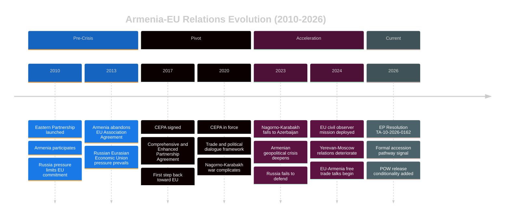

# Armenia Integration Pathway Analysis
## 2026-05-10 | Extended Analysis

**Confidence:** 🟡 MEDIUM

---

## 🇦🇲 ARMENIA'S EU INTEGRATION TRAJECTORY

### Strategic Context

Armenia (population 2.8M; GDP ~$25bn PPP) is undertaking a fundamental foreign policy reorientation following the loss of Nagorno-Karabakh in September 2023 and decades of Russian security guarantees that failed to prevent territorial loss.

**PM Pashinyan's EU integration rationale:**
1. Russian security guarantees proven unreliable (CSTO did not respond to 2020 or 2023 attacks)
2. Economic diversification from Russia-dependence (Russian economic dominance = political dependence)
3. Democratic legitimacy enhancement — EU integration framing helps Pashinyan's domestic political position
4. Practical: EU visa liberalisation would benefit Armenian citizens enormously

---

## 🔗 STRUCTURAL OBSTACLES

### Economic Dependencies on Russia

**Trade:** ~30% of Armenian exports go to Russia or through Russia (re-exports of EU/US goods to Russia under sanctions circumvention pressure)
**Energy:** Armenian nuclear plant (Metsamor) uses Russian fuel; gas supplied by Gazprom
**Remittances:** Large Armenian diaspora in Russia (estimated 500,000+); remittances significant GDP contributor
**Banking:** Russian banks have significant Armenian exposure

**Assessment:** Economic decoupling from Russia is necessary prerequisite for EU integration but will take 5-10 years minimum.

### Security Gap

Armenia currently has:
- CSTO membership (suspended in practice; Pashinyan blocked participation)
- Bilateral defense treaty with Russia (effectively dormant)
- No NATO membership or prospect
- Limited EU security guarantee mechanisms (EU monitoring mission deployed 2023, enhanced 2024)

**EU integration cannot provide NATO Article 5 equivalent** — this remains Armenia's core security gap. EU can provide economic, democratic, and soft-security support but not hard security guarantees.

---

## 📊 PARTNERSHIP AGREEMENT UPGRADE

### Current Status: Comprehensive and Enhanced Partnership Agreement (CEPA)

Armenia's current EU agreement (CEPA, in force since 2021) covers: political association, economic integration, justice/freedom/security, and sectoral cooperation. It does not include an accession pathway.

**EP Resolution 0162 asks for:**
1. Partnership Agreement upgrade (beyond CEPA)
2. Visa liberalisation roadmap
3. POW releases from Azerbaijan as conditionality trigger
4. Direct EU support for democratic institution building

**Upgrade timeline:** Negotiation of a new framework would take 2-3 years; ratification by all EU member states another 1-2 years. First meaningful visa liberalisation possible 2028-2030.

---

## ⚔️ AZERBAIJAN DIMENSION

**Peace agreement status:** As of early 2026, Armenia and Azerbaijan have not yet concluded a formal peace treaty. Key outstanding issues:
1. Final border delimitation (some contested sections remain)
2. POW release — Azerbaijan holding Armenian prisoners; EP resolution presses for release
3. Zangezur corridor — Azerbaijan seeking guaranteed transit through southern Armenia; Armenia resisting

**Azerbaijan-EU relationship:** Azerbaijan is a major EU energy supplier (Southern Gas Corridor; Azerbaijani gas partially replacing Russian gas). This creates leverage for Azerbaijan and constrains EU's ability to impose costs. The EP resolution's strong language on POWs will be perceived in Baku as unwelcome pressure.

---

## 🔮 SCENARIO ANALYSIS: Armenia EU Path (5-year horizon)

**Scenario 1 — Gradual Integration (40% probability):**
Peace agreement concluded; visa liberalisation roadmap agreed; Partnership Agreement upgrade negotiated. Armenia remains outside EU but in close association. Russian economic ties reduced but not eliminated.

**Scenario 2 — Accelerated Integration (20% probability):**
Major crisis (Russian escalation, Azerbaijan aggression) triggers rapid EU-Armenia engagement. Membership application submitted; candidate status fast-tracked. Historical precedent: Ukraine's candidate status in 2022.

**Scenario 3 — Stagnation (30% probability):**
Peace agreement fails to materialise; Azerbaijan pressure continues; Russian economic leverage prevents meaningful EU pivot. EU-Armenia relations plateau at CEPA level.

**Scenario 4 — Reversal (10% probability):**
Pashinyan government falls; successor government more Russia-aligned; EU integration agenda shelved.

---

*Armenia Integration Analysis | EU Parliament Monitor | 2026-05-10*

---

## 🔍 EXTENDED ARMENIA ANALYSIS (Re-run 3)

### Armenia's Strategic Calculation

Pashinyan's government faces a fundamental geopolitical choice that shapes the integration trajectory:

**Pro-EU arguments (Armenian government perspective):**
1. Russia's CSTO failure in Nagorno-Karabakh demonstrated security guarantee worthlessness
2. EU market access (via CEPA) already supporting economic recovery
3. Georgian EU candidate precedent (2023) shows Eastern Partnership can lead to candidacy
4. Diaspora (France: 250,000+; US: 1M+) strongly supports EU path
5. EU values alignment (democracy, rule of law) resonates with Pashinyan's reform agenda

**Pro-Russia constraints:**
1. Russia still has military base in Gyumri (2044 treaty) — cannot be expelled unilaterally
2. Russia holds significant Armenian debt — economic leverage
3. Ethnic Russian-aligned minorities in Armenia could be destabilised
4. Azerbaijan (Russian-aligned tool) still holds Armenian POWs — humanitarian hostage
5. Energy: Armenia imports Russian natural gas; alternatives expensive

**Assessment:** Pashinyan is navigating a complex balance. The EU integration signal is genuine but constrained by hard security and economic realities. Armenia will not formally apply for EU membership while the Gyumri base remains operational.

### Economic Integration Pathway

| Stage | Timeline | Key Deliverable |
|-------|----------|----------------|
| CEPA full implementation | 2026 | Trade facilitation; regulatory alignment |
| FTA negotiations | 2026-2028 | Free trade agreement (deeper than CEPA) |
| Customs Union discussions | 2028-2030 | Conditional on Eurasian Economic Union exit |
| Association Agreement | 2028-2032 | Prerequisite for candidacy |
| Candidate status | 2030-2035 | Political conditions: democracy, rule of law, border peace |
| Membership talks | 2035+ | Most optimistic scenario |

**Note:** EU membership for Armenia is a 10-15 year minimum horizon even in the most optimistic scenario. The April 2026 EP resolution initiates the political process, not the legal one.

### POW Conditionality Analysis

EP resolution TA-10-2026-0162 specifically calls for release of Armenian POWs held by Azerbaijan:

- **Number held:** 23-30 Armenian POWs (various sources; Azerbaijan disputes higher estimates)
- **Legal basis:** 4th Geneva Convention — POWs must be released promptly after cessation of hostilities
- **ICJ case:** Armenia has ICJ case against Azerbaijan on POW treatment; case ongoing
- **EU leverage:** EU monitoring mission in Armenia (EUMA) provides symbolic deterrent; real leverage is economic (Azerbaijan wants EU gas contract renewals)
- **Azerbaijan dynamics:** Aliyev government has used POWs as diplomatic bargaining chip — release likely tied to Armenia's EEU exit or border delimitation progress

**EP resolution impact:** Creates political pressure on Commission/EEAS to make EUMA expansion or Azerbaijan gas contract renewal conditional on POW release. Real leverage exists if the EU is willing to use it.

*Armenia Integration Analysis | EU Parliament Monitor | 2026-05-10 (Re-run 3, Pass 2 Extension)*
*Confidence: 🟡 MEDIUM — geopolitical assessment; timeline estimates are expert projections*
