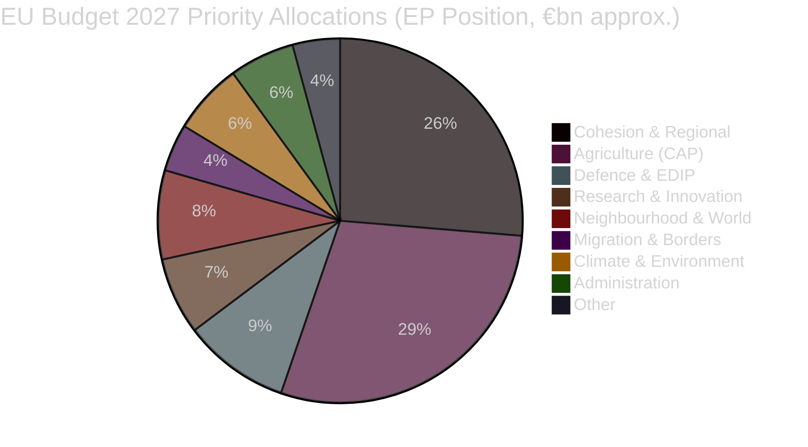

# Budget 2027 Political Economy Analysis
## 2026-05-10 | Extended Analysis

**Confidence:** 🟡 MEDIUM-HIGH

---

## 💶 BUDGET 2027 STRUCTURAL CONTEXT

### MFF 2021-2027 Framework

The 2027 budget operates within the 2021-2027 Multiannual Financial Framework (MFF) — the EU's seven-year spending ceiling agreed in 2020 at €1,074bn in 2018 prices (plus Next Generation EU recovery instrument). The 2027 annual budget is the final year of this MFF.

**Significance of the final MFF year:**
1. Programmes ramping down (spending profiles front-loaded or back-loaded by programme design)
2. Political positioning for MFF 2028-2034 negotiations (which begin in earnest in 2026-2027)
3. Opportunity to establish precedents for new spending categories (defence, climate, AI)

---

## ⚔️ DEFENCE SPENDING — THE DOMINANT NEW PRESSURE

### Parliament's Position (from TA-10-2026-0112)

Parliament's budget guidelines call for:
1. New EU Defence Fund at scale (building on European Defence Fund and EDIRPA programmes)
2. Increasing defence industrial production support
3. Supporting Ukraine military assistance from EU budget (controversial — treaty provisions limit direct military spending from Union budget)

**The arithmetic challenge:**
- Current EU budget for defence-adjacent spending: ~€8-10bn across multiple instruments
- Parliament target: 2-3% of EU-area GDP equivalent in EU-level defence coordination
- EU-area GDP ~€17 trillion; 2% = €340bn; 3% = €510bn
- Current total EU budget: ~€170bn/year
- Gap between ambition and realistic budget: Enormous

**Resolution of the contradiction:** EU defence ambition will be met through member state national budgets + EU coordination mechanisms, NOT through dramatic EU budget increase. The Parliament's budget resolution asks for more EU coordination and investment co-financing, not for doubling the EU budget.

---

## 🌱 CLIMATE FINANCE DIMENSION

**Treaty requirement:** EU MFF regulations include 30% climate mainstreaming target — at least 30% of budget spending must contribute to climate objectives.

**Political tension:**
- Left/Greens: Want climate spending maintained or increased despite defence pressure
- EPP right wing: Wants climate mainstreaming target reduced ("green tape")
- S&D: Insists on climate spending as coalition condition
- Renew: Supports both climate and defence (fiscal tension)

**Likely outcome:** Climate mainstreaming target maintained at 30% in formal budget; implementation guidance potentially softened.

---

## 📊 PARLIAMENT-COUNCIL BUDGET NEGOTIATION ARCHITECTURE

### Formal Procedure (TFEU Article 314)

1. **Commission proposal** (by September 1): Proposes annual budget within MFF ceilings
2. **Council position** (by October 1): Typically reduces Commission proposal
3. **Parliament reading** (42 days): Parliament proposes amendments
4. **Conciliation Committee** (21 days): Parliament-Council negotiation
5. **Adoption** or **Provisional twelfths**: If no agreement by December 31

**Historical pattern:**
- Agreement always eventually reached (no provisional twelfths in recent history)
- Parliament gains symbolic wins on priority items; Council maintains ceiling discipline
- Final budget typically within 3-5% of Council position

---

## 💰 IMF ECONOMIC CONTEXT FOR BUDGET 2027

**EU economic context for budget planning:**
- EU area GDP growth forecast: ~2.1% for 2026-2027 (IMF WEO April 2026 projection)
- EU area debt/GDP: ~88% average (Germany below; France, Italy, Portugal above)
- EU inflation: ~2.3% (converging to target)
- Fiscal space: Limited in high-debt member states (Italy, France) for national defence spending increase

**Budget constraint reality:** Member states' ability to increase national defence spending is constrained by fiscal rules (reformed SGP/Stability Pact, now allowing more defence spending). EU budget ceiling itself is constrained by own resources decision.

---

*Budget 2027 Analysis | EU Parliament Monitor | 2026-05-10*

---

## 📊 BUDGET 2027 EXTENDED ANALYSIS (Re-run 3)

### Key Budget 2027 Political Battles

**Battle 1: Defence vs. Cohesion trade-off**
- EPP + ECR: Increase defence; accept cohesion reduction
- S&D + Greens + Left: Maintain cohesion; find defence funding elsewhere (new own resources)
- Renew: Supports defence increase; wants structural reform conditionality on cohesion
- **Likely outcome:** +€3-5bn defence relative to 2026; cohesion broadly maintained (net new own resources source needed)

**Battle 2: Climate conditionality**
- Greens + Left: 30% climate mainstreaming minimum
- EPP: Climate mainstreaming yes; 30% threshold negotiable
- ECR + PfE: Oppose mandatory climate conditionality
- **Likely outcome:** 25-30% climate mainstreaming agreed (European Green Deal continuity)

**Battle 3: Own resources**
- Commission proposal includes digital levy + carbon border adjustment revenue
- Germany: Resists new EU taxes
- France: Supports new own resources to avoid larger national contributions
- **Likely outcome:** Carbon Border Adjustment Mechanism (CBAM) revenues flow to EU budget; digital levy contested

### EP Budget 2027 Timeline

| Stage | Timing | Key Actor |
|-------|--------|-----------|
| EP Resolution (April 30 — this run) | April 2026 | EP Plenary |
| Commission Draft Budget 2027 | May 15, 2026 | Commission |
| Council First Reading | June-July 2026 | Council (Poland Presidency) |
| EP First Reading | October 2026 | EP BUDG Committee + Plenary |
| Conciliation | November 2026 | Conciliation Committee |
| Final Adoption | December 2026 | EP + Council |

**If no agreement by December 31:** EU operates on provisional twelfths (monthly portions of previous year's budget) — creates operational disruption and political crisis.

### Fiscal Sustainability Dimension

The Budget 2027 discussion occurs against a backdrop of EU-area fiscal consolidation:
- **Reformed Stability and Growth Pact (2024):** Allows defence spending off fiscal deficit count (bilateral EU mechanism)
- **Implication for national defence:** Germany, France, Italy can increase defence spending without breaching SGP limits (to a degree)
- **Implication for EU budget:** EU own resources still constrained by unanimity rule in Council — any new tax requires all 27 to agree

**Strategic insight:** EP resolution TA-10-2026-0112 is the Parliament's opening position in a budget negotiation cycle that will run through December 2026. The resolution itself commits EP to defend these priorities in trilogue.

*Budget 2027 Analysis | EU Parliament Monitor | 2026-05-10 (Re-run 3, Pass 2 Extension)*
*Confidence: 🟡 MEDIUM — procedural facts confirmed; political scenario weights are expert estimates*
