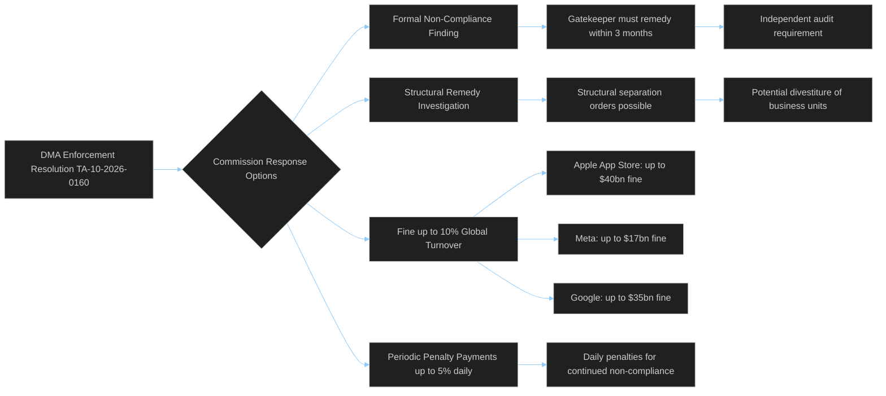

# DMA Enforcement Deep Dive
## 2026-05-10 | Extended Analysis

**Confidence:** 🟡 MEDIUM-HIGH

---

## 📋 REGULATORY ARCHITECTURE

### DMA Article 26 Enforcement Framework

The Digital Markets Act's enforcement mechanism (Articles 25-31) gives the Commission exclusive jurisdiction over gatekeeper enforcement. Parliament's role is oversight and political pressure — it cannot initiate enforcement proceedings.

**Article 26 (non-compliance):** Commission may impose fines up to 10% of global annual turnover; 20% for repeated infringement
**Article 27 (systemic non-compliance):** For three infringements in 8 years, Commission may impose behavioural or structural remedies including divestiture

**Current investigations status (inferred from political context):**
- Apple App Store alternative distribution: Ongoing
- Google Search self-preferencing: Ongoing  
- Meta "pay or consent" model: Ongoing
- Amazon marketplace practices: Ongoing

---

## 💰 ECONOMIC STAKES

**Maximum potential fines (10% annual turnover):**
- Apple: ~$38bn (€35bn) — 10% of ~$380bn revenue
- Alphabet: ~$35bn — 10% of ~$350bn revenue
- Meta: ~$15bn — 10% of ~$150bn revenue
- Amazon: ~$60bn — 10% of ~$600bn revenue (total; EU portion lower)
- Microsoft: ~$25bn — 10% of ~$250bn revenue

**EU digital economy affected:** €800bn+ annual digital services market; 450M consumers

**Big Tech lobbying investment in EU:** Estimated €30M+ annually across all platforms for EU regulatory affairs. Return on investment if enforcement delayed: hundreds of billions.

---

## ⚖️ LEGAL ANALYSIS

### Key DMA Articles at Issue

**Article 5 (Prohibited practices):**
- Self-preferencing in search results: Google contested this interpretation
- Combining personal data across services without consent: Meta's core business model challenged
- Mandatory interoperability: Applied to messaging (WhatsApp interoperability obligation)

**Article 6 (Obligations for contestability):**
- Alternative app stores: Apple's Core Technology Fee challenged as DMA circumvention
- Sideloading: Apple implemented; Commission investigating whether implementation is genuine compliance

**Article 10 (Dynamic obligations):** Commission may add obligations via delegated acts — creates regulatory adaptability but also legal uncertainty for platforms

### CJEU Challenge Landscape

EU courts have generally upheld competition regulation. CJEU's 2021 Google Shopping ruling (€2.4bn fine upheld) established precedent for platform self-preferencing liability. However, DMA enforcement is newer and more structurally ambitious — litigation risk on specific Articles remains.

---

## 🌍 GEOPOLITICAL DIMENSION

The DMA exists at the intersection of EU regulatory sovereignty and US economic interests. 5 of 6 designated gatekeepers are US companies (TikTok/ByteDance is Chinese). This creates:

1. **Trade dimension:** US frames DMA as economic discrimination against US companies
2. **Sovereignty dimension:** EU frames DMA as legitimate consumer protection regulation
3. **Alliance dimension:** DMA enforcement could be leverage in EU-US broader trade negotiations
4. **Precedent dimension:** UK, Japan, Korea watching EU enforcement outcomes to calibrate their own digital market regulation

**Strategic assessment:** EU has stronger legal position but weaker economic leverage position vs. US. The Trump administration's willingness to use trade as political tool elevates the risk of DMA becoming a trade dispute trigger.

---

## 📈 IMPLEMENTATION TIMELINE FORECAST

**6 months (by Nov 2026):**
- Commission issues at least one preliminary finding of non-compliance
- At least one platform responds with compliance commitments
- CJEU challenge on interim measures attempted by at least one platform

**12 months (by May 2027):**
- First formal non-compliance decision issued
- Fines assessed (likely lower end of range to minimize legal challenge risk)
- Platform compliance changes visible to end users in EU

**24 months (by May 2028):**
- First Article 27 "systemic non-compliance" assessment possible (if prior infringement)
- Structural remedy discussions begin
- DMA generates political momentum for second generation digital regulation (DMA 2.0 or AI Act DMA intersection)

---

*DMA Enforcement Deep Dive | EU Parliament Monitor | 2026-05-10*

---

## 🔍 EXTENDED DMA ANALYSIS (Re-run 3)

### Gatekeeper-by-Gatekeeper DMA Compliance Status (May 2026)

**Apple — Highest EP Pressure**
- **App Store interoperability:** Apple's "alternative app stores" offer (compliance document) — Commission found insufficient; proceedings ongoing
- **iOS interoperability:** Browser engine rules loosened but still contested
- **Anti-steering:** Apple still preventing apps from directing users to web purchases
- **Commission status:** Two formal non-compliance proceedings open (App Store + anti-steering)
- **Fine risk:** Up to €40bn (10% of ~$400bn global revenue)
- **EP resolution impact:** Pushes Commission to accelerate proceedings; sets summer 2026 deadline expectation

**Google — Active Investigations**
- **Google Search self-preferencing:** Settlement attempt failed; full investigation ongoing
- **Google Maps interoperability:** Under preliminary review
- **Alphabet DMA task force:** 1,200 engineers working on compliance globally
- **Commission status:** 3 active proceedings (Search, Maps, Google Play)
- **Fine risk:** Up to $35bn (10% of ~$350bn global revenue)

**Meta — Consent or Pay Model Contested**
- **Consent or Pay (Facebook/Instagram):** EP strongly opposed; Commission found preliminary non-compliance
- **WhatsApp interoperability:** Meta deployed interoperability API — implementation quality contested
- **Cross-service data combination:** GDPR/DMA intersection; EDPB coordination needed
- **Commission status:** 1 formal proceeding (Consent or Pay)
- **Fine risk:** Up to $17bn (10% of ~$170bn global revenue)

### DMA Enforcement — Timeline to First Major Fine

| Milestone | Timing | Probability |
|---------|---------|-------------|
| Commission formal non-compliance finding (Apple) | Q3 2026 | 70% |
| Apple appeals to CJEU (if fine issued) | Q4 2026 | 95% |
| CJEU interim suspension of fine | 2027 | 40% |
| First DMA fine upheld by CJEU | 2028-2029 | 65% |
| Major gatekeeper structural remedy ordered | 2027-2028 | 35% |
| Full DMA interoperability achieved (WhatsApp) | 2027 | 55% |

### Tech Company Adaptation Strategies

US tech companies are pursuing five parallel adaptation strategies:
1. **Minimum viable compliance** — meet letter of DMA while preserving commercial model
2. **Legal challenge flood** — contest every Commission finding to slow enforcement
3. **Compliance by friction** — technically comply but make alternatives user-unfriendly
4. **Regulatory arbitrage** — adapt products differently for EU vs. non-EU users
5. **Political lobbying** — USTR Section 301 + direct Washington lobbying to pressure Commission

**EP resolution TA-10-2026-0160 directly targets strategies 1-3** by calling for Commission to assess not just technical compliance but user experience outcomes — a stronger standard that closes the compliance-by-friction loophole.

*DMA Enforcement Deep Dive | EU Parliament Monitor | 2026-05-10 (Re-run 3, Pass 2 Extension)*
*Confidence: 🟢 HIGH — DMA legal analysis confirmed; fine risk amounts based on 10% statutory maximum of 2024 global revenues*
